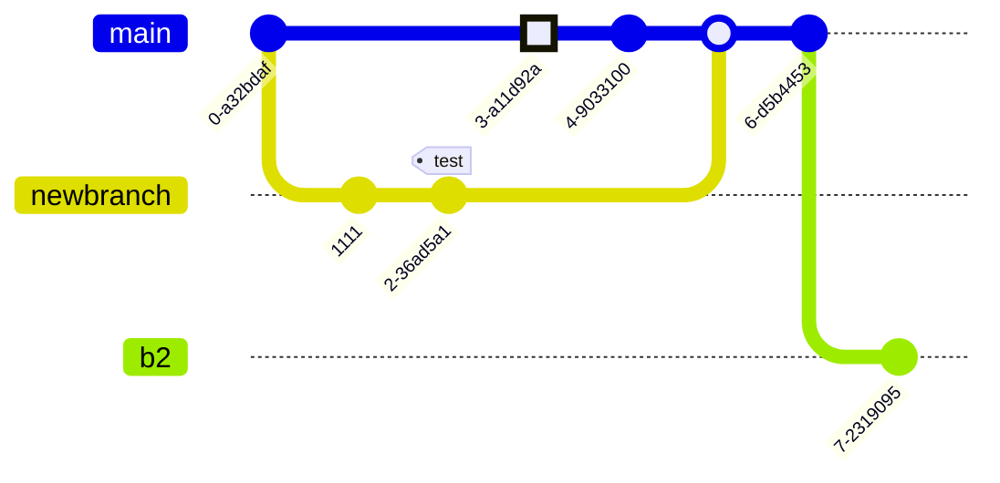

import { YouTubeVideo } from "@site/src/components/YouTubeVideo/YouTubeVideo"

# Markdown and HTML Features
These features are part of [standard MDX syntax](https://docusaurus.io/docs/markdown-features) as used by Docusaurus by
default.

## Standard features
All **standard features** you would _expect_ from `Markdown` are available [here](#) as well.


## Code blocks
A simple code block:
```py
def greet():
    print("Hello, world!")
```

A code block with line numbers and a highlighted section:
```html {3-7} showLineNumbers
<html>
  <body>
    <h1>My first website</h1>
    <div>
        <span>This is my first website!</span>
    </div>
  </body>
</html>
```

## Blockquotes
> This is a famous quote.
>
> — Some famous person

## Tables
| First name | Middle name | Last Name    |
|-----------:|:-----------:|--------------|
|        Jon |  DeLorean   | Doe          |
|       Jane |   Charlie   | Jefferson    |
|      Billy |   Beanbag   | Bumblebee IV |

## Details
<details>
  <summary>Toggle to see more...</summary>
  <div>
    <span>Here's the "more" 😉</span>
    <details>
      <summary>Details can even be nested...</summary>
      <div>
        <span>...and nothing stops you from hiding a YouTube video here, if you want 😎</span>
        <YouTubeVideo videoId="bEWP7llgGec" />
      </div>
    </details>
  </div>
</details>

## Dividers
***
Divide sections by adding horizontal lines.
***

## Mermaid diagrams
Mermaid is a plugin for rendering complex diagrams from Markdown code blocks. In Docusaurus, it is provided by the
`@docusaurus/theme-mermaid` plugin as described [here](https://docusaurus.io/docs/next/markdown-features/diagrams).

A simple Mermaid diagram can look as follows:


Here are some examples from the [Mermaid website](https://mermaid.js.org/syntax/examples.html):

### Pie chart


### Sequence diagram


### Git graph

