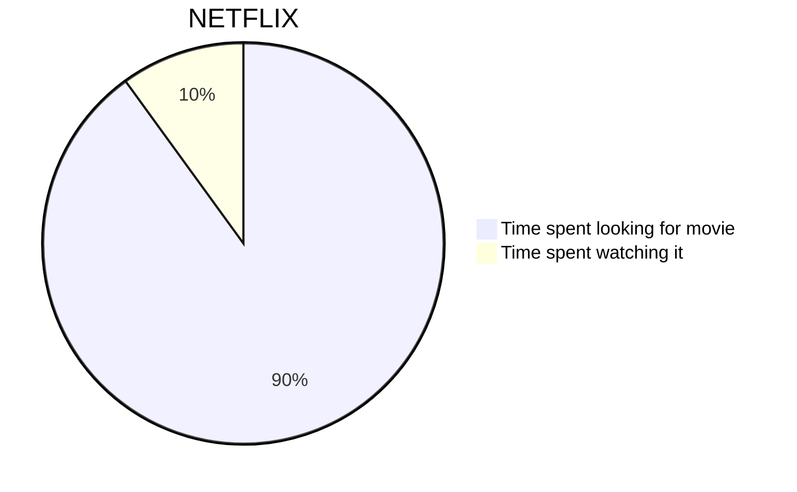
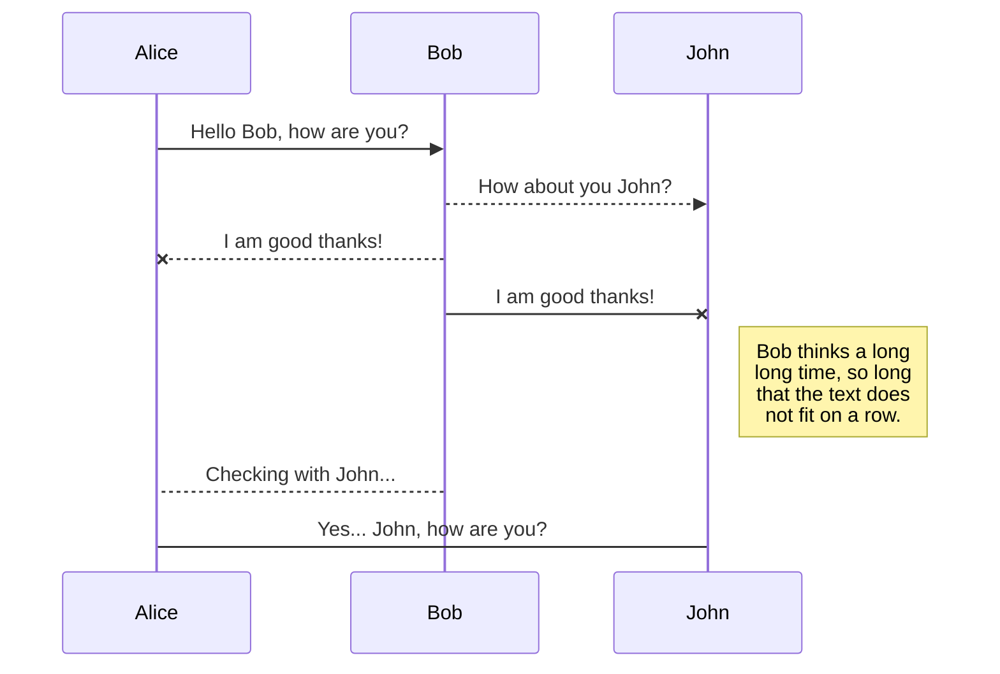
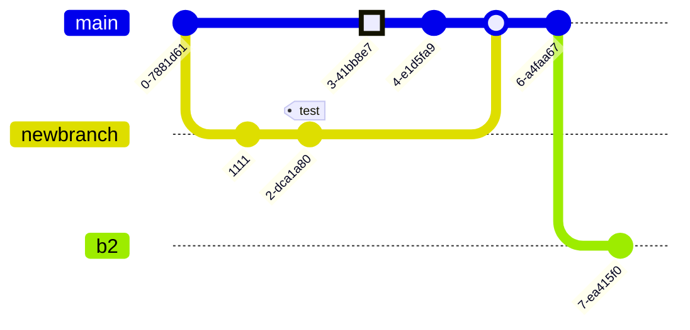

# Mermaid Diagrams [@SeeCode](https://github.com/SilasBerger/teaching-website/blob/main/content/material/Components-Gallery/05-Mermaid-Diagrams.mdx)
Mermaid is a plugin for rendering complex diagrams from Markdown code blocks. In Docusaurus, it is provided by the
`@docusaurus/theme-mermaid` plugin as described [here](https://docusaurus.io/docs/next/markdown-features/diagrams).

A simple Mermaid diagram can look as follows:

Below are some examples from the [Mermaid website](https://mermaid.js.org/syntax/examples.html).

## Pie chart

## Sequence diagram

## Git graph

