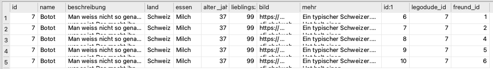

# `SELECT` aus mehreren Tabellen
Sie kennen nun folgendes Grundschema für SQL-Datenbank-Abfragen:

```sql
SELECT spalten FROM tabelle WHERE bedingung;
```

Also zum Beispiel:

```sql
SELECT name, beschreibung, land FROM legodudes WHERE lieblingszahl < 100;
```

Sie kennen auch bereits zwei Tabellen aus unserer Übungsdatenbank, nämlich `legodudes` und `haustiere`. Nun lernen Sie noch die dritte Tabelle kennen: `legodudes_freunde`.

:::warning[Arbeitsanweisungen]
- Öffnen Sie jetzt zuerst einen **neuen SQL-Editor** und **speichern** Sie diesen gleich als `SELECT aus mehreren Tabellen.sql` auf Ihrer OneDrive. Arbeiten Sie für den gesamten Verlauf dieser Aufgabe in dieser Datei, welche Sie **am Ende abgeben**.
- Bearbeiten Sie alle Aufgaben **immer zuerst selbstständig**. Klappen Sie anschliessend die Musterlösung auf und vergleichen Sie mit Ihrer eigenen Lösung / Vermutung.
- Die **Musterlösungen** erhalten oft wichtige Hilfestellungen zur Interpretation der Ergebnisse oder zur darauffolgenden Aufgabe. **Lesen** Sie diese also **aufmerksam** durch.
:::

:::aufgabe[Aufgabe 1]
1. Schreiben Sie eine Abfrage, mit welcher Sie alle Zeilen der Tabelle `legodudes_freunde` erhalten.
2. Wie interpretieren Sie diese Tabelle? Diskutieren Sie zu zweit.

<details>
  <summary>Musterlösung</summary>
  <div>
    1. ```sql
       SELECT * FORM legodudes_freunde;
       ```
    2. Die Tabelle gibt an, welcher Legodude mit welchem anderen Legodude befreundet ist. Jeder Legodude hat eine `id` (sie können auch nochmal `SELECT * FROM legodudes` ausführen, um sich davon zu überzeugen). Jede Zeile in der Tabelle `legodudes_freunde` stellt eine Freundschaftsbeziehung dar: der Legodude mit der ID in der Spalte `legodude_id` ist befreundet mit dem Legodude mit der ID in der Spalte `freund_id`.
  </div>
</details>
:::

:::aufgabe[Aufgabe 2]
1. Führen Sie folgende Abfrage aus:
   ```sql
   SELECT * FROM legodudes, legodudes_freunde;
   ```
2. Wie interpretieren Sie das Ergebnis? Warum gibt es diese Duplikate? Diskutieren Sie wieder zu zweit. Schauen Sie sich dabei auch die Abfrage genau an.

**Wichtig:** Scrollen Sie in der Tabelle auch ganz nach rechts!

<details>
  <summary>Musterlösung</summary>
  <div>
    Das Ergebnis besteht aus allen möglichen Kombinationen aus je einer Zeile aus der Tabelle `legodudes` und einer Zeile aus `legodudes_freunde`.

    Deshalb sehen wir jeden Legodude auch immer 10x nacheinander: die `legodudes_freunde`-Tabelle hat nämlich 10 Zeilen. Jede `legodudes`-Zeile wird also einmal mit jeder `legodudes_freunde`-Zeile kombiniert.
  </div>
</details>
:::

Diese Kombination alleine ist noch nicht besonders spannend. Sie wird aber sehr mächtig, sobald wir sie sinnvoll filtern. Dabei kommt wieder das `WHERE`-Schlüsselwort ins Spiel, das Sie bereits kennen.

:::aufgabe[Aufgabe 3]
Ergänzen Sie der Abfrage aus Aufgabe 2 einen `WHERE`-Teil, so dass die resultierende Tabelle nur noch Ergebnisse enthält, bei denen der Name `Litty Feuerwehr` lautet.

<details>
  <summary>Musterlösung</summary>

  <div>
    ```sql
    SELECT * FROM legodudes, legodudes_freunde WHERE name = 'Litty Feuerwehr';
    ```
  </div>
</details>
:::

Wir sehen jetzt nur noch Einträge für Legodude `Litty Feuerwehr`. Allerdings erhalten wir immer noch 10 Einträge. Und wie sollen wir die Einträge genau interpretieren? Auf der ersten Zeile erhalten wir beispielsweise Informationen über Litty's Land und Lieblingsessen, sowie über die Tatsache, dass der Legodude mit der `id` 2 mit dem Legodude mit der `id` 6 befreundet ist. Litty's `id` ist aber 1. Diese Freundschaftsbeziehung hat somit nichts mit ihr zu tun.

Anders sieht es auf Zeile 2 aus: Hier haben wir die `legodude_id` 1 und die `freund_id` 4. Da erhalten wir also die Information, dass Litty mit Legodude Nr. 6 befreundet ist.

:::aufgabe[Aufgabe 4]
Erweitern Sie den `WHERE`-Teil aus der vorangehenden Aufgabe so, dass das Ergebnis nur noch Zeilen enthält, bei der die `legodude_id` mit Litty's ID (also 1) übereinstimmt.

<details>
  <summary>Musterlösung</summary>
  <div>
    ```sql
    SELECT * FROM legodudes, legodudes_freunde WHERE name = 'Litty Feuerwehr' and legodude_id = 1;
    ```

    Und schon haben wir nur noch denjenigen Eintrag, der auch tatsächlich Litty betrifft.
  </div>
</details>
:::


::::aufgabe[Aufgabe 5]
Ändern Sie den `WHERE`-Teil so ab, dass Sie nicht mehr Ergebnisse nicht für `Litty Feuerwehr` sondern for `Botot` erhalten. Es sollen auch hier wieder nur Freundschaftsbeziehungen angezeigt werden, die tatsächlich `Botot` betreffen.

:::tip[Was ist die ID von Botot?]
Wenn Sie die `id` von Botot herausfinden wollen, dann führen Sie folgende Abfrage aus:
```sql
SELECT id FROM legodudes WHERE name = 'Botot';
```
:::

<details>
  <summary>Musterlösung</summary>
  <div>
    Mit der obigen Abfrage finden wir heraus, dass Botot die `id` 7 hat. Die Abfrage aus der vorangehenden Aufgabe können wir also wie folgt abändern:

    ```sql
    SELECT * FROM legodudes, legodudes_freunde WHERE name = 'Botot' and legodude_id = 7
    ```

    Anders als bei der vorangehenden Aufgabe sehen wir hier trotzdem noch fünf Zeilen. Das liegt ganz einfach daran, dass `Botot` gemäss der `legodudes_freunde`-Tabelle mit fünf anderen Legodudes befreundet ist: seine `id` 6 steht bei fünf Zeilen in der `legodude_id`-Spalte.
  </div>
</details>
::::

Auf diese Weise können wir für jeden Legodude die `id`s seiner Freunde herausfinden. Allerdings müssen wir in Ihrer Abfrage jeweils nicht nur den Namen, sondern auch die `id` anpassen. Das ist einerseits umständlich und sollte andererseits auch gar nicht nötig sein: Der Name und die `id` gehören nämlich immer zusammen.

Eigentlich müssten wir bei der Abfrage also nicht auf eine bestimmte `id` prüfen. Stattdessen müssen wir nur schauen, ob die `id` des Legodudes mit der `legodude_id` übereinstimmt.

:::aufgabe[Aufgabe 6]
1. Verallgemeinern Sie den `WHERE`-Teil Ihrer Abfrage so, dass nicht mehr auf eine spezifische `id` geprüft wird, sondern dass nur noch geschaut wird, ob die `id` mit der `legodude_id` übereinstimmt. Falls Sie dabei einen Fehler erhalten, gehen Sie weiter zur Teilaufgabe 2.
2. Vermutlich werden Sie bei der ersten Teilaufgabe einen Fehler erhalten. Das ist okay. Schauen Sie sich den Fehler genau an und versuchen Sie, ihn zu interpretieren. Was könnte das Problem sein? Diskutieren Sie zu zweit.

<details>
  <summary>Musterlösung</summary>
  <div>
    #### Teilaufgabe 1
    ```sql
    SELECT * FROM legodudes, legodudes_freunde WHERE name = 'Botot' and legodude_id = id;
    ```

    #### Teilaufgabe 2
    Bei der obigen Abfrage erhalten wir den Fehler `ambiguous column name: id` (dt.: _mehrdeutiger Zeilenname: id_).
    <br />
    Wenn Sie sich das Resultat der Abfrage
    ```sql
    SELECT * FROM legodudes, legodudes_freunde;
    ```
    genau ansehen, stellen Sie fest, dass dort tatsächlich zwei Spalten namens `id` vorkommen. Das liegt daran, dass sowohl die Tabelle `legodudes` als auch die Tabelle `legodudes_freunde` je eine Spalte `id` haben. In dieser Abfrage werden alle Spalten beider Tabellen kombiniert und somit erhalten wir im Ergebnis zwei Spalten namens `id`.
    <br />
    Das wird dann ein Problem, wenn wir uns bei der Abfrage
    ```sql
    SELECT * FROM legodudes, legodudes_freunde WHERE name = 'Botot' and legodude_id = id;
    ```
    auf die Spalte `id` beziehen wollen: SQL weiss nicht, welche der beiden `id`-Spalten jetzt gemeint ist. Wir müssen das also präzisieren.
    <br />
    Das tun wir, indem wir nicht nur den Spaltennamen nennen, sondern das Schema `tabellenname.spaltenname` verwenden. Da es und hier um die `id`-Spalte der `legodudes`-Tabelle geht, wäre das also `legodudes.id`.
    <br />
    Wir erhalten damit die folgende korrigierte, funktionierende Abfrage:
    ```sql
    SELECT * FROM legodudes, legodudes_freunde WHERE name = 'Botot' and legodude_id = legodudes.id;
    ```
  </div>
</details>
:::

:::key[Wie interpretieren wir dieses Ergebnis?]
Wir haben nun eine Tabelle erstellt, in der ein gesuchter Legodude so oft vorkommt, wie er Anzahl Freunde hat. So hat `Botot` beispielsweise offenbar 6 Freunde, denn er kommt hier sechsmal vor:



Auf jeder Zeile sehen wir immer alle Informationen über diesen Legodude — die sind natürlich immer gleich. Spannend ist aber die Spalte `freund_id`: hierbei handelt es sich nämlich um die `id` eines spezifischen Freundes dieses Legodudes.

So erfahren wir aus Zeile 1 dieses Resultats beispielsweise unter anderem folgende Informationen:
- Dieser Legodude hat die `id` 7.
- Dieser Legodude heisst `Botot` (das wissen wir, denn danach haben wir schliesslich gesucht).
- Er ist aus der Schweiz.
- Er mag Milch.
- Er ist 37 Jahre alt.
- **Er ist mit dem Legodude mit der `id` 1 befreundet.**

Aus der Zeile 2 erfahren wir genau die gleichen Informationen — ausser bei der letzten Spalte. Hier erfahren wir, dass er mit dem Legodude mit der `id` 2 befreundet ist.

Jede Zeile des Ergebnisses ist also eine spezifische **Freundschaftsbeziehung** vom gesuchten Legodude zu einem anderen. Insgesamt können wir dieser Tabelle entnehmen, dass `Botot` mit den sechs Legodudes mit den `ids` 1, 2, 4, 5 und 6 befreundet ist.

Leider erhalten wir im Ergebnis noch keine wirklichen Informatinen über diese Freunde — ausser eben deren `id`. Um mehr über einen Freund zu erfahren, müssten wir also immer eine zusätzliche Abfrage der Form

```sql
SELECT * FROM legodudes WHERE id = ???;
```

ausführen, wobei wir `???` mit einer entsprechenden Zahl aus der Spalte `freund_id` ersetzen.

Das ist natürlich etwas mühsam. Später werden Sie deshalb noch lernen, wie wir unsere Abfrage so verbessern können, dass wir statt der `id` des Freundes im Ergebnis gleich seinen Namen sehen.
:::

:::aufgabe[Aufgabe 7]
Erweitern Sie den `WHERE`-Teil Ihrer Abfrage so, dass nur noch Ergebnisse für Legodudes aus den USA angezeigt werden.

Klicken Sie anschliessend auf "Speichern" und geben Sie die Datei `SELECT aus mehreren Tabellen.sql` ab.
:::

---
