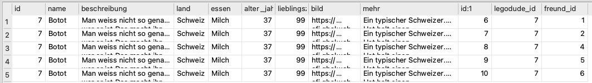

# Liste von Freunden
Sie haben gelernt, wie Sie die [Tabellen `legodudes` und `legodudes_freunde` kombinieren](Tabellen-Kombinieren) können, um herauszufinden, wer mit wem befreundet ist.

Im Ergebnis erhalten Sie allerdings noch kaum Informationen über die entsprechenden Freunde, ausser deren `id`.


Sie bräuchten also eigentlich nochmal die Tabelle `legodudes`, denn die enthält ja alle weiteren Informationen wie etwa den Namen.

:::aufgabe[Erster Versuch]
Nehmen Sie die Abfrage
```sql
SELECT * FROM legodudes, legodudes_freunde WHERE name = 'Botot' and legodude_id = legodudes.id;
```

und passen Sie so an, dass nicht nur aus den zwei Tabellen `legodudes` und `legodudes_freunde`, sondern aus den "drei" Tabellen `legodudes`, `legodudes_freunde` und nochmal `legodudes` selektiert wird.

Führen Sie die Abfrage aus und versuchen Sie das Ergebnis zu interpretieren.

<details>
  <summary>Musterlösung</summary>
  <div>
    ```sql
    SELECT * FROM legodudes, legodudes_freunde, legodudes WHERE name = 'Botot' and legodude_id = legodudes.id;
    ```
  </div>
</details>
:::

Ups — da haben wir ein Problem. Mit _Mehrdeutigkeit_ hatten wir es bereits zu tun, als SQL nicht klar war, auf welche der beiden `id`-Spalten wir uns beziehen. Das haben wir präzisiert, indem wir gesagt haben, dass es um die Spalte `legodudes.id` geht. Nun haben wir in unserer Abfrage aber **zwei Tabellen namens `legodudes`**.

Jetzt müssen wir also noch weiter präzisieren, auf welche Nennung der `legodudes`-Tabelle wir uns beziehen, weil die in unserer Abfrage jetzt zweimal vorkommt (auch wenn es sich natürlich beide Male um genau die gleiche Tabelle handelt). Das machen wir, in dem wir eine der beiden Tabellen in unserer Abfrage _temporär umbenennen_ — wir geben ihr ein sogenanntes **Alias**.

Dazu müssen wir den `FROM`-Teil wie folgt anpassen:

```sql
[...] FROM legodudes, legodudes_freunde, legodudes as freunde [...];
```

Der zweiten Nennung von `legodudes` geben wir hier also den "Spitznamen" (das _Alias_) `freunde`.

:::aufgabe[Abfrage verbessern]
Passen Sie Ihre Abfrage so lange an, bis Sie als Ergebnis die folgende Tabelle erhalten:


Dazu braucht es sicher folgende Anpassungen:
- Alias für die zweite Nennung der `legodudes`-Tabelle (siehe oben)
- Anpassung einer bestehenden Bedingung im `WHILE`-Teil, weil dort nochmal ein `ambiguous column name`-Fehler auftritt
- Eine zusätzliche Bedingung im `WHILE`-Teil, damit wir keine Duplikate erhalten (Tipp: schauen Sie sich die Spalte `freund_id` an)
- Anpassung der Spalten-Auswahl im `SELECT`-Teil

Speichern Sie Ihre Abfrage als `Liste von Freunen.sql` und geben Sie sie ab.
:::

---
