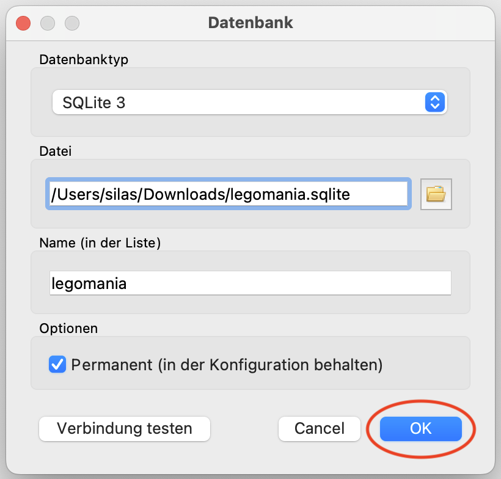

# Erste Schritte mit SQLiteStudio

## Datenbank hinzufügen
In SQLite ist eine Datenbank ganz einfach eine Datei mit der Dateiendung `.sqlite`.

Im in SQLiteStudio eine bestehende Datenbank hinzuzufügen (also, sich mit der Datenbank zu _verbinden_), klicken Sie zuerst auf folgenden Button:


Anschliessend müssen Sie die entsprechende `.sqlite`-Datenbank-Datei auswählen. Dazu klicken Sie auf folgenden Button:


Nun suchen Sie die `.sqlite`-Datenbank-Datei, mit der Sie sich verbinden wollen. In diesem Beispiel wählen wir die Datei `legomania.sqlite` im Ordner `Downloads` aus. Den Namen müssen Sie nicht anpassen. Klicken Sie am Schluss auf "OK" um sich mit der Datenbank-Datei zu verbinden.


## SQL Editor und Überblick
Wenn Sie mit einer Datenbank verbunden sind, können Sie den _SQL-Editor_ öffnen, um mit der Datenbank zu interagieren. Was genau SQL ist, das lernen Sie später.

Stellen Sie zuerst sicher, dass die korrekte Datenbank ausgewählt ist. Hier haben wir die Datenbank `legomania` ausgewählt. Klicken Sie dann auf folgenden Button:


Es öffnet sich nun der sogenannte (vorerst noch leere) _SQL-Editor_:


Klicken Sie links neben dem Namen der Datenbank (hier `legomania`) auf den kleinen Dropdown-Pfeil, um eine Liste aller _Tabellen_ in dieser Datenbank zu sehen.

Rechts im _SQL-Editor_ sehen Sie zuoberst den Abfrage-Editor, in dem Sie ihre Abfragen formulieren können. In der Resultat-Ansicht erscheint später das Resultat der Abfrage.

In der Status-Ansicht erhalten Sie nützliche Informationen zum Status der Abfrage — sie ist besonders dann nützlich, wenn Fehler auftreten.

## Eine erste Abfrage (_"Query"_)
Fügen Sie im SQL-Editor folgenden Text ein und drücken Sie anschliessend auf den "Play-Button":
```sql
SELECT * FROM legodudes;
```


:::warning[Was wird gespeichert?]
Es wird hierbei nur der "Text" im Abfrage-Editor gespeichert — nicht etwa das Resultat, oder die ganze Datenbank!
:::

---
