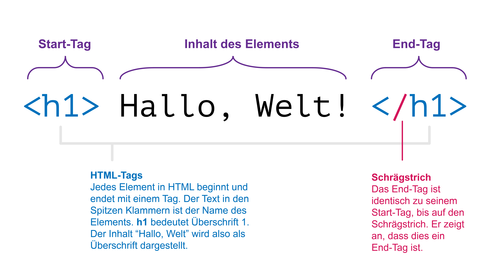

# HTML und seine Elemente
In Word formatieren wir unseren Text mit Formatvorlagen. Damit beeinflussen wir nicht nur das Aussehen unseres Dokuments, sondern geben dem Programm auch Informationen über die Struktur unseres Texts. Word nutzt diese Informationen beispielsweise um ein automatisches Inhaltsverzeichnis zu generieren.

Auch für unseren Browser ist es wichtig, die Struktur eines Texts zu kennen. Er muss jeden Teil unseres Inhalts eindeutig als Titel, Überschrift, Absatz, etc. identifizieren können. Nur so kann der Browser unser Dokument korrekt darstellen.

Da wir im Web mit reinen Textdateien arbeiten, müssen wir diese Strukturinformationen direkt im Text mitliefern. Wir verwenden dazu ein [Dateiformat](../HTML-CSS#dateiformat-statt-papierformat) namens **HTML** (Hypertext Markup Language).

In HTML strukturieren wir unseren Text mit sogenannten _Elementen_. Ein **HTML-Element** sieht folgendermassen aus:

Hier würden wir sagen, **der Text _"Hallo, Welt!"_ steht in einem h1-Element**. Das Element besteht aus dem Start-Tag `<h1>`, gefolgt vom Text _"Hallo, Welt!"_, gefolgt von End-Tag `</h1>`.

## Was sind Tags?
Tags sind Markierungen. Mit dem Tag `<h1>` sagen wir dem Browser: _"Hey! Alles, was jetzt kommt, ist eine Überschrift 1. Und zwar so lange, bis du das dazugehörige End-Tag `</h1>` siehst."_ Anders gesagt: mit dem Start-Tag `<h1>` und dem End-Tag `</h1>` markieren wir den gesamten dazwischen stehenden Text als Überschrift 1.

Insgesamt bezeichnen wir dieses Konstrukt aus den beiden Tags und ihrem Inhalt als _h1-Element_. Die Begriffe _Tag_ und _Element_ verwenden wir im alltäglichen Sprachgebrauch aber oft auch als Synonyme, sofern im Kontext klar ist, was wir damit meinen.

Wir werden sehen, dass es in HTML nebst `<h1>` noch eine Vielzahl anderer Elemente gibt, mit denen wir unseren Text strukturieren können. Einige davon lernen Sie bereits im nächsten Abschnitt kennen.

## HTML-Elemente im Vergleich zu Word
Ihr erstes HTML-Element haben Sie nun bereits kennengelernt. Und wenn das `<h1>`-Element eine Überschrift 1 ist, dann liegt es nahe, dass es wohl auch ein `<h2>` für eine Überschrift 2 geben müsste. Dabei gibt es übrigens einen kleinen Unterschied zwischen Word und HTML: In HTML haben wir kein `<titel>`-Element[^1]. Wir verwenden `<h1>` in HTML deshalb analog zur Word-Formatvorlage _Titel_, und `<h2>` demnach analog zur Formatvorlage _Überschrift 1_.

Ein paar weitere grundlegende HTML-Elemente und ihren Vergleich zu Word finden Sie in der unten stehenden Tabelle.

| HTML-Element | Vergleich zu Word                                                                                                                                                                                                   |
|:------------:|---------------------------------------------------------------------------------------------------------------------------------------------------------------------------------------------------------------------|
|    `<h1>`    | `<h1>` (engl.: _heading 1_) steht für  Überschrift 1. Da es in HTML aber kein Vergleichbares Element zu der Word-Formatvorlage _Titel_ gibt[^1], verwenden wir das `<h1>`-Element analog zur Formatvorlage _Titel_. |
|    `<h2>`    | Da wir `<h1>` nicht als Überschrift sondern als Titel verwenden, verwenden wir das `<h2>` somit alanog zur Word-Formatvorlage _Überschrift 1_.                                                                      |
|    `<h3>`    | Wenig überraschend verwenden wir demnach das `<h3>`-Element analog zur Word-Formatvorlage _Überschrift 2_.                                                                                                          |
|    `
`     | In Word machen wir einen Absatzumbruch mit der Enter-Taste. In HTML funktionert das etwas anders: Ein Absatz ist alles, was in einem `
`-Element steht.                                                           |
|   ``    | In Unterschied zu Word müssen wir in HTML auch Bilder als Bild-Elemente kennzeichnen. Das tun wir mit dem ``-Tag, welches wir uns später noch genauer ansehen.                                                 |

Mit den Elementen `<h1>` bis `<h3>` und dem `
`-Element haben Sie auch schon alles, was sie zur Strukturierung eines Texts für eine erste einfache Webseite brauchen. Im nächsten Abschnitt schauen wir uns an, wie wir damit nun ein HTML-Dokument erstellen können.

[^1]: Tatsächlich gibt es `<title>`-Element. Wir verwenden es aber nicht, um Text auf unserer Webseite zu formatieren. Stattdessen definieren wir damit den Text, der oben im Browser-Tab angezeigt werden soll.
