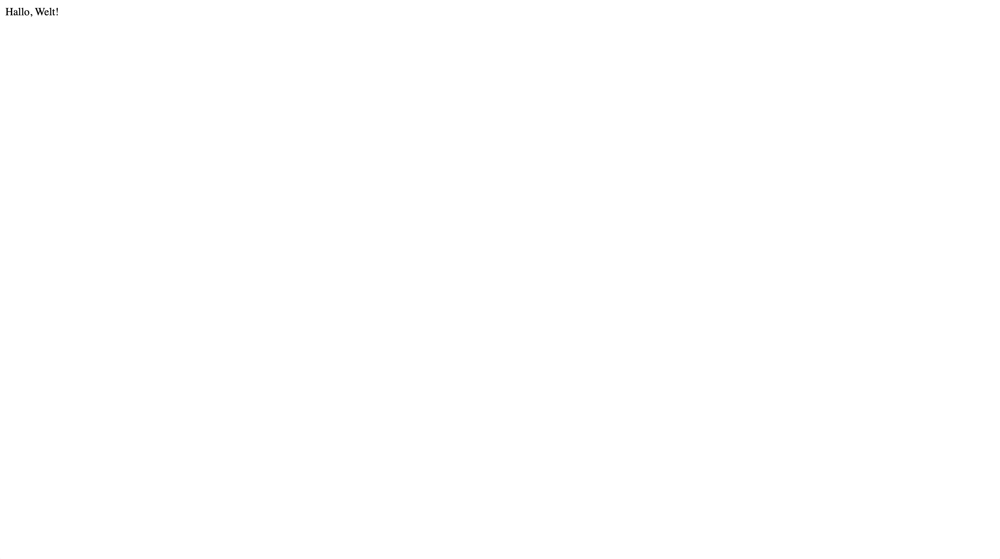
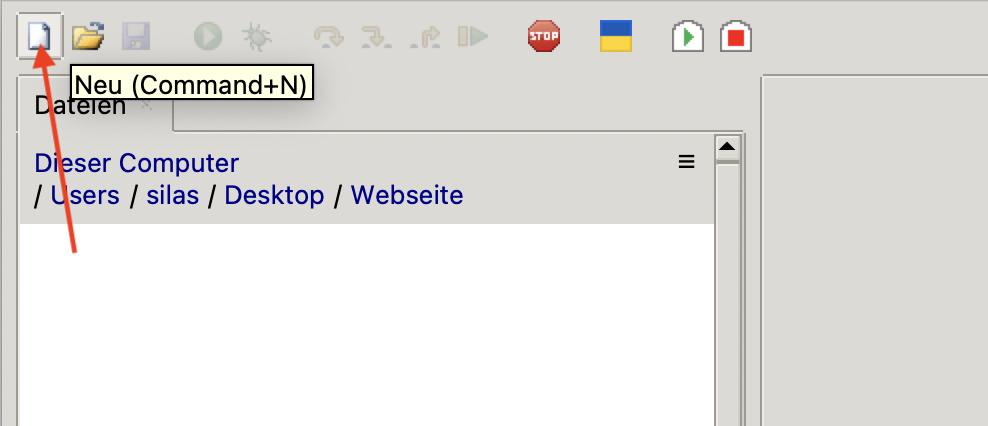

import BrowserWindow from "@site/src/app/components/BrowserWindow";

# Das HTML-Dokument
## Aufbau eines HTML-Dokuments
```html showLineNumbers
<!DOCTYPE html>
<html>
</html>
```

```html {3-4} showLineNumbers
<!DOCTYPE html>
<html>
  <body>
  </body>
</html>
```

```html {4} showLineNumbers
<!DOCTYPE html>
<html>
  <body>
    Hallo, Welt!
  </body>
</html>
```

<BrowserWindow url="C:\Benutzer\silas\Webseite\index.html">
  
</BrowserWindow>

```html {4} showLineNumbers
<!DOCTYPE html>
<html>
  <body>
    <h1>Hallo, Welt!</h1>
  </body>
</html>
```

<BrowserWindow url="C:\Benutzer\silas\Webseite\index.html">
  
</BrowserWindow>

- Verschachtelte Tags: Bezug auf [was sind Tags](HTML-Elemente#was-sind-tags)

## Ein HTML-Dokument erstellen



---
