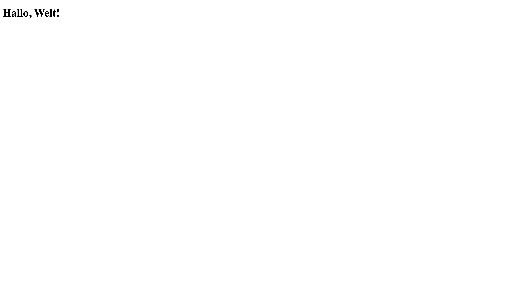

import BrowserWindow from "@site/src/components/BrowserWindow";

# Text formatieren
Genauso wie wir einer Überschrift in Word eine Formatvorlage zuweisen, können wir unseren Text in HTML formatieren, indem wir ihn mit einem entsprechenden Tag umranden. Um aus unserem Text `Hallo, Welt!` also einen Titel zu machen, umranden wir ihn mit dem Start-Tag `<h1>` und dem End-Tag `</h1>`. So wird daraus ein `h1`-Element.
```html {4} showLineNumbers
<!DOCTYPE html>
<html>
  <body>
    <h1>Hallo, Welt!</h1>
  </body>
</html>
```

In Thonny sieht das wie folgt aus:


Jetzt müssen wir unsere Änderungen wieder speichern...


...und in den Browser wechseln. Damit die Änderungen im Browser sichtbar werden, müssen wir hier noch die Seite neu laden:


Und schon sehen wir, wie unser `Hallo, Welt!` von kleinem Normaltext zu einer grossen Überschrift wird:
<BrowserWindow url="C:\Benutzer\silas\Webseite\index.html">
  
</BrowserWindow>
