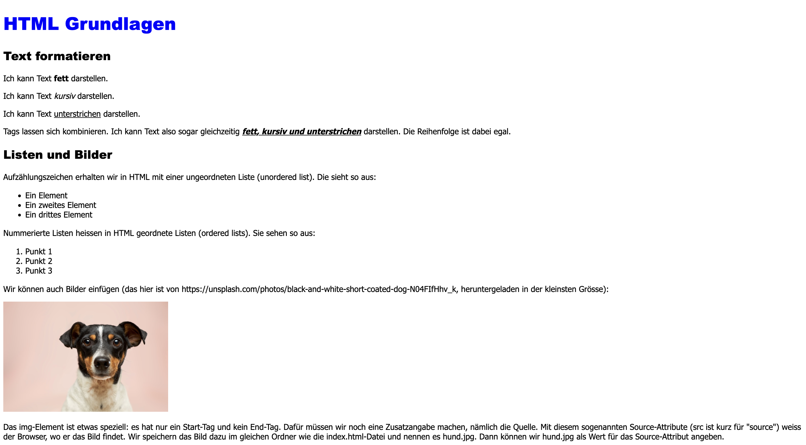

import BrowserWindow from "@site/src/app/components/BrowserWindow";

# Das grössere Dokument stylen
Wenden wir uns nun wieder unserem grösseren Dokument (`groesseres-dokument.html`) zu. Auch hier können wir ein `head`- und darin ein `style`-Element hinzufügen, um das Aussehen des Dokuments anzupassen.

Etwa so könnte dieses Styling am Schluss aussehen (einige Erklärungen dazu finden Sie unten):
```html showLineNumbers
<!DOCTYPE html>
<html>
  <head>
    <style>
      h1 { /* Diese Regel gilt für alle h1-Elemente */
        color: blue;
        font-family: 'Arial Black'; /* Den Namen einer Schriftart setzen wir in einfache Anführungszeichen '' */
        font-size: 24pt; /* Für die Schriftgrösse brauchen wir eine EINHEIT - wir verwenden hier pt ("Punkte") */
      }

      h2 { /* Diese Regel gilt für alle h2-Elemente */
        font-family: 'Arial Black';
        font-size: 16pt;
      }

      p, /* Mehrere Selektoren: diese Regel gilt für alle p-Elemente... */
      li { /* ...UND für alle li-Elemente */
        font-family: 'Tahoma';
        font-size: 11pt;
      }

      img { /* Diese Regel gilt für alle Bilder */
        width: 300px; /* Wir setzen die Breite der Bilder auf 300 Pixel (Einheit: px) */
      }
    </style>
  </head>
  <body>
    <h1>HTML Grundlagen</h1>
    <h2>Text formatieren</h2>
    <p>
      Ich kann Text <b>fett</b> darstellen.
    </p>

    <p>
      Ich kann Text <i>kursiv</i> darstellen.
    </p>

    <p>
      Ich kann Text <u>unterstrichen</u> darstellen.
    </p>

    <p>
      Tags lassen sich kombinieren. Ich kann Text also sogar gleichzeitig <b><i><u>fett,
      kursiv und unterstrichen</u></i></b> darstellen. Die Reihenfolge ist dabei egal.
    </p>

    <h2>Listen und Bilder</h2>
    <p>
      Aufzählungszeichen erhalten wir in HTML mit einer ungeordneten Liste (unordered
      list). Die sieht so aus:
    </p>
    <ul>
      <li>Ein Element</li>
      <li>Ein zweites Element</li>
      <li>Ein drittes Element</li>
    </ul>

    <p>
      Nummerierte Listen heissen in HTML geordnete Listen (ordered lists). Sie sehen
      so aus:
    </p>
    <ol>
      <li>Punkt 1</li>
      <li>Punkt 2</li>
      <li>Punkt 3</li>
    </ol>

    <p>
      Wir können auch Bilder einfügen (das hier ist von
      https://unsplash.com/photos/black-and-white-short-coated-dog-N04FIfHhv_k,
      heruntergeladen in der kleinsten Grösse):
    </p>
    

    <p>
      Das img-Element ist etwas speziell: es hat nur ein Start-Tag und kein End-Tag.
      Dafür müssen wir noch eine Zusatzangabe machen, nämlich die Quelle. Mit diesem
      sogenannten Source-Attribute (src ist kurz für "source") weiss der Browser, wo
      er das Bild findet. Wir speichern das Bild dazu im gleichen Ordner wie die
      index.html-Datei und nennen es hund.jpg. Dann können wir hund.jpg als Wert für
      das Source-Attribut angeben.
    </p>
  </body>
</html>
```

Im Browser sieht das wie folgt aus:
<BrowserWindow url="C:\Benutzer\silas\Webseite\groesseres-dokument.html">
  
</BrowserWindow>

Um den oben stehenden Code besser zu verstehen, schauen wir uns die Regel für die `h1`-Elemente hier nochmal genauer an:
```css showLineNumbers
h1 { /* Diese Regel gilt für alle h1-Elemente */
  color: blue;
  font-family: 'Arial Black'; /* Den Namen einer Schriftart setzen wir in einfache Anführungszeichen '' */
  font-size: 24pt; /* Für die Schriftgrösse brauchen wir eine EINHEIT - wir verwenden hier pt ("Punkte") */
}
```

Folgendes sollten Sie dazu wissen:
- Alles, was in CSS zwischen `/*` und `*/` steht (hier grau und kursiv dargestellt), ist ein _Kommentar_. Der Browser ignoriert Kommentare. Wir können sie zum Beispiel verwenden, um eine bestimmte Code-Stelle zu erklären, so wie ich das hier gemacht habe.
- Bei der Eigenschaft `font-family` (Schriftart) setzen wir den Wert in einfache Anführungszeichen (`'Arial Black'`). Wir machen das deshalb, weil wir hier auch mehrere Schriftarten hintereinander könnten[^1]. Mit den Anführungszeichen stellen wir sicher, dass der Browser diesen Wert als die Schriftart `Arial Black` versteht, und nicht etwa als zwei Schriftarten, `Arial` und `Black`.
- Bei den meisten nummerischen Eigenschaften wie `font-size` und `width` müssen wir nebst der Zahl auch noch eine Einheit angeben. Dies deshalb, weil wir dieselbe Eigenschaft meistens in verschiedenen Einheiten definieren können. Der Einfachheit halber verwenden wir für die Schriftgrösse hier immer die Einheit `pt` (für _Points_), wie das auch in Word der Fall ist. Für Bilder verwenden wir ebenso immer die Einheit `px` für _Pixel_.[^2]

:::insight[Andere Arten von Selektoren]
In Code ganz oben haben wir folgende Regel definiert:

```css showLineNumbers
img {
  width: 300px;
}
```

Der Selektor auf Zeile 1 sagt aus, dass diese Regel auf alle Bilder angewendet werden soll. Es sollen also **alle** Bilder genau `300px` breit sein. Doch was, wenn wir mehrere Bilder haben, und nicht unbedingt möchten, dass die alle genau die gleiche Breite haben?

Sie kennen bisher nur die Art von CSS-Selektor, die immer alle Elemente eines bestimmten Typs (`h1`, `p`, `img`) anspricht. CSS kennt weitere Arten von Selektoren. Die zwei wichtigsten sind **IDs** und **Klassen**. Mehr dazu erfahren Sie im nächsten Artikel.
:::

[^1]: Wieso mehrere Schriftarten? Nicht jede Schriftart ist in jedem Browser verfügbar. Wir geben deshalb häufig zuerst die Schriftart an, die wir gerne verwenden möchten. Dahinter geben wir noch eine zweite Schriftart an, die der Browser verwenden soll, falls die erste nicht zur Verfügung steht - quasi als "Backup".
[^2]: `pt` und `px` sind _absolute_ Einheiten. Weil ein HTML-Dokument auf unterschiedlichen Bildschirmen aber unterschiedlich gross dargestellt wird, verwenden wir in der Praxis oft _relative_ Einheiten - als Einheiten, die in irgendeiner Form vom Kontext abhängig sind. Beispielsweise verwenden wir für die Schriftgrösse oft die Einheit `rem` (für _root element_), um sie so als Faktor einer bestimmten Basis-Schriftgrösse auszudrücken. Statt zu sagen, dass die Schriftgrösse für `h1` genau `24pt` sein soll, sagen wir also z.B. mit `1.2rem`, dass sie 1.2-Mal so gross sein soll, wie die Basis-Schriftgrösse (die meistens vom Browser festgelegt wird). Für Bilder verwenden wir oft die Einheit `%`. Zum Beispiel bedeutet `width: 50%`, dass das Bild `50%` der verfügbaren Breite einnehmen soll - egal wie viel Pixel das sind.
