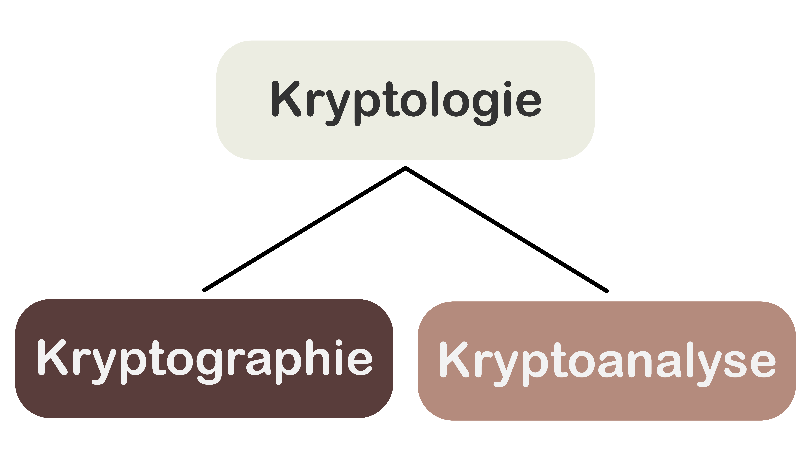
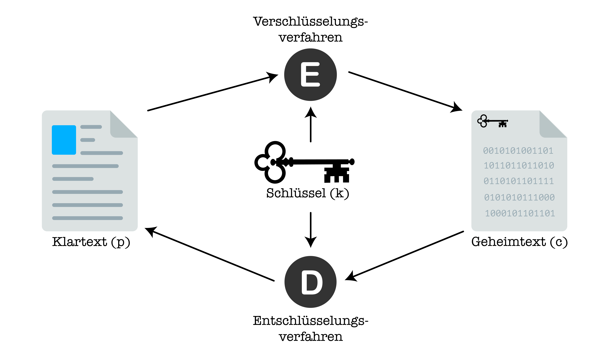

# Grundbegriffe
## Kryptologie
Der Begriff **Kryptologie** setzt sich zusammen aus dem altgriechischen κρυπτός (also kryptós, _verborgen_) und λόγος (also lógos, _Lehre, Kunde_). Die Kryptologie ist also die _Lehre des Verborgenen_. Sie ist die Wissenschaft, die sich mit der Ver- und Entschlüsselung von Informationen (also mit Informationssicherheit) beschäftigt.

## Kryptographie und Kryptoanalyse
Die Kryptologie kann grob in zwei Bereiche unterteilt werden:
* die **Kryptographie** (γράφειν, also gráphein, was schreiben bedeutet) und
* die **Kryptoanalyse**.

Während sich die _Kryptographie_ mit dem Finden von sicheren Verschlüsselungsverfahren beschäftigt, liegt der Fokus der _Kryptoanalyse_ auf dem "Brechen" oder "Knacken" solcher Verfahren.

## Die Begriffe der Kryptographie
In der Kryptologie bezeichnen wir eine _unverschlüsselte_ Nachricht als **Klartext** und notieren diesen Begriff oft abgekürzt mit _p_ (engl.: _plaintext_). Eine _verschlüsselte_ Nachricht bezeichnen wir als **Geheimtext** und notieren dies mit _c_ (engl.: _ciphertext_).

Um einen Klartext in einen Geheimtext umzuwandeln, benötigen wir einerseits einen **Schlüssel** (_k_, engl.: _key_) und andererseits einen Algorithmus, der den Klartext unter Verwendung des Schlüssels in Geheimtext umwandelt. Diesen Algorithmus bezeichnen wir als **Verschlüsselungsverfahren** oder **Verschlüsselungsalgorithmus**, abgekürzt _E_ (engl.: _encryption algorithm_). Damit wir eine verschlüsselte Nachricht aber auch wieder entschlüsseln können, brauchen wir zudem noch ein dazugehöriges **Entschlüsselungsverfahren**, resp. einen **Entschlüsselungsalgorithmus** (_D_, engl.: _decryption algorithm_). Ein Paar aus zwei solchen Algorithmen bezeichnen wir dann als eine **Chiffre**, wenn _D_ die unter Verwendung desselben Schlüssels _k_ die Umkehroperation von _E_ ist.

| Symbol | Deutscher Begriff                                           | Englischer Begriff     | Bedeutung                                                                                                                       |
|--------|-------------------------------------------------------------|------------------------|---------------------------------------------------------------------------------------------------------------------------------|
| _p_    | **Klartext**                                                | _plaintext_            | unverschlüsselte Nachricht                                                                                                      |
| _c_    | **Geheimtext**                                              | _ciphertext_           | verschlüsselte Nachricht                                                                                                        |
| _k_    | **Schlüssel**                                               | _key_                  | Information, welche benötigt wird, um den Klartext zu ver-, bzw. den Geheimtext zu entschlüsseln                                |
| _E_    | **Verschlüsselungsverfahren (Verschlüsselungsalgorithmus)** | _encryption algorithm_ | Ein Algorithmus, der einen Klartext unter Verwendung eines Schlüssels in Geheimtext umwandelt.                                  |
| _D_    | **Entschlüsselungsverfahren (Entschlüsselungsalgorithmus)** | _decryption algorithm_ | Ein Algorithmus, der einen Geheimtext unter Verwendung eines Schlüssels in Klartext umwandelt.                                  |
|        | **Chiffre**                                                 | _cipher_               | Ein Paar aus einem _E_ und einem _D_, bei dem _D_ die unter Verwendung desselben Schlüssels _k_ die Umkehroperation von _E_ ist |

:::definition[Die Bestandteile einer Chiffre]
Formal können wir die Bestandteile einer Chiffre also wie folgt definieren:
* `E` ist eine Funktion, sodass gilt: `E(p, k) = c`. Das Verschlüsselungsverfahren _E_ ist also eine Funktion, die aus einem Klartext _p_ und dem Schlüssel _k_ den dazugehörigen Geheimtext _c_ berechnet.
* `D` ist eine Funktion, sodass gilt: `D(c, k) = p`: Das Entschlüsselungsverfahren _D_ ist also eine Funktion, die aus einem Geheimtext _c_ und dem Schlüssel _k_ den dazugehörigen Klartext _p_ berechnet.
:::

:::insight[Das Zusammenspiel der Bestandteile einer Chiffre]
Weil `E(p, k) = c` gilt, können wir in `D(c, k) = p` das `c` mit `E(p, k)` ersetzen und erhalten somit `D(E(p, k), k) = p`. In anderen Worten: Wenn wir einen Klartext `p` unter Verwendung eines Schlüssels `k` mit `E` verschlüsseln und das Ergebnis wieder unter Verwendung desselben Schlüssels `k` mit `D` entschlüsseln, dann erhalten wir am Ende wieder den ursprünglichen Klartext `p`.
:::

---
