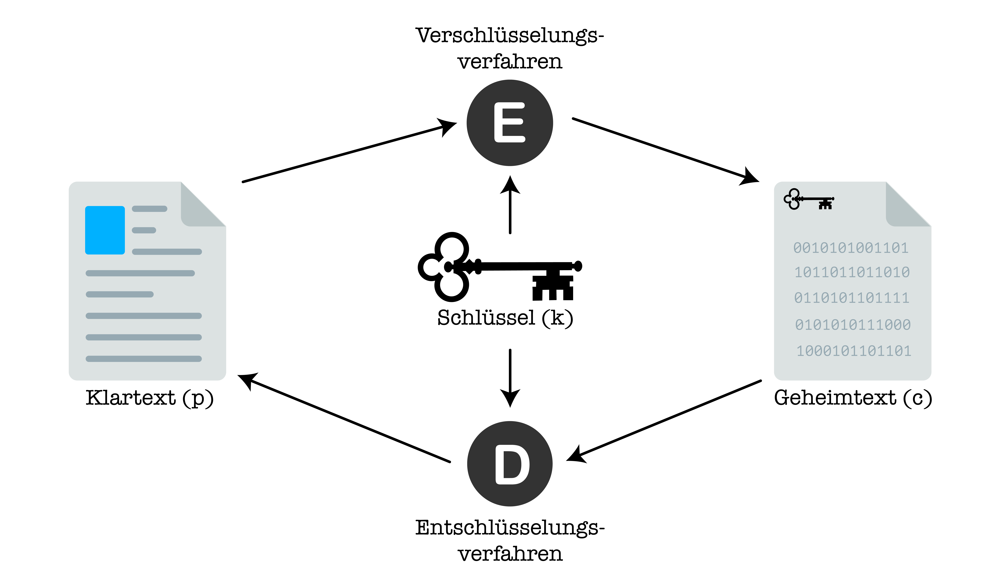

# Symmetrische Verschlüsselung
Nachdem wir nun einige antike Verschlüsselungsmethoden kennengelernt haben, dringen wir jetzt in unsere Zeit vor. Dazu schauen wir uns in diesem Abschnitt einige modernere **symmetrische Verschlüsselungsverfahren** an.

Ein _symmetrisches_ Verschlüsselungsverfahren ist ein Verfahren, bei dem wir für die **Ver**schlüsselung und die **Ent**schlüsselung ein und **denselben Schlüssel** verwenden - genau so, wie Sie das bisher bei Polybios, Caesar, Vigenère und co. kennengelernt haben.

---
