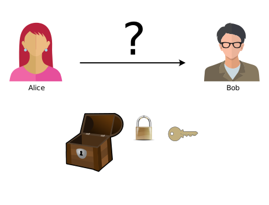
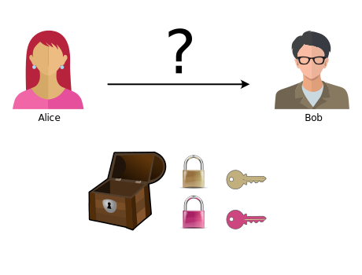

---
sidebar_custom_props:
  source:
    name: ofi-blog.gbsl.website
    ref: https://ofi.gbsl.website/26e/Kryptologie/Asymmetrisch/key-exchange
---

# Schlüsselaustausch

Alice und Bob möchten sich geheime Unterlagen senden. Doch wie können sie den Schlüssel austauschen?

Vielleicht hilft es, wenn wir uns in Erinnerung rufen, dass im Handel mehrere Schlösser mit unterschiedlichen Schlüsseln zu kaufen sind:

## Aufgabe: Schlüsselaustausch
Finden Sie eine Möglichkeit, den Inhalt der Truhe sicher zu übertragen?

Versetzen Sie sich dabei in die Rollen der anderen Krypto-Charaktere!

  
Hinweis: Variante 1

  

    #### Variante 1: Eigene Schlösser Verteilen

    Können Sie sich zusammenreimen, wie die geheimen Unterlagen versendet werden? Wo liegen allenfalls Probleme?

    

      
Antwort anzeigen

      

        Alice verschliesst die Truhe mit dem eigenen Schloss, um ungewollten Zugriff zu unterbinden. So verschlossen schickt sie die Truhe an Bob. Auch er kann sie nicht öffnen. Daher fügt er noch sein Schloss hinzu und sendet die Truhe zurück. Nun kann Alice ihr Schloss entfernen und die Truhe ein letztes Mal schicken und nachdem Bob sein eigenes Schloss entfernt hat, kann er den Inhalt sehen.

        Dass es sich um Alices Schloss handelt, kann Bob glauben, da die Absenderin die Informationen ja sicher nicht offen transportieren würde.

        **Problem**: Wie weiss Alice, dass es sich um Bobs Schloss handelt? Jemand unterwegs könnte das Schloss austauschen.
      

    

  

  
Hinweis: Variante 2

  

    #### Variante 2: Eigene Schlösser Verteilen

    

    Wie können die Unterlagen sicher zugestellt werden? Wo liegen allenfalls Probleme?

    

      
Antwort anzeigen

      

        Bob könnte Alice das eigene, offene Schloss senden, mit dem Alice anschliessend die Truhe verschliesst.

        **Problem**: Wie weiss Alice, dass es sich um Bobs Schloss handelt? Jemand unterwegs könnte das Schloss austauschen.
      

    

  

  
Hinweis: Variante 3

  

    #### Variante 3: Schlösser beim vertrauenswürdigen Trent beziehen

    

    Wie können die Unterlagen sicher zugestellt werden? Wo liegen allenfalls Probleme?

    

      
Antwort anzeigen

      

        Hier handelt es sich eigentlich um die zweite, einfache Variante mit nur einer Sendung. Allerdings erhält Alice das Schloss nicht von Bob, sondern von einer vertrauenswürdigen Dritten Stelle (Trent). Trent hat eine ganze Sammlung von Schlössern – natürlich nicht nur von Bob, sondern von ganz vielen Leuten. So können alle, die Trent vertrauen, dort Schlösser abholen.
      

    

  

---
