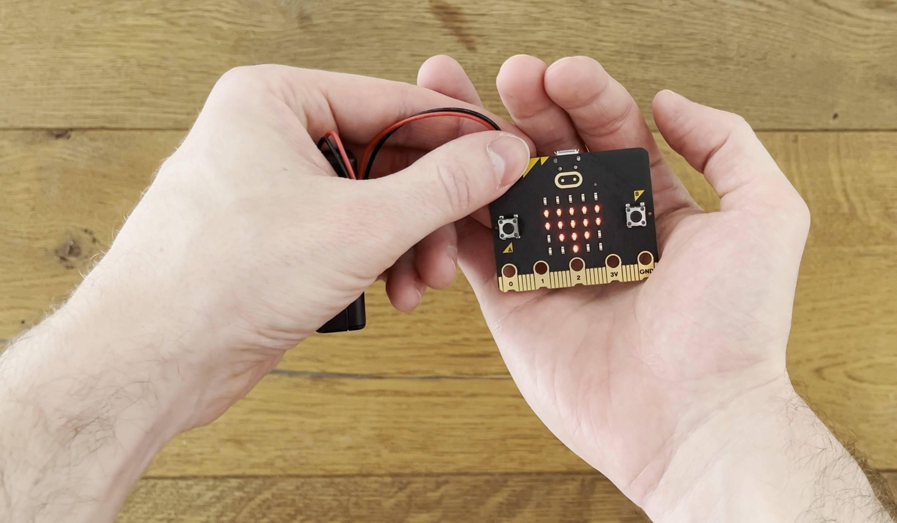

# Der Micro:bit: Dein Einstieg in die spannende Welt der Programmierung!
:::Hero
  
:::
:::Caption
  Der Micro:bit Microcontroller ist so klein, dass er gut in eine Hand passt!
:::

Dieser Artikel gibt dir einen ersten Einblick in die faszinierende Welt des _Micro:bit_, eines kleinen Computers, der
dich unkompliziert und kreativ an die Grundlagen der Programmierung heranführt. Selbst wenn du bisher keine Erfahrung
mit dem Programmieren hast und nur grundlegende ICT-Kenntnisse besitzt, kannst du ganz entspannt sein – der Micro:bit
ist der ideale Begleiter für deinen ersten Ausflug in die Welt _Codens_.

## Was ist der Micro:bit?
Der Micro:bit ist kein gewöhnlicher Computer, wie du ihn in deinem Alltag findet. Er hat weder Maus, noch Bildschirm
oder Tastatur. Er ist so klein, dass du ihn vielleicht sogar in deiner Faust verstecken kannst! Der Micro:bit ist
nämlich winziger sogenannter _Einplatinencomputer_.

:::insight Wozu wurde dieser Computer entwickelt?
Der Micro:bit wurde von der BBC (_British Broadcasting Corporation_) entwickelt, damit Menschen von jung bis alt die
Grundlagen der Programmierung und der Robotik auf spannende, kreative Weise entdecken können.
:::

## Was kann man damit anstellen?
Der Micro:bit mag klein erscheinen, aber seine Möglichkeiten sind riesig! Hier sind nur einige spannende Dinge, die du
mit diesem kleinen Kraftpaket machen kannst:
- **Licht und Farben:** Der Micro:bit verfügt über eingebaute LEDs, mit denen du Muster, Animationen und sogar
  Nachrichten erstellen kannst. Macht deine eigenen leuchtenden Kreationen!
- **Bewegung und Beschleunigung:** Mit den integrierten Sensoren kannst du Bewegungen erkennen und deine eigenen
  Bewegungssteuerungen programmieren. Der Micro:bit wird deine Bewegungen in aufregende Aktionen umsetzen!
- **Musik und Töne:** Ja, du kannst mit dem Micro:bit sogar Musik machen! Programmiert deine eigenen Melodien und
  entdecke, wie du Klänge erzeugen kannst.
- **Spiele programmieren:** Dein erstes eigenes Spiel erstellen? Mit dem Micro:bit ist das problemlos möglich! Lass
  deiner Fantasie freien Lauf und programmiere deine eigenen interaktiven Spiele.

