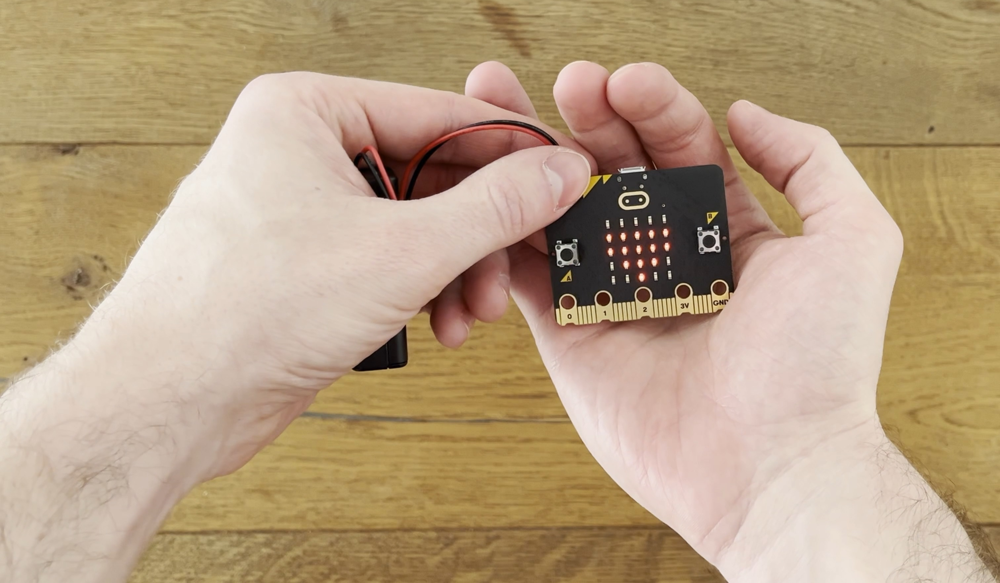

# Der Micro:bit
Der Micro:bit ist ein so kleiner Computer, dass du ihn vielleicht sogar in deiner Faust verstecken kannst. Es ist aber
kein Computer, so wie du ihn kennst: Er hat weder einen Bildschirm, noch eine Tastatur, eine Maus oder ein Touchpad.
Der Micro:bit ist nämlich ein sogenannter _Microcontroller_.

