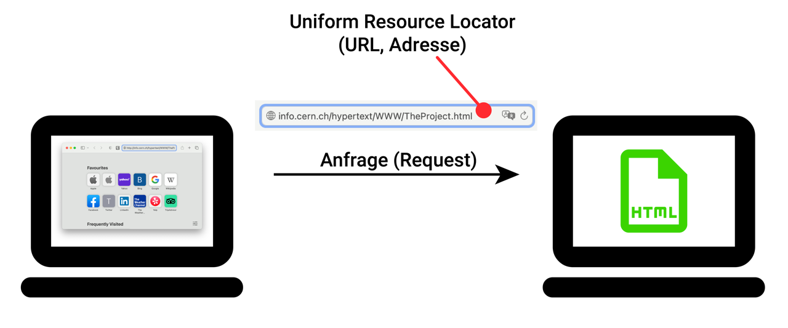

# Ablauf eines Webseitenaufrufs
Wann immer in der Informatik zwei Parteien (in diesem Fall zwei Computer) miteinander kommunizieren wollen, müssen sich
beide Seiten an gewisse Spielregeln halten, damit sie sich gegenseitig verstehen. Diese Spielregeln - wir bezeichnen sie
in der Informatik als **Protokolle** - legen beispielsweise einen Handlungsablauf fest, oder sie definieren, wie ein
bestimmtes Datenpaket aufgebaut sein muss.

In diesem Abschnitt verschaffen wir uns einen Überblick über den Ablauf eines Webseitenaufrufs, wie er durch das
**Hypertext Transfer Protocol (HTTP)** festgelegt wird.

Der erste Teilnehmer ist dabei der sogenannte **Browser** - also ein Programm auf dem Computer der Benutzerin, welches
Webseiten aufrufen und anzeigen kann.

Der andere Teilnehmer ist ein zweiter (in der Praxis meist sehr leistungsstarker) Computer, welcher die von der
Benutzerin gewünschte **Ressource**, nämlich die Webseite in form einer HTML-Datei, besitzt und öffentlich anbietet. Die
beiden Seiten stehen sich also in einem sogenannten Client-Server-Verhältnis gegenüber. Der **Client** ist dabei
konzeptuell die Partei, die um etwas bittet (in diesem Fall um eine HTML-Datei), der **Server** ist die Partei die etwas
anbietet. Wir können dabei sowohl den Browser als auch den Computer der Benutzerin als Client bezeichnen - im Prinzip
sogar die Benutzerin selbst.

Im ersten Schritt sendet der Client nun eine **Anfrage (Request)** an den Server. Im Rahmen von HTTP, also bei einem
Webseitenaufruf, tut er dies in Form einer URL. Die **URL** (Uniform Resource Locator) ist die Adresse der gewünschten
Webseite im World Wide Web.

Wenn der über diese Adresse erreichte Server (hier `info.cern.ch`) nun die gewünschte Ressource (hier das Dokument
`/hypertext/WWW/TheProject.html`) besitzt und anbietet, so wird diese in der **Antwort (Response)** des Servers
retourniert. Sie wird dazu in ein Paket gepackt, und darin als Payload (also als "eigentlicher Inhalt") des Pakets
bezeichnet. Nebst der **Payload** enthält das Paket auch noch den sogenannten **Status Code**. Mehr Informationen dazu
finden Sie unten.

Und damit ist die gesuchte Webseite auch bereits auf dem Computer der Benutzerin angelangt. Der Browser nimmt die
erhaltene HTML-Datei nun entgegen und präsentiert deren Inhalt auf dem Bildschirm.

Wie Sie sehen, regelt das Hypertext Transfer Protocol (HTTP) also einerseits den Ablauf eines Webseitenaufrufs in Form
dieses Request-Response-Prinzips, bestimmt andererseits aber auch, wie diese Anfrage (Request) und die entsprechende
Antwort (Response) auszusehen haben. Solange sich beide Parteien, also Client und Server, an diese Spielregeln halten,
können wir sicherstellen, dass ein solcher Aufruf ordnungsgemäss funktioniert.

Hier sehen Sie das Endergebnis nun noch einmal im Gesamtüberblick:

## Komplexere Webseiten
Die meisten Webseiten bestehen heutzutage nicht mehr nur aus einer einzigen HTML-Datei. Dazu kommen meistens noch
CSS-Dateien für das Styling, JavaScript-Dateien für gewisse Programmlogik, sowie Bilder und sonstige Medien.

Der Abruf einer Webseite beginnt aber trotzdem immer mit dem Abruf eines HTML-Dokuments. Es ist anschliessend die
Aufgabe des Browsers, die HTML-Datei genau anzuschauen und zu sehen, welche weiteren Ressourcen darin verlinkt sind
(zum Beispiel mit `<link rel="stylesheet" href="style.css">`). Er wiederholt dann den oben beschrieben
Request-Response-Prozess für all diese Ressourcen, bis er schlussendlich eine vollständig geladene Webseite darstellen
kann.
