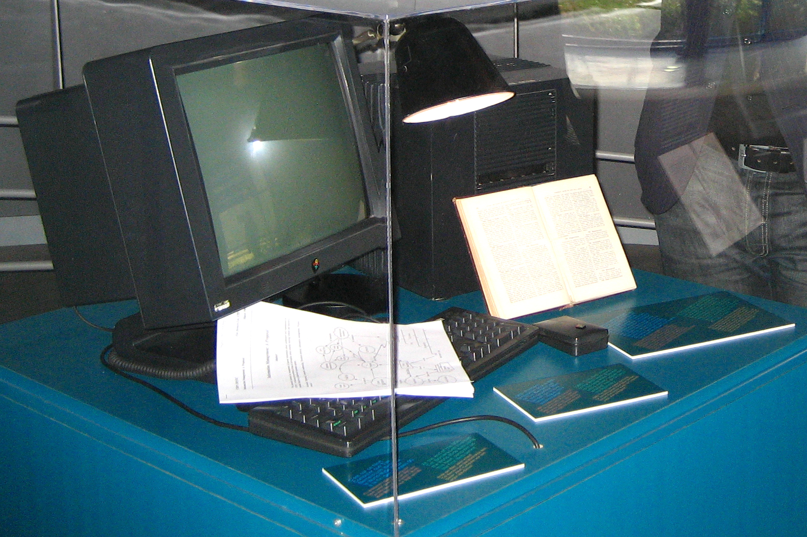
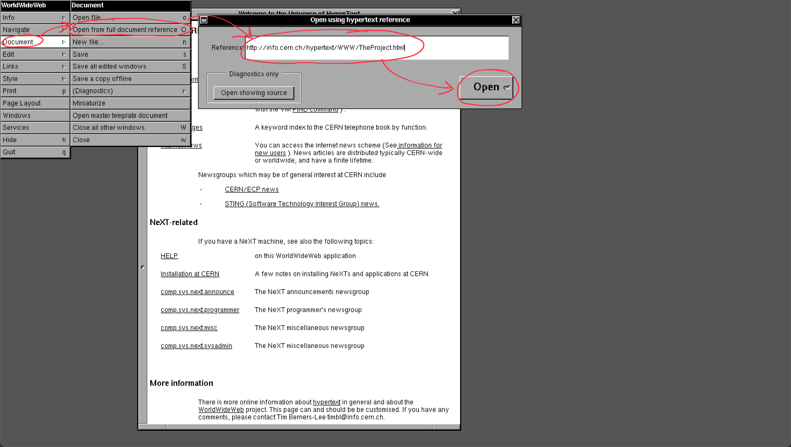
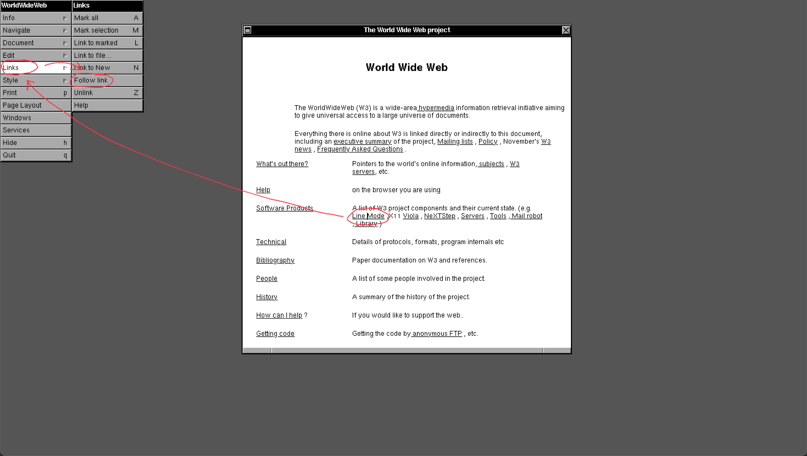

import {HeroContainer} from "@site/src/components/HeroContainer/HeroContainer";
import {Caption} from "@site/src/components/Caption/Caption";

# Die Anfänge des World Wide Web erkunden
<HeroContainer>
  
</HeroContainer>
<Caption>
  Der erste Webserver vom Tim Berners-Lee am [CERN](https://home.cern/science/computing/birth-web).
  Bild: [Thomas Stiren, Wikipedia](https://de.wikipedia.org/wiki/World_Wide_Web#/media/Datei:Tim_berners_lee_webserver.jpg).
</Caption>

:::key Die erste Webseite
Anfang der 1990er-Jahre veröffentlichte [Tim Berners-Lee](https://de.wikipedia.org/wiki/Tim_Berners-Lee) am CERN in Genf **die erste Webseite der Welt**. Diese
Seite besteht bis heute unverändert unter http://info.cern.ch/hypertext/WWW/TheProject.html.
:::

:::insight CERN: Anfänge des World Wide Web
Mehr Informationen zur Geburt des World Wide Web finden Sie auf dieser [Webseite des CERN](https://home.cern/science/computing/birth-web).
:::

## Der erste Web Browser
Wer eine Webseite öffnen will, braucht einen Browser. Tim Berners-Lee musste also nicht nur eine erste HTML-Datei
schreiben, sondern auch noch ein Programm entwickeln, welches diese anzeigen konnte. Der erste solche Web Browser hiess
_WorldWideWeb_. Eine Nachbildung davon können Sie auch heute noch
[selbst ausprobieren](https://worldwideweb.cern.ch/browser/).

Zugegeben, WorldWideWeb ist nicht ganz so intuitiv wie etwa Safari, Firefox, Chrome oder Edge. Wenn Sie also zum
Beispiel die erste Webseite der Welt öffnen wollen, dann gehen Sie folgendermassen vor:

Was, wenn Sie nun einem dieser _Hyperlinks_ folgen wollen? Dazu klicken Sie mit der Maus auf den Link, und anschliessend
im Menu auf "Links" → "Follow link":

:::insight Parallelen
Unsere modernen Web Browser wie Google Chrome, Microsoft Edge, Safari und Firefox sind zweifellos viel mächtiger und
benutzerfreundlicher als der _WorldWideWeb_ Browser von damals. Welche Elemente sind dennoch bis heute erhalten
geblieben?
:::

## Der zweite Web Browser
WorldWideWeb war ein Meilenstein des modernen Informationszeitalters - das Programm hatte aber einen grosse Schwäche:
Es lief ausschliesslich auf einem Betriebssystem namens _NeXT_. Heute kennen wir vor allem die Betriebssysteme Windows,
macOS und Linux. Stellen Sie sich vor, man könnte nur über ein macOS-Gerät auf das Web zugreifen!

Tim Berners-Lee entwickelte also bald darauf einen Nachfolger von WorldWideWeb, nämlich den _line-mode_ Browser. Diesen
baute er so, dass er auf möglichst vielen verschiedenen Betriebssystemen funktionierte, denn nur so konnte er seiner
Vision einer weltweiten Vernetzung von Informationen und Geräten ein entscheidendes Stück näher kommen.

Auch vom line-mode Browser gibt es eine Nachbildung, die Sie [hier ausprobieren](https://line-mode.cern.ch/) können.

:::warning Verfügbarkeit
Die Nachbildung des line-mode Browsers ist leider ab und zu nicht verfügbar.
:::
