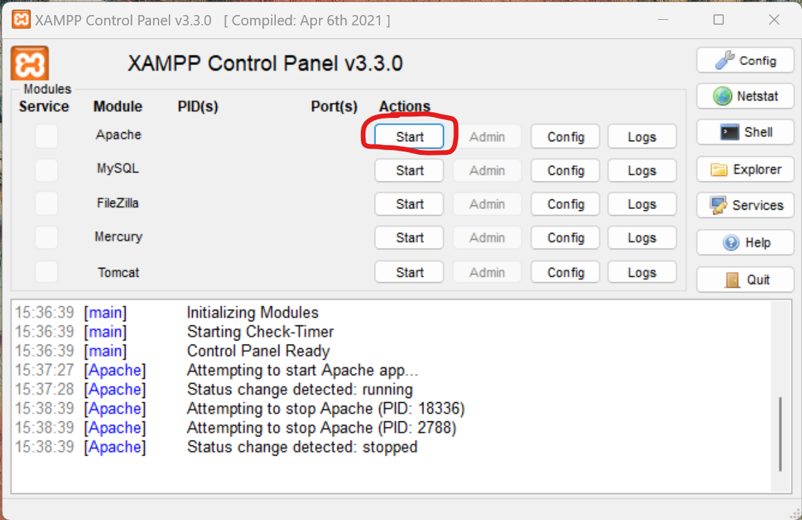
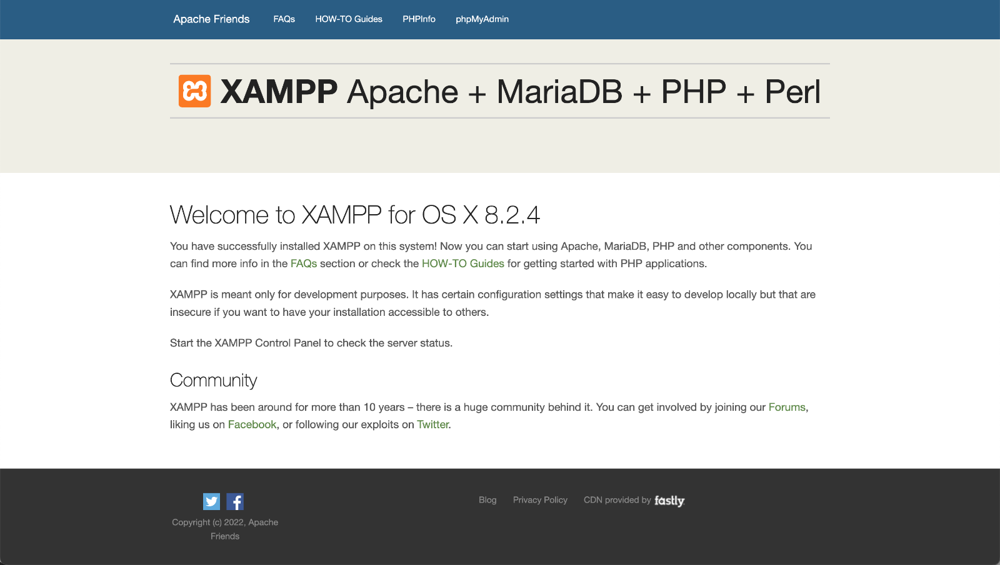

import {Caption} from "@site/src/components/Caption/Caption"

# Den Laptop zum Web Server verwandeln
Sie haben bereits mit HTML und CSS gearbeitet und eine eigene Webseite erstellt? Super! In diesem Abschnitt lernen Sie,
wie Sie Ihren Laptop zu einem Web Server verwandeln, damit Ihre Kolleginnen und Kollegen auf Ihre Webseite zugreifen
können.

## XAMPP einrichten
Um Ihren Laptop als Web Server verwenden zu können, müssen Sie zuerst ein entsprechendes Programm installieren.
ir verwenden dazu eine Software namens XAMPP. Gehen Sie für die Einrichtung von XAMPP wie folgt vor:

1. Laden Sie die aktuellste Version von XAMPP für Ihr Betriebssystem (Windows oder macOS) von dieser Webseite herunter:
   https://www.apachefriends.org/de/index.html
2. Führen Sie die heruntergeladene Datei aus, um das Programm zu installieren. Akzeptieren Sie dabei alle
   Standardeinstellungen.
3. Wenn die Windows Defender Firewall um Erlaubnis fragt, erlauben Sie den Zugriff sowohl für private als auch für
   öffentliche Netzwerke (siehe Screenshot).
4. Schliessen Sie die Installation ab und öffnen Sie am Schluss das "XAMPP Control Panel". Sie können dieses auch
   jederzeit aus den Windows Start-Menü öffnen.

<Caption>
  Windows Firewall: Zugriff für private und öffentliche Netzwerke erlauben.
</Caption>

## Web Server starten
Sobald Sie XAMPP installiert haben, starten Sie im Control Panel das "Apache"-Modul:

Wenn alles funktioniert hat, sollte das Control Panel am Schluss wie folgt aussehen:

Um das zu kontrollieren, rufen Sie die Adresse http://127.0.0.1 auf. Es sollte folgende Webseite angezeigt werden:

:::info Exkurs: Die Loopback-Adresse
Sie haben damit auch gleich eine spezielle IP-Adresse kennengelernt: `127.0.0.1` ist die sogenannte
**Loopback-Adresse**, auch **Localhost** genannt. Unter dieser Adresse erreicht jedes Gerät immer sich selbst
(deshalb _Loopback_), unabhängig von der tatsächlichen IP-Adresse, welche dem Gerät im Netzwerk zugewiesen wurde.
:::

## Eigene Webseite anbieten
Ihr Gerät fungiert nun also als Web Server. Eine von diesem Web Server angebotene Webseite haben Sie am Ende des letzten
Schritts bereits gesehen. Jetzt sollen Sie aber auch Ihre eigene Webseite über diesen Server anbieten, die Sie bereits
erstellt haben.

Öffnen Sie dazu zuerst den XAMPP `htdocs`-Ordner:
- Unter Windows finden Sie diesen unter `C:\xampp\htdocs`
- Unter macOS befindet er sich unter `Programme → XAMPP → xamppfiles → htdocs`

:::info Zur Orientierung...
Im XAMPP `htdocs`-Ordner finden Sie einige Dateien wie `index.php` und `applications.html`, sowie einige Ordner wie
`dashboard` und `img`. Wenn Sie diese sehen, dann sind sie am richtigen Ort.
:::

Erstellen Sie jetzt also in diesem `htdocs`-Ordner einen neuen Unterordner namens `meine-webseite`. Kopieren Sie zum
Schluss alle Dateien Ihrer eigenen Webseite (also, die HTML-Datei, plus allfällige CSS-Dateien, Bilder, etc.)
unverändert in den neu erstellten Ordner `meine-webseite`.

Diese Webseite können Sie jetzt im Browser öffnen. Angenommen, Ihre HTML-Datei heisst `webseite.html`. Dann können Sie
die Adresse http://127.0.0.1/meine-webseite/webseite.html aufrufen und sehen dort Ihr Werk!

:::info Ausnahme: index.html
Falls Sie Ihre HTML-Datei `index.html` genannt haben, dann reicht es, wenn Sie die Adresse nur als
http://127.0.0.1/meine-webseite/ angeben - der Web Server sucht dann automatisch nach einer Datei namens `index.html`.
:::
