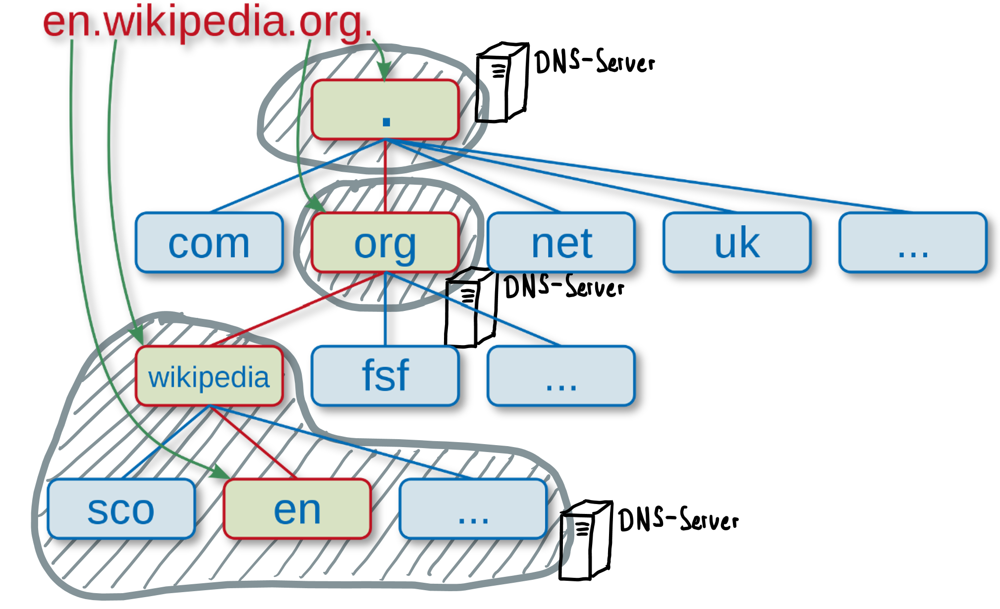

import DefinitionList from "@site/src/app/components/DefinitionList";

# Domain-Name-System
## Telefonbücher

IP-Adressen sind wie Telefonnummern, man kann sie sich nur schwer merken. Für Telefonnummern gibt es deshalb Verzeichnisse, in welchen man die Nummer einer bestimmten Person nachschauen kann (entweder das gute alte Telefonbuch oder, moderner, [tel.search.ch](https://tel.search.ch)). Man muss nur den Namen der Person und vielleicht noch die Wohnadresse kennen.

## Domain Name
Auch für das Internet gibt es solche Verzeichnisse. Wenn man den Namen einer bestimmten Webseite kennt, kann man im Verzeichnis die IP-Adresse des Servers nachschauen, der diese Seite im Internet anbietet.

Solche Namen sind zum Beispiel
-	www.instagram.com
-	www.gbsl.ch
-	[ofi.gbsl.website](https://ofi.gbsl.website)

Diese Namen werden als **Domain-Names** bezeichnet und das Verzeichnis, wo sie drinstehen, heisst **Domain-Name-System**, kurz **DNS**.

## Kernidee
> Namen kann man sich viel besser merken als Zahlen. Deshalb sind Webseiten im Internet mit einem Domain-Namen versehen. Im **Verzeichnis** der Domain-Namen, dem **Domain-Name-System**, kann man nachschauen, welches die IP-Adresse des Servers ist, der diese Seite anbietet.

## Funktionsweise

Es gibt auf der Welt bald **2 Milliarden**[^1] Webseiten, verteilt auf ca. 200 Millionen Server. Jeder Server beherbergt also durchschnittlich 10 Webseiten. Für jeden dieser Server braucht es eine öffentliche IP-Adresse, damit der Server im Internet erreichbar ist. Wenn man die IP-Adresse des Servers kennt, könnte man theoretisch versuchen im Browser statt des Domain-Namens einer Web-Site direkt die IP-Adresse des Servers einzugeben, also statt www.instgram.com die IP-Adresse 157.240.17.174.

:::insight[IP-Adressen direkt eingeben]
Obiges Beispiel, die IP-Adresse von Instagram direkt in den Browser einzutippen, funktioniert in der Praxis mit modernen Webseiten, die `https` als Protokoll verwenden, nicht. Bei `https` wird von Ihrem Browser mittels Zertifikat sichergestellt, dass die Adresse auf den korrekten Domain Namen lautet. Dadurch wird verhindert, dass Sie auf eine falsche Seite umgeleitet werden, und dann unwissentlich bspw. eine Geldtransaktion vornehmen. Das führt aber dazu, dass das Zertifikat bei IP-Adressen nicht gültig ist.

Eine zu Demonstrationszwecken veröffentlichte Seite ohne https ist [login.gbsl.website](http://login.gbsl.website). Diese ist auch direkt über den entsprechenden Server [188.34.157.212](http://188.34.157.212) zu finden.
:::

Wie schon in der Einleitung erwähnt, wird das niemand tun, weil man sich diese IP-Adresse nicht merken kann und sie mit der Zeit auch ändern könnte (z.B. wenn die Web-Site auf einen anderen Server gezügelt wird). Ganz abgesehen davon, dass es auch nicht ausreichen würde, nur die IP-Adresse anzugeben, weil ja eben mehrere Web-Sites an einer bestimmten Adresse «zuhause» sein können - der Port müsste ebenfalls bekannt sein.

:::insight[Ports]
Ein Port spezifiziert, welche Applikation auf einem Server die Anfrage behandeln soll.

Auf dem Server [188.34.157.212](http://188.34.157.212) sind mehrere Web-Sites, und mit dem richtigen Port kann ausgewählt werden, welche man möchte:

<DefinitionList>
  <dt>Port 80\*</dt>
  <dd>[188.34.157.212:80](http://188.34.157.212:80) → [login.gbsl.website](http://login.gbsl.website)</dd>
  <dt>Port 8080</dt>
  <dd>[188.34.157.212:8080](http://188.34.157.212:8080) → [hacksql.gbsl.website](https://hacksql.gbsl.website)</dd>
</DefinitionList>

Nun wird deutlich, dass es schwierig würde, sich auch noch alle Ports zu merken...

\* *Port 80 ist der Standard-Port für Web-Sites mit dem http Protokoll und kann deshalb auch weggelassen werden*
:::

Die Frage ist nun aber: Wie kann man 2 Milliarden Domain-Namen in einem Verzeichnis verwalten? Würde man dies in Form eines Buches versuchen, so ergäbe das ein Buch mit ca. **4 Millionen Seiten** (500 Adresseinträge pro Seite). Hinzu kommt, dass diese Adressen laufend angepasst werden müssten. Neue Adressen kommen hinzu, andere ändern oder verschwinden. Ganz zu schweigen von der schieren Unmöglichkeit, in einem solchen Buch eine gesuchte Adresse zu finden.

In elektronischer Form ist dieses Problem nicht so gross. 2 Milliarden Adressen ergeben eine Datenmenge von ca. **2 Terrabyte**, wenn man grosszügig 1 KB (1000 Zeichen) pro Adresse annimmt. Eine Harddisk mit so viel Platz kriegt man für einige zehn Franken. Allerdings bleibt das Problem mit den dauernden Änderungen. Eine zentrale Stelle, welche dieses Verzeichnis führen müsste, wäre wohl schnell überfordert. Zudem bestünde auch ein grosses Risiko, dass ein Ausfall dieser zentralen Stelle das ganze Internet lahmlegen könnte. Schliesslich müsste ein solches Verzeichnis auch auf einem sehr, sehr leistungsfähigen Server betrieben werden, denn bei ca. 5 Milliarden Internetnutzern weltweit, die dauernd irgendwelche IP-Adressen brauchen, ist mit einer enormen Flut von Anfragen zu rechnen.

Aus diesen Gründen haben die Erfinder des Domain-Name-Systems einen anderen Weg eingeschlagen: Das Verzeichnis ist
-	erstens **hierarchisch gegliedert** und
-	zweitens auf viele DNS-Server weltweit **verteilt**, wobei jeder Server nur die Adressen in seiner Zone kennt und für alle anderen Adressen auf weitere DNS-Server verweist.

Untenstehendes Bild zeigt diese Hierarchie. Auf der obersten Ebene befinden sich die sogenannten **Top-Level-Domains** (**TLD**), z.B. **ch**, **de**, **org** oder **com**. Diese sind unter einer namenlosen Root-Domain zusammengefasst (Punkt im obersten Kästchen auf dem Bild). Unterhalb einer TLD können dann **beliebig viele Subdomains** angehängt werden. Liest man nun von unten beginnend, die Namen der Subdomains auf einem Pfad bis zur Root-Domain, so entsteht ein vollständiger Domain-Name, z.B. en.wikipedia.org.

Im Bild sind **drei DNS-Server** mit ihrer jeweiligen **Zone** (grau) eingezeichnet. Jeder DNS-Server verwaltet den Teil der Adressinformationen, der zu seiner Zone gehört. Die IP-Adresse zum Domain-Namen en.wikipedia.org, also 91.198.174.192, kennt dabei nur der unterste DNS-Server, denn er ist für die Zone, in welche dieser Domain-Name schliesslich gehört, zuständig.

Wird einer der übergeordneten DNS-Server nach dieser IP-Adresse gefragt, so verweist er als Antwort nur auf den nächsttieferen DNS-Server, mit dem Hinweis, man solle dort weiterfragen. Das geht dann so weiter, bis der Frager beim untersten DNS-Server angelangt ist und die IP-Adresse als Antwort erhält.

Man kann diese Situation mit jemandem vergleichen, der sich in einer fremden Stadt über mehrere Stationen zu seinem Hotel durchfragt.

## Wer verwaltet Domain-Namen?
Die hierarchische Gliederung des Domain-Name-Systems erlaubt es, die Verwaltung zu **dezentralisieren**. So gibt es für jede Top-Level-Domain eine Organisation, welche die Namen der darunter angesiedelten Subdomains verwaltet. Für die TLD der Schweiz (ch) und Liechtenstein (li) ist die Stiftung [SWITCH](https://www.switch.ch/) zuständig.

:::insight[Domain registrieren]
Die SWITCH betreibt unter dem Link https://www.nic.ch/de/ einen Dienst zur Überprüfung, ob eine bestimmte Subdomain noch verfügbar ist. Das Registrieren einer Subdomain delegiert die SWITCH an sogenannte **Registrare**, also an Unternehmen die Domain-Namen anbieten und verkaufen. Bekannte (und günstige) Registrare sind:
- [Swizzonic.ch](https://swizzonic.ch/)
- [Gandi.net](https://www.gandi.net/)
- [hostech](https://www.hosttech.ch/domains)

Jährlich muss für eine .ch Domain zwischen 5 und 20 Franken gerechnet werden.
:::

Es gibt Web-Sites, über welche man herausfinden kann, von wem ein bestimmter Domain-Name registriert wurde (Registrar) und wem dieser Name gehört (Registrant). Drei davon sind:
- https://www.hostpoint.ch/domains/whois.html	(TLDs ch, li, …)
- https://www.whois.com/whois/ (TLDs com, org, edu, website, …)
- http://whois.nic.swiss/ (TLD swiss)

[^1]: Quelle: [internetlivestats](https://www.internetlivestats.com/total-number-of-websites/)
