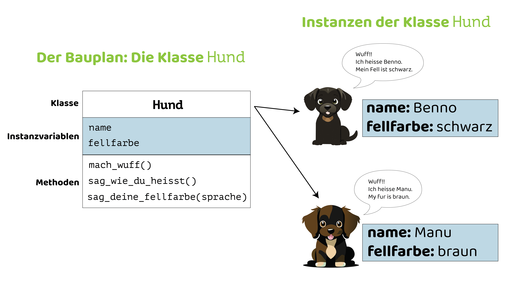

# Objektorientierte Programmierung
Objektorientierte Programmierung (OOP) ist eine Methode zum Schreiben von Programmen, bei der wir Dinge aus der realen Welt (wie Tiere, Gegenstände oder Benutzer) als "Objekte" betrachten. Jedes Objekt hat Eigenschaften (_Instanzvariablen_) und Dinge, die es tun kann (_Methoden_). Jedes Objekt ist _Instanz_ einer _Klasse_ — eine _Klasse_ ist eine Art "Bauplan" für _Objekte_.

OOP hilft uns, Programme auf eine organisierte Weise zu schreiben, sodass wir sie einfacher verstehen, verändern und wiederverwenden können.

## Klassen und Objekte


```python showLineNumbers
class Hund:
    def __init__(self, name, fellfarbe):
        self.name = name
        self.fellfarbe = fellfarbe

    def mach_wuff(self):
        print("Wuff!!")

    def sag_wie_du_heisst(self):
        print("Ich heisse " + self.name + ".")

    def sag_deine_fellfarbe(self, sprache):
        if sprache == "de":
            print("Mein Fell ist " + self.fellfarbe + ".")
        elif sprache == "en":
            print("My fur is " + self.fellfarbe + ".")

benno = Hund("Benno", "schwarz")
manu = Hund("Manu", "braun")

benno.mach_wuff()
benno.sag_wie_du_heisst()
benno.sag_deine_fellfarbe("de")

manu.mach_wuff()
manu.sag_wie_du_heisst()
manu.sag_deine_fellfarbe("en")
```

Dieses Programm produziert folgende Ausgabe:
```
Wuff!!
Ich heisse Benno.
Mein Fell ist schwarz.
Wuff!!
Ich heisse Manu.
My fur is braun.
```

### Der Aufbau dieser Klasse
- Auf den Zeilen `1`-`16` wird eine Klasse namens `Hund` definiert.
- Die Klasse `Hund` hat einen _Konstruktor_ (Zeilen `2`-`3`), der die Parameter `self`, `name` und `fellfarbe` entgegennimmt.
  - Der Konstruktor ist eine spezielle Funktion, die in jeder Klasse existiert, und immer genau den Namen `__init__` hat. Er wird immer dann (automatisch) aufgerufen, wenn wir eine neue _Instanz_ dieser Klasse erzeugen. Die Aufgabe des Konstruktors ist das _Konstruieren_ dieser _Instanz_. Wir schreiben also alles in diese Funktion hinein, das wir beim Erzeugen einer neuen _Instanz_ dieser Klasse erledigen müssen.
  - Der spezielle Parameter `self` ermöglicht den Zugriff auf die jeweilige _Instanz_ der `Hund`-Klasse.
  - Der Wert des Parameters `name` wird auf Zeile `3` der _Instanzvariable_ `self.name` zugewiesen.
  - Der Wert des Parameters `fellfarbe` wird auf Zeile `4` der _Instanzvariable_ `self.fellfarbe` zugewiesen.
- Auf den Zeilen `6`-`7` wird die _Methode_ `mach_wuff()` definiert.
  - Wenn eine _Funktion_ zu einer _Klasse_ gehört (also wie hier unter einem `class` eingerückt ist), dann nennen wir sie nicht _Funktion_, sondern _Methode_.
  - Jede _Methode_ muss zwingend den speziellen Parameter _self_ entgegennehmen — selbst dann, wenn er wie hier gar nicht benötigt wird.
- Auf den Zeilen `9`-`10` wird die _Methode_ `sag_wie_du_heisst()` definiert.
  - Auf Zeile `9` wird über den speziellen Parameter `self` auf die _Instanzvariable_ `self.name` zugegriffen.
  - Die Ausgabe der Methode `sag_wie_du_heisst()` kann also für jede _Instanz_ der Klasse `Hund` unterschiedlich sein. Er hängt davon ab, welchen Wert wir bei der _Instanziierung_ dem Konstruktor für den Parameter `name` übergeben haben. Diesen Wert nennt man ein _Konstruktor-Argument_.
- Auf den Zeilen `12`-`16` wird die _Methode_ `sag_deine_fellfarbe()` definiert.
  - Nebst dem speziellen Parameter `self` nimmt diese Methode auf Zeile `12` einen zweiten Parameter `sprache` entgegen.
  - Die Ausgabe dieser Methode ist also abhängig vom Wert der Instanzvariable `self.fellfarbe` und vom Wert für den Parameter `sprache`.

### Die Instanzen von `Hund`
- Eine _Klasse_ ist wie ein Bauplan.
- Aus einer Klasse können wir beliebig viele _Instanzen_ erzeugen.
- Wenn wir eine _Instanz_ einer Klasse erzeugen, dann _instanziieren_ wir diese Klasse. Wir setzen also den Bauplan in die Tat um.
- Eine _Instanz_ einer beliebigen Klasse nennt man allgemein auch ein _Objekt_.
- Auf Zeile `18` wird eine _Instanz_ der `Hund`-Klasse mit den _Konstruktor-Argumenten_ `"Benno"` und `"schwarz"` erzeugt.
  - Dabei wird als Erstes die Konstruktor-Funktion der `Hund`-Klasse ausgeführt.
      - Der Wert der _Instanzvariable_ `self.name` hat in der _Instanz_ `benno` den Wert `"Benno"`.
      - Der Wert der _Instanzvariable_ `self.fellfarbe` hat in der _Instanz_ `benno` den Wert `"schwarz"`.
  - Die resultierende _Instanz_ wird der Variable `benno` zugewiesen.
  - Die Variable `benno` enthält nun also ein _Objekt_ vom _Datentyp_ `Hund` — sprich, eine Instanz der `Hund`-Klasse.
  - Konzeptuell repräsentiert das Objekt `benno` einen schwarzen Hund namens _Benno_.
- Auf Zeile `19` wird eine _Instanz_ der `Hund`-Klasse mit den _Konstruktor-Argumenten_ `"Manu"` und `"braun"` erzeugt.
  - Dabei wird als Erstes die Konstruktor-Funktion der `Hund`-Klasse ausgeführt.
      - Der Wert der _Instanzvariable_ `self.name` hat in der _Instanz_ `manu` den Wert `"Manu"`.
      - Der Wert der _Instanzvariable_ `self.fellfarbe` hat in der _Instanz_ `manu` den Wert `"braun"`.
  - Die resultierende _Instanz_ wird der Variable `manu` zugewiesen.
  - Die Variable `manu` enthält nun also ein _Objekt_ vom _Datentyp_ `Hund` — sprich, eine Instanz der `Hund`-Klasse.
  - Konzeptuell repräsentiert das Objekt `manu` einen braunen Hund namens _Manu_.
- Auf den Zeilen `21`-`23` wird das Objekt `benno` verwendet.
  - Auf Zeile `21` wird die _Methode_ `mach_wuff()` auf dem _Objekt_ `benno` aufgerufen. Die Ausgabe ist `Wuff!!`.
  - Auf Zeile `22` wird die _Methode_ `sag_wie_du_heisst()` auf dem _Objekt_ `benno` aufgerufen. Die Ausgabe ist `Ich heisse Benno.`.
  - Auf Zeile `23` wird die _Methode_ `sag_deine_fellfarbe()` auf dem _Objekt_ `benno` mit dem Argument `"de"` für den Parameter `sprache` aufgerufen. Die Ausgabe ist `Mein Fell ist schwarz.`.
- Auf den Zeilen `25`-`27` wird das Objekt `benno` verwendet.
  - Auf Zeile `25` wird die _Methode_ `mach_wuff()` auf dem _Objekt_ `manu` aufgerufen. Die Ausgabe ist `Wuff!!`.
  - Auf Zeile `26` wird die _Methode_ `sag_wie_du_heisst()` auf dem _Objekt_ `manu` aufgerufen. Die Ausgabe ist `Ich heisse Manu.`.
  - Auf Zeile `27` wird die _Methode_ `sag_deine_fellfarbe()` auf dem _Objekt_ `manu` mit dem Argument `"en"` für den Parameter `sprache` aufgerufen. Die Ausgabe ist `My fur is braun.`.

---
