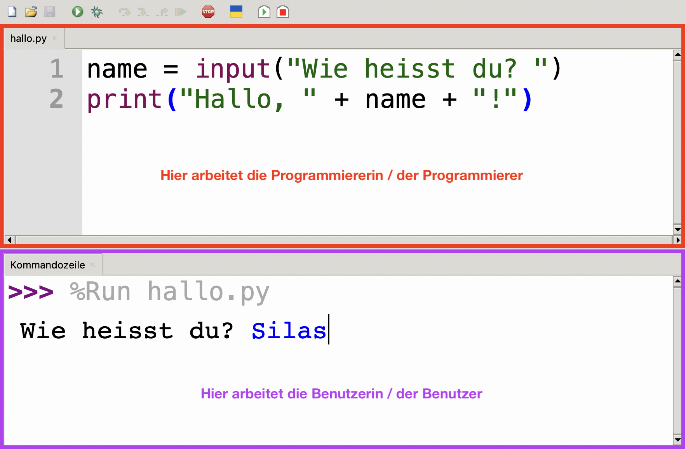

# Ein- und Ausgabe
## Rollenwechsel
Beim Programmieren gibt es eine besondere Herausforderung: Nämlich müssen wir sehr oft unsere Rolle wechseln. Solange wir unseren Code schreiben, sind wir **Programmierer:innen**. Irgendwann wollen wir unser Programm aber auch ausprobieren. Also drücken wir in Thonny auf den grünen Start-Knopf — und werden in dem Moment zu **Benutzer:innen**!

:::key[Wer arbeitet wo?]
- **Programmierer:innen** arbeiten oben im **Code-Editor**, wo sie ihren **Programmcode bearbeiten**.
- **Benutzer:innen** arbeiten unten in der **Kommandozeile**, wo sie **mit dem laufenden Programm interagieren**.


:::

Dieser _Rollenwechsel_ wird besonders deutlich, wenn wir uns mit der Ein- und Ausgabe befassen.

## Ausgabe
Um in der Kommandozeile etwas auszugeben, benötigen wir die Funktion `print()`.

Folgendes Beispiel zeigt verschiedene Möglichkeiten, wie wir die `print()`-Funktion verwenden können:

```python showLineNumbers
print("Hallo, Welt!")
print(23)
print(3.14)
print(True)

name = "Bob"
print("Hallo, " + name + "!")
print("Hallo,", name, "!")
```

Dieses Programm produziert folgende Ausgabe in der Kommandozeile:

```
Hallo, Welt!
23
3.14
True
Hallo, Bob!
Hallo, Bob !
```

## Eingabe
Um vom Benutzer / der Benutzerin eine Eingabe zu erfragen, benötigen wir die Funktion `input()`:

```python showLineNumbers
name = input("Wie heisst du? ")
```

Auf dieser einen Zeile passieren die folgenden drei Dinge:
- Der Aufruf der Funktion `input()` sorgt dafür, dass das Programm anhält und darauf wartet, dass die Benutzerin etwas eingibt. Es läuft erst weiter, wenn sie _Enter_ drückt.
- Der _String_ `"Wie heisst du? "` wird dabei als sogenannte **Eingabeaufforderung** in der Kommandozeile ausgegeben. Eine _Eingabeaufforderung_ ist nicht zwingend notwendig. Ohne diese weiss der Benutzer allerdings nicht, was er eingeben muss. Noch schlimmer: Vermutlich merkt er gar nicht erst, dass das Programm auf seine Eingabe wartet.
- Der eigegebene Wert wird der Variable `name` zugewiesen (`name = ...`). Auch das ist genau genommen nicht zwingend nötig. Wenn wir den eingegebenen Wert allerdings in keine Variable speichern, dann verlieren wir ihn sofort wieder. Die Eingabe wäre in dem Fall also sinnlos.

## Datentypen im Kontext der Ein- und Ausgabe
[Datentypen](Variablen-und-Datentypen#datentypen), Conversion

---
