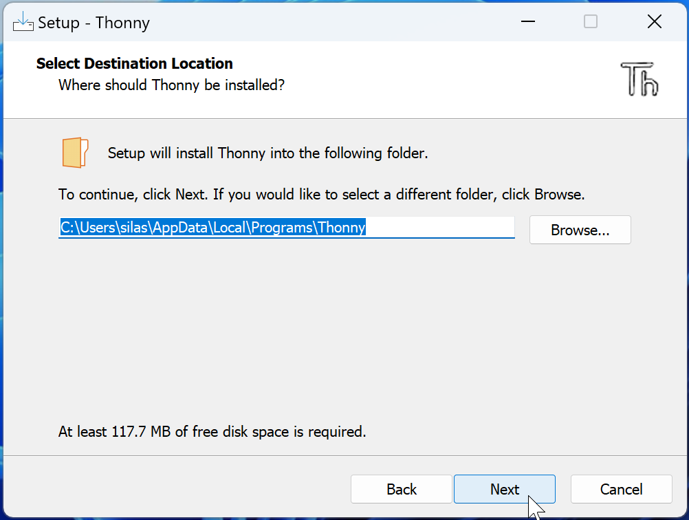

# Thonny installieren
## Installation
Als ersten Schritt, laden Sie Thonny von [dieser Webseite](https://thonny.org/) für **Ihr Betriebssystem (Windows oder macOS)** herunter. Verwenden Sie anschliessend die unten stehende Anleitung, um Thonny zu installieren.

::::Tabs{groupId="os"}
:::Tab[Windows]{value="win"}
1. Suchen Sie die heruntergeladene Datei im Downloads-Ordner und führen Sie sie mit einem Doppelklick aus:
   
2. Next...
   
3. Wählen Sie hier die obere Option:
   
4. Akzeptieren Sie die Lizenvereinbarungen:
   
5. Lassen Sie den Pfad unverändert:
   
6. Lassen Sie auch diese Option unverändert:
   
7. Aktivieren Sie hier die Option zum Erstellen einer Desktopverknüpfung:
   
8. Install...
   
9. Dann ist die Installation angeschlossen
   

## Erste Einrichtung
Starten Sie nun Thonny, um die erste Einrichtung abzuschliessen. Das entsprechende Symbol sollten Sie jetzt auf dem Desktop finden:

Wählen Sie anschliessend hier die Sprache _Deutsch_:

Die erste Einrichtung können Sie dann mit _Let's go!_ abschliessen:

Jetzt ist Thonny einsatzbereit!
:::
::::

---
