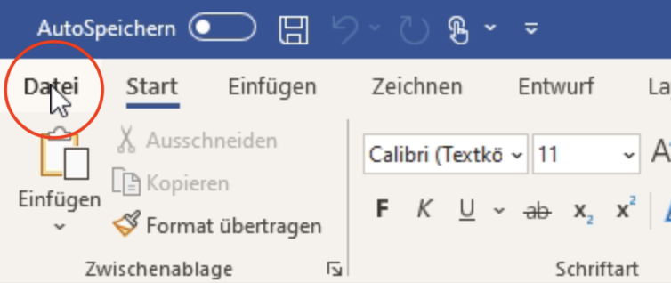
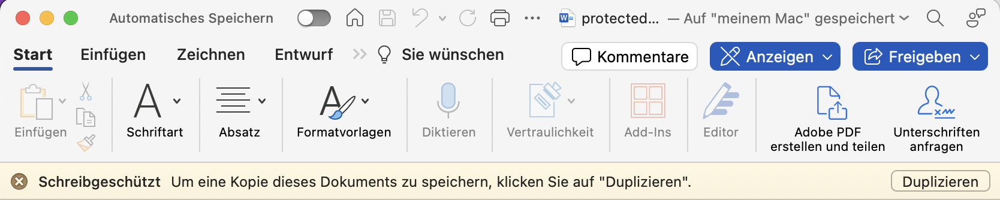
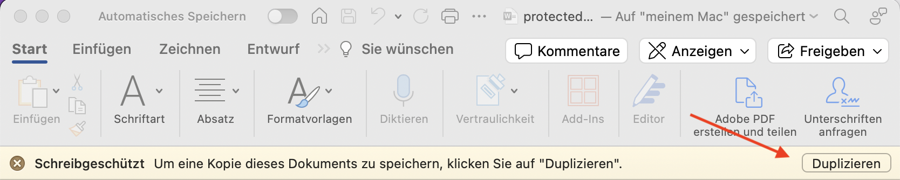
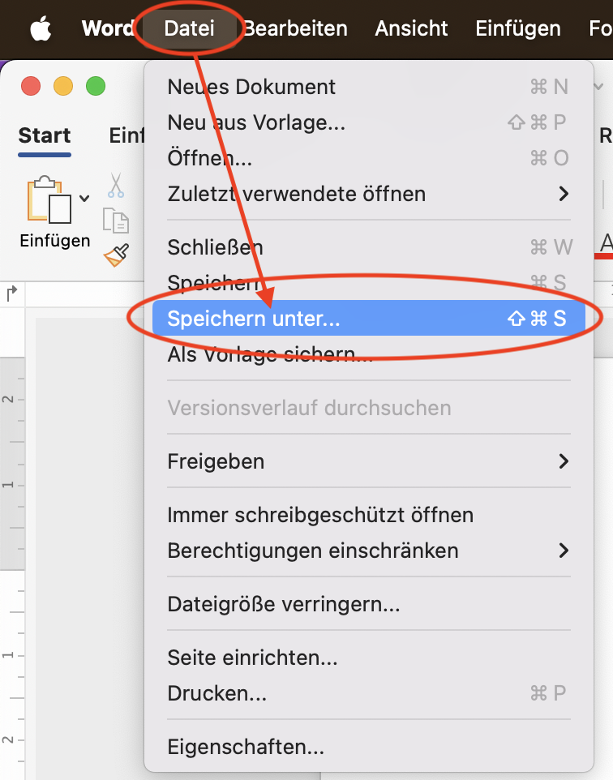
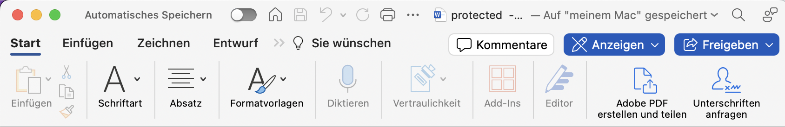

# Erste Hilfe bei Problemen
## Ich kann das Dokument nicht bearbeiten

  
Hilfe anzeigen

  :::::Tabs{groupId="os"}
  ::::Tab[Windows]{value="win"}
  Möglicherweise können Sie das Dokument nicht bearbeiten, weil es schreibgeschützt ist.

  

  Speichern Sie es als Kopie ab und arbeiten Sie anschliessend mit dieser Kopie weiter.

  :::danger[Speicherort]
  Speichern Sie das Dokument an einem Ort ab, an den Sie es wieder finden!
  :::

  Gehen Sie folgendermassen vor:

  

  
  ::::

  ::::Tab[macOS]{value="macos"}
  Möglicherweise können Sie das Dokument nicht bearbeiten, weil es schreibgeschützt ist.

  

  Speichern Sie es als Kopie ab und arbeiten Sie anschliessend mit dieser Kopie weiter.

  :::danger[Speicherort]
  Speichern Sie das Dokument an einem Ort ab, an den Sie es wieder finden!
  :::

  Am besten klicken Sie dazu gleich dort auf "Duplizieren":

  

  Sollte diese Option nicht verfügbar sein, dann gehen Sie folgendermassen vor:

  
  ::::
  :::::

## Ich kann nicht alle Knöpfe sehen

  
Hilfe anzeigen

  :::::Tabs{groupId="os"}
  ::::Tab[Windows]{value="win"}
  
  Vermutlich liegt es daran, dass das Word-Fenster nicht breit genug ist. Ziehen Sie das Word-Fenster breiter, bis Sie alle Knöpfe sehen können.
  ::::

  ::::Tab[macOS]{value="macos"}
  
  Vermutlich liegt es daran, dass das Word-Fenster nicht breit genug ist. Ziehen Sie das Word-Fenster breiter, bis Sie alle Knöpfe sehen können.
  ::::
  :::::

