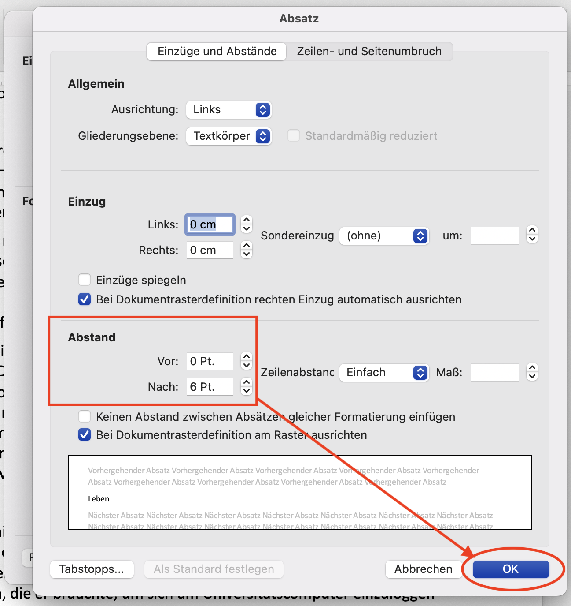

# Absatzabstand anpassen
Um den Absatzabstand auf einen bestimmten Wert zu setzten, gehen Sie folgendermassen vor:

::::Tabs
:::Tab[Windows]{value="win"}
:::

:::Tab[macOS]{value="macos"}
Im Bereich Formatvorlagen bei der entsprechenden Vorlage auf das "Pfeil-nach-unten"-Menu klicken:

"Formatvorlage ändern" klicken:

Unten rechts auf "Format" → Absatz:

Hier können Sie im entsprechenden Feld den "Abstand vor" oder den "Abstand nach" anpassen. Anschliessend bestätigen Sie mit "OK".

:::
::::

---
