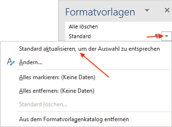
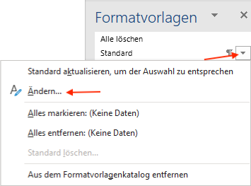
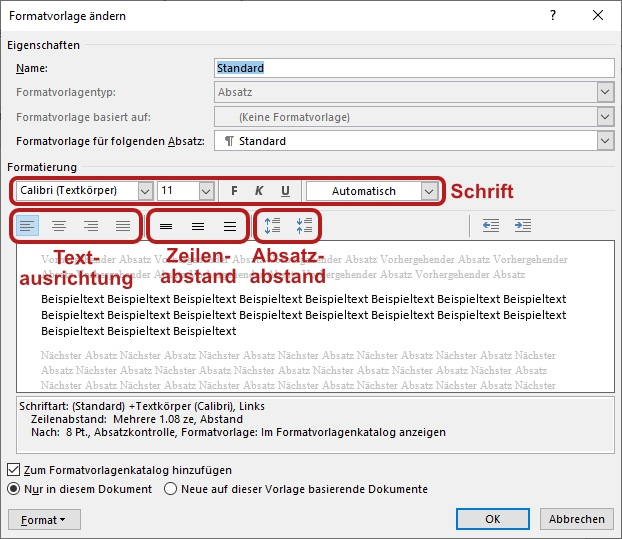

---
sidebar_custom_props:
  source:
    name: rothe.io
    ref: https://craft.rothe.io/DaKvaRbuG85WnX/b/DDD3B69F-CF95-4353-BAA1-203D6A68E8F4/1.4-%E2%80%94-Formatvorlagen-anpassen
---

# Formatvorlagen anpassen
Formatvorlagen können geändert werden, um so das Aussehen aller Absätze mit der entsprechenden Vorlage zu beeinflussen. Es gibt zwei Wege, um eine Formatvorlage anzupassen:

1. Einen Absatz ändern und anschliessend die Vorlage aktualisieren.
2. Direkt die Vorlage ändern.

## Option 1: Vorlage aktualisieren
Passen Sie den aktuellen Absatz zuerst nach Wunsch an (Schriftart, Schriftgrösse, Schriftfarbe, etc.). Anschliessend klicken Sie in der Formatvorlagen-Seitenleiste auf den Dropdown-Pfeil der entsprechenden Vorlage und wählt den Menüpunkt __... aktualisieren, um der Auswahl zu entsprechen__.

## Option 2: Vorlagen ändern
Klicken Sie in der Formatvorlagen-Seitenleiste auf den Dropdown-Pfeil der zu ändernden Formatvorlage und wählen Sie den Menüpunkt __Ändern__.

Im folgenden Fenster kann die Schrift, die Textausrichtung, der Zeilenabstand sowie der Absatzabstand der Formatvorlage angepasst werden. Anhand des Beispieltexts ist gleich sichtbar, was die Änderung bewirkt.

Sobald Sie auf __OK__ klicken, werden die Änderungen übernommen und alle Absätze mit der entsprechenden Formatvorlage automatisch angepasst.

:::key[Änderung der Formatvorlage "Standard"]
Alle Formatvorlagen basieren auf __Standard__. Wenn in der Formatvorlage __Standard__ eine Einstellung geändert wird, so kann dies auch sämtliche anderen Formatvorlagen beeinflussen.
:::

---