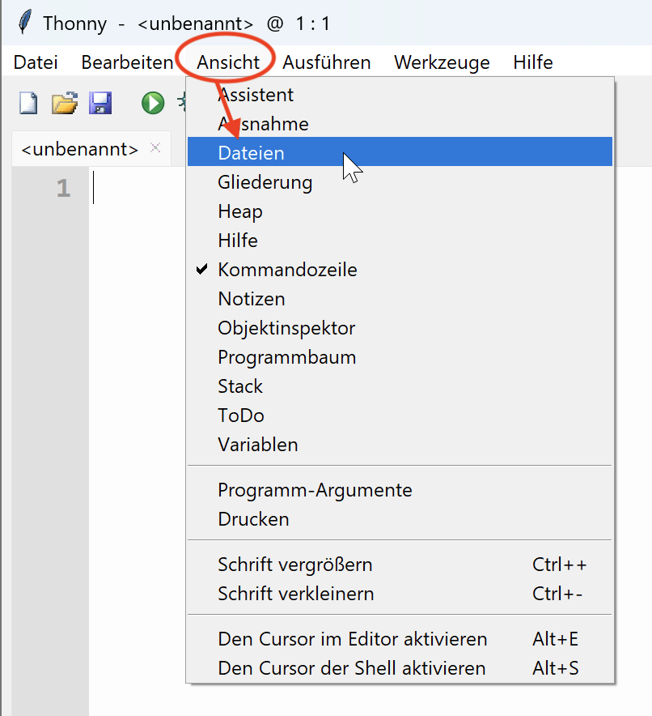
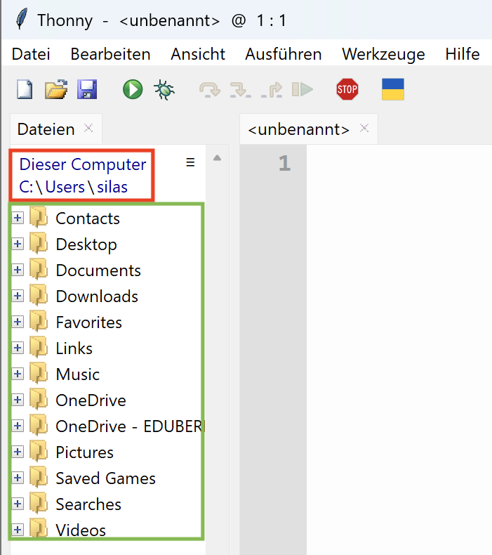
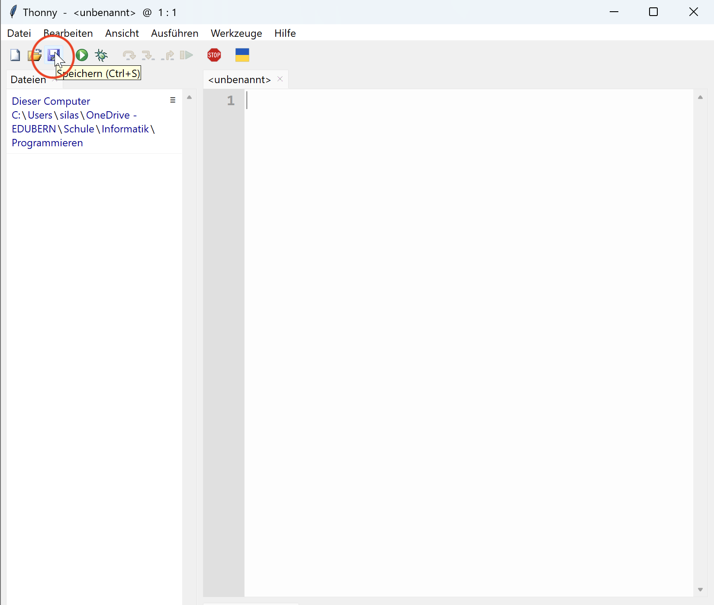
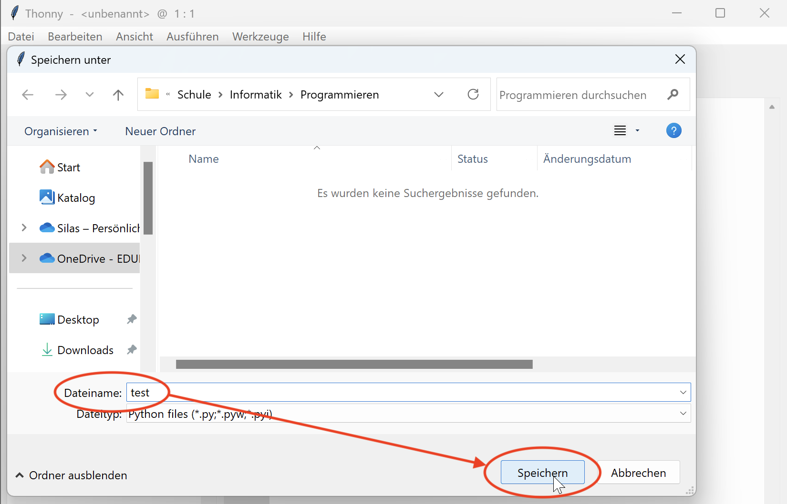
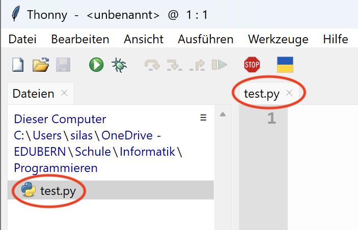

# Navigation in Thonny
## Dateien anzeigen
Stellen Sie zuerst sicher, dass in Thonny am linken Rand Bereich _Dateien_ angezeigt wird. Sollte dieser Bereich bei Ihnen fehlen (wie im Bild unten), dann blenden Sie ihn folgendermassen ein:

Im Bereich _Dateien_ sehen Sie dann einerseits den Pfad des Ordners, in dem Sie sich gerade befinden (rot markiert). Andererseits sehen Sie eine Liste aller Dateien und Ordner, die sich in diesem Ordner befinden (grün markiert).

## Navigieren
Zum Navigieren haben Sie drei Möglichkeiten:
1. Einen Ordner mit dem ➕-Symbol aufklappen (Sie bleiben dabei im aktuellen Ordner - Sie navigieren also eigentlich nicht).
2. Auf einen Ordner Doppelklicken, um in diesen Ordner hineinzuwechseln.
3. Auf einen Über-Ordner im Pfad des aktuellen Ordners klicken (im Bild rot markiert), um in der Hierarchie nach oben zu navigieren. Im Bild unten wären das beispielsweise die Über-Ordner `C:`, `Users` und `silas`.

## Datei Speichern
Um die aktuell offene Datei zu speichern (wenn sie noch nich gespeichert ist), klicken Sie im Menuband oben auf das Speicher-Symbol:

Geben Sie der Datei anschliessend einen Namen und klicken Sie dann auf _Speichern_:

:::warning[Dateiendung]
Wenn Sie keine Dateiendung angeben, wird Thonny automatisch die Endung `.py` (für _Python_) hinzufügen. Wenn Sie eine andere Dateiendung verwenden wollen (z.B. `.html`), dann müssen Sie diese im obigen Schritt explizit beim Namen angeben (z.B. `test.html`, statt nur `test`).
:::

Sofern Sie in vorherigen Schritt den Speicherort nicht verändert haben, wir die Datei im aktuell geöffneten Ordner abgespeichert:

---
