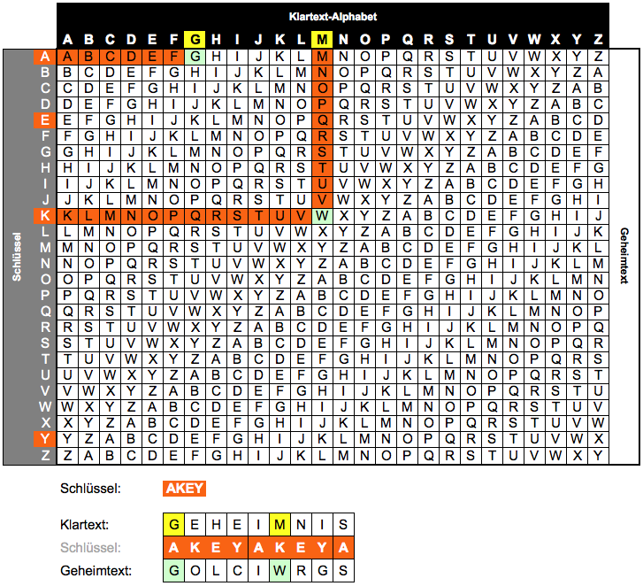

# Vigenère-Chiffre
Die Vigenère-Verschlüsselung wurde im 16. Jahrhundert vom französischen Diplomaten Blaise de Vigenère erfunden und galt aus damaliger Sicht lange als unknackbar.

Es handelt sich dabei um ein _polyalphabetisches Substitutionsverfahren_. Im Gegensatz zur [monoalphabetischen Substitution](Substitution) werden dabei also _mehrere Geheimtextalphabete_ verwendet.

Das Verschlüsselungsprinzip funktioniert folgendermassen:
> - Wir legen ein Schlüsselwort fest, z.B. `AKEY`.
> - Wir verwenden jeden Buchstaben des Schlüsselworts als einen Schlüssel für eine Caesar-Verschlüsselung.
>   - Den ersten Buchstaben des Klartexts verschlüssen wir also mit der Caesar-Verschlüsselung mit dem Schlüssel `A`.
>   - Den zweiten Buchstaben des Klartexts verschlüsseln wir mit der Caesar-Verschlüsselung mit dem Schlüssel `K`.
>   - Und so weiter...
> - Wenn alle Buchstaben des Schlüsselwortes "aufgebraucht" sind, beginnen wir wieder mit dem ersten (also `A`).

Die folgende Grafik zeigt den Vigenère-Verschlüsselungsprozess für den Klartext `GEHEIMNIS` mit dem Schlüssel `AKEY`.

:::insight["nicht verschlüsselte" Buchstaben]
Wie bei der [Substitution](Substitution) gibt es auch bei der Vigenère-Verschlüsselung einige Buchstaben, die "nicht" verschlüsselt werden - nämlich immer dann, wenn der Schlüsselbuchstabe ein `A` ist. Auch hier ist dies kein Problem, sondern würde im Gegenteil sogar die Anzahl Möglichkeiten einschränken, wenn es verboten wäre, dass einzelne Buchstaben auch unverändert bleiben dürfen.
:::

Wir verwenden hier also vier Geheimtextalphabete, nämlich die "Caesar-Alphabete" für die vier Schlüssel `A`, `K`, `E` und `Y`. Beim ersten `I` des Klartexts `GEHE`**`I`**`MNIS` beginnen wir dabei wieder beim ersten Buchstaben `A` des Schlüsselworts.

:::key[Vigenère und Caesar]
Die Vigenère-Verschlüsselung ist die wiederholte Anwendung der Caesar-Verschlüsselung mit einer zyklisch angewendeten Schlüsselsequenz.
:::

Das Entschlüsselungsverfahren funktioniert dementsprechend auch analog: Den ersten Buchstaben des Klartexts erhalten wir, indem wir den ersten Buchstaben des Geheimtexts mit dem ersten Buchstaben des Schlüsselworts Caesar-entschlüsseln, und so weiter. Auch hier beginnen wir mit dem ersten Buchstaben des Schlüsselworts, sobald wir alle Schlüsselbuchstaben "aufgebraucht" haben.

Die Vigenère-Verschlüsselung können Sie auf [dieser Webseite](https://gc.de/gc/vigenere/) online ausprobieren.

---
