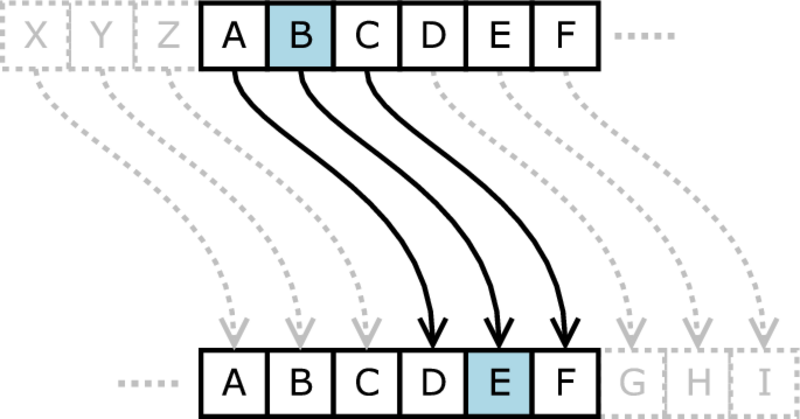
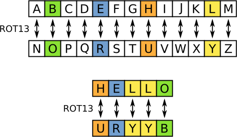

---
sidebar_custom_props:
  source:
    name: rothe.io
    ref: 'https://rothe.io/?b=crypto&p=544692'
page_id: 69a93997-02db-4f2e-a104-748e32a59adc
---

import Caesar from "@tdev-components/visualization-tools/cryptology/Caesar";

# Caesar-Chiffre

Der römische Feldherr _Gaius Julius Caesar_ hat seine militärischen Nachrichten verschlüsselt. Der römische Schriftsteller Sueton hat Folgendes überliefert:

> … si qua occultius perferenda erant, per notas scripsit, id est sic structo litterarum ordine, ut nullum verbum effici posset: quae si qui investigare et persequi velit, quartam elementorum litteram, id est D pro A et perinde reliquas commutet.

_Übersetzt..._

> … wenn etwas Geheimes zu überbringen war, schrieb er in Zeichen, das heisst, er ordnete die Buchstaben so, dass kein Wort gelesen werden konnte: Um diese zu lesen, tauscht man den vierten Buchstaben, also D für A aus, und ebenso mit den restlichen.

Caesar hat also jeden Buchstaben seiner Nachrichten durch den Buchstaben ersetzt, welcher im Alphabet drei Stellen weiter hinten steht. Der Buchstabe `D`, welcher für `A` eingesetzt wird, wird **Schlüssel** genannt. Er muss bekannt sein, um die Nachricht wieder **entschlüsseln** zu können.

Die **Verschlüsselung** erfolgt, indem man in der folgenden Tabelle einen Klartextbuchstaben im Klartextalphabet sucht und durch den Buchstaben des Geheimtextalphabets ersetzt, der genau unterhalb steht. Die **Entschlüsselung** erfolgt in umgekehrter Richtung. Die Gegenüberstellung von Klartext- und Geheimtextalphabet mit dem Schlüssel `D` sieht wie folgt aus:

| Caesar-Chiffre     |                                                                                                             |
|:-------------------|:------------------------------------------------------------------------------------------------------------|
| Klartextalphabet   | `A` `B` `C` `D` `E` `F` `G` `H` `I` `J` `K` `L` `M` `N` `O` `P` `Q` `R` `S` `T` `U` `V` `W` `X` `Y` `Z`     |
| Geheimtextalphabet | **`D`** `E` `F` `G` `H` `I` `J` `K` `L` `M` `N` `O` `P` `Q` `R` `S` `T` `U` `V` `W` `X` `Y` `Z` `A` `B` `C` |

:::insight[Ähnliche Verschlüsselungen]
Heute wird jede Verschlüsselung, die auf einer Verschiebung des Alphabets beruht, eine **Casear-Verschlüsselung** genannt.
:::

Die Nachricht `MORGEN UM ZEHN` wird verschlüsselt zu `PRUJHQ XP CHKQ`.

## ROT13

**ROT13** ist eine Caesar-Verschlüsselung, bei welcher die Buchstaben um `13` Stellen – also exakt um die Hälfte des Alphabets – verschoben werden. Der Buchstabe `A` wird folglich auf `N` abgebildet (sprich, Schlüssel `N`). Das Spezielle an dieser Verschlüsselung ist, dass man durch eine erneute Verschlüsselung wieder den Klartext erhält. Oder anders formuliert: Es spielt keine Rolle, ob man ver- oder entschlüsselt. Wenn das `A` im Klartextalphabet über dem `N` im Geheimtextalphabet steht, dann steht auch das `N` im Klartextalphabet über dem `A` im Geheimtextalphabet. Sie können dies in der folgenden Tabelle einfach nachvollziehen:

| ROT-13             |                                                                                                             |
|:-------------------|:------------------------------------------------------------------------------------------------------------|
| Klartextalphabet   | `A` `B` `C` `D` `E` `F` `G` `H` `I` `J` `K` `L` `M` `N` `O` `P` `Q` `R` `S` `T` `U` `V` `W` `X` `Y` `Z`     |
| Geheimtextalphabet | **`N`** `O` `P` `Q` `R` `S` `T` `U` `V` `W` `X` `Y` `Z` `A` `B` `C` `D` `E` `F` `G` `H` `I` `J` `K` `L` `M` |

Beachten Sie aber, dass diese Symmetrie nur für ROT13 gilt! Man braucht man bei ROT13 eigentlich auch nur die halbe Tabelle:

Die Nachricht `KOMM ALLEINE` wird verschlüsselt zu `XBZZ NYYRVAR`.

## Caesar-Chiffre ausprobieren
<Caesar />

---
