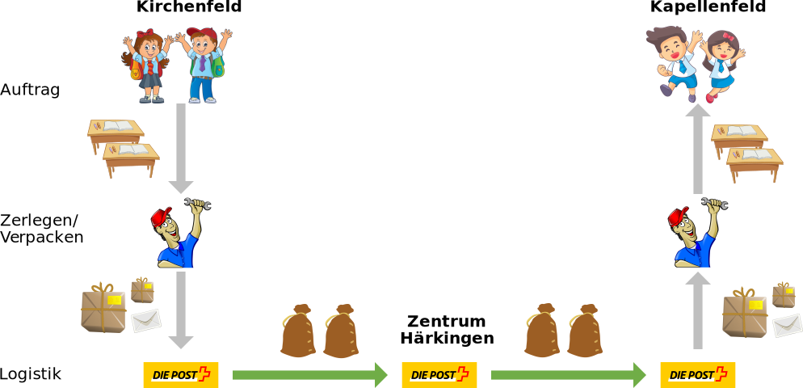

# Vermittlungsschicht
In der Vermittlungsschicht brauchen wir eine Adresse, an die die (Daten-)Pakete gesendet werden können. Es handelt sich um eine logische Adresse aus dem Netzwerk, in dem sich das Gerät gerade befindet.

## Beispiel «Schule»
Im Beispiel «Schule» ist aus den beiden oberen Schichten alles für den Transport vorbereitet. Der Hauswart bringt aber die Pulte nicht selbst ins andere Schulhaus – er muss sich gar nicht um die Zustellung kümmern. Die Vermittlungsschicht wird hier von der Post übernommen. Anhand der Adresse auf den Paketen weiss die Post, wohin die einzelnen Pakete verschickt werden müssen.

Üblicherweise können die Pakete nicht direkt, sondern via ein Paketzentrum zugestellt werden. Welche Route die Pakete nehmen – also via welches Paketzentrum die Pakete verschickt werden – darum kümmert sich die Post. Die Pakete werden so in Säcke verpackt, dass sie mit anderen Paketen zusammen im richtigen Paketzentrum landen. Dort werden sie neu sortiert und für den Weitertransport vorbereitet.

Die Post hat keine Ahnung, welche Ware in wie viele Pakete aufgeteilt transportiert wird, sie weiss nur von wo nach wo welches Paket transportiert werden muss.

## Internet
Das wichtigste Protokoll der Vermittlungsschicht ist das Internet Protokoll (IP). Damit Computer in einem Netzwerk Daten austauschen können, brauchen sie eine Adresse (analog zur Postadresse in unserem Beispiel oben). Die Adressen der Vermittlungsschicht werden IP-Adressen genannt. Jedes vernetzte Gerät besitzt eine IP-Adresse, damit es mit anderen Geräten kommunizieren kann.

## ⭐️ Weitere Informationen
::youtube[https://www.youtube.com/embed/5o8CwafCxnU?si=OjfuPtaR1698JvUa]

---
