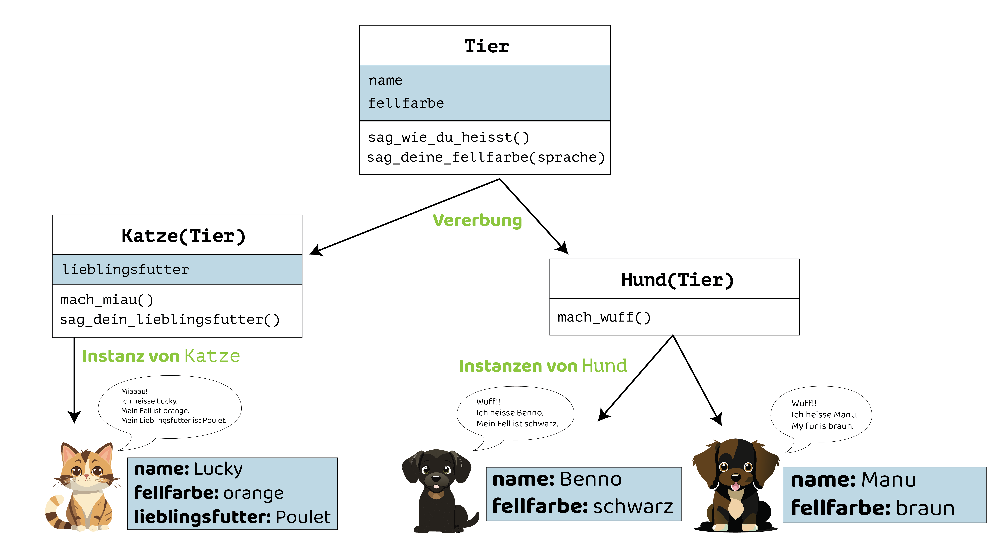

# Vererbung
Vererbung in der objektorientierten Programmierung das Weitergeben von Eigenschaften (_Instanzvariablen_ und _Methoden_) von einer Klasse auf eine andere. Mit Vererbung können wir also eine neue Klasse erstellen, die auf einer bestehenden Klasse aufbaut. Die neue Klasse _erbt_ dabei alle _Instanzvariablen_ und _Methoden_ der _Superklasse_. Das macht es einfacher, Code zu schreiben, wiederzuverwenden und zu organisieren.



Dieses Beispielprogramm erweitert den Code aus dem [vorherigen Beispiel](./#klassen-und-objekte) um zwei neue Klassen `Tier` und `Katze`.

```python showLineNumbers
class Tier:
    def __init__(self, name, fellfarbe):
        self.name = name
        self.fellfarbe = fellfarbe

    def sag_wie_du_heisst(self):
        print("Ich heisse " + self.name + ".")

    def sag_deine_fellfarbe(self, sprache):
        if sprache == "de":
            print("Mein Fell ist " + self.fellfarbe + ".")
        elif sprache == "en":
            print("My fur is " + self.fellfarbe + ".")

class Hund(Tier):
    def __init__(self, name, fellfarbe):
        super().__init__(name, fellfarbe)

    def mach_wuff(self):
        print("Wuff!!")

class Katze(Tier):
    def __init__(self, name, fellfarbe, lieblingsfutter):
        super().__init__(name, fellfarbe)
        self.lieblingsfutter = lieblingsfutter

    def mach_miau(self):
        print("Miaaau!")

    def sag_dein_lieblingsfutter(self):
        print("Mein Lieblingsfutter ist " + self.lieblingsfutter + ".")

benno = Hund("Benno", "schwarz")
manu = Hund("Manu", "braun")
lucky = Katze("Lucky", "rot", "Poulet")

benno.mach_wuff()
benno.sag_wie_du_heisst()
benno.sag_deine_fellfarbe("de")

manu.mach_wuff()
manu.sag_wie_du_heisst()
manu.sag_deine_fellfarbe("en")

lucky.mach_miau()
lucky.sag_wie_du_heisst()
lucky.sag_deine_fellfarbe("de")
lucky.sag_dein_lieblingsfutter()
```

Es produziert folgende Ausgabe:

```
Wuff!!
Ich heisse Benno.
Mein Fell ist schwarz.
Wuff!!
Ich heisse Manu.
My fur is braun.
Miaaau!
Ich heisse Lucky.
Mein Fell ist rot.
Mein Lieblingsfutter ist Poulet.
```

**Erklärungen:**
- Zeile `15`: `class Hund(Tier)` bedeutet, dass die Klasse `Hund` auf der Klasse `Tier` aufbauen soll.
  - Wir sagen: `Hund` _erweitert_ `Tier`.
  - Oder: `Hund` _erbt von_ `Tier`. `Hund` ist eine _Kindklasse_ von `Tier`.
  - Und umgekehrt: `Tier` ist die Superklasse von `Hund`.
- Analog für Zeile `22`: `Katze` _erweitert / erbt von_ `Tier`, ist eine _Kindklasse_ von `Tier`. `Tier` ist die _Superklasse_ von `Katze`.
- Das heisst: `Hund` und `Katze` sind _Spezialformen_ von `Tier`.
  - Sie besitzen alle _Instanzvariablen_ und _Methoden_, die in `Tier` definiert sind. Deshalb können wir den Zeilen `38`, `39`, `42`, `46` und `47` die Methoden `sag_wie_du_heisst()` und `sag_deine_fellfarbe()` auf Instanzen von `Hund` und `Katze` aufrufen, obwohl diese Methoden in der Klasse `Tier` definiert sind (Zeilen `6`-`13`).
- Der _Konstruktor_ von `Tier` definiert zwei Parameter: `name` und `fellfarbe`.
  - _Kindklassen_ müssen in ihrem Konstruktor den Konstruktor ihrer _Superklasse_ (genannt, _Superkonstruktor_) aufrufen (Zeilen `17` und `24`).
  - Dabei müssen sie Argumente für die entsprechenden Parameter des _Superkonstruktors_ mitgeben, so wie das auf Zeilen `17` und `24` jeweils mit `name` und `fellfarbe` gemacht wird.
  - Merke: Angenommen, alle Katzen wären orange. Dann dürfte der Konstruktor der Klasse `Katze` seinen _Superkonstruktor_ beispielsweise auch mit `super().__init__(name, "orange")` aufrufen, und müsste selbst keinen Parameter `fellfarbe` mehr definieren.
- Die Klasse `Hund` definiert eine eigene Methode `mach_wuff()`. Diese Methode ist demnach auf allen Instanzen von `Hund` verfügbar, jedoch nicht auch Instanzen von `Katze`.
- Das Gleiche gilt für die Methode `sag_dein_lieblingsfutter()` und die darin verwendete Instanzvariable `self.lieblingsessen` in der Klasse `Katze`: sie sind beide nur in Instanzen von `Katze` verfügbar.
- Die Klassen `Hund` und `Katze` könnten selbst auch wieder erweitert werden, beispielsweise um spezifische Hunde- resp. Katzenrassen. Diese _Vererbungskette_ kann beliebig lang sein — sie wird allerdings schnell unübersichtlich.
- Die Klasse `Tier` könnte auch direkt _instanziiert_ werden: `momo = Tier("Momo", "gelb")`.
  - `momo` verfügt in dem Fall über die Methoden `sag_wie_du_heisst()` und `sag_deine_fellfarbe()`.
  - `momo` verfügt aber nicht über die Methoden `mach_miau()`, `mach_wuff()` oder `sag_dein_lieblingsfutter()`, da diese nicht `Tier`, sondern in den Kindklassen `Hund`, resp. `Katze` definiert werden.
- Eine Klasse kann theoretisch mehrere _Superklassen_ haben. Davon ist allerdings abzuraten.

---
