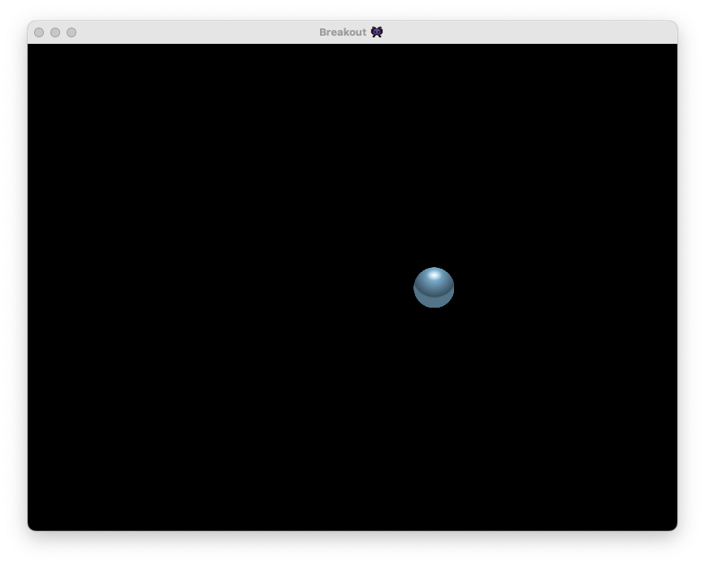
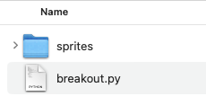
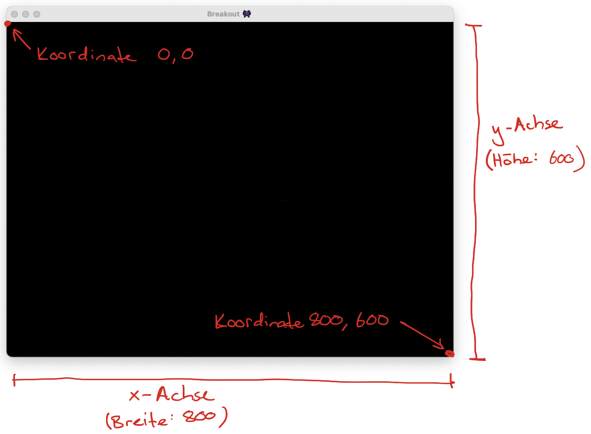

# Einen Ball hinzufügen

In diesem Schritt fügen wir dem Spielfeld einen Spielball hinzu. Wir schreiben dabei zwar nur recht wenig neuen Code — und dennoch passiert hier so einiges. Nehmen Sie sich für diesen Schritt also genügend Zeit.



## Sprites herunterladen

Die grafischen Elemente unseres Spiels erhalten wir, indem wir verschiedene kleine Bilder ins Spielfenster einfügen und sie darin bewegen. In der Spielentwicklung bezeichnen wir solche Bilder als *Sprites*.

Die Sprites für unser Breakout-Spiel können Sie [hier herunterladen](https://opengameart.org/sites/default/files/Breakout_Tile_Set_Free.zip). Nachdem Sie die Datei heruntergeladen haben, gehen Sie wie folgt vor:

1. Entpacken Sie die ZIP-Datei.
2. Suchen sie in entpackten Order nach dem Unterordner `PNG`.
3. Verschieben Sie den `PNG`-Ordner in den gleichen Ordner, in dem sich auch die im letzten Schritt erstellte Python-Datei `breakout.py` befindet. `breakout.py` und der Ordner `PNG` sollten dann also nebeneinander liegen.
4. Ändern Sie den Namen des Ordners von `PNG` zu `sprites`.



Nun ist alles bereit, damit wir unserem Game gleich ein erstes Sprite hinzuzufügen können. Schauen Sie sich ruhig schonmal etwas im `sprites`-Ordner um. Welches Bild werden wir in diesem Schritt wohl verwenden?

## Exkurs: Objektorientierte Programmierung

Als Nächstes sollen Sie sich mit einem Programmierkonzept auseinandersetzen, das sie bisher noch nicht kennen: *objektorientierte Programmierung (OOP)*. Wir nutzen Objekte, um die Elemente unseres Spiels (Ball, Paddle und Blocks) zu modellieren.

::::aufgabe[Einführung in OOP]
Nehmen Sie sich jetzt einen Moment Zeit und lesen Sie [diese Einführung in die objektorientierte Programmierung](../Advanced-Python/OOP). Lesen Sie dabei auch das [Unterkapitel zur Vererbung](../Advanced-Python/OOP). Sie müssen nicht jedes Detail verstehen.

Bearbeiten Sie anschliessend die zwei folgenden Aufgaben, um Ihr Verständnis zu prüfen und weiter zu schärfen.

### Aufgabe 1

Erweitern Sie im unten stehenden Programm die beiden *Klassen* `Ferrari` und `Mercedes` so, dass ihr *Konstruktor* je zwei Parameter `fahrer` und `nummernschild` entgegennimmt. Weisen Sie diese beiden Werte im Konstruktor einer entsprechenden *Instanzvariable* zu.

Implementieren Sie dann in beiden Klassen je zwei Methoden namens `gib_fahrer_aus()` und `gib_nummernschild_aus()`. Was diese beiden *Methoden* ausgeben sollen, können sie der erwarteten Ausgabe unten entnehmen.

Erledigen Sie zum Schluss die drei TODOs auf den Zeilen `11`-`13` in unten stehenden Programm, wo Sie die *Instanziierung* und die *Methodenaufrufe* für den Mercedes analog zum Ferrari ergänzen.

```python showLineNumbers
class Ferrari:
  # TODO...

class Mercedes:
  # TODO...

ferrari = Ferrari("Charles", "BE 123456")
ferrari.gib_fahrer_aus()
ferrari.gib_nummernschild_aus()

# TODO: Instanz von Mercedes erstellen
# TODO: Auf dem Mercedes-Objekt die Methoden gib_fahrer_aus() aufrufen
# TODO: Auf dem Mercedes-Objekt die Methode gib_nummernschild_aus() aufrufen
```

Das Programm sollte folgende Ausgabe produzieren:

```
Fahrer Ferrari: Charles
Nummernschild Ferrari: BE 123456
Fahrer Mercedes: George
Nummernschild Mercedes: GL 4321
```

### Aufgabe 2

Nun haben Sie für die Klassen `Ferrari` und `Mercedes` genau den gleichen Konstruktor und zwei fast identische Methoden `gib_fahrer_aus()` und `gib_nummernschild_aus()` implementiert. Das lässt sich noch optimieren.

Erstellen Sie dazu eine dritte Klasse namens `Auto`. Verändern Sie die Klassen `Ferrari` und `Mercedes` anschliessend so, dass beide von `Auto` *erben* (also *Kindklassen* von `Auto` sind).

Versuchen Sie dann, so viel Code wie möglich von `Ferrari` und `Mercedes` in die Klasse `Auto` zu verschieben, ohne dass sich an der Ausgabe etwas verändert.

:::tip[Automarken weglassen]
Um die Aufgabe etwas zu vereinfachen, dürfen Sie in der Ausgabe optional auch die Automarken (*Ferrari* und *Mercedes*) weglassen.
:::
::::

## Den Ball hinzufügen

Nun haben Sie alles, was Sie benötigen, um dem Spiel einen Ball hinzuzufügen!

Dazu erstellen wir zuerst eine Klasse `Ball`, die von einer Pygame-eigenen *Superklasse* `pygame.sprite.Sprite` erbt (Zeile `17`). Die Klasse `Ball` verfügt damit über alle Eigenschaften (Instanzvariablen) und Methoden, die in einem Pygame-Sprite zur Verfügung stehen.

Im *Konstruktor* der `Ball`-Klasse (Zeilen `18`-`23`) nehmen wir auf Zeile `18` nebst `self` zwei Parameter `x` und `y` entgegen. Danach rufen wir auf Zeile `19` zuerst den *Superkonstruktor* auf. Auf Zeile `20` laden wir dann das Sprite für den Ball, welches wir vorerst in einer lokalen Variable speichern. Anschliessend setzen wir die Grösse des Ball-Sprites auf Zeile `21` auf 50x50 und speichern das fertige Bild in der *Instanzvariable* `self.image` ab.

Auf den letzten beiden Zeilen des Konstruktors müssen wir Pygame noch sagen, wo genau sich dieses Sprite befinden soll. Das tun wir in Pygame, indem wir ein (virtuelles, unsichtbares) Rechteck angeben, indem sich das Sprite-Bild befinden soll. Ein solches Rechteck besitzt einige Eingenschaften; darunter eine Breite (`width`) und eine Höhe (`height`), und ein Zentrum (`center`):


Auch das Bild selbst besitzt ein solches Rechteck (`rect`), welches bereits genau die richtige Breite und Höhe hat. Auf Zeile `22` nehmen wir deshalb das Rechteck unseres Sprite-Bildes und weisen es der Instanzvariable `self.rect` zu. Diese Instanzvariable kommt aus der `pygame.sprite.Sprite`-Klasse und wird von Pygame verwendet. Zum Schluss legen wir noch das Zentrum dieses Rechtecks fest, indem wir es auf `(x, y)` setzen. Die Werte `x` und `y` erhalten wir als Parameter im Konstruktor. Die runden Klammern `(...)` bedeuten in dem Fall, dass es sich hier um ein sogenanntes *Tuple* handelt. Ein Tuple ist fast genau das gleiche wie eine *Liste*, nur mit dem Unterschied, dass man ein Tuple nicht nachträglich verändern kann.

Auf Zeile `25` erstellen wir anschliessend eine *Instanz* von `Ball` mit den *Konstruktor-Argumenten* `500` für den Parameter `x` und `300` für den Parameter `y`. Der Ball soll also an der Stelle `500,300` positioniert werden, wobei sich die Stelle `0,0` in der oberen linken Ecke des Spielfensters befindet:



Dann passiert auf den Zeilen `26` und `27` noch etwas Besonderes: wir müssen für den Ball nämlich eine *Sprite-Gruppe* erstellen (wir nennen sie `balls`, Zeile `26`) und den Ball dieser Gruppe hinzufügen (Zeile `27`), obwohl wir nur einen Ball haben. Dies müssen wir deshalb tun, weil Pygame gewisse Dinge nur mit Sprite-Gruppen und nicht direkt mit Sprites erledigen kann.

Zum Schluss müssen wir noch dafür sorgen, dass der Ball auch wirklich im Spielfenster angezeigt wird. Das tun wir mit den Zeilen `33` und `34`. `balls.update()` bewirkt dabei, dass der Ball (respektive, die "Ball-Gruppe") beispielsweise an die korrekte Stelle im Spielfenster verschoben wird, falls sich seine Position (`self.rect.center`, Zeile `23`) seit dem letzten Update des Spielfensters verändert hat. Mit `balls.draw(screen)` übergeben wir der Ball-Gruppe das Spielfenster, welches wir auf Zeile `15` erstellt haben, und sagen ihr somit, dass sie sich in diesem Spielfenster darstellen soll.

```python showLineNumbers {17-23,25-27,33-34}
import pygame

# Spiel initialisieren
pygame.init()

# Einstellungen für das Fenster
window_width = 800
window_height = 600

# Hintergrundfarbe festlegen
background_color = pygame.color.Color("black")

# Pygame-Fenster vorbereiten
pygame.display.set_caption("Breakout 👾")
screen = pygame.display.set_mode([window_width, window_height])

class Ball(pygame.sprite.Sprite):
    def __init__(self, x, y):
        super().__init__()
        ball_image = pygame.image.load("sprites/58-Breakout-Tiles.png")
        self.image = pygame.transform.scale(ball_image, (50, 50))
        self.rect = self.image.get_rect()
        self.rect.center = (x, y)

ball = Ball(500, 300)
balls = pygame.sprite.Group()
balls.add(ball)

run = True
while run:
    screen.fill(background_color)

    balls.update()
    balls.draw(screen)

    pygame.display.flip()

    for event in pygame.event.get():
        if event.type == pygame.QUIT:
            run = False
```

Der Game-Loop (Zeilen `30`-`40`) führt nun kontinuierlich folgende Schritte aus:

1. Fülle den Bildschirm mit schwarzer Hintergrundfarbe (Zeile `31`).
2. Prüfe, ob sich am Ball etwas verändert hat; beispielsweise seine Position (Zeile `33`).
3. Sag dem Ball, dass er im Spielfenster dargestellt werden soll (Zeile `34`).
4. Zeichne den gesamten Inhalt des Spielfensters neu, mit allen allfälligen Veränderungen (Zeile `36`).
5. Prüfe, ob der Benutzer `Alt+F4` oder `Cmd+Q` gedruckt hat. Falls ja, setze `run` auf den Wert `False`, um diese `while`-Schleife, und damit das gesamte Spiel, zu beenden (Zeilen `38`-`40`).

Wir prüfen also bereits jetzt fortlaufend auf Veränderungen und zeichnen das Spielfenster ständig neu. Im nächsten Schritt schauen wir uns an, wie wir eine solche Veränderung bewirken können, um dem Ball zu bewegen.

---