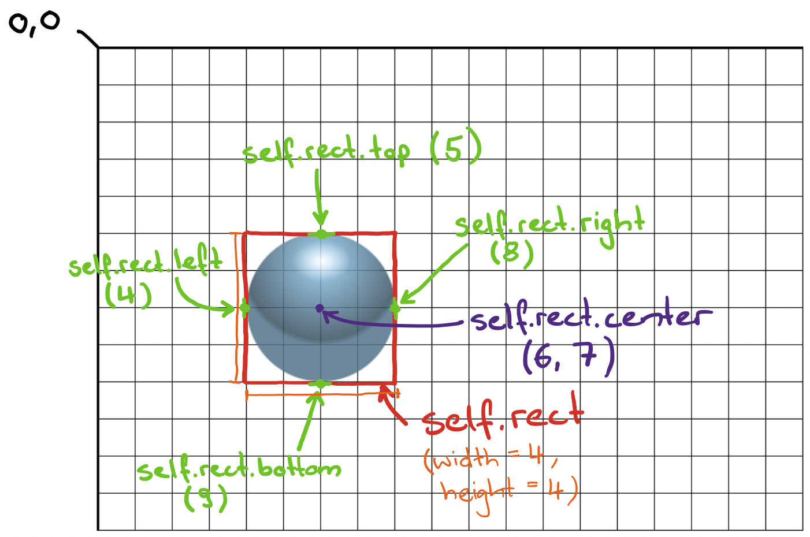

# Kollision mit dem Fensterrand
Damit der Ball nicht gleich aus dem Spielfenster herausfliegt, wollen wir in diesem Schritt dafür sorgen, dass er mit den Fensterrändern kollidiert und zurückprallt.



Dazu müssen wir als Erstes prüfen können, ob der Ball einen Fensterrand berührt. Diese Funktionalität setzen wir auf den Zeilen `44`-`45` für den oberen Rand und `47`-`48` für die beiden Seitenränder um — und zwar als Methoden in der `Ball`-Klasse. Für den oberen Rand schauen wir uns dazu die Eigenschaft `self.rect.top` des Balls an. Damit erhalten wir Zugriff auf die Koordinate der oberen Kante des unsichtbaren Rechtecks, welches Pygame um den Ball zieht. Wenn diese obere Kante die Koordinate `0` erreicht oder unterschreitet, dann wissen wir, dass der Ball die obere Kante des Spielfensters berührt. Der Ausdruck `self.rect.top <= 0` auf Zeile `45` in der Methode `hits_top_of_window()` prüft genau das. Er hat den Wert `True`, wenn die Oberkante des Ball-Rechtecks den oberen Rand des Spielfensters berührt oder unterschreitet. Ansonsten hat er den Wert `False`. Dieser Wert, `True` oder `False`, wird direkt _zurückgegeben_.

:::insight[Rückgabewerte]
Was heisst, der Wert wird _zurückgegeben_? Eine Funktion (oder Methode; der Einfachheit halber sprechen wir hier nun lediglich von Funktionen) kann zwei Arten von Aufgaben erfüllen: Sie kann etwas bewirken, oder sie kann einen Wert produzieren.

Wenn eine Funktion einen Wert produziert, dann sagen wir, dass sie einen Wert _zurückgibt. Solche Funktionen haben Sie in diesem Tutorial bereits ganz oft gesehen; nämlich immer dann, wenn ein Funktionsaufruf rechts von einem `=`-Zeichen steht (wie z.B. auf den Zeilen `11`, `15` oder `18`).

Damit eine Funktion einen Wert zurückgibt, brauchen wir das Schlüsselwort `return`. Der Wert, der rechts von diesem `return` steht, ist das, was diese Funktion zurückgibt.

Ausführlichere Informationen zu diesen sogenannten _Rückgabewerten_ finden Sie in [diesem Artikel](../../../03-Ressourcen/03-Advanced-Python/04-Return.mdx).
:::

Damit können wir also bereits prüfen, ob der Ball die Oberkante des Spielfensters berührt. Dasselbe machen auf den Zeilen `47`-`48` anschliessend für die Seitenränder. Hier interessiert uns nicht das `self.rect.top`, sondern das `self.rect.left` und das `self.rect.right`. Für ersteres prüfen wir, auf Zeile `48`, ob es den linken Spielfensterrand berührt (`self.rect.left <= 0`). Für zweiteres prüfen wir, ob es über die Breite des Spielfensters hinausgeht und somit den rechten Rand berührt (`self.rect.right >= window_width`). Beide Ausdrücke ergeben wieder einen `True` oder `False` Wert, und wir verknüpfen diese Werte mit einem `or`. Das Ergebnis, welches wir hier zurückgeben, ist dann `True`, wenn `self.rect.left <= 0` oder `self.rect.right >= window_width` `True` ist.

Nun können wir prüfen, ob der Ball über den oberen, linken oder rechten Bildschirmrand hinausgeht. Diese Überprüfung rufen wir weiter unten auf Zeile `63`, respektive `66` auf und benutzen deren _Rückgabewert_ dort als `if`-Bedingung. Wenn der Ball den oberen Rand berührt, dann wollen wir seine Richtung in der y-Achse umdrehen (`Zeile 64`) — sprich, er soll nicht mehr nach oben, sondern nach unten fliegen. Wenn er einen der Seitenränder berührt, dann wollen wir seine Richtung in der x-Achse umdrehen: wenn er sich aktuell nach links bewegt, und so einen Seitenrand berührt, dann soll er nach rechts wechseln, und umgekehrt (`67`).

Dazu fehlen uns nochmal zwei Methoden in der `Ball`-Klasse, welche diese Richtungsänderung bewerkstelligen. Wir implementieren sie auf den Zeilen `34`-`37`, respektive `39`-`42`. Für `flip_x_direction()`, die Richtungsänderung in der x-Achse, berechnen wir dazu zuerst die neue x-Richtung, indem wir die aktuelle x-Richtung mal `-1` rechnen (Zeile `35`). Wenn der Ball also aktuell nach links geht (negative x-Richtung), dann soll er neu genauso schnell nach rechts gehen (positive x-Richtung) und umgekehrt. Danach berechnen wir noch die "neue" y-Richtung — hier ändert sich aber nichts, also übernehmen wir auf Zeile `36` einfach die aktuelle y-Richtung. Diese beiden neu berechneten Richtungswerte weisen wir dann wieder der Instanzvariable `self.direction` zu und haben damit eine neue Flugrichtung für den Ball definiert. Die Methode `flip_y_direction()` funktioniert genau gleich, nur mit den beiden Achsen vertauscht.

```python showLineNumbers {34-37,39-42,41-42,44-45,47-48,63-64,66-67}
import pygame

# Spiel initialisieren
pygame.init()

# Einstellungen für das Fenster
window_width = 800
window_height = 600

# Hintergrundfarbe festlegen
background_color = pygame.color.Color("black")

# Pygame-Fenster vorbereiten
pygame.display.set_caption("Breakout 👾")
screen = pygame.display.set_mode([window_width, window_height])

# Zugriff auf die Uhr -> damit können wir die Geschwindigkeit des Spiels anpassen
clock = pygame.time.Clock()

class Ball(pygame.sprite.Sprite):
    def __init__(self, x, y):
        super().__init__()
        ball_image = pygame.image.load("sprites/58-Breakout-Tiles.png")
        self.image = pygame.transform.scale(ball_image, (50, 50))
        self.rect = self.image.get_rect()
        self.rect.center = (x, y)
        self.direction = (-1, -2)

    def move(self):
        new_x = self.rect.center[0] + self.direction[0]
        new_y = self.rect.center[1] + self.direction[1]
        self.rect.center = (new_x, new_y)

    def flip_x_direction(self):
        new_x_direction = self.direction[0] * -1
        new_y_direction = self.direction[1]
        self.direction = (new_x_direction, new_y_direction)

    def flip_y_direction(self):
        new_x_direction = self.direction[0]
        new_y_direction = self.direction[1] * -1
        self.direction = (new_x_direction, new_y_direction)

    def hits_top_of_window(self):
        return self.rect.top <= 0

    def hits_side_of_window(self):
        return self.rect.left <= 0 or self.rect.right >= window_width

ball = Ball(500, 300)
balls = pygame.sprite.Group()
balls.add(ball)

run = True
while run:
    clock.tick(100)
    screen.fill(background_color)

    ball.move()
    balls.update()
    balls.draw(screen)

    if ball.hits_top_of_window():
        ball.flip_y_direction()

    if ball.hits_side_of_window():
        ball.flip_x_direction()

    pygame.display.flip()

    for event in pygame.event.get():
        if event.type == pygame.QUIT:
            run = False
```

Das war's — der Ball prallt nun vom oberen, linken und rechten Spielfensterrand ab. Zumindest wäre das der Fall, wenn er nicht nach dem ersten Abpraller ab oberen Rand gleich unten rausfallen würde. Für den unteren Rand haben wir aber bewusst keine solche Kollision definiert, denn unten fehlt uns etwas ganz anderes: ein beweglicher "Schläger"; das _Paddle_. Das werden wir in den nächsten paar Schritten hinzufügen und ausbauen.

---
