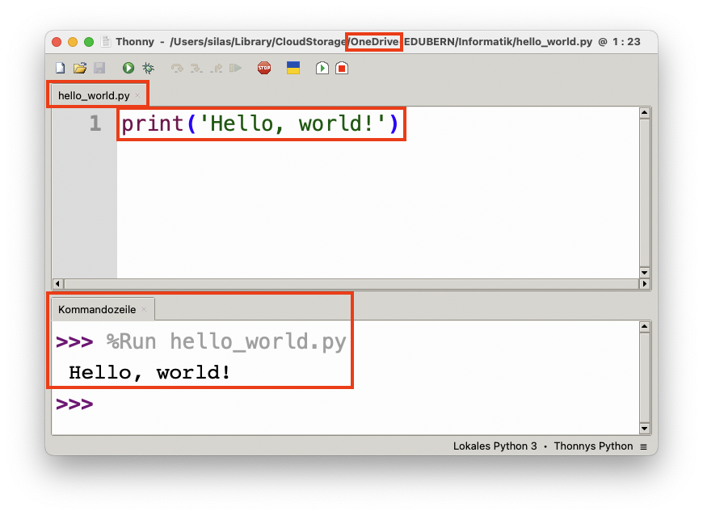

import TaskState from "@tdev-components/documents/TaskState";

# Hallo, Welt!
Da Sie Thonny nun installiert haben, ist es an der Zeit, Ihr erstes Python-Programm auszuführen! 🥳

:::aufgabe[Ein erstes Programm]
<TaskState id='c4b3ddd9-4856-40ce-9ffd-9b482dc68b69' />
Öffnen Sie nun Thonny und fügen Sie folgenden Programm-Code im Code-Editor ein:

```python
print('Hello, world!')
```

Führen Sie dieses Programm anschliessend aus. Kontrollieren Sie dann, ob in der Kommandozeile die Ausgabe `Hello, world!` erscheint.

**Speichern Sie das Programm zum Schluss als `hello_world.py` auf Ihrer OneDrive an.**



Wenn alles funktioniert hat, rufen Sie die Lehrperson. Anschliessend können Sie die Aufgabe als erledigt markieren.
:::

---
