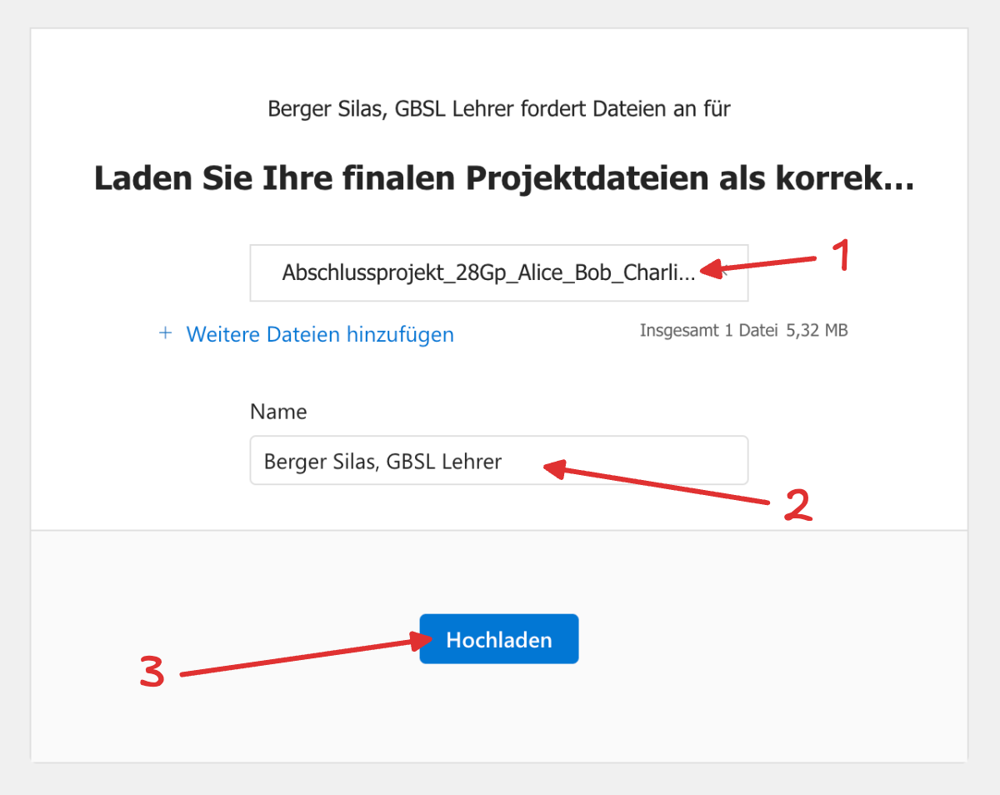
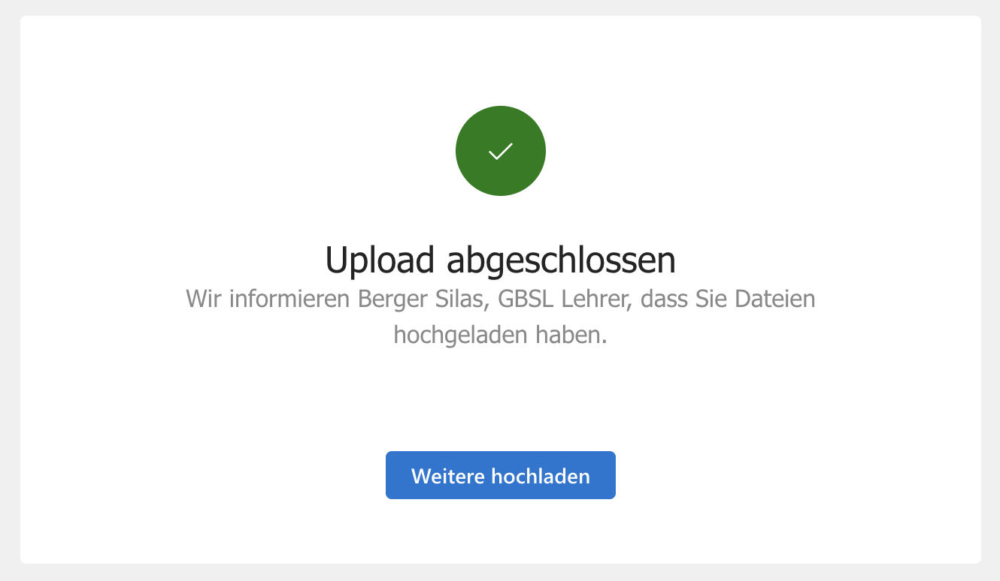

import ProgressState from '@tdev-components/documents/ProgressState';

# Artefakte und Abgabe
Es ist empfehlenswert, gleich zu Beginn einen gemeinsamen OneDrive-Ordner für die Gruppe anzulegen, damit alle Gruppenmitglieder jederzeit Zugriff auf die Projektdokumentation und die Projekt-Artefakte haben und diese gemeinsam bearbeiten können. So kann **technischen Problemen bei der Abgabe** vorgebeugt werden, denn diese **entschuldigen kein verspätetes Einreichen**!

Abzugeben sind:

Projektartefakte
: z.B. Quellcode, Werkstück, Druckprodukt, etc. (abhängig vom individuellen Projektkonzept der Gruppe)
Projektdokumentation
: bestehend aus einem schriftlichen Werkbericht und einem Begleitvideo

::::aufgabe[Projekt abgeben]
Sobald Sie Ihr Projekt abgeschlossen und alle abzugebenden Elemente (Projektartefakte und Projektdokumentation; siehe unten) fertiggestellt haben, bearbeitet **eine Person aus der Gruppe** diese Aufgabe, um das Projekt abzugeben. 

:::warning[Teil der Beurteilung]
Die **termingerechte** und **korrekte** Abgabe (inkl. **Benennung der ZIP-Datei**) fliesst in die Beurteilung mit ein.
:::

Geben Sie Ihr Projekt bis zum angegebenen Zeitpunkt ab, indem **eine Person** wie folgt vorgeht:
<ProgressState id="5c004b17-048f-4919-b5e8-16ebbf932bcd" keepPreviousStepsOpen>
  1. Legen Sie alle abzugebenden Elemente (Projektartefakte, Werkbericht, Begleitvideo) in einem einzigen Ordner ab. Achten Sie darauf, dass der Ordner **aufgeräumt ist** (z.B. auch keine unnötigen Dateien enthält), und dass die Dateien **sinnvolle, aussagekräftige Namen** mit korrekter **Dateiendung** (`.pdf`, `.mp4`, `.py`, `.html`, etc.) haben.
  2. Erstellen Sie aus diesem Ordner eine ZIP-Datei. Im BYOD Basics Thema haben Sie gelernt, wie das geht. Benennen Sie die ZIP-Datei nach folgendem Muster: `Abschlussprojekt_28Gx_Name1_Name2_Name3_Name4.zip`, also z.B. `Abschlussprojekt_28Gp_Alice_Bob_Charlie.zip`.
  3. Laden Sie die ZIP-Datei unter folgendem Link hoch: [Abgabe Abschlussprojekt](https://erzbe-my.sharepoint.com/:f:/g/personal/silas_berger_gbsl_ch/IgABmoZ80SeTSoUu0sm-qKLGAVsmsOTiMvrhIVoDcI9ZFrw)

     1
     : Kontrollieren Sie, ob Sie die richtige Datei ausgewählt haben.
     2
     : Kontrollieren Sie, ob Ihr Name automatisch ausgefüllt wurde oder ergänzen Sie diesen ansonsten manuell.
     3
     : Nachdem Sie alles kontrolliert haben, klicken Sie auf «Hochladen».

     

     Der Upload war erfolgreich, wenn Sie die folgende Meldung sehen:

     
</ProgressState>
::::

## Projekt-Artefakte
Die abzugebenden Projekt-Artefakte (z.B. Quellcode, Werkstück, Druckprodukt, etc.) sind abhängig vom individuellen Projektkonzept der Gruppe. Sie sind im Projektvertrag festzuhalten und genau zu beschreiben, und müssen bei der Abgabe des Projekts eingereicht werden.

## Projektdokumentation
Die Projektdokumentation besteht aus zwei Teilen, welche unter dem **angegebenen Dateinamen** im **Abgabeordner** abgelegt werden müssen:

Schriftlicher Werkbericht
: ein PDF-Dokument, in dem die Gruppe ausführlich über die Umsetzung des Projekts berichtet, reflektiert und die verwendeten Hilfsmittel (inkl. KI, externe Hilfe, etc.) transparent macht 
Begleitvideo
: ein kurzes Video, in dem die Gruppe ihr Projekt auf ansprechende Weise präsentiert und einen Einblick in die Umsetzung gibt

### Werkbericht
Umfang
: nach Bedarf
Inhalt
: gemäss vorgegebenen Punkten (siehe unten)
Ziel
: einen umfassenden Einblick in die Umsetzung des Projekts geben und die verwendeten Hilfsmittel transparent machen
Dateiname
: `Werkbericht.pdf` 

Der Werkbericht umfasst folgende Punkte:
- Projektidee, Projektkonzept und vereinbarter Rahmen zur Verwendung von KI gemäss Projektvertrag (bitte eins-zu-eins übernehmen, damit klar ist, was ursprünglich geplant war)
- Beschreibung der Umsetzung 
  - Was haben Sie gemacht? Wie sind Sie vorgegangen?
  - Wer hat was gemacht?
  - Wie haben Sie die Zusammenarbeit organisiert?
- Reflexion zum Projekt 
  - Was lief gut?
  - Was lief weniger gut? Was würden Sie beim nächsten Mal anders machen?
  - Welche erlernten Inhalte aus dem Informatikunterricht konnten Sie anwenden?
  - Was haben Sie aus diesem Projekt neu dazugelernt?
- Deklaration der verwendeten Hilfsmittel
  - Wo und wie wurden KI, externe Hilfe oder sonstige Hilfsmittel eingesetzt?
  - Inwiefern konnten die Resultate z.B. von KI direkt übernommen werden, und inwiefern mussten sie angepasst oder sogar verworfen werden?
  - Die konkreten Prompts und Anweisungen, die Sie KI oder externen Helfer:innen gegeben haben, müssen **nicht** dokumentiert werden (dürfen aber zur Erklärung verwendet werden).

Für den Werkbericht wird keine Seiten- oder Zeichenzahl vorgegeben. Entscheidend ist, dass die geforderten inhaltlichen Punkte vollständig, sinnvoll, detailliert, klar strukturiert und verständlich abgedeckt werden.

### Begleitvideo
Dauer
: 4-8 Minuten
Inhalt
: Präsentation des Projekts, z.B. durch eine kurze Vorstellung der Gruppe, eine Demonstration
Ziel
: einen ansprechenden Einblick in die Umsetzung des Projekts geben und einen Mehrwert zum Werkbericht bieten
Dateiname
: `Begleitvideo.mp4` 
: _(oder einem anderen gängigen Videoformat, z.B. `.mov`)_

Das Begleitvideo soll einen kurzen Einblick in das Projekt geben und kann z.B. eine kurze Präsentation der Gruppe, eine Demonstration des Projekts, ein Interview mit den Gruppenmitgliedern oder eine Kombination davon sein. Die genaue Form und der Inhalt des Begleitvideos sind der Kreativität der Gruppe überlassen, sollten aber einen Mehrwert zum Werkbericht bieten und das Projekt auf ansprechende Weise präsentieren.

### Transparenz und Nachvollziehbarkeit
Aus der **Kombination von Werkbericht und Begleitvideo** sollte klar hervorgehen, dass die Gruppe das Projekt selbstständig und mit einem angemessenen Mass an Eigenleistung umgesetzt hat, und dass sie die verwendeten Hilfsmittel (inkl. KI, externe Hilfe, etc.) kritisch geprüft und vollumfänglich verstanden hat. Sie dürfen im Video also z.B. auch Code-Stellen oder sonstige Resultate zeigen und erklären, die von KI oder externen Helfer:innen generiert wurden, um zu demonstrieren, dass Sie diese verstanden haben und sinnvoll in Ihr Projekt integriert haben.

---