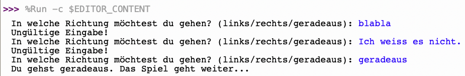
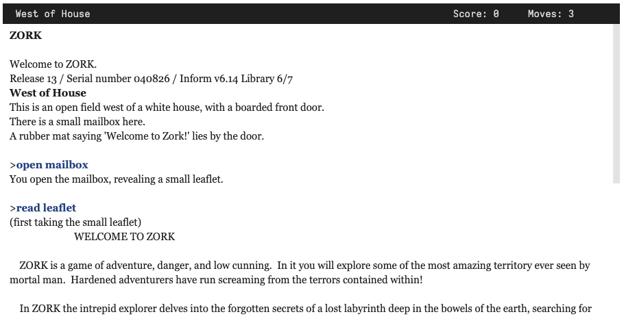

import QuillV2 from '@tdev-components/documents/QuillV2';

# Text Adventures


In einer Zeit, in der komplexe Computergrafiken noch eine ferne Zukunftsvision waren, erzählten viele klassische Videospiele ihre Geschichte als sogenannte _Text Adventures_. Das Geschehen wurde der Spielerin oder dem Spieler also nicht grafisch gezeigt, sondern in Textform beschrieben. Die Spielfigur steuerte man nicht mit Tasten, Controllern oder Touch-Gesten, sondern mittels Texteingaben.

## Ein Beispiel
Etwa so könnte ein sehr einfaches Text adventure aussehen:

:::warning[In Thonny ausprobieren]
Komplexere Programme wie Text Adventures lassen sich nicht gut auf der Webseite ausführen. Laden Sie das Programm herunter (:mdi[download]), öffnen Sie es mit Thonny und führen Sie es dort aus.

Probieren Sie das Spiel aus. Machen Sie sich keine Sorgen, wenn Sie den Code noch nicht vollständig verstehen.
:::

```py live_py readonly
def ungueltige_wahl():
    print('Ungültige Wahl! Spiel vorbei!')

def hoehle():
    print('Du siehst eine Höhle vor dir.')
    auswahl = input('Möchtest du die Höhle betreten? (ja/nein): ')
    if auswahl == 'ja':
        print('Du hast den Schatz gefunden! Herzlichen Glückwunsch, du gewinnst!')
    else:
        print('Du hast beschlossen, die Höhle nicht zu betreten und den Schatz verpasst. Spiel vorbei!')

def fluss():
    print('Du stösst auf einen Fluss. Du kannst schwimmen oder eine Brücke suchen.')
    auswahl = input('Was möchtest du tun? (schwimmen/brücke): ')
    if auswahl == 'schwimmen':
        print('Du wurdest von einem Krokodil angegriffen! Spiel vorbei!')
    elif auswahl == 'brücke':
        print('Du hast eine versteckte Brücke gefunden und den Fluss sicher überquert.')
        hoehle()
    else:
        ungueltige_wahl()

def schloss():
    print('Du siehst ein Schloss in der Ferne.')
    auswahl = input('Möchtest du dich dem Schloss nähern? (ja/nein): ')
    if auswahl == 'ja':
        print('Du bist ins Schloss eingetreten und wurdest von zwei Rittern festgenommen. Spiel vorbei!')
    else:
        print('Du hast beschlossen, dich dem Schloss nicht zu nähern. Leider ist dein Proviant aufgebraucht. Spiel vorbei!')

def woelfe():
    print('Du begegnest einem Rudel Wölfe. Du kannst entweder rennen oder versuchen, sie zu zähmen.')
    auswahl = input('Was möchtest du tun? (rennen/zähmen): ')
    if auswahl == 'rennen':
        print('Du bist erfolgreich vor den Wölfen geflohen.')
        schloss()
    elif auswahl == 'zähmen':
        print('Die Wölfe greifen dich an! Spiel vorbei!')
    else:
        ungueltige_wahl()

def tempel():
    print('Du siehst einen Tempel in der Ferne.')
    auswahl = input('Möchtest du den Tempel betreten? (ja/nein): ')
    if auswahl == 'ja':
        print('Du bist in den Tempel eingetreten und in seine Katakomben vorgedrungen.')
        hoehle()
    else:
        print('Du hast beschlossen, den Tempel nicht zu betreten und den Schatz verpasst. Spiel vorbei!')

def riesenspinne():
    print('Du gehst geradeaus und triffst auf eine Riesenspinne.')
    auswahl = input('Was möchtest du tun? (kämpfen/fliehen): ')
    if auswahl == 'kämpfen':
        print('Du hast die Spinne besiegt!')
        hoehle()
    elif auswahl == 'fliehen':
        print('Du konntest der Spinne entkommen.')
        tempel()
    else:
        ungueltige_wahl()

print('Willkommen beim Schatzsuche-Spiel!')
print('Du befindest dich in einem Wald. Du musst den versteckten Schatz finden.')
print('Du stehst an einer Wegkreuzung. Du kannst nach links, rechts oder geradeaus gehen.')

auswahl = input('In welche Richtung möchtest du gehen? (links/rechts/geradeaus): ')
if auswahl == 'links':
    fluss()
elif auswahl == 'rechts':
    woelfe()
elif auswahl == 'geradeaus':
    riesenspinne()
else:
    ungueltige_wahl()
```

:::aufgabe[Inhalte schlüssiger machen]
<TaskState id="53b2a881-bec3-4026-ad6f-5da2ca94350c" />

Dieses kleine Beispiel ist natürlich nicht perfekt. Das grösste Problem ist, dass wir als Spieler:in keine Ahnung haben können, welche Entscheidung korrekt ist. Wir müssen also raten, und wenn wir falsch raten, ist das Spiel vorbei. Das ist nicht besonders fair.

In einem gut gemachten Text Adventure gibt es Hinweise, die uns helfen, die richtige Entscheidung zu treffen. Wir können also nicht einfach raten, sondern müssen die Hinweise im Spielgeschehen interpretieren und daraus die richtige Entscheidung ableiten.

Überlegen Sie sich, wie Sie das Spiel spannender und fairer machen könnten. Was für Hinweise könnten Sie einbauen, um den Spieler:innen zu helfen, die richtige Entscheidung zu treffen? Wie könnten Sie entscheidungen so gestalten, dass man sie mit Logik und Überlegung treffen kann, und nicht einfach raten muss? Sie dürfen sich dabei auch auf Allgemeinwissen oder bekannte Geschichten beziehen.

**Überlegen Sie zuerst für sich alleine und halten Sie Ihre Ideen fest.** Diskutieren Sie dann in der Gruppe und überlegen Sie gemeinsam, wie Sie das Spiel verbessern könnten.

<QuillV2 id="373fdf2c-920b-4f24-ad0e-5590e48ccb48" />
:::

::::aufgabe[Ungültige Eingaben abfangen]
<TaskState id="f7b6f46d-2393-40b1-9126-e382106b30a6" />

Ein weiteres Problem in diesem Beispiel ist, dass das Spiel abstürzt, wenn wir eine ungültige Eingabe machen. Das ist nicht besonders benutzerfreundlich. Wie könnten Sie das Spiel anpassen, um dieses Problem zu lösen?

Kopieren Sie den folgenden Beispielcode ins Thonny. Passen Sie ihn so an, dass die Spielerin so lange immer wieder nach einer Eingabe gefragt wird, bis sie eine gültige Eingabe macht. Wenn die Eingabe ungültig ist, soll eine entsprechende Meldung ausgegeben werden, und die Spielerin soll erneut nach einer Eingabe gefragt werden.

```py
auswahl = input('In welche Richtung möchtest du gehen? (links/rechts/geradeaus): ')
if auswahl == 'links':
    print('Du gehst nach links. Das Spiel geht weiter...')
elif auswahl == "rechts":
    print('Du gehst nach rechts. Das Spiel geht weiter...')
elif auswahl == 'geradeaus':
    print('Du gehst geradeaus. Das Spiel geht weiter...')
else:
    print('Ungültige Eingabe! Spiel vorbei!')
```

Eine Interaktion mit dem Spiel könnte danach zum Beispiel so aussehen:



:::tip[While-Schleife und bool-Variable]
Vermutlich hilft Ihnen dabei die Verwendung einer `while`-Schleife und einer Variable vom Datentyp `bool`.
:::

Fügen Sie Ihre Lösung am Schluss hier ein:

```py live_py id=14e1e864-e8bc-47a0-bce9-619df530ab6a
```

<Solution id="58a63cb0-492f-4132-97bd-d596fec223ef">
```py
eingabe_okay = False

while not eingabe_okay:
    auswahl = input('In welche Richtung möchtest du gehen? (links/rechts/geradeaus): ')
    if auswahl == 'links':
        print('Du gehst nach links. Das Spiel geht weiter...')
        eingabe_okay = True
    elif auswahl == "rechts":
        print('Du gehst nach rechts. Das Spiel geht weiter...')
        eingabe_okay = True
    elif auswahl == 'geradeaus':
        print('Du gehst geradeaus. Das Spiel geht weiter...')
        eingabe_okay = True
    else:
        print('Ungültige Eingabe!')
```
</Solution>
::::

## Ein berühmter Klassiker
Eines der berühmtesten Text Adventures ist _Zork_, das 1977 von _Infocom_ veröffentlicht wurde. Es war eines der ersten Spiele, die eine grafische Benutzeroberfläche überhaupt nicht mehr benötigten. Das Spiel war so erfolgreich, dass es später auch grafische Versionen gab.

Sie können eine Nachbildung von _Zork_ [hier](https://textadventures.co.uk/games/play/5zyoqrsugeopel3ffhz_vq) online spielen. Probieren Sie's aus!

So sieht das aus:



Fällt Ihnen etwas auf? _Zork_ gibt uns keine Auswahl möglicher Eingaben! Stattdessen können wir beliebige Eingaben der Form `<Imperativ> <Objekt>` machen: z.B. `open mailbox`. Das Spiel interpretiert diese Eingaben und reagiert entsprechend.

Ein solch flexibels Text Adventure zu programmieren, ist natürlich sehr viel schwieriger. Bei unseren eigenen Games beschränken wir uns deshalb auf die "einfachere" Variante mit klar vordefinierten Eingabemöglichkeiten.

---
