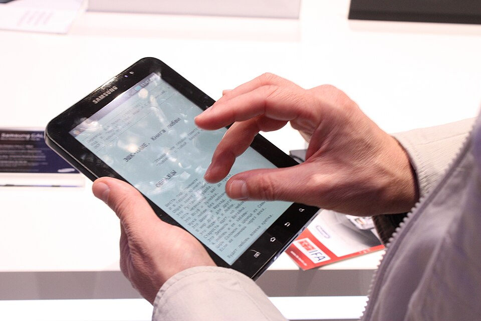
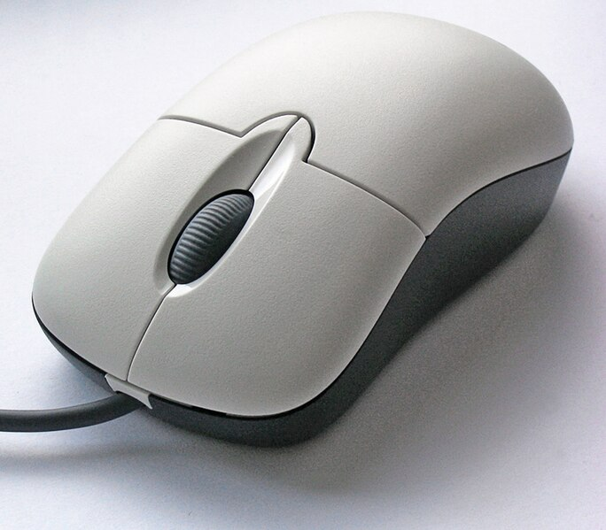
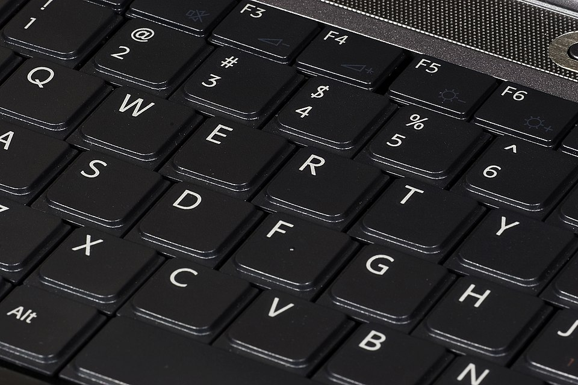
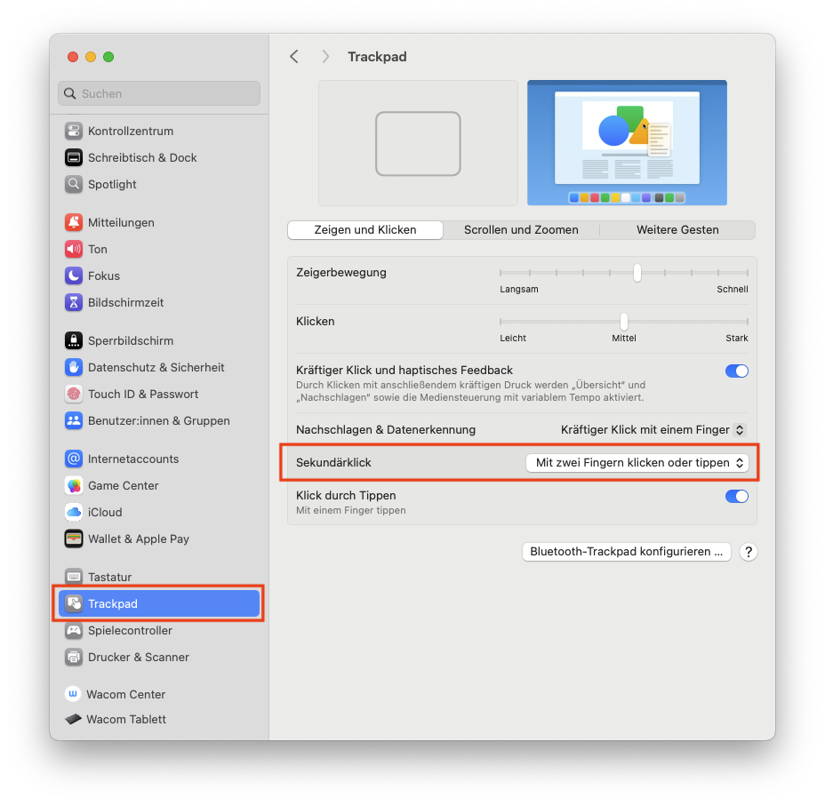

import ClickTest from '@tdev-components/ClickTest'

# Modul 1: Grundlegende Bedienung
:::info[Lernziele]
1. Du kannst die wichtigsten Grundbegriffe rund um dein Gerät erläutern, korrekt anwenden und ggf. mit ähnlichen Begriffen / Konzepten vergleichen (z.B. Tochpad vs. Maus vs. Touchscreen, iPad vs. Laptop, etc.).
2. Du kennst die wichtigsten Tastenkombinationen («Keyboard Shortcuts») auswendig und kannst sie verwenden, um einfache Abläufe nur mit der Tastatur und ohne Maus / Touchpad / Touchscreen umzusetzen.
3. Du kannst auf der Tastatur alle wichtigen Sonderzeichen eingeben.
4. Du kannst ein Programm von einer Webseite herunterladen, installieren, starten und wieder deinstallieren.
:::

## Grundbegriffe
Die Welt der Informatik und ICT ist bekannt für ihre vielen Fachbegriffe. Damit wir möglichst präzise und verständlich kommunizieren können, ist es wichtig, dass wir die wichtigsten Begriffe kennen und korrekt anwenden.

Fangen wir mit den zentralsten Begriffen an:
Computer
: Elektronisches Gerät, das Informationen verarbeiten, speichern und darstellen kann. 
: Besteht aus Hardware Hardware (z. B. Tastatur, Touchpad, Bildschirm, evtl. Touchscreen, Prozessor, Speicher, etc.) und Software (Programme).
Desktop-Computer
: Stationärer Computer, der aus einzelnen Teilen wie Bildschirm, Tastatur, Maus und dem eigentlichen Rechnergehäuse besteht.
: Wird an einem festen Arbeitsplatz genutzt und ist nicht zum Mitnehmen gedacht.
Laptop
: Tragbarer Computer mit eingebautem Bildschirm, Tastatur, Akku und allen wichtigen Komponenten in einem Gerät. 
: Kann im Gegensatz zum Desktop-Computer mobil genutzt werden und benötigt nicht ständig eine Stromverbindung.
Mobilgerät
: Kleines, tragbares Gerät, das leicht in der Hand gehalten werden kann und meist über einen Touchscreen bedient wird.
: Dazu zählen Smartphones und Tablets.
Betriebssystem
: Wichtigste Software eines Geräts, die dafür sorgt, dass alle Teile des Computers zusammenarbeiten und Programme oder Apps gestartet werden können. Beispiele sind Windows, macOS oder Linux.
: Beispiele sind _Windows_, _macOS_ und _Linux_ für Desktop-Computer und Laptops, sowie _Android_, _iOS_ und _iPadOS_ für Mobilgeräte.

### Laptop vs. Mobilgerät / Chromebook
Für den Schulunterricht wird ein vollwertiger Laptop benötigt. Darunter versteht man einen tragbaren Computer mit einem **vollständigen Betriebssystem wie _Windows_ oder _macOS_**. Solche Geräte können alle Programme ausführen, die im Unterricht gebraucht werden, zum Beispiel Textverarbeitungen, Tabellenkalkulationen, Präsentationssoftware, Programmier-Umgebungen oder spezielle Lernprogramme. Sie haben in der Regel genug Rechenleistung, Speicherplatz und Anschlussmöglichkeiten (z. B. USB, HDMI) für verschiedene schulische Aufgaben.

Mobilgeräte wie Tablets oder Smartphones mit Betriebssystemen verwenden Betriebssysteme wie _Android_ (z.B. Samsung-Smartphones), _iOS_ (iPhone) oder _iPadOS_ (iPad). Diese Geräte sind zwar handlich und praktisch für unterwegs, haben aber oft Einschränkungen:
- Viele Programme existieren für diese Betriebssysteme nur in einer stark limitierten Version oder gar nicht.
- Mehrere Anwendungen gleichzeitig zu nutzen ist oft umständlich.
- Anschlüsse für externe Geräte oder Speicher fehlen häufig.
- Das Arbeiten mit Tastatur und Maus ist nur umständlich oder über Zusatzgeräte möglich.

:::insight[Umgang mit Daten]
TODO: "Mit Programmen werden Dateien erstellt und bearbeitet" vs. "Apps haben ihren eigenen, abgegrenzten Speicherbereich"
:::

Chromebooks sind Laptops mit dem Betriebssystem _ChromeOS_. Sie eignen sich gut für das Surfen im Internet oder für einfache Online-Aufgaben, können aber oft keine Programme installieren, die nicht im Browser laufen. Viele schulische Anwendungen – insbesondere spezielle Software, die offline funktioniert – lassen sich damit nicht nutzen.

:::insight[Programme vs. Apps]
Software, die auf vollständigen Betriebssystemen wie Windows oder macOS läuft, wird meist als **«Programm»** bezeichnet. Auf Mobilgeräten hingegen spricht man meist von **«Apps»** (kurz für «Applikationen»).

Apps sind oft speziell für Touchscreens optimiert und bieten eine vereinfachte Benutzeroberfläche. Dadurch haben sie in der Regel aber auch einen limitierten Funktionsumfang.
:::

Hier die Unterschiede im Überblick:
| Gerätetyp        | Betriebssystem         | Stärken im Schulkontext                               | Einschränkungen im Schulkontext                         |
|------------------|------------------------|-------------------------------------------------------|---------------------------------------------------------|
| **Vollwertiger Laptop** | Windows, macOS, (Linux) | Kann alle benötigten Programme installieren und nutzen; gute Leistung; viele Anschlüsse; komfortables Arbeiten mit Tastatur und Maus / Touchpad | Meist schwerer und teurer als Mobilgeräte               |
| **Tablet**       | iPadOS, Android        | Leicht, mobil, guter Touchscreen für kreative Aufgaben | Eingeschränkte Programmvielfalt («Apps»); oft keine vollwertige Office- oder Spezialsoftware; wenige Anschlüsse |
| **Smartphone**   | iOS, Android           | Sehr mobil, schnelle Kommunikation, Kamera            | Sehr kleiner Bildschirm; ungeeignet für längeres Arbeiten; eingeschränkte Programme («Apps») |
| **Chromebook**   | ChromeOS               | Schnell startklar, gut für Internet- und Cloud-Arbeiten | Viele Programme nur online nutzbar; keine Installation von Spezialsoftware möglich |

:::aufgabe[Teste dein Wissen]
<TaskState id="cd3e34ea-20a9-4d57-8f94-6c71d362966c" />

Mit diesem Quiz kannst du dein Wissen zu den unterschiedlichen Gerätetypen testen.

**Achtung:** Wenn du die Seite neu lädst, wird bei solchen Quizzes deine Lösung jeweils zurückgesetzt. Dafür kannst du das Quiz jederzeit wiederholen, um dein Wissen zu festigen. Denk trotzdem daran, die **Aufgabe als erledigt zu markieren**, sobald du das Quiz fehlerfrei gelöst hast!

::learningapps[https://learningapps.org/pt4m72wvc25]
:::

### Eingabegeräte
Eingabegeräte sind Hardware-Komponenten, mit denen Informationen und Befehle an einen Computer übermittelt werden. Sie dienen dazu, den Computer zu steuern oder Daten einzugeben – zum Beispiel durch Tippen, Klicken, Wischen oder Ziehen. Wir unterscheiden dabei zwischen **Zeigegeräten** (z. B. Touchscreen, Touchpad, Maus), mit denen der Mauszeiger oder Objekte gesteuert werden, und **Texteingabegeräten** (konkret: Tastatur), mit denen Buchstaben, Zahlen und Symbole eingegeben werden. 

| Eingabegerät | Gerätetyp | Typische Verwendung | Bild | 
|--------------|---------------------|--------------|---|
| **Touchscreen** | Zeigegerät         | Navigation, Zeichnen, Tippen über Bildschirmtastatur |  |
| **Touchpad**    | Zeigegerät         | Steuerung des Mauszeigers, Gestensteuerung |  |
| **Maus**        | Zeigegerät         | Präzises Steuern des Mauszeigers, z. B. bei grafischen Arbeiten |  |
| **Tastatur**    | Texteingabegerät   | Schreiben von Texten, Ausführen von Befehlen über Tastenkombinationen |  |

TODO: Übung!

### Arten von Klicks
Beim Arbeiten mit einer Maus, einem Touchpad oder einem Touchscreen gibt es verschiedene Klickarten. Sie lösen je nach Art unterschiedliche Aktionen aus. Die wichtigsten sind **Linksklick**, **Doppelklick** und **Rechtsklick**.

| Klickart       | Beschreibung |
|----------------|--------------------------------------------------|
| **Klick** («Linksklick») | Standard-Klick, wird am meisten gebraucht. Zum Beispiel Buttons anklicken, Elemente markieren, etc. |
| **Doppelklick**| Zwei Klicks schnell nacheinander. Wird oft gebraucht, um Dateien und Programme zu öffnen (in der Taskleiste / dem Dock braucht es allerdings nur einen einzelnen Klick)  |
| **Rechtsklick**| Wird z.B. gebraucht, um das Kontextmenü mit zusätzlichen Optionen zu öffnen. Ausführung: je nach Gerät (meistens mit zwei Fingern) |

:::warning[Rechtsklick unter macOS]
Wenn Sie ein MacBook verwenden, klappen Sie diesen Abschnitt auf und befolgen Sie die entsprechende Anleitung.

    
    
Rechtsklick einstellen unter macOS

    

    Wenn Sie ein MacBook verwenden, sollten Sie unbedingt die Einstellungen für den Rechtsklick (bei macOS auch «Sekundärklick» genannt) anpassen:

    Das :mdi[apple]-Symbol ganz oben links anklicken → __Systemeinstellungen__ → __Trackpad__ → __Sekundärklick: Mit zwe Fingern klicken oder tippen__.

    
    

:::

:::aufgabe[Alle Klicks ausprobieren]
<TaskState id="7c45a564-8b22-4f2a-b04f-9905955fe642" />
In dieser Aufgabe kannst du zeigen, dass du alle drei Klick-Arten beherrschst.

Führe auf dem grossen runden Knopf je einen Klick, einen Doppelklick und einen Rechtsklick aus. Die Checkboxen auf der rechten Seite zeigen dir an, welche Klick-Arten du bereits geschafft hast. Wenn du die Seite neu lädst, wird dein Fortschritt zurückgesetzt.

Markiere die Aufgabe als erledigt, wenn du alle drei Klick-Arten erfolgreich ausgeführt hast. 

<ClickTest />
:::

## Tastenkombinationen
### Die wichtigsten Tastenkombinationen (Prüfungsrelevant)
copy, paste, alles markieren, cut, undo, suchen, Alt+Tab, Pfeiltasten inkl. Modifier, öffnen über Spotlight / Startmenu, save, print

### ⭐️ Weitere nützliche Tastenkombinationen
print, bold, underline, italic, 

## Sonderzeichen
TBD.

---