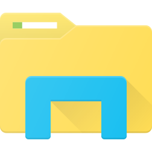

import TabItem from "@theme/TabItem";
import OsTabs from '@tdev-components/OsTabs';
import useBaseUrl from '@docusaurus/useBaseUrl';
import Video from '@tdev-components/Video'

# Modul 2: Dateimanagement
:::info[Lernziele]
1. Du kannst den Begriff «Dateisystem» und die damit verbundenen Konzepte wie Speicher, Festplatte (inkl. Alternativbezeichnungen), Dateiexplorer («Finder»), Ordner, Unterordner, Dateien, Pfade, etc. erklären und korrekt verwenden.
2. Du kannst in einem Dateibaum und auf deinem Computer den vollständigen Pfad einer Datei oder eines Ordners korrekt bestimmen.
9. Du kannst erklären, was passiert, wenn man eine Datei erstellt und etwas «speichert» oder «abspeichert». Du kannst auch den Unterschied zwischen «speichern» und «abspeichern» (auch «ablegen») erklären.
5. Du kannst deinem Gerät den Dateiexplorer öffnen, darin navigieren und die Ordner und Dateien nach verschiedenen Kriterien sortieren (z.B. Name, Grösse, Erstellungsdatum, Änderungsdatum).
6. Du kannst auf deinem Gerät einen neuen Ordner erstellen, sowie Dateien und Ordner finden, umbenennen, kopieren, verschieben, löschen und wiederherstellen.
7. Du kannst Dateien Dateiexplorer und über die globale Suche (macOS: «Spotlight») öffnen und du kannst die Vor- und Nachteile der beiden Methoden erklären.
3. Du kannst erklären, was Dateinamenerweiterungen sind und wozu sie dienen. Auf deinem Gerät hast du die Dateinamenerweiterungen aktiviert und kannst zeigen, wo man das einstellen kann.  
8. Du kannst in einem Programm (z.B. Word oder PowerPoint) eine Datei bewusst an einem bestimmten Ort und unter einem bestimmten Namen abspeichern und diese Datei im Dateiexplorer wiederfinden.
12. Du kannst Dateien und Ordner sinnvoll benennen und dich dabei auch exakt an etwaige Vorgaben halten (z.B. Gross- und Kleinschreibung, Leerzeichen, Trennstriche, etc.). Du kannst deine Dateien auf deinem Gerät in einer sinnvollen Ordnerstruktur organisieren.
10. Du kannst erklären, wo sich deine Daten zu welchem Zeitpunkt befinden, wenn du mit OneDrive arbeitest. Dabei kannst du auch die OneDrive-Begriffe «online Verfügbar», «synchronisiert» und «immer synchronisiert» korrekt verwenden und mit den entsprechenden Symbolen und Funktionen im Dateiexplorer deines Geräts verknüpfen.
11. Du kannst auf deinem Gerät eine Datei (ohne mit der Browser-Version von OneDrive zu arbeiten) bewusst auf der Schul-OneDrive, auf der privaten OneDrive und «lokal» (also ausserhalb von OneDrive) ablegen. Du kannst auch erklären, was es bedeutet, wenn man etwas auf der «falschen» OneDrive oder nur lokal ablegt.
14. Du kannst eine ZIP-Datei erstellen und entpacken. Zudem kannst du erklären, was eine ZIP-Datei ist, wozu sie dient, und inwiefern sie sich von einem Ordner unterscheidet.
15. Du kannst grob darüber Auskunft geben, inwiefern man OneDrive als Backup bezeichnen kann und welche weiteren Backup-Möglichkeiten es gibt.
:::

## Speicher und Dateien
Jeder Computer verfügt über permanenten **Speicher**, in dem Daten dauerhaft abgelegt werden. Diesen Speicher nennt man auch die **Festplatte** (auch: _HDD, Harddisk, Harddrive, Laufwerk_; wobei es sich heute praktisch immer um eine modernere, schnellere Lösung namens **SSD**[^1] handelt). Typischerweise hat die Festplatte eines modernen Laptops eine Kapazität von 256 GB bis 2 TB oder mehr.

Um diesen Speicher zu organisieren, verwendet jedes Betriebssystem ein sogenanntes **Dateisystem**. Dieses sorgt dafür, dass man Dateien und Ordner anlegen, öffnen, verschieben und löschen kann.

Das Dateisystem ist als sogenannte **Baumstruktur** aufgebaut, die aus Ordnern und Dateien (Verzeichnissen) besteht. Das oberste Verzeichnis im Dateisystem wird als **Root** bezeichnet. Unter Windows wir das Root-Verzeichnis. Von hier aus verzweigen sich alle weiteren Ordner.

<OsTabs>
<TabItem value="win">   
Auf einem Windows-Computer könnte das Dateisystem ungefähr so aussehen, wie in diesem **Dateibaum** gezeigt:
```
C:
├── Users
│   └── Max
│       ├── Desktop
│       ├── Downloads
│       └── Documents
│           └── Text.docx
├── Program Files
│   ├── Google
│   │   └── Chrome
│   │       ├── chrome.exe
│   │       └── manifest.json
│   └── Microsoft
│       └── Office
│           ├── Word.exe
│           └── Excel.exe
└── Windows
    ├── System32
    │   ├── cmd.exe
    │   ├── notepad.exe
    │   └── drivers
    │       └── etc
    │           └── hosts
    └── explorer.exe
```

Das `C:/` ist hier das Root-Verzeichnis[^2] – also der «Start» des Dateisystems. In diesem Root-Verzeichnis sehen wir drei Unter-Verzeichnisse (Ordner, Unterordner): `Users`, `Program Files` und `Windows`.

Die Ordner `Programme` und `Windows` gehören zum Betriebssystem. Sie enthalten wichtige Programme und Systemdateien, mit denen wir meistens nichts zu tun haben. In den meisten Fällen arbeiten wir nur im Verzeichnis `Users`. Darin sehen wir einen Ordner für den Benutzer Max, in dem sich sie Unterordner `Desktop`, `Downloads` und `Documents` befinden. Im Ordner `Documents` liegt die Datei `Text.docx`. 

:::insight[Übersetzte Ordnernamen]
Wenn du deinen Computer auf Deutsch eingestellt hast, wird dir der Ordner `Documents` im Explorer vermutlich als `Dokumente` angezeigt. Aus Sicht des Betriebssystems heisst der Ordner aber immer `Documents`, damit sich das Dateisystem nicht ändert, wenn du die Sprache deines Computers wechselst. Dasselbe gilt z.B. für den Ordner `Pictures`, der dir vermutlich als `Bilder` angezeigt wird.
:::

Falls dieser Computer von mehreren Personen verwendet würde, hätte es im `Benutzer`-Ordner auch noch weitere Ordner für andere Benutzer gegeben.
</TabItem>

<TabItem value="mac">
Auf einem Mac-Computer könnte das Dateisystem ungefähr so aussehen, wie in diesem **Dateibaum** gezeigt:
```
/
├── Applications
│   ├── Google Chrome.app
│   └── Microsoft Word.app
├── System
│   └── Library
│       └── CoreServices
│           └── Finder.app
└── Users
    └── Max
        ├── Desktop
        ├── Downloads
        └── Documents
            └── Text.docx
```

Der `/`-Ordner ist hier das Root-Verzeichnis – also der «Start» des Dateisystems. In diesem Root-Verzeichnis sehen wir drei Unter-Verzeichnisse: `Applications`, `System` und `Users`.

Die Ordner `Applications` und `System` gehören zum Betriebssystem. Sie enthalten wichtige Programme und Systemdateien, mit denen wir meistens nichts zu tun haben.  In den meisten Fällen arbeiten wir nur im Verzeichnis `Benutzer`. Darin sehen wir einen Ordner für den Benutzer Max, in dem sich sie Unterordner `Desktop`, `Downloads` und `Dokumente` befinden. Im Ordner `Dokumente` liegt die Datei `Text.docx`. 

:::insight[Übersetzte Ordnernamen]
Wenn du deinen Computer auf Deutsch eingestellt hast, wird dir der Ordner `Documents` im Explorer vermutlich als `Dokumente` angezeigt. Aus Sicht des Betriebssystems heisst der Ordner aber immer `Documents`, damit sich das Dateisystem nicht ändert, wenn du die Sprache deines Computers wechselst. Dasselbe gilt z.B. für den Ordner `Pictures`, der dir vermutlich als `Bilder` angezeigt wird.
:::

Würde dieser Mac von mehreren Personen genutzt, gäbe es im Ordner `Users` auch weitere Benutzerordner.
</TabItem>
</OsTabs>

Hier die wichtigsten Begriffe nochmal zusammengefasst:

**Root**
: Das oberste Verzeichnis im Dateisystem. Von hier aus verzweigen sich alle weiteren Ordner.
**Ordner** 
: (auch: Verzeichnisse): Dienen dazu, Dateien und weitere Unterordner zu organisieren.
**Datei**
: Ein einzelnes Dokument, Bild, Programm oder eine andere Informationseinheit.

### Der Pfad
Der **Pfad** ist die «Adresse» einer Datei oder eines Ordners im Dateisystem. Mit dem _Pfad_ kann man eine Datei eindeutig identifizieren. Man folgt dem Baum von Root-Verzeichnis bis zum Ordner oder der Datei, deren Pfad man angeben will.

<OsTabs>
<TabItem value="win">
Die einzelnen **Pfad-Segmente** (also die Verzweigungen auf dem Weg vom Root-Verzeichnis zum Ordner oder zur Datei) werden bei Windows durch _Backslashes_ (`\`) getrennt.

Im obigen Beispiel sieht der Pfad zur Datei `Test.docx` wie folgt aus:

```
C:\Users\Max\Documents\Text.docx
```

Mit dem _Pfad_ kann man eine Datei eindeutig identifizieren. Es könnte auf dem obigen Computer beispielsweise mehrere Dateien mit dem Namen `Text.docx` geben. Innerhalb eines Ordners dürfen aber nie mehrere Dateien denselben Namen haben. Deshalb kann es nur eine Datei geben, die den Pfad `C:\Users\Max\Documents\Text.docx`.

:::aufgabe[Pfad bestimmen]
<TaskState id="018d232b-550d-4682-91f7-5bcc687d28ad" />
Bestimme im obigen Baum den Pfad zur Datei `chrome.exe`. Achte auf die Gross- und Kleinschreibung sowie die korrekte Verwendung von Backslashes (`\`) und nicht Slashes (`/`).

Gib deine Lösung hier ein und überprüfe sie mit dem Button. Markiere die Aufgabe als erledigt, wenn dieser anzeigt, dass deine Lösung korrekt ist.
<String id="e726160f-f04c-4aed-af40-c679b9bc1ccc" inputWidth="25em" solution="C:\Program Files\Google\Chrome\chrome.exe" />
:::
</TabItem>

<TabItem value="mac">
Die einzelnen **Pfad-Segmente** (also die Verzweigungen auf dem Weg vom Root-Verzeichnis zum Ordner oder zur Datei) werden bei macOS durch _Slashes_ (`/`) getrennt.

Im obigen Beispiel sieht der Pfad zur Datei `Test.docx` wie folgt aus:

```
/Users/Max/Documents/Text.docx
```

Mit dem _Pfad_ kann man eine Datei eindeutig identifizieren. Es könnte auf dem obigen Computer beispielsweise mehrere Dateien mit dem Namen `Text.docx` geben. Innerhalb eines Ordners dürfen aber nie mehrere Dateien denselben Namen haben. Deshalb kann es nur eine Datei geben, die den Pfad `/Users/Max/Documents/Text.docx`.

:::aufgabe[Pfad bestimmen]
<TaskState id="018d232b-550d-4682-91f7-5bcc687d28ad" />
Bestimme im obigen Baum den Pfad zur Datei `Finder.app`. Achte auf die Gross- und Kleinschreibung.

Gib deine Lösung hier ein und überprüfe sie mit dem Button. Markiere die Aufgabe als erledigt, wenn dieser anzeigt, dass deine Lösung korrekt ist.
<String id="4ff12db9-dfd7-4f83-aac1-b7f8db54e7c8" inputWidth="25em" solution="/System/Library/CoreServices/Finder.app" />
:::
</TabItem>
</OsTabs>

### Speichern und abspeichern
Wenn wir beispielsweise ein neues Word-Dokument erstellen und es **abspeichern**, dann wird in dem Moment eine **neue Datei erstellt**, die einen Namen (z.B. `Test2.docx`) und einen entsprechenden Pfad hat. Es wird also ein kleiner Bereich der Festplatte reserviert, in dem der Inhalt dieses Word-Dokuments gespeichert wird.

Wenn wir das Word-Dokument weiter bearbeiten und anschliessend **speichern**, dann wird der **Inhalt der Datei aktualisiert**. Es wird also keine neue Datei erstellt, sondern die bestehende Datei wird überschrieben. In vielen Programmen gibt es aber die Menu-Option «Speichern unter…» oder «Kopie speichern», mit der man eine neue Datei anlegen kann, die dann einen anderen Namen oder Pfad hat.

Wenn wir das Word-Dokument schliessen und später wieder öffnen, dann wird die vorher gespeicherte Datei geladen. Das heisst, der Inhalt der Datei wird in das Programm geladen, damit wir ihn bearbeiten können.

| Aktion | Was passiert? |
| --- | --- |
| **Abspeichern** | Eine neue Datei wird erstellt, die den Inhalt des Dokuments enthält. Das **Dateisystem** erhält einen **neuen Eintrag**. |
| **Speichern** | Der Inhalt der bestehenden Datei wird aktualisiert. Das **Dateisystem** erhält **keinen** neuen Eintrag. |
| **«Speichern unter…»** | Eine neue Datei wird erstellt, die den Inhalt des Dokuments enthält. Das **Dateisystem** erhält einen **neuen Eintrag**. Die neue Datei ist eine Kopie der alten. Das Programm bearbeitet anschliessend i.d.R. die neue Datei. |

## Dateien verwalten
<OsTabs>
<TabItem value="win">
Der Zugang zum Dateisystem erfolgt über einen sogenannten **Dateiexplorer**. Unter Windows heisst dieser **«Explorer»** und sieht wie folgt aus:



Wenn wir ein neues Explorer-Fenster öffnen, sehen wir folgende Ansicht:


In der **Seitenleiste** werden die wichgisten Ordner auf dem Gerät angezeigt. Dazu gehören:

`OneDrive`
: Markiert durch das blaue Wolkensymbol.
: Oft gibt es zwei davon: eine persönliche und eine Schul-OneDrive.
: Die Schul-OneDrive wird in der Regel als `OneDrive – EDUBERN` angezeigt.
`Desktop`
: Der Inhalte des `Desktop-Ordners sind auch auf dem Desktop sichtbar.
: Je nach Einstellung wird dieser Ordner mit OneDrive (persönlich oder schulisch) synchronisiert.
`Downloads`
: Hier landen Dateien, die man mit dem Browser aus dem Internet herunterlädt.
`Dokumente`
: Heisst aus Sicht des Dateisystems immer `Documents`, auch wenn der Ordner im Explorer als `Dokumente` angezeigt wird.
: Kann z.B. für Word-Dokumente, PDFs, etc. genutzt werden.
: Je nach Einstellung wird dieser Ordner mit OneDrive (persönlich oder schulisch) synchronisiert.
: Falls der `Dokumente`-Ordner **nicht** mit OneDrive synchronisiert wird, sollte man ihn nicht für Schulmaterian und andere wichtige Dateien verwenden, da diese dann nur lokal auf dem Gerät gespeichert sind und nicht in der Cloud gesichert werden.
`Dieser PC`
: Zugang zum Root-Verzeichnis.

Im **Anzeigebereich** wird der Ihnhalt des Ordners angezeigt, den man gerade geöffnet hat. Hier wird beispielsweise der Inhalt des Ordners `BYOD_Übung` angezeigt:


In welchem Ordner wir uns gerade befinden, sehen wir in der **Pfadleiste**: Wir sind im Ordner `OneDrive` → `OneDrive – EDUBERN` → `Informatik` → `BYOD_Übung`. Wir können auch direkt in einen übergeordneten Ordner wechseln, indem wir auf den entsprechenden Eintrag in der Pfadleiste klicken. Die einzelnen Einträge werden als  bezeichnet.
</TabItem>
<TabItem value="mac">
Der Zugang zum Dateisystem erfolgt über einen sogenannten **Dateiexplorer**. Unter Windows heisst dieser **«Finder»** und sieht wie folgt aus:


Das Finder-Fenster ist wie folgt gegliedert:


In der **Seitenleiste** werden die wichgisten Ordner auf dem Gerät angezeigt. Dazu gehören:

`OneDrive`
: Markiert durch das blaue Wolkensymbol.
: Oft gibt es zwei davon: eine persönliche und eine Schul-OneDrive.
: Die Schul-OneDrive wird in der Regel als `OneDrive – EDUBERN` angezeigt.
`Schreibtisch`
: Aus Sicht des Computers heisst dieser Ordner immer `Desktop`, auch wenn er im Finder als `Schreibtisch` angezeigt wird.
: Der Inhalte des `Desktop`-Ordners sind auch auf dem Desktop sichtbar.
: Je nach Einstellung wird dieser Ordner mit OneDrive (persönlich oder schulisch) synchronisiert.
`Downloads`
: Hier landen Dateien, die man mit dem Browser aus dem Internet herunterlädt.
`Dokumente`
: Heisst aus Sicht des Dateisystems immer `Documents`, auch wenn der Ordner im Explorer als `Dokumente` angezeigt wird.
: Kann z.B. für Word-Dokumente, PDFs, etc. genutzt werden.
: Je nach Einstellung wird dieser Ordner mit OneDrive (persönlich oder schulisch) synchronisiert.
: Falls der `Dokumente`-Ordner **nicht** mit OneDrive synchronisiert wird, sollte man ihn nicht für Schulmaterian und andere wichtige Dateien verwenden, da diese dann nur lokal auf dem Gerät gespeichert sind und nicht in der Cloud gesichert werden.
`Dieser PC`
: Zugang zum Root-Verzeichnis.

Im **Anzeigebereich** wird der Ihnhalt des Ordners angezeigt, den man gerade geöffnet hat.

In welchem Ordner wir uns gerade befinden, sehen wir in der **Pfadleiste**: Wir sind im Ordner `OneDrive – EDUBERN` → `Informatik` → `BYOD_Übung`. Wir können auch direkt in einen übergeordneten Ordner wechseln, indem wir auf den entsprechenden Eintrag in der Pfadleiste klicken. Die einzelnen Einträge werden als  bezeichnet. **Achtung:** Die Pfadleiste ist im Finder standardmässig ausgeblendet. Du kannst sie aber über das Menü «Darstellung» → «Pfadleiste einblenden» aktivieren.
</TabItem>
</OsTabs>

### Navigation im Dateiexplorer
<OsTabs>
    <TabItem value="win">
        In diesem Video lernst du, wie du im Explorer navigierst:
        - Ordner öffnen
        - Inhalte eines Ordners sortieren
        - Pfad anzeigen
        - mit der Pfadleiste und den sogenannten «Breadcrumbs» (dt.: _«Brotkrümel»_) navigieren
        - Ordner erstellen
        - Ordner und Dateien umbenennen
        - Ordner und Dateien löschen

        ::youtube[https://www.youtube.com/embed/lfe3r43u7kI?si=ThcCXZjsUN7r1bXl]

        ::::aufgabe[Navigation üben]
        <TaskState id="1c9c098e-4467-43a9-9178-863941157e12" />        
        1. Erstelle in deiner **Schul-OneDrive** in einem sinnvollen Ordner (z.B. `Informatik`) einen Ordner namens `Übung Navigation Explorer`.
        2. Erstelle ein neues Word-Dokument (der Inhalt ist egal) und speichere es in diesem Ordner unter dem Namen `Demo-Dokument.docx`. **Achtung:** Stelle sicher, dass du das Dokument von Anfang an am richtigen Ort speicherst, statt es irgendwo zu speichern und dann zu verschieben.
        3. Öffne den Ordner `Übung Navigation Explorer` im Explorer. Erstelle eine Kopie des Dokuments und nenne sie `Demo-Dokument Backup 1.docx`.
        4. Erstelle in `Übung Navigation Explorer` eine neuen Unterordner namens `Backups`.
        5. Verschiebe die Datei `Demo-Dokument Backup 1.docx` in den Ordner `Backups`.
        
        Erstelle nun zwei Screenshots von deinem Explorer-Fenster: einmal mit dem Ordner `Übung Navigation Explorer` und einmal mit dem Unterordner `Backups`. **Füge die Screenshots hier ein:**
        
        <QuillV2 id="fd114f36-c2db-4964-8716-4d9f9defac25" />

        Vergleiche deine eigenen Screenshots mit diesen hier und **prüfe**, ob du alles richtig gemacht hast. **Wenn nicht**, lösche den Ordner `Übung Navigation Explorer` und **starte die Übung von vorne**.

        :::cards
        
        ::br
        
        :::

        Bestimme nun den **vollständigen Pfad**…
        1. …des Ordners `Übung Navigation Explorer`.
        2. …der Datei `Demo-Dokument Backup 1.docx`. 
        
        :::info[Pfad kopieren]
        Im Explorer musst du den Pfad nicht selber herausfinden.

        So kopierst du den Pfad des aktuellen Ordners:
        <Video src={useBaseUrl('/img/byod-basics/win11/copy_folder_path.mov')}/>

        Und so kopierst du den Pfad einer Datei oder eines Ordners im Anzeigebereich:
        <Video src={useBaseUrl('/img/byod-basics/win11/copy_file_path.mov')}/>
        :::

        Halte deine Antworten hier fest:

        <String id="3af69cb9-b1fe-46f3-9c30-33bf3d2fcf99" inputWidth="25em" label="Pfad des Ordners" />
        <String id="09a28bcf-fa69-430a-9f39-720ff954b246" inputWidth="25em" label="Pfad der Datei" />

        **Vergleiche** deine Angaben mit der Musterlösung, sobald diese freigegeben ist.

        **Lösche** nun den Ordner `Übung Navigation Explorer`, um die Aufgabe abzuschliessen, und markiere diese als erledigt.

        <Solution id="f412c304-127e-44b0-a9e9-f7e316f42dc9">

        

        Auf diesem Computer lautet der Pfad des Ordner `Übung Navigation Explorer`:
        ```
        C:\Users\silas\OneDrive – EDUBERN\Informatik\Übung Navigation Explorer
        ```

        Bei dir wird der Pfad etwas anders aussehen. Darauf solltest du aber achten:
        - Der Pfad muss mit `C:\` beginnen.
        - Die Pfad-Segmente müssen durch Backslashes (`\`) getrennt sein.
        - Keine unnötigen Leerzeichen.
        - Irgendwo sollte `OneDrive` (vermutlich `OneDrive – EDUBERN`) stehen.
        - Am Schluss sollte der Ordnername `Übung Navigation Explorer` stehen.

        Der Pfad der Datei `Demo-Dokument Backup 1.docx` lautet auf diesem Computer demnach:
        ```
        C:\Users\silas\OneDrive – EDUBERN\Informatik\Übung Navigation Explorer\Backups\Demo-Dokument Backup 1.docx
        ```

        **Denk daran:** Mit dem Pfad kannst du eine Datei eindeutig identifizieren. Das ist auch beim Programmieren wichtig, wenn du z.B. eine Datei laden oder speichern willst.
        </Solution>
        ::::
    </TabItem>
    <TabItem value="mac">        
        In diesem Video lernst du, wie du im Finder navigierst:
        - Ordner öffnen
        - Inhalte eines Ordners sortieren
        - Pfad anzeigen
        - mit der Pfadleiste und den sogenannten «Breadcrumbs» (dt.: _«Brotkrümel»_) navigieren
        - Ordner erstellen
        - Ordner und Dateien umbenennen
        - Ordner und Dateien löschen

        ::youtube[https://www.youtube.com/embed/2_s1Pm4jdr4?si=IRP1LF46sukS3IvT]

        ::::aufgabe[Navigation üben]
        <TaskState id="1c9c098e-4467-43a9-9178-863941157e12" />        
        1. Erstelle in deiner **Schul-OneDrive** in einem sinnvollen Ordner (z.B. `Informatik`) einen Ordner namens `Übung Navigation Explorer`.
        2. Erstelle ein neues Word-Dokument (der Inhalt ist egal) und speichere es in diesem Ordner unter dem Namen `Demo-Dokument.docx`. **Achtung:** Stelle sicher, dass du das Dokument von Anfang an am richtigen Ort speicherst, statt es irgendwo zu speichern und dann zu verschieben.
        3. Öffne den Ordner `Übung Navigation Finder` im Finder. Erstelle eine Kopie des Dokuments und nenne sie `Demo-Dokument Backup 1.docx`.
        4. Erstelle in `Übung Navigation Finder` eine neuen Unterordner namens `Backups`.
        5. Verschiebe die Datei `Demo-Dokument Backup 1.docx` in den Ordner `Backups`.
        
        Erstelle nun zwei Screenshots von deinem Finder-Fenster: einmal mit dem Ordner `Übung Navigation Finder` und einmal mit dem Unterordner `Backups`. **Füge die Screenshots hier ein:**
        
        <QuillV2 id="892d1768-aa4a-42f4-b864-c530489e5a11" />

        Vergleiche deine eigenen Screenshots mit diesen hier und **prüfe**, ob du alles richtig gemacht hast. **Wenn nicht**, lösche den Ordner `Übung Navigation Finder` und **starte die Übung von vorne**.

        :::cards
        
        ::br
        
        :::

        Bestimme nun den **vollständigen Pfad**…
        1. …des Ordners `Übung Navigation Finder`.
        2. …der Datei `Demo-Dokument Backup 1.docx`. 
        
        :::info[Pfad kopieren]
        Im Finder musst du den Pfad nicht selber herausfinden.

        Pfad des aktuellen Ordners kopieren:
        1. [[:mdi[cursor-default-click] Rechtsklick]] auf den Ordner in der Pfadleiste
        2. `… als Pfadname kopieren`.
        <Video src={useBaseUrl('/img/byod-basics/osx/copy_folder_path.mov')}/>

        Pfad einer Datei oder eines Ordners im Anzeigebereich kopieren: 
        1. [[:mdi[cursor-default-click] Rechtsklick]] auf die Datei oder den Ordner
        2. [[Option]] gedrückt halten
        3. `… als Pfadname kopieren`.
        <Video src={useBaseUrl('/img/byod-basics/osx/copy_file_path.mov')}/>
        :::

        Halte deine Antworten hier fest:

        <String id="2f71a90c-f62a-491d-80a9-6af1d49292b7" inputWidth="25em" label="Pfad des Ordners" />
        <String id="8e24d1c0-9f91-412d-8085-c0a11d9d7ac8" inputWidth="25em" label="Pfad der Datei" />

        **Vergleiche** deine Angaben mit der Musterlösung, sobald diese freigegeben ist.

        **Lösche** nun den Ordner `Übung Navigation Finder`, um die Aufgabe abzuschliessen, und markiere diese als erledigt.

        <Solution id="f412c304-127e-44b0-a9e9-f7e316f42dc9">
        Der Pfad des Ordners könnte ungefähr so aussehen:

        ```
        /Users/silas/Library/CloudStorage/OneDrive-EDUBERN/Informatik/Übung Navigation Finder
        ```

        Bei dir wird der Pfad etwas anders aussehen. Darauf solltest du aber achten:
        - Der Pfad muss mit `/Users` beginnen.
        - Die Pfad-Segmente müssen durch Backslashes (`/`) getrennt sein.
        - Keine unnötigen Leerzeichen.
        - Irgendwo sollte `OneDrive` (vermutlich `OneDrive – EDUBERN`) stehen.
        - Am Schluss sollte der Ordnername `Übung Navigation Finder` stehen.

        Ausgehend von der Musterlösung für den Pfad des Ordners lautet der Pfad der Datei `Demo-Dokument Backup 1.docx` demnach:
        ```
        /Users/silas/Library/CloudStorage/OneDrive-EDUBERN/Informatik/Übung Navigation Finder/Backups/Demo-Dokument Backup 1.docx
        ```

        **Denk daran:** Mit dem Pfad kannst du eine Datei eindeutig identifizieren. Das ist auch beim Programmieren wichtig, wenn du z.B. eine Datei laden oder speichern willst.
        </Solution>
        ::::
    </TabItem>
</OsTabs>

### Dateien öffnen und suchen
<OsTabs>
    <TabItem value="win">
        In diesem Video lernst du, wie du Dateien im Explorer öffnest und findest:
        - Dateien öffnen
        - Dateien suchen
        - Dateinamenerweiterungen: Was sind sie, wozu braucht man sie und wie zeigt man sie an?

        ::youtube[https://www.youtube.com/embed/EmA1QdfzBBc?si=xGN8TGe03tjpq999]
    </TabItem>
    <TabItem value="mac">
        In diesem Video lernst du, wie du Dateien im Explorer öffnest und findest:
        - Dateien öffnen
        - Dateien suchen
        - Dateinamenerweiterungen: Was sind sie, wozu braucht man sie und wie zeigt man sie an?

        ::youtube[https://www.youtube.com/embed/ncGVRmwAzhA?si=ISG7iHbh9N1VfQOx]
    </TabItem>
</OsTabs>

:::aufgabe[Dateinamenerweiterungen aktivieren]
<TaskState id="c2497d46-56b7-426f-ae56-8e9ad899f770" />
Stelle sicher, dass du die **Dateinamenerweiterungen** auf deinem Gerät aktiviert hast. Du weisst, dass sie aktiviert sind, wenn im Explorer/Finder die Dateinamen immer mit einer Endung (z.B. `.docx`, `.jpg`, etc.) angezeigt werden.

Wenn du mit einem MacBook arbeitest, sind die Dateinamenerweiterungen bei dir vermutlich bereits aktiviert.
:::

### Dateien wiederherstellen
<OsTabs>
    <TabItem value="win">
        Wenn wir eine Datei _löschen_, wird sie in der Regel nicht sofort endgültig entfernt, sondern landet im **Papierkorb**. Dort kann sie wiederhergestellt werden, solange der Papierkorb nicht geleert wurde.

        So kannst du eine Datei im Explorer löschen (also in den Papierkorb verschieben) und anschliessend wiederherstellen
        <Video src={useBaseUrl('/img/byod-basics/win11/delete_restore.mov')}/>
    </TabItem>
    <TabItem value="mac">
        Wenn wir eine Datei _löschen_, wird sie in der Regel nicht sofort endgültig entfernt, sondern landet im **Papierkorb**. Dort kann sie wiederhergestellt werden, solange der Papierkorb nicht geleert wurde.

        So kannst du eine Datei im Finder löschen (also in den Papierkorb verschieben) und anschliessend wiederherstellen
        <Video src={useBaseUrl('/img/byod-basics/osx/delete_restore.mov')}/>
    </TabItem>
</OsTabs>


## Ordnung halten auf dem Computer
### Ein Umdenken…
TBD.

### Warum ist Ordnung wichtig?
Wenn du alles auf deinem Computer irgendwo abspeicherst, verlierst du schnell den Überblick. Typische Probleme sind:

- **Zeitverlust:** Du suchst ewig nach einer Datei.
- **Doppelte Dateien:** Du speicherst dieselbe Datei mehrfach, weil du sie nicht findest.
- **Fehler:** Du verwendest die falsche Version einer Datei.
- **Stress:** Ein unübersichtlicher Computer sorgt für Chaos.

### Wie benenne ich eine Datei sinnvoll?
Ein Dateiname sollte auf den ersten Blick verraten, was sich in der Datei befindet. Vermeide Namen wie:
- `neu.docx`
- `Aufsatz final final2.docx`
- `Info-Projekt.docx`
- `Präsentation.pptx`
- `programmier code.py`

Sie sind unklar und führen dazu, dass du später nicht mehr weisst, um was genau es geht. Stattdessen sollte der Name den Inhalt beschreiben – zum Beispiel das Fach, das Thema oder den Zweck der Datei. So erkennst du auch nach Wochen oder Monaten, wofür die Datei gedacht ist, ohne sie erst öffnen zu müssen.

Beispiele für sinnvolle Namen:
- `Aufsatz Märchen.docx`  
- `Math_Trigonometrie_Vorbereitung.pdf`  
- `turtle_bewegen_aufgabe_2.py`
- `Projekt Wasserstoffauto - Notizen.docx`
- `Projekt Wasserstoffauto - Abschlussbericht.docx`
- `Projekt Wasserstoffauto - Präsentation.pptx`
‚
Die letzten drei Beispiele zeigen: Wenn zwei Dateien zum selben Thema oder Projekt gehören, ist es sinnvoll, diese nach einem einheitlichen Muster zu benennen.

### Wie sieht eine sinnvolle Ordnerstruktur aus?
Eine gute Ordnerstruktur hilft dir, Dateien schnell zu finden und zu organisieren. Hier sind einige Tipps:
- **Oberordner:** z.B. für jedes Schuljahr oder Fach.
- **Unterordner:** für Themen oder Projekte.
- **Sinnvolle Namen:** gleiche Logik wie bei Dateien.

Eine sinnvolle Ordnerstruktur – **z.B. in deiner Schul-OneDrive** – könnte so aussehen:

```
Schule
├── GYM1
│ ├── Deutsch
│ │ ├── Aufsätze
│ │ │ ├── Aufsatz Märchen.docx
│ │ │ └── Erörterung zu Textsorten.docx
│ │ └── Grammatik
│ │   ├── Übungen.docx
│ │   └── Zusammenfassung Kommaregeln.docx
│ └── Informatik
│   ├── BYOD Basics
│   │ └── Übung Navigation
│   │ ├── Szenarienbibliothek
│   │ └── BYOD Übung
│   └── Programmieren
└ GYM2
```

## Cloud
Viele Schulen nutzen **Cloud-Dienste** wie OneDrive, um Daten zu speichern und zu synchronisieren.

- **Private vs. Schul-OneDrive**: Achte darauf, ob du auf deiner privaten oder der schulischen OneDrive arbeitest. Dateien sollten für die Schule immer auf der Schul-OneDrive gespeichert werden.
- **Wo sind die Daten?**: Dateien können „online“ (nur in der Cloud), „synchronisiert“ (auf deinem Gerät und in der Cloud) oder „nur lokal“ (nur auf deinem Gerät) gespeichert sein.
- **Lokal speichern**: Du kannst Dateien gezielt außerhalb von OneDrive ablegen, z.B. auf dem Desktop oder in einem lokalen Ordner.
- **OneDrive als Backup?**: OneDrive kann als Backup dienen, da deine Daten in der Cloud gesichert sind. Es gibt aber auch andere Backup-Möglichkeiten, z.B. externe Festplatten.
- **Status-Symbole**: Im Explorer/Finder zeigen kleine Symbole an, ob eine Datei online verfügbar, synchronisiert oder immer synchronisiert ist.
- Link freigenen
- Zusammen arbeiten

## Komprimierte Dateien

**ZIP-Dateien** sind komprimierte Archive, die mehrere Dateien und Ordner in einer einzigen Datei zusammenfassen.

- **Was ist eine ZIP-Datei?**: Eine ZIP-Datei ist wie ein „digitaler Ordner“, der Daten platzsparend speichert und den Versand mehrerer Dateien erleichtert.
- **ZIP-Datei erstellen**: Markiere die gewünschten Dateien/Ordner, wähle „Komprimieren“ oder „Senden an ZIP-Archiv“.
- **ZIP-Datei entpacken**: Doppelklicke auf die ZIP-Datei und wähle „Entpacken“ oder „Hier entpacken“.
- **Vergleich zu Ordnern**: Im Gegensatz zu normalen Ordnern sind ZIP-Dateien komprimiert und müssen vor der Bearbeitung entpackt werden.

[^1]: SSD steht für _Solid State Drive_ und ist eine schnellere Speichertechnologie im Vergleich zur traditionellen Festplatte (HDD).
[^2]: Genaugenommen hat unter Windows jedes Laufwerk ein eigenes Root-Verzeichnis, z.B. `C:/` für die Hauptfestplatte, `D:/`, für eine zweite Festplatte oder einen USB-Stick, etc. Auf macOS gibt es nur ein Root-Verzeichnis (`/`), unter dem alle anderen Verzeichnisse liegen.