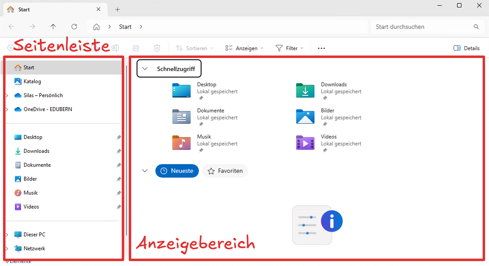

import TabItem from "@theme/TabItem";
import OsTabs from '@tdev-components/OsTabs';
import useBaseUrl from '@docusaurus/useBaseUrl';
import Video from '@tdev-components/Video'

# Dateien verwalten
<OsTabs>
<TabItem value="win">
Der Zugang zum Dateisystem erfolgt über einen sogenannten **Dateiexplorer**. Unter Windows heisst dieser **«Explorer»** und sieht wie folgt aus:


Wenn wir ein neues Explorer-Fenster öffnen, sehen wir folgende Ansicht:



In der **Seitenleiste** werden die wichgisten Ordner auf dem Gerät angezeigt. Dazu gehören:

`OneDrive`
: Markiert durch das blaue Wolkensymbol.
: Oft gibt es zwei davon: eine persönliche und eine Schul-OneDrive.
: Die Schul-OneDrive wird in der Regel als `OneDrive – EDUBERN` angezeigt.
`Desktop`
: Der Inhalte des `Desktop-Ordners sind auch auf dem Desktop sichtbar.
: Je nach Einstellung wird dieser Ordner mit OneDrive (persönlich oder schulisch) synchronisiert.
`Downloads`
: Hier landen Dateien, die man mit dem Browser aus dem Internet herunterlädt.
`Dokumente`
: Heisst aus Sicht des Dateisystems immer `Documents`, auch wenn der Ordner im Explorer als `Dokumente` angezeigt wird.
: Kann z.B. für Word-Dokumente, PDFs, etc. genutzt werden.
: Je nach Einstellung wird dieser Ordner mit OneDrive (persönlich oder schulisch) synchronisiert.
: Falls der `Dokumente`-Ordner **nicht** mit OneDrive synchronisiert wird, sollte man ihn nicht für Schulmaterian und andere wichtige Dateien verwenden, da diese dann nur lokal auf dem Gerät gespeichert sind und nicht in der Cloud gesichert werden.
`Dieser PC`
: Zugang zum Root-Verzeichnis.

Im **Anzeigebereich** wird der Ihnhalt des Ordners angezeigt, den Sie gerade geöffnet haben. Hier wird beispielsweise der Inhalt des Ordners `BYOD_Übung` angezeigt:


In welchem Ordner Sie sich gerade befinden, sehen Sie in der **Pfadleiste**: Sie sind im Ordner `OneDrive` → `OneDrive – EDUBERN` → `Informatik` → `BYOD_Übung`. Sie können auch direkt in einen übergeordneten Ordner wechseln, indem Sie auf den entsprechenden Eintrag in der Pfadleiste klicken. Die einzelnen Einträge werden als  bezeichnet.
</TabItem>
<TabItem value="mac">
Der Zugang zum Dateisystem erfolgt über einen sogenannten **Dateiexplorer**. Unter Windows heisst dieser **«Finder»** und sieht wie folgt aus:


Das Finder-Fenster ist wie folgt gegliedert:


In der **Seitenleiste** werden die wichgisten Ordner auf dem Gerät angezeigt. Dazu gehören:

`OneDrive`
: Markiert durch das blaue Wolkensymbol.
: Oft gibt es zwei davon: eine persönliche und eine Schul-OneDrive.
: Die Schul-OneDrive wird in der Regel als `OneDrive – EDUBERN` angezeigt.
`Schreibtisch`
: Aus Sicht des Computers heisst dieser Ordner immer `Desktop`, auch wenn er im Finder als `Schreibtisch` angezeigt wird.
: Der Inhalte des `Desktop`-Ordners sind auch auf dem Desktop sichtbar.
: Je nach Einstellung wird dieser Ordner mit OneDrive (persönlich oder schulisch) synchronisiert.
`Downloads`
: Hier landen Dateien, die man mit dem Browser aus dem Internet herunterlädt.
`Dokumente`
: Heisst aus Sicht des Dateisystems immer `Documents`, auch wenn der Ordner im Explorer als `Dokumente` angezeigt wird.
: Kann z.B. für Word-Dokumente, PDFs, etc. genutzt werden.
: Je nach Einstellung wird dieser Ordner mit OneDrive (persönlich oder schulisch) synchronisiert.
: Falls der `Dokumente`-Ordner **nicht** mit OneDrive synchronisiert wird, sollte man ihn nicht für Schulmaterian und andere wichtige Dateien verwenden, da diese dann nur lokal auf dem Gerät gespeichert sind und nicht in der Cloud gesichert werden.
`Dieser PC`
: Zugang zum Root-Verzeichnis.

Im **Anzeigebereich** wird der Ihnhalt des Ordners angezeigt, den man gerade geöffnet hat.

In welchem Ordner Sie sich gerade befinden, sehen Sie in der **Pfadleiste**: Sie sind im Ordner `OneDrive – EDUBERN` → `Informatik` → `BYOD_Übung`. Sie können auch direkt in einen übergeordneten Ordner wechseln, indem Sie auf den entsprechenden Eintrag in der Pfadleiste klicken. Die einzelnen Einträge werden als  bezeichnet. **Achtung:** Die Pfadleiste ist im Finder standardmässig ausgeblendet. Sie können sie aber über das Menü «Darstellung» → «Pfadleiste einblenden» aktivieren.
</TabItem>
</OsTabs>

## Navigation im Dateiexplorer
<OsTabs>
    <TabItem value="win">
        In diesem Video lernen Sie, wie Sie im Explorer navigieren:
        - Ordner öffnen
        - Inhalte eines Ordners sortieren
        - Pfad anzeigen
        - mit der Pfadleiste und den sogenannten «Breadcrumbs» (dt.: _«Brotkrümel»_) navigieren
        - Ordner erstellen
        - Ordner und Dateien umbenennen
        - Ordner und Dateien löschen

        ::youtube[https://www.youtube.com/embed/lfe3r43u7kI?si=ThcCXZjsUN7r1bXl]

        ::::aufgabe[Navigation üben]
        <TaskState id="1c9c098e-4467-43a9-9178-863941157e12" />        
        1. Erstellen Sie in Ihrer **Schul-OneDrive** in einem sinnvollen Ordner (z.B. `Informatik`) einen Ordner namens `Übung Navigation Explorer`.
        2. Erstellen Sie ein neues Word-Dokument (der Inhalt ist egal) und speichern Sie es in diesem Ordner unter dem Namen `Demo-Dokument.docx`. **Achtung:** Stellen Sie sicher, dass Sie das Dokument von Anfang an am richtigen Ort speichern, statt es irgendwo zu speichern und dann zu verschieben.
        3. Öffnen Sie den Ordner `Übung Navigation Explorer` im Explorer. Erstellen Sie eine Kopie des Dokuments und nennen Sie sie `Demo-Dokument Backup 1.docx`.
        4. Erstellen Sie in `Übung Navigation Explorer` einen neuen Unterordner namens `Backups`.
        5. Verschieben Sie die Datei `Demo-Dokument Backup 1.docx` in den Ordner `Backups`.
        
        Erstellen Sie nun zwei Screenshots von Ihrem Explorer-Fenster: einmal mit dem Ordner `Übung Navigation Explorer` und einmal mit dem Unterordner `Backups`. **Fügen Sie die Screenshots hier ein:**
        
        <QuillV2 id="fd114f36-c2db-4964-8716-4d9f9defac25" />

        Vergleichen Sie Ihre eigenen Screenshots mit diesen hier und **prüfen** Sie, ob Sie alles richtig gemacht haben. **Wenn nicht**, löschen Sie den Ordner `Übung Navigation Explorer` und **starten** Sie die Übung von vorne.

        :::cards
        
        ::br
        
        :::

        Bestimmen Sie nun den **vollständigen Pfad**…
        1. …des Ordners `Übung Navigation Explorer`.
        2. …der Datei `Demo-Dokument Backup 1.docx`. 
        
        :::info[Pfad kopieren]
        Im Explorer müssen Sie den Pfad nicht selber herausfinden:

        <Video title="Pfad des aktuellen Ordners kopieren" src={useBaseUrl('/img/byod-basics/win11/copy_folder_path.mov')}/>

        <Video title="Pfad einer Datei oder eines Ordners im Anzeigebereich kopieren" src={useBaseUrl('/img/byod-basics/win11/copy_file_path.mov')}/>
        :::

        Halten Sie Ihre Antworten hier fest:

        <String id="3af69cb9-b1fe-46f3-9c30-33bf3d2fcf99" inputWidth="25em" label="Pfad des Ordners" />
        <String id="09a28bcf-fa69-430a-9f39-720ff954b246" inputWidth="25em" label="Pfad der Datei" />

        **Vergleichen** Sie Ihre Angaben mit der Musterlösung, sobald diese freigegeben ist.

        **Löschen** Sie nun den Ordner `Übung Navigation Explorer`, um die Aufgabe abzuschliessen, und markieren Sie diese als erledigt.

        <Solution id="f412c304-127e-44b0-a9e9-f7e316f42dc9">

        

        Auf diesem Computer lautet der Pfad des Ordner `Übung Navigation Explorer`:
        ```
        C:\Users\silas\OneDrive – EDUBERN\Informatik\Übung Navigation Explorer
        ```

        Bei Ihnen wird der Pfad etwas anders aussehen. Darauf sollten Sie aber achten:
        - Der Pfad muss mit `C:\` beginnen.
        - Die Pfad-Segmente müssen durch Backslashes (`\`) getrennt sein.
        - Keine unnötigen Leerzeichen.
        - Irgendwo sollte `OneDrive` (vermutlich `OneDrive – EDUBERN`) stehen.
        - Am Schluss sollte der Ordnername `Übung Navigation Explorer` stehen.

        Der Pfad der Datei `Demo-Dokument Backup 1.docx` lautet auf diesem Computer demnach:
        ```
        C:\Users\silas\OneDrive – EDUBERN\Informatik\Übung Navigation Explorer\Backups\Demo-Dokument Backup 1.docx
        ```

        **Denken Sie daran:** Mit dem Pfad können Sie eine Datei eindeutig identifizieren. Das ist auch beim Programmieren wichtig, wenn Sie z.B. eine Datei laden oder speichern wollen.
        </Solution>
        ::::
    </TabItem>
    <TabItem value="mac">        
        In diesem Video lernen Sie, wie Sie im Finder navigieren:
        - Ordner öffnen
        - Inhalte eines Ordners sortieren
        - Pfad anzeigen
        - mit der Pfadleiste und den sogenannten «Breadcrumbs» (dt.: _«Brotkrümel»_) navigieren
        - Ordner erstellen
        - Ordner und Dateien umbenennen
        - Ordner und Dateien löschen

        ::youtube[https://www.youtube.com/embed/2_s1Pm4jdr4?si=IRP1LF46sukS3IvT]

        ::::aufgabe[Navigation üben]
        <TaskState id="1c9c098e-4467-43a9-9178-863941157e12" />        
        1. Erstellen Sie in Ihrer **Schul-OneDrive** in einem sinnvollen Ordner (z.B. `Informatik`) einen Ordner namens `Übung Navigation Explorer`.
        2. Erstellen Sie ein neues Word-Dokument (der Inhalt ist egal) und speichern Sie es in diesem Ordner unter dem Namen `Demo-Dokument.docx`. **Achtung:** Stellen Sie sicher, dass Sie das Dokument von Anfang an am richtigen Ort speichern, statt es irgendwo zu speichern und dann zu verschieben.
        3. Öffnen Sie den Ordner `Übung Navigation Finder` im Finder. Erstellen Sie eine Kopie des Dokuments und nennen Sie sie `Demo-Dokument Backup 1.docx`.
        4. Erstellen Sie in `Übung Navigation Finder` einen neuen Unterordner namens `Backups`.
        5. Verschieben Sie die Datei `Demo-Dokument Backup 1.docx` in den Ordner `Backups`.
        
        Erstellen Sie nun zwei Screenshots von Ihrem Finder-Fenster: einmal mit dem Ordner `Übung Navigation Finder` und einmal mit dem Unterordner `Backups`. **Fügen Sie die Screenshots hier ein:**
        
        <QuillV2 id="892d1768-aa4a-42f4-b864-c530489e5a11" />

        Vergleichen Sie Ihre eigenen Screenshots mit diesen hier und **prüfen** Sie, ob Sie alles richtig gemacht haben. **Wenn nicht**, löschen Sie den Ordner `Übung Navigation Finder` und **starten** Sie die Übung von vorne.

        :::cards
        
        ::br
        
        :::

        Bestimmen Sie nun den **vollständigen Pfad**…
        1. …des Ordners `Übung Navigation Finder`.
        2. …der Datei `Demo-Dokument Backup 1.docx`. 
        
        :::info[Pfad kopieren]
        Im Finder müssen Sie den Pfad nicht selber herausfinden:

        <Video title="Pfad des aktuellen Ordners kopieren" src={useBaseUrl('/img/byod-basics/osx/copy_folder_path.mov')}>
        1. [[:mdi[cursor-default-click] Rechtsklick]] auf den Ordner in der Pfadleiste
        2. `… als Pfadname kopieren`.
        </Video>
        
        <Video title="Pfad einer Datei oder eines Ordners im Anzeigebereich kopieren" src={useBaseUrl('/img/byod-basics/osx/copy_file_path.mov')}>
        1. [[:mdi[cursor-default-click] Rechtsklick]] auf die Datei oder den Ordner
        2. [[Option]] gedrückt halten
        3. `… als Pfadname kopieren`.
        </Video>
        :::

        Halten Sie Ihre Antworten hier fest:

        <String id="2f71a90c-f62a-491d-80a9-6af1d49292b7" inputWidth="25em" label="Pfad des Ordners" />
        <String id="8e24d1c0-9f91-412d-8085-c0a11d9d7ac8" inputWidth="25em" label="Pfad der Datei" />

        **Vergleichen** Sie Ihre Angaben mit der Musterlösung, sobald diese freigegeben ist.

        **Löschen** Sie nun den Ordner `Übung Navigation Finder`, um die Aufgabe abzuschliessen, und markieren Sie diese als erledigt.

        <Solution id="f412c304-127e-44b0-a9e9-f7e316f42dc9">
        Der Pfad des Ordners könnte ungefähr so aussehen:

        ```
        /Users/silas/Library/CloudStorage/OneDrive-EDUBERN/Informatik/Übung Navigation Finder
        ```

        Bei Ihnen wird der Pfad etwas anders aussehen. Darauf sollten Sie aber achten:
        - Der Pfad muss mit `/Users` beginnen.
        - Die Pfad-Segmente müssen durch Backslashes (`/`) getrennt sein.
        - Keine unnötigen Leerzeichen.
        - Irgendwo sollte `OneDrive` (vermutlich `OneDrive – EDUBERN`) stehen.
        - Am Schluss sollte der Ordnername `Übung Navigation Finder` stehen.

        Ausgehend von der Musterlösung für den Pfad des Ordners lautet der Pfad der Datei `Demo-Dokument Backup 1.docx` demnach:
        ```
        /Users/silas/Library/CloudStorage/OneDrive-EDUBERN/Informatik/Übung Navigation Finder/Backups/Demo-Dokument Backup 1.docx
        ```

        **Denken Sie daran:** Mit dem Pfad können Sie eine Datei eindeutig identifizieren. Das ist auch beim Programmieren wichtig, wenn Sie z.B. eine Datei laden oder speichern wollen.
        </Solution>
        ::::
    </TabItem>
</OsTabs>

## Dateien öffnen und suchen
<OsTabs>
    <TabItem value="win">
        In diesem Video lernen Sie, wie Sie Dateien im Explorer öffnen und finden:
        - Dateien öffnen
        - Dateien suchen
        - Dateinamenerweiterungen: Was sind sie, wozu braucht man sie und wie zeigt man sie an?

        ::youtube[https://www.youtube.com/embed/EmA1QdfzBBc?si=xGN8TGe03tjpq999]
    </TabItem>
    <TabItem value="mac">
        In diesem Video lernen Sie, wie Sie Dateien im Explorer öffnen und finden:
        - Dateien öffnen
        - Dateien suchen
        - Dateinamenerweiterungen: Was sind sie, wozu braucht man sie und wie zeigt man sie an?

        ::youtube[https://www.youtube.com/embed/ncGVRmwAzhA?si=ISG7iHbh9N1VfQOx]
    </TabItem>
</OsTabs>

:::aufgabe[Dateinamenerweiterungen aktivieren]
<TaskState id="c2497d46-56b7-426f-ae56-8e9ad899f770" />
Stellen Sie sicher, dass Sie die **Dateinamenerweiterungen** auf Ihrem Gerät aktiviert haben. Sie wissen, dass sie aktiviert sind, wenn im Explorer/Finder die Dateinamen immer mit einer Endung (z.B. `.docx`, `.jpg`, etc.) angezeigt werden.

Wenn Sie mit einem MacBook arbeiten, sind die Dateinamenerweiterungen bei Ihnen vermutlich bereits aktiviert.
:::

## Dateien wiederherstellen
<OsTabs>
    <TabItem value="win">
        Wenn wir eine Datei _löschen_, wird sie in der Regel nicht sofort endgültig entfernt, sondern landet im **Papierkorb**. Dort kann sie wiederhergestellt werden, solange der Papierkorb nicht geleert wurde.

        So können Sie eine Datei im Explorer löschen (also in den Papierkorb verschieben) und anschliessend wiederherstellen
        <Video src={useBaseUrl('/img/byod-basics/win11/delete_restore.mov')}/>
    </TabItem>
    <TabItem value="mac">
        Wenn wir eine Datei _löschen_, wird sie in der Regel nicht sofort endgültig entfernt, sondern landet im **Papierkorb**. Dort kann sie wiederhergestellt werden, solange der Papierkorb nicht geleert wurde.

        So können Sie eine Datei im Finder löschen (also in den Papierkorb verschieben) und anschliessend wiederherstellen
        <Video src={useBaseUrl('/img/byod-basics/osx/delete_restore.mov')}/>
    </TabItem>
</OsTabs>

---