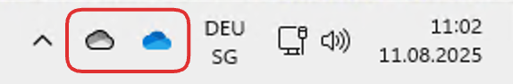
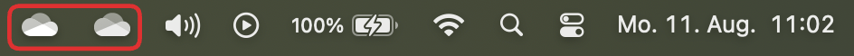
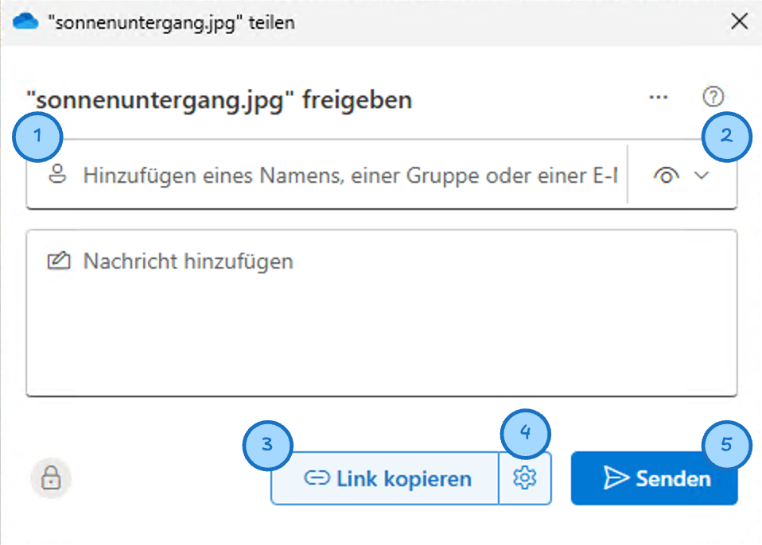
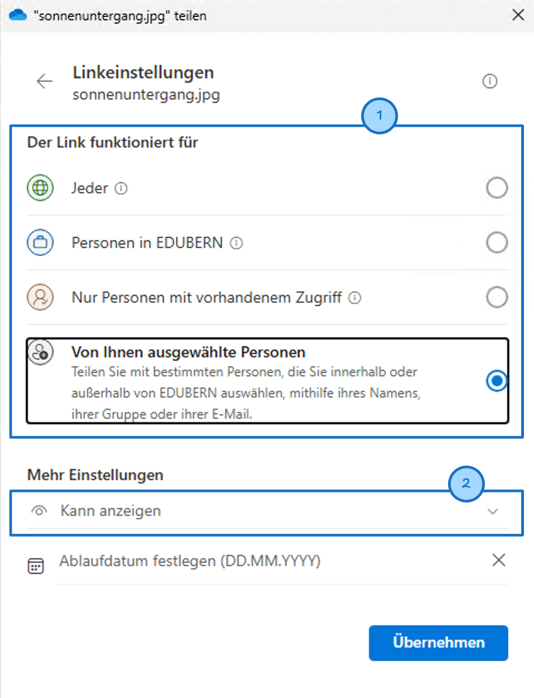

import TabItem from "@theme/TabItem";
import OsTabs from '@tdev-components/OsTabs'
import useBaseUrl from '@docusaurus/useBaseUrl';
import Video from '@tdev-components/Video';
import ProgressState from '@tdev-components/documents/ProgressState';

# Cloud
Ein Cloud-Dienst ist ein Online-Speicher, mit dem man Dateien online speichern und teilen kann. Der Cloud-Dienst, den wir an unserer Schule nutzen, heisst **OneDrive**.

Du solltest alle wichtigen Dateien (insbesondere dein Schulmaterial) immer in OneDrive speichern. Das hat einige Vorteile:
- **Schutz vor Datenverlust**: Wenn dein Gerät kaputt geht oder verloren geht, sind deine Dateien in der Cloud sicher und du kannst jederzeit wieder darauf zugreifen.
- **Zugriff von überall**: Fall du mal ein Ersatzgerät brauchst, kannst du dich einfach bei OneDrive anmelden und hast sofort Zugriff auf deine Dateien.
- **Zusammenarbeit**: Du kannst Dateien mit anderen teilen und gemeinsam daran arbeiten, ohne dass du sie per E-Mail hin- und herschicken musst.
- **Automatisches Speichern**: Die Office-Programme (Word, PowerPoint, Excel) können **automatisch speichern**. Das funktioniert aber nur für Dateien, die **in OneDrive** gespeichert sind.

## Wo liegen meine Dateien?
Wenn du eine Datei so abspeicherst, dass im Pfad irgendwo `OneDrive` (z.B. `OneDrive – EDUBERN`) steht, dann ist die Datei grundsätzlich in OneDrive gespeichert.

Das kannst du kontrollieren, indem du im Dateiexplorer den Ordner öffnest, wo du die Datei abgespeichert hast. Wenn die Datei mit einem dieser Symbole gekennzeichnet ist, dann ist sie in OneDrive gespeichert:

Die Symbole können je nach Betriebssystem auch leicht anders aussehen. Sie zeigen den Zustand der OneDrive-Synchronisation an. Folgende Zustände gibt es:

Nur Online
: :mdi[cloud-arrow-down-outline]{color="blue"} oder :mdi[cloud-outline]{color="blue"} 
: Das Element ist **online verfügbar**.
: Das Element (Datei oder Ordner) befindet sich im Moment **nicht** auf deinem Gerät, sondern nur auf den OneDrive-Servern (vermutlich irgendwo in Europa).
: Wenn du das Element jetzt öffest, wird es automatisch heruntergeladen und auf deinem Gerät gespeichert. Dabei wechselt der Zustand zu «Auf diesem Gerät».
: Wenn du gerade keine Internetverbindung hast (z.B. im Flugzeug oder in einem Tunnel), kannst du dieses Element nicht öffnen.
Auf diesem Gerät
: :mdi[check-circle-outline]{color="var(--ifm-color-success)"} 
: Das Element wird **synchronisiert**.
: Es ist auf deinem Gerät gespeichert und du kannst es jederzeit öffnen, auch ohne Internetverbindung.
: Um Platz zu sparen, entfernt OneDrive aber automatisch Dateien von deinem Gerät, wenn du sie länger nicht benutzt hast. Dann wechselt der Zustand zu «Nur Online».
Immer verfügbar
: :mdi[check-circle]{color="var(--ifm-color-success)"} 
: Das Element wird **immer synchronisiert**.
: Es ist auf deinem Gerät gespeichert und du kannst es jederzeit öffnen, auch ohne Internetverbindung.
: In diesem Zustand bleibt die Datei **immer** auf deinem Gerät, auch wenn du sie länger nicht benutzt hast. Das ist nützlich für Dateien, die du oft brauchst, z.B. deine wichtigsten Schulunterlagen.

So kannst du den Synchronisations-Zustand einer Datei ändern:

<OsTabs>
  <TabItem value="win">
    <Video title="Dateien / Ordner immer synchronisieren"
           src={useBaseUrl('/img/byod-basics/win/onedrive_keep_on_device.mp4')}>
        OneDrive darf das Element nicht mehr von deinem Computer entfernen, auch wenn du sie länger nicht benutzt hast.
    </Video>
    <Video title="Dateien / Ordner nicht mehr immer synchronisieren"
           src={useBaseUrl('/img/byod-basics/win/onedrive_speicher_freigeben.mp4')}>

      `Speicherplatz freigeben` - das Element ist weiterhin auf OneDrive verfügbar, es braucht aber Internet damit du es auf diesem Gerät verwenden kannst.
    </Video>
    <Video title="Dateiversionsverlauf" src={useBaseUrl('/img/byod-basics/win/onedrive_versionhistory.mp4')}>
        Mit dem Dateiversionsverlauf kannst du frühere Versionen einer Datei wiederherstellen, falls du etwas versehentlich gelöscht oder geändert hast.
    </Video>
  </TabItem>
  <TabItem value="mac">
    <Video title="Dateien/Ordner immer synchronisieren"
           src={useBaseUrl('/img/byod-basics/osx/onedrive_keep_on_device.mp4')}>
        OneDrive darf das Element nicht mehr von deinem Computer entfernen, auch wenn du sie länger nicht benutzt hast.
    </Video>
    <Video title="Dateien/Ordner nicht mehr immer synchronisieren"
           src={useBaseUrl('/img/byod-basics/osx/onedrive_speicher_freigeben.mp4')}>
      `Speicherplatz freigeben` - das Element ist weiterhin auf OneDrive verfügbar, es braucht aber Internet damit du es auf diesem Gerät verwenden kannst.
    </Video>
    <Video title="Dateiversionsverlauf" src={useBaseUrl('/img/byod-basics/osx/onedrive_versionhistory.mp4')}>
        Mit dem Dateiversionsverlauf kannst du frühere Versionen einer Datei wiederherstellen, falls du etwas versehentlich gelöscht oder geändert hast.
    </Video>
  </TabItem>
</OsTabs>

## OneDrive Web
OneDrive ist auch als Web-Applikation verfügbar. Die Web-Version der **Schul**-OneDrive findest du unter https://erzbe-my.sharepoint.com.

:::warning[OneDrive Web nur in Ausnahmefällen]
OneDrive Web ist eine nützliche Ergänzung, aber du solltest deine Dateien grundsätzlich immer im **Dateiexplorer** (also nicht in der Web-Version) verwalten.

So kannst du sicher sein, dass alle Programme (z.B. Word, PowerPoint, Excel, Programmier-Umgebungen, etc.) darauf zugreifen können.
:::

:::aufgabe[Schul-OneDrive synchronisieren]
Überprüfe jetzt, ob du deine **Schul**-OneDrive auf deinem Gerät synchronisiert hast. Gehe dazu wie folgt vor:

<ProgressState id="927240df-e2b7-4405-96b5-8d6a4239d3dd" confirm preventTogglingFutureSteps>
1. Öffne ein neues Word-Dokument und speichere es unter dem Namen `OneDrive-Test.docx` in deinem **Schul**-OneDrive-Ordner. Wenn du mehrere OneDrive-Ordner siehst, heisst einer davon vermutlich `OneDrive – EDUBERN`.
2. Öffne deinen Dateiexplorer und navigiere zu `OneDrive-Test.docx`. 
3. Schau dir den Pfad der Datei genau an. Kommt darin `OneDrive` vor? Wenn nicht, dann solltest du nochmal von vorne beginnen.
4. Öffne OneDrive Web (mehr dazu unten) unter https://erzbe-my.sharepoint.com und logge dich mit deinem Schul-Account ein.
5. Klicke links auf `Eigene Dateien` und suche dort nach `OneDrive-Test.docx`.
6. Wenn du die Datei dort siehst und dein Browser oben in der Adresszeile immer noch `https://erzbe-my.sharepoint.com/…` anzeigt, dann hast du deine Schul-OneDrive erfolgreich synchronisiert. Wenn nicht, dann musst du das noch nachholen. Hilfe dazu findest du [hier](https://ict.gbsl.website/byod/onedrive/onedriveeinrichten/).
</ProgressState>
:::

OneDrive Web ist immer dann nützlich, wenn man etwas nicht im Dateiexplorer machen kann. Beispielsweise kann man gelöschte Daten dort während 30 Tagen wiederherstellen, auch wenn man auf dem Laptop bereits den Papierkorb geleert hat:

<Video title="Gelöschte Dateien Wiederherstellen"
        src={useBaseUrl('/img/byod-basics/osx/onedrive_restore_deleted.mp4')}>
    Gelöschte Dateien können **online** während 30 Tagen wiederhergestellt werden. Danach sind sie definitiv gelöscht.
</Video>

:::aufgabe[Datei wiederherstellen]
<TaskState id="a3c50ab9-4b44-4ef3-aeb5-684ee89bd3ad" />
Speichere eine beliebige Datei in deiner **Schul**-OneDrive ab. Finde die Datei anschliessend im Dateiexplorer und lösche sie.

Gehe danach zu OneDrive Web und stelle die Datei dort wieder her (**ohne den Papierkorb auf deinem Laptop zu verwenden**).
:::

## Mehrere OneDrive-Konten
Es ist möglich, dass du auf deinem Gerät mehrere OneDrive-Konten hast. Das kann z.B. sein, wenn du nebst der Schul-OneDrive auch eine private OneDrive hast. Auf Windows-Geräten ist das fast immer der Fall.

:::aufgabe[Schul-OneDrive erkennen]
<TaskState id="37d2a8da-72a2-4443-b932-74043a16ab37" />
Für Schulaufgaben ist es wichtig, dass du immer in der **Schul**-OneDrive arbeitest. Andernfalls ist es in gewissen Fällen nicht möglich, Dateien zu teilen, korrekt abzugeben oder mit Klassenkamerad:innen gemeinsam zu bearbeiten.

Schau dazu im Dateiexplorer nach, ob du mehrere OneDrive-Ordner findest. Wenn ja, dann schau, ob einer davon `OneDrive – EDUBERN` heisst. Das ist deine **Schul**-OneDrive. Wenn nicht, findest du evtl. einen anderen Hinweis darauf, welcher OneDrive-Ordner deine **Schul**-OneDrive ist.

Sobald du eine Vermutung hast, welches dein Schul-OneDrive-Ordner ist (selbst wenn du nur einen hast), speichere eine beliebige Datei in diesem Ordner ab. Gehe anschliessend auf OneDrive Web unter https://erzbe-my.sharepoint.com, logge dich mit deinem Schul-Account ein und prüfe, ob du die Datei dort siehst. Wenn ja, dann hast du deine **Schul**-OneDrive gefunden – und sichergestellt, dass die Synchronisation funktioniert.
:::

::::tip[Wolken-Symbole]
Es lohnt sich, immer mal wieder zu prüfen, ob OneDrive ordentlich funktioniert. Dazu schaust du dir am besten die «Wolken-Symbole» in deiner Taskleiste (Windows) oder in der Menüleiste (macOS) an:

Falls du dort ein Ausrufezeichen oder ein :mdi[close-circle-outline]{color="var(--ifm-color-danger)"} siehst, dann ist etwas nicht in Ordnung. Klicke auf das Symbol und folge den Anweisungen, um das Problem zu beheben.

Du kannst auch auf die Symbole klicken, um zu sehen, welche Daten zuletzt synchronisiert wurden:

So siehst du, ob deine Dateien aktuell sind und ob die Synchronisation funktioniert – und, ob du wirklich in der **Schul**-OneDrive arbeitest.
::::

## Dateien freigeben
Um in OneDrive eine Datei oder einen Ordner freizugeben, muss ein **Freigabelink** erstellt werden.

<OsTabs>
  <TabItem value="win">
    <Video title="Freigabefenster öffnen" src={useBaseUrl('/img/byod-basics/win11/onedrive_open_share_panel.mov')}>
        Um einen **Freigabelink** zu erstellen, wird zuerst das Freigabefenster geöffnet.
    </Video>
  </TabItem>
  <TabItem value="mac">
    <Video title="Freigabefenster öffnen" src={useBaseUrl('/img/byod-basics/osx/onedrive_open_share_panel.mov')}>
        Um einen **Freigabelink** zu erstellen, wird zuerst das Freigabefenster geöffnet.
    </Video>
  </TabItem>
</OsTabs>

Das Freigabefenster ist wie folgt aufgebaut:

    

        
    

    

        1
        : **Empfängerliste**
        : Soll der Freigabelink nur für bestimmte Personen funktionieren, können diese Personen hier eigetragen werden.
        2
        : **Berechtigungen**
        : Hier kann festgelegt werden, ob die Empfänger die Datei **nur anzeigen** oder auch **bearbeiten** dürfen
        3
        : **Link kopieren**
        : Mit diesem Button wird der Freigabelink in die Zwischenablage kopiert. Der kopiere Link kann dann z.B. via Teams versendet oder irgendwo anders eingefügt werden.
        4 
        : **Link-Einstellungen**
        : Öffnet die Link-Einstellungen.
        : Mehr dazu weiter unten.
        5 
        : **Link per E-Mail senden**
        : Der Freigabelink wird direkt per E-Mail an alle Personen gesendet, die in der _Empfängerliste_ (vgl. Punkt __1__) eingetragen sind.
    

In den Link-Einstellungen (oben Punkt __4__) gibt es folgende Optionen:

    

        
    

    

        1
        : **Empfängergruppe**
        : Hier kann eingestellt werden, ob der Link nur für **ausgewählte Personen** (vgl. Punkt __1__ oben), für **alle Personen in EDUBERN** (also mit einem Schulkonto), oder **jeden** funktionieren soll.
        2
        : **Berechtigungen**
        : Hier kann festgelegt werden, ob die Empfänger die Datei **nur anzeigen** oder auch **bearbeiten** dürfen
    

:::insight[Datei oder Ordner freigeben?]
Oft reicht es, nur eine einzelne Datei freizugeben. Bei Gruppenprojekten oder bei gewissen Abgaben ist es aber sinnvoll, gleich einen ganzen Ordner freizigeben. Das hat folgende Vorteile:
- Bei einer Gruppenarbeit könnt ihr einen Gruppenordner erstellen, in dem alle Gruppenmitglieder ihre Dateien ablegen können.
- Bei Abgaben, die mehrere Dateien enthalten, musst du nur einen Link erstellen und abgeben, und die Lehrperson muss nur eine Datei herunterladen.
:::

:::aufgabe[Abgabe-Link erstellen]
<TaskState id="7f6a5404-b588-4411-885f-074e9942ef5b" />
In Classrooms laufen Abgaben häufig so ab:
1. Du speicherst deine Arbeit in der **Schul-OneDrive**.
2. Du erstellst einen **Freigabelink** für die Datei oder den Ordner (**achte jeweils genau auf die Aneisungen**).
3. Du **kopierst** den Link, **ohne ihn per Mail zu versenden** (vgl. Punkt __5__ in der ersten Grafik).
4. Du fügst den Link in ein entsprechendes Textfeld in Classrooms ein oder gibst ihn via Teams oder Microsoft Forms ab.

Das wollen wir jetzt üben. **Such dir dazu als erstes ein:e Partner:in**, damit ihr die Aufgabe zu zweit erledigen könnt.

Geht anschliessend beide wie folgt vor:
1. Speichert eine beliebige Datei auf eurer **Schul**-OneDrive.
2. Erstellt einen **Freigabelink** für diese Datei, mit folgenden Einstellungen:
   - Sichtbarkeit (also _Empfängergruppe_): `Personen in EDUBERN`
   - Berechtigungen: `Nur anzeigen`
3. **Kopiert** den Link, **ohne ihn per E-Mail zu versenden**.
4. Sendet einander den kopierten Link via Teams.

Prüft euch danach gegenseitig:
- ✅ Habt ihr beide einen Link erhalten?
- ✅ Könnt ihr beide die Datei der anderen Person öffnen?
- ✅ Habt ihr beide **kein** E-Mail erhalten?

Falls ihr einen dieser Punkte nicht erfüllen konntet, dann wiederholt diese Aufgabe, bis es klappt.

Die nächste Aufgabe könnt ihr auch gleich zusammen erledigen.
:::

:::aufgabe[Gruppenordner einrichten]
<TaskState id="48175458-ef80-4387-ae1f-a017f8ffeced" />
Bei Gruppenarbeiten ist es sinnvoll, einen gemeinsamen Ordner zu erstellen, in dem alle Gruppenmitglieder ihre Dateien ablegen können.

Erledigt diese Aufgabe wieder zuzweit.

Person A macht folgendes:
1. Erstelle in der Schul-OneDrive einen neuen Ordner namens `BYOD Übung Gruppenarbeit`.
2. Erstelle einen Freigabelink für diesen Ordner:
   - Gib dein:e Partner:in als Empfänger:in an.
   - Sichtbarkeit (also _Empfängergruppe_): ausgewählte Personen
   - Berechtigungen: kann bearbeiten
3. Versende den Freigabelink direkt aus dem Freigabefenster via E-Mail

Sobald Person B den Freigabelink per E-Mail erhalten hat, macht sie folgendes:
1. Klicke auf den Link in der E-Mail. Es öffnet sich OneDrive Web.
2. Klicke oben (oder im Menü) die Option __Zu meinem OneDrive hinzufügen__.
3. Öffne den Schul-OneDrive-Ordner in deinem Dateiexplorer und prüfe, ob der geteilte Ordner dort erscheint.
4. Kopiere eine beliebige Datei in diesen Ordner. Gib Person A Bescheid, wenn du fertig bist.

Sobald die andere Person A die von Person B abgelegte Datei sieht, könnt ihr beide die Aufgabe als erledigt markieren.
:::

<OsTabs>
    <TabItem value="win">
        <Video title="Zugriff verwalten, Freigabe aufbehen"
            src={useBaseUrl('/img/byod-basics/win11/onedrive_stop_sharing.mov')}>
            Wenn du eine Datei nicht mehr teilen möchtest, kannst du die Freigabe aufheben. Dort kannst du auch einzelne Empfänger:innen entfernen, wenn du die Datei nur für bestimmte Personen freigegeben hast.
        </Video>
    </TabItem>
    <TabItem value="mac">
        <Video title="Zugriff verwalten, Freigabe aufbehen"
            src={useBaseUrl('/img/byod-basics/osx/onedrive_stop_sharing.mov')}>
            Wenn du eine Datei nicht mehr teilen möchtest, kannst du die Freigabe aufheben. Dort kannst du auch einzelne Empfänger:innen entfernen, wenn du die Datei nur für bestimmte Personen freigegeben hast.
        </Video>
    </TabItem>
</OsTabs>

## OneDrive als Backup?
OneDrive ist ein Cloud-Dienst, der dir hilft, deine Dateien online zu speichern und zu teilen. Wenn dein Computer defekt ist oder du ihn verlierst, sind deine Dateien immer noch in OneDrive verfügbar. Es ist jedoch wichtig zu verstehen, dass OneDrive **kein vollständiges Backup** deiner Daten ist. Hier sind einige Gründe, warum OneDrive nicht als vollständiges Backup betrachtet werden sollte:
- **Dateien können gelöscht werden**: Wenn du eine Datei in OneDrive löschst, wird sie in den Papierkorb verschoben und kann dort für 30 Tage wiederhergestellt werden. Nach dieser Zeit wird sie endgültig gelöscht. Das bedeutet, dass du versehentlich gelöschte Dateien nicht für immer sichern kannst.
- **Dateien können überschrieben werden**: Wenn du eine Datei in OneDrive bearbeitest und speicherst, wird die vorherige Version der Datei überschrieben. Das kann entweder absichtlich, unabslichtlich oder sogar durch ein bösartiges Programm («Virus») geschehen. OneDrive bietet zwar eine Versionsverwaltung, aber es ist nicht so umfassend wie bei einem echten Backup-System. Die Wiederherstellung von älteren Versionen ist zudem aufwändig.
- **Abhängigkeit von einem Account**: Wenn du die Schule verlässt oder dein OneDrive-Konto aus anderen Gründen nicht mehr zugänglich ist (z.B. gehackt wird), verlierst du den Zugriff auf deine Dateien. Das bedeutet, dass du nicht auf deine Daten zugreifen kannst, wenn du sie nur in OneDrive gespeichert hast. Beachte dabei auch, dass OneDrive Dateien von deinem Computer entfernt, wenn du sie länger nicht benutzt hast. Diese sind dann nur noch online verfügbar.

Es ist also empfehlenswert, nebst der Nutzung von OneDrive auch noch andere Backup-Methoden zu verwenden. Speichere beispielsweise 1x pro Monat all deine wichtigsten Dateien und Schulsachen auf einer externen Festplatte. 

---
