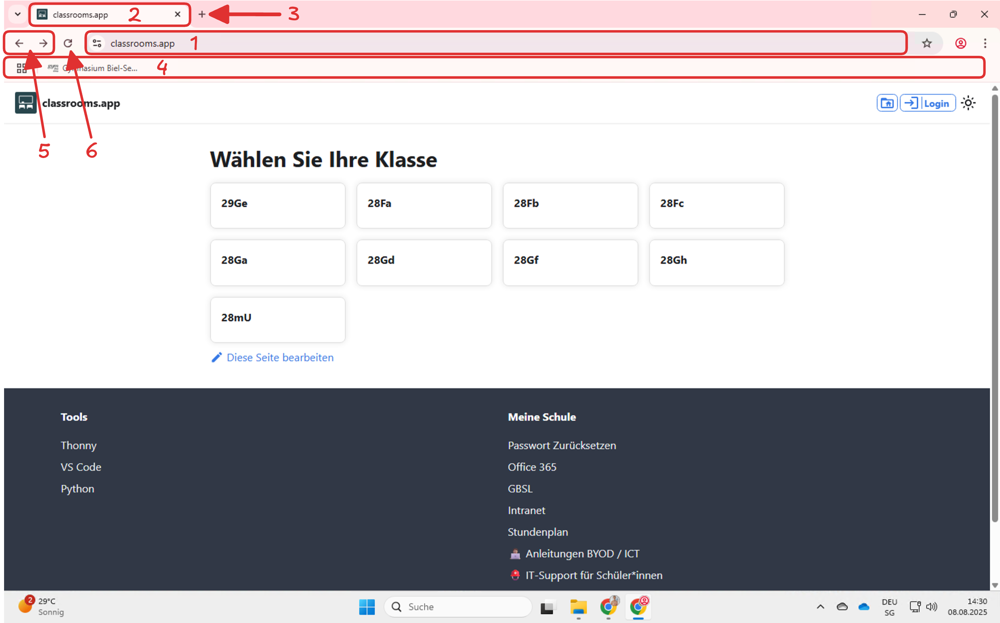

import TabItem from "@theme/TabItem";
import OsTabs from '@tdev-components/OsTabs'
import useBaseUrl from '@docusaurus/useBaseUrl';
import Video from '@tdev-components/Video';
import Tabs from '@theme/Tabs';

# Modul 3: Web
:::info[Lernziele]
1. Sie können erklären, was ein Browser ist und wozu man ihn braucht.
2. Sie können mindestens drei verschiedene Browser aufzählen.
3. Sie können Webseiten in verschiedenen Tabs öffnen, Tabs wieder schliessen und eine Seite neu laden.
4. Sie können eine Webseite öffnen, ohne dabei eine Suchmaschine zu verwenden.
5. Sie können erklären, wozu man Bookmarks braucht. Sie können in Ihrem Browser ein Bookmark erstellen und bearbeiten und können Webseiten über Bookmarks öffnen. Sie haben für Ihre Classrooms-Klassen-Startseite ein Bookmark erstellt.
6. Sie können erklären, was eine Suchmaschine ist und können mindestens drei verschiedene Suchmaschinen aufzählen. Dabei können Sie auch den Unterschied zwischen «Google» als Suchmaschine und «Google Chrome» als Browser erklären.
8. Sie können erklären, weshalb die Browser-Version von OneDrive nicht das gleiche ist wie die OneDrive-Integration in Ihrem Dateisystem.
8. Sie können ein Programm von einer Webseite herunterladen, installieren, starten und wieder deinstallieren.
:::

## Browser
Ein Browser ist ein Programm, mit dem Sie Webseiten aufrufen können. Es gibt verschiedene Browser, die sich besonders hinsichtlich Privatsphäre unterscheiden (wobei es im Alltag auch weitere Unterschiede geben kann). Zu den bekanntesten Browsern gehören:
- **Microsoft Edge**: Der Standardbrowser von Windows.
- **Apple Safari**: Der Standardbrowser für Apple-Geräte.
- **Google Chrome**: Ein weit verbreiteter Browser, der von Google entwickelt wurde. Bei diesem Browser gibt es Bedenken bezüglich des Datenschutzes, da Google viele Daten über die Nutzer sammelt.
- **Mozilla Firefox**: Ein Open-Source-Browser, der deutlich besseren Datenschutz bietet als Google Chrome, jedoch unter Umständen etwas langsamer ist.
- **Brave**: Ein datenschutzorientierter Browser, der Werbung blockiert und Nutzerdaten schützt.

:::tip[Mindestens zwei Browser installieren]
Nebst Ihrem Standardbrowser (Edge oder Safari) sollten Sie mindestens einen weiteren Browser installieren, z.B. Chrome, Firefox oder Brave. Das ist besonders nützlich, wenn in einem Browser mal etwas nicht funktioniert.
:::

Die verschiedenen Browser sehen alle etwas unterschiedlich aus. Einige Funktionen sind aber bei allen Browsern mehr oder weniger gleich. Diese Elemente sollten Sie kennen:
1
: **Adressleiste**
: Hier geben Sie Suchanfragen und URLs (_Web-Adressen_).
: Mehr dazu erfahren Sie weiter unten.
2
: **Browser-Tab**
: Sie können mehrere Webseiten gleichzeitig geöffnet haben, indem Sie für jede Webseite einen eigenen Tab öffnen. Tabs können Sie auch schliessen, wenn Sie sie nicht mehr benötigen.
3 
: **Neuer Tab**
: Mit diesem Symbol können Sie einen neuen Tab öffnen, um eine weitere Webseite zu laden.
4
: **Favoritenleiste**
: Hier können für regelmässig benötigte Webseiten (z.B. ihre Classrooms-Klassen-Startseite) [Bookmarks](#bookmarks) anlegen, um sie schnell zu erreichen.
5
: **Navigation**
: Zurück und vorwärts.
6
: **Seite neu laden**
: Wenn eine Webseite nicht richtig funktioniert oder Sie Änderungen erwarten, können Sie die Seite mit diesem Symbol neu laden.

### Webseiten öffnen
Es gibt mehrere Möglichkeiten, um eine Webseite zu öffnen:
1. Die URL (Web-Adresse) direkt in die Adressleiste des Browsers eingeben
2. nur den Namen der Webseite in die Adressleiste eingeben, um mit einer [Suchmaschine](#suchmaschinen) danach zu suchen
3. auf einen Link klicken (z.B. https://gbsl.ch)
4. über ein [Bookmark](#bookmarks)

Wenn Sie die sogenannte **URL** (also die _Web-Adresse_) einer Webseite nicht kennen, dann geben Sie in der Suchleiste Ihres Browsers den Namen der Webseite ein, z.B. __gbsl__, wenn Sie die GBSL-Seite öffnen wollen. Wenn Sie dann [[Enter]] drücken, wird mit Ihrer Standard-Suchmaschine (in der Regel Google oder Bing) nach dieser Webseite gesucht. **Der Nachteil:** Sie müssen in den Suchergebnissen dann die **richtige** Webseite auswählen, was lange dauern kann, und in jedem Fall mindestens einen Extra-Klick in Anspruch nimmt.

Wenn Sie stattdessen wissen, dass z.B. die GBSL-Webseite unter der URL `gbsl.ch` erreichbar ist (das `.ch` am Ende ist die sogenannte Domain-Endung, damit erkennt es der Browser als eine «vollständige»[^1] URL), dann können Sie diese URL direkt in die Adressleiste eingeben. Das ist schneller und einfacher, weil Sie dann direkt auf der GBSL-Seite landen, ohne erst eine Suchmaschine zu verwenden.

Hier der Vergleich für `classrooms.app`:
<Video title='Suchen vs. URL verwenden' src={useBaseUrl('/img/docs/material/BYOD-Basics-2025/05-Web/search_vs_direct_url.mov')} />

:::tip[Besser die URL eigeben]
Von vielen Webseiten wissen Sie die URL vermutlich auswendig: classrooms.app, gbsl.ch, youtube.com, instagram.com, etc. Geben Sie diese URLs immer gleich direkt in die Adressleiste ein. Das spart Zeit und Klicks.
:::

:::warning[Auto-Vervollständigung]
Beim Tippen in der Adressleiste vervollständigt der Browser die Eingabe oft automatisch zu einer URL oder einer Suchanfrage. Dass kann praktisch sein, aber es kann einem auch in die Quere kommen. Bevor Sie [[Enter]] drücken, achten Sie deshalb immer darauf, was der Browser vervollständigt. Die meisten Browser zeigen auch mit einem Symbol an, ob Sie beispielsweise mit Google danach suchen wollen.

Wenn Sie mit dem Vorschlag nicht einverstanden sind, können Sie ihn in der Regel mit der [[Backspace]]-Taste löschen und dann Ihre eigene Eingabe abschliessen.
:::

:::aufgabe[Ausprobieren]
<TaskState id="1af67430-e959-487c-aaef-f16a53e8444e" />
Probieren Sie die verschiedenen Möglichkeiten aus, um eine Webseite zu öffnen. Arbeiten Sie mit den folgenden Webseiten. Öffnen Sie sie mal via Such-Anfrage (sofern Sie sie finden), dann direkt via URL, dann wieder via Such-Anfrage, etc. So erhalten Sie auch ein Gefühl dafür, wie Ihr Browser Ihnen zu helfen versucht.

- `gbsl.ch`
- `classrooms.app` (die Domain-Endung ist hier `.app`)
- `ict.gbsl.website` (die Domain-Endung ist hier `.website`)
:::

### Suchmaschinen
Suchmaschinen sind Webseiten, mit denen wir nach anderen Webseiten suchen können. Es gibt viele verschiedene Suchmaschinen, die sich in der Qualität ihrer Ergebnisse unterscheiden können. Unterschiede gibt es auch hinsichtlich der Privatsphäre, da viele Suchmaschinen Daten über die Nutzer:innen sammeln.

Bekannte Suchmaschinen sind:

**[Google](google.com)**
: Die wohl bekannteste Suchmaschine, die allerdings auch viele Daten über die Nutzer:innen sammelt.
**[Bing](bing.com)**
: Die Suchmaschine von Microsoft. Im Edge-Browser ist sie als Standard-Suchmaschine voreingestellt. Wenn man in der Adressleiste von Edge eine Suchanfrage eingibt, wird diese also standardmässig mit Bing ausgeführt. Auch Bing sammelt Daten über die Nutzer:innen.
**[DuckDuckGo](duckduckgo.com)**
: Eine datenschutzorientierte Suchmaschine, die (nach eigenen Angaben) keine Nutzerdaten sammelt.
**[Ecosia](ecosia.org)**
: Eine umweltfreundliche Suchmaschine, die Bäume pflanzt, wenn Nutzer:innen Suchanfragen durchführen. Sie sammelt (nach eigenen Angaben) ebenfalls keine persönlichen Daten.

:::warning[Google Chrome ≠ Google-Suche]
Mit «Google» meint man meistens entweder das Unternehmen _Google LLC_ oder – in der Regel – die **Google-Suchmaschine**. Das ist aber **nicht dasselbe** wie der (von _Google LLC_ entwickelte) Browser **«Google Chrome»**.

Man kann mit Google Chrome auch andere Suchmaschinen verwenden, und man kann umgekehrt auch mit anderen Browsern die Google-Suchmaschine verwenden. Es ist wichtig, diese Begriffe voneinander zu trennen.
:::

:::info[Standard-Suchmaschine ändern]
In den Einstellungen Ihres Browsers können Sie die Standard-Suchmaschine ändern. Wenn Sie also lieber DuckDuckGo oder Ecosia verwenden möchten, können Sie das dort einstellen.

Suchen Sie dazu in der Adresszeile nach «Standard-Suchmaschine ändern [Ihr Browser]», also z.B. «Standard-Suchmaschine ändern Google Chrome». Dann finden Sie die entsprechenden Anleitungen.
:::

### Bookmarks
Bookmarks (auch _Lesezeichen_ oder _Favoriten_) sind eine Möglichkeit, um Webseiten zu speichern, die Sie später wieder besuchen möchten. Sie können Bookmarks in Ihrem Browser erstellen und verwalten. Damit können Sie schnell auf oft verwendete Webseiten zugreifen, ohne die Adresse (URL) jedes Mal neu eingeben zu müssen oder die Seite mit Google (oder einer anderen Suchmaschine) zu suchen.

<Video title='Bookmarks in Microsoft Edge' src={useBaseUrl('/img/docs/material/BYOD-Basics-2025/05-Web/bookmarks_edge.mov')} />
<Video title='Bookmarks in Safari' src={useBaseUrl('/img/docs/material/BYOD-Basics-2025/05-Web/bookmarks_safari.mov')} />
<Video title='Bookmarks in Google Chrome' src={useBaseUrl('/img/docs/material/BYOD-Basics-2025/05-Web/bookmarks_chrome.mov')} />
<Video title='Bookmarks in Mozilla Firefox' src={useBaseUrl('/img/docs/material/BYOD-Basics-2025/05-Web/bookmarks_firefox.mov')} />

:::aufgabe[Bookmark für classrooms.app erstellen]
<TaskState id="d4ba3ffe-13af-468f-8601-630305c2ee1b" />
1. Öffnen Sie mit Ihrem Browser (in einem neuen Tab) Ihre Classrooms-Klassen-Startseite (dort, wo Sie den Terminplan sehen).
2. Erstellen Sie ein Bookmark für diese Seite, damit Sie sie jeweils zum Unterrichtsbeginn schnell öffnen können.
3. Öffnen Sie einen neuen Tab und überprüfen Sie, ob das Bookmark funktioniert. Klicken Sie dazu auf das Bookmark und prüfen Sie, ob Sie die Seite mit dem Terminplan Ihrer Klasse sehen.
:::

### Browser-Zugriff auf das Dateiesystem
Browser vermitteln zwischen Ihrem Computer und den Webseiten, die Sie öffnen möchten. Ein Ziel von Browsern ist es auch, Sie vor bösartigen Webseiten zu schützen. Deshalb haben Webseiten grundsätzlich keinen oder nur eingeschränkten Zugriff auf das Dateisystem Ihres Computers.

Das bedeutet aber auch, dass die Programme auf Ihrem Computer nicht direkt auf die Dateien in Ihrer OneDrive zugreifen können, wenn Sie lediglich die [OneDrive-Web-Applikation verwenden](Dateimanagement/Cloud#onedrive-web). Das gilt insbesondere für Programme, die **nicht** zum Microsoft Office Paket (Word, PowerPoint, Excel, etc.) gehören. Deshalb ist es zwingend nötig, dass Sie Ihre Schul-OneDrive auf Ihrem Computer synchronisieren.

## Programm aus dem Web installieren
Auf Mobilgeräten installiert man Apps über den App Store (iOS) oder den Play Store (Android). Solche Stores stehen zwar auch auf vollständigen Betriebssystemen zur Verfügung (App Store für macOS, Microsoft Store für Windows), aber darin sind verältnismässig wenige Programme verfügbar. Auf einem Laptop installiert man deshalb die meisten Programme nicht aus einem Store, sondern direkt von der Webseite des Herstellers.

:::danger[Vorsicht vor Viren]
Die Apps und Programme in den Stores werden in der Regel auf Viren geprüft. Programme, die Sie direkt von einer Webseite herunterladen, können dagegen Viren enthalten. Achten Sie deshalb darauf, dass Sie Programme nur von vertrauenswürdigen Webseiten herunterladen und installieren! Idealerweise erhalten Sie von einer vertrauenswürdigen Person (z.B. der Lehrperson) den Link zur entsprechenden Webseite.
:::

Im Gegensatz zum Installieren einer App oder eines Programms aus einem Store verläuft die Installation eines Programms von einer Webseite nicht immer genau gleich. Sie folgt aber grundsätzlich diesem Ablauf:

<OsTabs>
    <TabItem value="win">
        1. **Webseite des Herstellers aufrufen**: Öffnen Sie die Webseite des Herstellers des Programms, das Sie installieren möchten. Prüfen Sie, ob Sie wirklich auf der offiziellen Webseite sind.
        2. **Dowload-Link finden**: Suchen Sie auf der Webseite nach dem Download-Link für das Programm. Achten Sie darauf, dass Sie die Windows-Version auswählen.
        3. **Installationsdatei herunterladen**: Klicken Sie auf den Download-Link, um die Installationsdatei herunterzuladen. Diese Datei hat in der Regel die Endung `.exe`.
        4. **Installationsdatei ausführen**: Öffnen Sie den `Downloads`-Ordner und machen Sie einen Doppelklick auf die heruntergeladene Installationsdatei.
        5. **Installationsprogramm ausführen**: Es öffnet sich ein Installationsprogramm. Folgen Sie dessen Anweidungen, um das Programm zu installieren.
        6. **Installationsdatei löschen**: Die Installationsdatei wird nur einmal benötigt. Wenn Sie sie jetzt nochmal ausführen, wird nicht das eigentliche Programm gestartet, sondern es wird einfach nochmal das Installationsprogramm geöffnet. Deshalb können Sie die Installationsdatei aus den `Downloads`-Ordner löschen, wenn Sie das Programm einmal installiert haben.
        7. **Installation prüfen**: Suchen Sie in der globalen Suche nach dem Programm und starten Sie es, um zu überprüfen, ob die Installation erfolgreich war.
    </TabItem>
    <TabItem value="mac">
        1. **Webseite des Herstellers aufrufen**: Öffnen Sie die Webseite des Herstellers des Programms, das Sie installieren möchten. Prüfen Sie, ob Sie wirklich auf der offiziellen Webseite sind.
        2. **Dowload-Link finden**: Suchen Sie auf der Webseite nach dem Download-Link für das Programm. Achten Sie darauf, dass Sie die macOS-Version auswählen.
        3. **Installationsdatei herunterladen**: Klicken Sie auf den Download-Link, um die Installationsdatei herunterzuladen. Diese Datei hat in der Regel die Endung `.dmg`, `.pkg` oder `.app`.
        4. **Installationsdatei anschauen**: Öffnen Sie den `Downloads`-Ordner und schauen Sie sich die Dateinamenerweiterung Installationsdatei an: Normalerweise ist es entweder `.dmg` oder `.pkg` oder `.app`. Wählen Sie hier den Tab mit der entsprechenden Anleitung aus.

        <Tabs>
            <TabItem value="dmg" label=".dmg">
                1. **Installationsdatei ausführen**: Öffnen Sie die Installationsdatei mit einem Doppelklick.
                2. **Installationsprogramm ausführen**: Es öffnet sich ein Installationsfenster. Darin müssen Sie lediglich das Programm in den `Programme`-Ordner ziehen, um es zu installieren. Das Installationsfenster können Sie danach wieder schliessen.
                3. **Installationsprogramm auswerfen**: Das Installationsprogramm sollte im Finder auf der rechten Seite wie ein USB-Stick angezeigt werden. Klicken Sie auf das :mdi[eject-circle-outline]-Symbol um das Programm auszuwerfen.
                4. **Installationsdatei löschen**: Die Installationsdatei wird nur einmal benötigt. Wenn Sie sie jetzt nochmal ausführen, wird nicht das eigentliche Programm gestartet, sondern es wird einfach nochmal das 
            </TabItem>
            <TabItem value="pkg" label=".pkg">
                1. **Installationsdatei ausführen**: Öffnen Sie die Installationsdatei mit einem Doppelklick.
                2. **Installationsprogramm ausführen**: Es öffnet sich ein Installationsprogramm. Folgen Sie dessen Anweisungen.
                3. **Installationsprogramm auswerfen**: Das Installationsprogramm sollte im Finder auf der rechten Seite wie ein USB-Stick angezeigt werden. Klicken Sie auf das :mdi[eject-circle-outline]-Symbol um das Programm auszuwerfen.
                4. **Installationsdatei löschen**: Die Installationsdatei wird nur einmal benötigt. Wenn Sie sie jetzt nochmal ausführen, wird nicht das eigentliche Programm gestartet, sondern es wird einfach nochmal das 
            </TabItem>
            <TabItem value="app" label=".app">
                Verschieben Sie die heruntergeladene Datei in den `Programme`-Ordner. Das ist alles, was Sie tun müssen, um das Programm zu installieren.
            </TabItem>
        </Tabs>

        **Abschluss:** Suchen Sie in der Spotlight-Suche nach dem Programm und starten Sie es, um zu überprüfen, ob die Installation erfolgreich war.
    </TabItem>
</OsTabs>

### Programme deinstallieren
<OsTabs>
    <TabItem value="win">
        1. Über die globale Suche nach `Einstellungen` suchen und diese öffnen
        2. Dort zu `Apps` → `Installierte Apps` navigieren
        3. Das entsprechende Programm suchen
        4. Rechts auf die drei Punkte (:mdi[dots-horizontal]) klicken und `Deinstallieren` auswählen
        5. Allfällige Abfragen bestätigen
    </TabItem>
    <TabItem value="mac">
        1. Den `Programme`-Ordner öffnen
        2. Das entsprechende Programm suchen
        3. Das Programm in den Papierkorb ziehen (allfällige Abfragen bestätigen)
    </TabItem>
</OsTabs>

[^1]: Aus technischer Sicht bräuchte es für eine vollständige URL noch mehr Angaben, z.B. das `https://`. Mit einer Domain-Endung wie `.ch` oder `.com` am Ende erkennt der Browser es aber in der Regel auch so als vollständige URL an. Wenn Sie also nur `gbsl.ch` eingeben, dann wird der Browser das automatisch zu `https://gbsl.ch` erweitern.