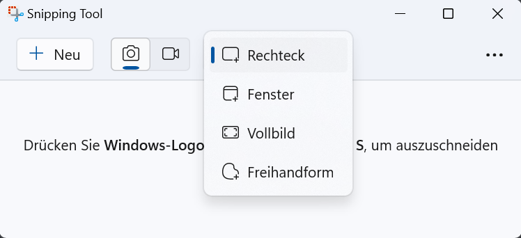

import TabItem from "@theme/TabItem";
import OsTabs from '@tdev-components/OsTabs'
import useBaseUrl from '@docusaurus/useBaseUrl';
import Video from '@tdev-components/Video';

# Modul 5: Multimedia
:::info[Lernziele]
1. Sie können einen Screenshot erstellen und diesen auf Ihrem Gerät wiederfinden.
2. Sie können einem Bild Beschriftung (Computertext), Handschrift und Symbole (z.B. Pfeile) hinzufügen.
3. Sie können einen Screencast (Bildschirmaufnahme mit oder ohne Ton) aufnehmen und diesen auf Ihrem Gerät wiederfinden.
4. Sie können ein Video kürzen.
:::

## Screenshot erstellen
<OsTabs>
  <TabItem value="win">
    

    1. Unter dem Startmenü nach `Snipping Tool` suchen.
    2. Es gibt drei Optionen um eine Bildschirmaufnahme zu erfassen:
    1. den ganzen Bildschirm
    2. ein einzelnes Fenster
    3. ein selbst gewählter Ausschnitt
    4. Freihandform

    
  </TabItem>
  <TabItem value="mac">
    

    1. In Spotlight nach `Bildschirmfoto` (französisch: `captures`) suchen
    2. Es gibt unterschiedliche Optionen um eine Bildschirmaufnahme zu erfassen:

    
  </TabItem>
</OsTabs>

### Screencast erstellen

<OsTabs>
  <TabItem value="win">
    Mit dem Snipping Tool kann man auch Screencasts erstellen.

    TODO: Neues Video, ganzer Bildschirm, Ton, speichern.

    <Video src={useBaseUrl('/img/byod-basics/win11/create-screencast.mp4')}/>
  </TabItem>
  <TabItem value="mac">
    Mit dem Programm `Bildschirmfoto` lassen sich auch Screencasts (Videoaufnahmen des Bildschirms) aufnehmen.

    TODO: Video erstellen, ganzer Bildschirm, Ton, speichern.

    
  </TabItem>
</OsTabs>

### Foto zuschneiden, drehen und bearbeiten
Bekanntlich sagt ein Foto mehr als 1000 Worte - allerdings sollte sich das Foto auf das Wesentliche beziehen... Deshalb ist es wichtig, dass Sie ein Foto (oder einen Screenshot) für die Verwendung in einem Bericht oder in einer Nachricht
bearbeiten können.

<OsTabs>
  <TabItem value="win">
    <Video
      title="Zeichnung hinzufügen"
      src={useBaseUrl('/img/byod-basics/win11/image-edit.mp4')}
    >
      1. Foto doppelklicken (öffnen in "Fotos")
      2. __Bearbeiten__ > __Zeichnen__
    </Video>
    <Video title="Zuschneiden/Drehen" src={useBaseUrl('/img/byod-basics/win11/image-crop-rotate.mp4')}/>
  </TabItem>
  <TabItem value="mac">
    <Video title="Foto zuschneiden, drehen und bearbeiten" src={useBaseUrl('/img/byod-basics/osx/edit_picture.mp4')}/>
  </TabItem>
</OsTabs>

### Text zu Bildern hinzufügen

<OsTabs>
  <TabItem value="win11">
    <Video
      title="Text hinzufügen"
      src={useBaseUrl('/img/byod-basics/win11/image-text.mp4')}
    />
  </TabItem>
  <TabItem value="win10">
    <Video
      title="Text hinzufügen"
      src={useBaseUrl('/img/byod-basics/win11/image-text.mp4')}
    />
  </TabItem>
  <TabItem value="mac">
    <Video
      title="Text hinzufügen"
      src={useBaseUrl('/img/byod-basics/osx/image-text.mp4')}
    />
  </TabItem>
</OsTabs>

## Video zuschneiden

<OsTabs>
  <TabItem value="win11">

    

      
Falls das Video nicht automatisch in _"Fotos"_ geöffnet wird...

      

        Wir das Video nicht automatisch mit der App _"Fotos"_ (_"Windows-Fotoanzeige"_) geöffnet, gehen Sie wie folgt vor:
        

        
      

    

    <Video title="Video zuschneiden" src={useBaseUrl('/img/byod-basics/win11/video-cut.mp4')}>
      1. Video in "Fotos" öffnen
      2. __Bearbeiten__ > __Zuschneiden__
    </Video>
  </TabItem>
  <TabItem value="win10">
    <Video title="Video zuschneiden" src={useBaseUrl('/img/byod-basics/win/shorten_video.mp4')}>
      1. Video in "Fotos" öffnen
      2. __Bearbeiten__ > __Zuschneiden__
    </Video>
  </TabItem>
  <TabItem value="mac">
    <Video
      title="Video zuschneiden"
      src={useBaseUrl('/img/byod-basics/osx/shorten_video.mp4')}
    >
      1. Video mit "QuickTime" öffnen (doppelklicken)
      2. __Bearbeiten__ > __Kürzen__
    </Video>
  </TabItem>
</OsTabs>

---