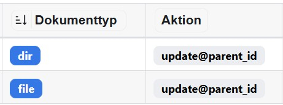

import Directory from '@tdev-components/documents/FileSystem/Directory';
import BrowserWindow from '@tdev-components/BrowserWindow';

# Dateien und Ordner

```md
import Directory from '@tdev-components/documents/FileSystem/Directory';

<Directory name="Ordner" id="1e79cf9a-b890-4d9e-a5fe-e4b372e233c6"/>
```

<BrowserWindow>
    <Directory name="Ordner" id="1e79cf9a-b890-4d9e-a5fe-e4b372e233c6" />
</BrowserWindow>

## Installation

::::info[Code-Ordner kopieren]

- `src/models/documents/FileSystem`
- `src/components/documents/FileSystem`

:::warning[Abhängigkeiten] Standardmässig werden alle verfügbaren Dateitypen unterstützt. Ist ein Dokumententyp (bspw. `excalidoc`) nicht verfügbar, muss dieser entfernt werden. ::: ::::

:::info[Models]

```tsx title="src/api/document.ts"
export enum DocumentType {
    /* ... */
    Dir = 'dir',
    File = 'file'
}

export interface DirData {
    name: string;
    isOpen: boolean;
}

export interface FileData {
    name: string;
    isOpen: boolean;
}
export interface TypeDataMapping {
    /* ... */
    [DocumentType.Dir]: DirData;
    [DocumentType.File]: FileData;
}

export interface TypeModelMapping {
    /* ... */
    [DocumentType.Dir]: Directory;
    [DocumentType.File]: File;
}

export type DocumentTypes =
    /* ... */
    Directory | File;
```

:::

:::info[Stores]

```tsx title="src/stores/DocumentStore.ts" {4-7}
export function CreateDocumentModel(data: DocumentProps<DocumentType>, store: DocumentStore): DocumentTypes {
    switch (data.type) {
        /* ... */
        case DocumentType.Dir:
            return new Directory(data as DocumentProps<DocumentType.Dir>, store);
        case DocumentType.File:
            return new File(data as DocumentProps<DocumentType.File>, store);
    }
}
```

```ts title="src/stores/SocketDataStore.ts" {4}
/**
 * Records that should be created when a IoEvent.NEW_RECORD event is received.
 */
const RecordsToCreate = new Set<DocumentType>([DocumentType.Dir, DocumentType.File /* ... */]);
/* ... */
```

:::

:::warning[Ordner und Dateien verschieben] Ordner und Dateien können innerhalb derselben `DocumentRoot` verschoben werden. Dies bedarf jedoch folgende **Erlaubte Aktionen** im [Admin Panel](/admin?panel=allowedActions)

 :::
