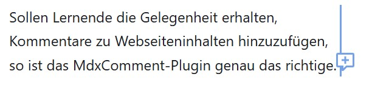
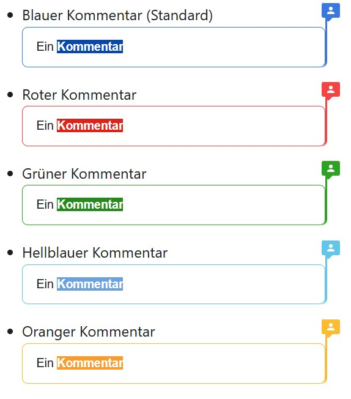
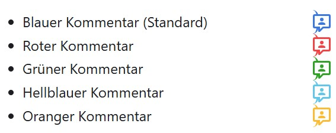
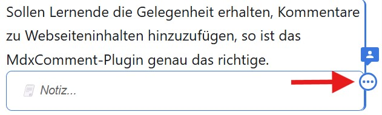
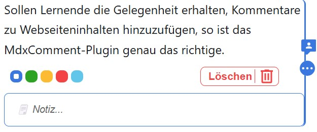

# Kommentare

Sollen Lernende die Gelegenheit erhalten, Kommentare zu Webseiteninhalten hinzuzufügen, so ist das MdxComment-Plugin genau das richtige.

Es ermöglicht angemeldeten Usern, dynamisch Kommentare hinzuzufügen, zu bearbeiten und farblich zu kennzeichnen.

## Kommentare Hinzufügen
Befindet sich die Maus über einem Abschnitt, so wird auf der rechten Seite ein Icon zum Hinzufügen eines Kommentars angezeigt.



## Vorhandene Kommentare
Kommentare werden nach dem laden dort angezeigt, wo sie hinzugefpgt wurden. Kommentare können entweder geöffnet oder geschlossen sein.

### Offene Kommentare


### Geschlossene Komentare
Bei den geschlossenen Kommentaren wird nur ein kleiner Indikator rechts neben dem Abschnitt angezeigt.



## Optionen
Die kommentaroptionen können bei einem geöffneten Kommentar durch Positionieren des Mauszeigers über dem Kommentar angezeigt werden.





### Dokument nicht kommentierbar machen

Ein Dokument kann als "nicht kommentierbar" markiert werden, indem im Frontmatter die Option `no_comments: true` gesetzt wird.

```md
---
no_comments: true
page_id: 694583bd-784f-4db9-99c4-491d6e373b88
---
# Ein Dokument ohne Kommentare
```

## Installation

:::warning[Voraussetzung]
Damit die Kommentarfunktion gebraucht werden kann, braucht es das Plugin [👉 remark-page](../mdx-page.mdx).
:::

:::info[Code Kopieren]
- `src/components/documents/MdxComment`
- `src/models/documents/MdxComment.ts`
- `src/plugins/remark-comments`
:::

:::info[Models]
 
```tsx title="src/api/document.ts"

export enum DocumentType {
    /* ... */
    MdxComment = 'mdx_comment'
}

export interface MdxCommentData {
    type: string;
    nr: number;
    commentNr: number;
    isOpen: boolean;
    color: Color;
}
export interface TypeDataMapping {
    /* ... */
    [DocumentType.MdxComment]: MdxCommentData;
}

export interface TypeModelMapping {
    /* ... */
    [DocumentType.MdxComment]: MdxComment;
}

export type DocumentTypes =
    /* ... */
    | MdxComment;
```

:::
:::info[Stores]

```tsx title="src/stores/DocumentStore.ts" {4-5}
export function CreateDocumentModel(data: DocumentProps<DocumentType>, store: DocumentStore): DocumentTypes {
    switch (data.type) {
        /* ... */
        case DocumentType.MdxComment:
            return new MdxComment(data as DocumentProps<DocumentType.MdxComment>, store);
    }
}
```

```ts title="src/stores/SocketDataStore.ts" {4}
/**
 * Records that should be created when a IoEvent.NEW_RECORD event is received.
 */
const RecordsToCreate = new Set<DocumentType>([DocumentType.MdxComment, /* ... */]);
/* ... */
```

:::
:::info[Remark-Plugins]
```ts title="src/plugins/remark-comments/plugin.ts"
Das Plugin `remark-comments` kann für die Bedürfnisse der Seite konfiguriert werden - für die Teaching-Dev Seite ist es wie folgt konfiguriert:
```ts title="docusaurus.config.ts"
import commentPlugin from './src/plugins/remark-comments/plugin';
/* ... */

const REMARK_PLUGINS = [
  /* ... */
  [
    commentPlugin,
    {
      commentableJsxFlowElements: ['dd', 'DefHeading', 'figcaption'],
      ignoreJsxFlowElements: ['summary', 'dt'],
      ignoreCodeBlocksWithMeta: /live_py/
    }
  ]
];

```
:::
