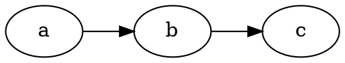
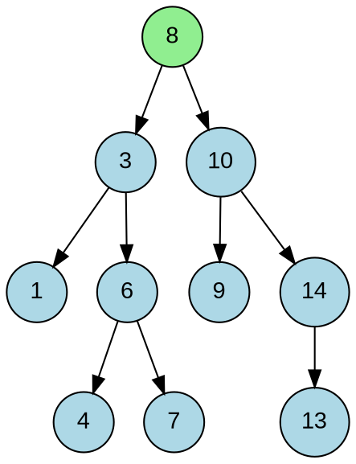
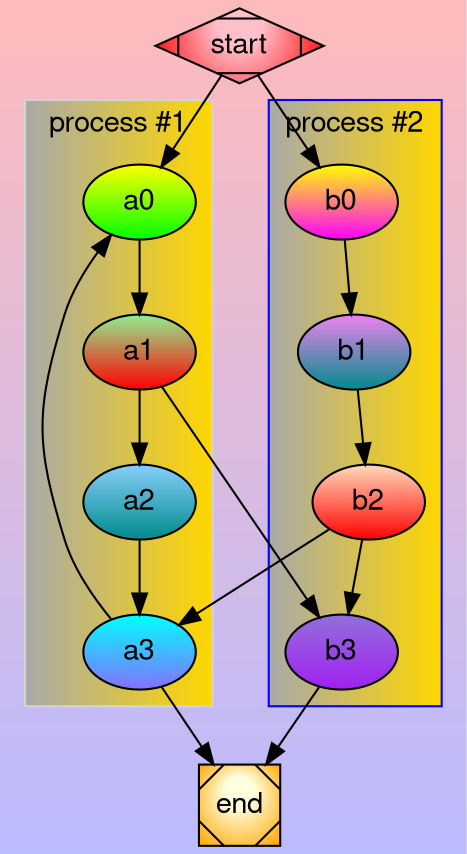
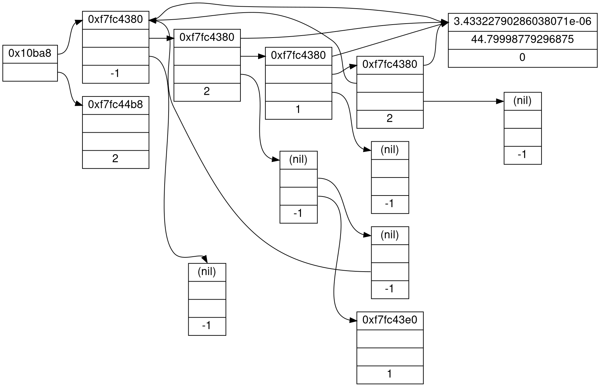
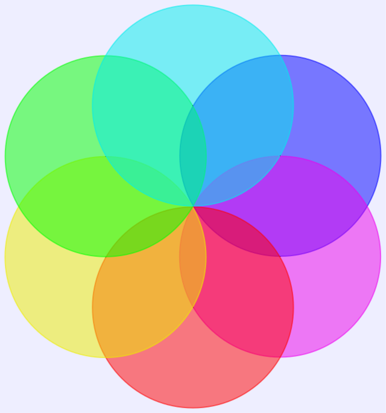
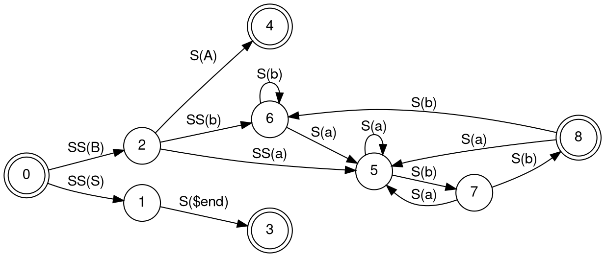
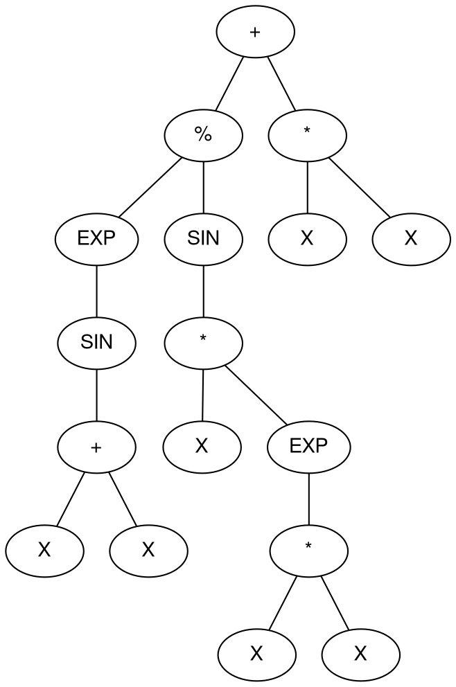

import BrowserWindow from '@tdev-components/BrowserWindow';

# Graphviz

[Graphviz](https://graphviz.org/) ist ein Open-Source-Tool, das zur Visualisierung von Graphen und Diagrammen verwendet wird. Es ermöglicht die Darstellung von Beziehungen zwischen Knoten in einem Diagramm und ist besonders nützlich für die Darstellung von Datenstrukturen, Flussdiagrammen und anderen komplexen Beziehungen.

Die Grafiken werden in der `DOT`-Sprache beschrieben und anschliessend in ein SVG übersetzt.

````md

````

<BrowserWindow>

</BrowserWindow>

## Optionen

### Ausgabeoptionen

Der `dot`-Code wird als SVG ausgegeben und somit lassen sich wie bei Bildern Unterschriften und Ausgabeoptionen hinzufügen.

````md
```dot :mdi[image]{.blue}-Beschriftung **mit** __Formatierung__ --width=500px
digraph {
	rankdir=LR;
    a -> b;
    b -> c;
}
```
````

<BrowserWindow>
```dot :mdi[image]{.blue}-Beschriftung **mit** __Formatierung__ --width=500px
digraph {
	rankdir=LR;
    a -> b;
    b -> c;
}
```
</BrowserWindow>

## Beispiele

### Binärbaum

:::details[Sourcecode]
By Anthropic Claude 3.7 Sonnet

```
digraph BinarySearchTree {
  node [shape=circle, style=filled, fillcolor=lightblue, fontname="Arial"];
  edge [fontname="Arial"];

  // Root node
  8 [fillcolor=lightgreen, label="8"];

  // Connections
  8 -> 3;
  8 -> 10;
  3 -> 1;
  3 -> 6;
  6 -> 4;
  6 -> 7;
  10 -> 9;
  10 -> 14;
  14 -> 13;

  // Node numbers indicate both value and insertion order
  1 [label="1"];
  3 [label="3"];
  4 [label="4"];
  6 [label="6"];
  7 [label="7"];
  9 [label="9"];
  10 [label="10"];
  13 [label="13"];
  14 [label="14"];
}
```
:::

Beispiele von https://graphviz.org/gallery/

### Cluster Gradients



:::details[Sourcecode]
https://graphviz.org/Gallery/gradient/cluster.html

```
digraph G {bgcolor="#0000FF44:#FF000044" gradientangle=90
	fontname="Helvetica,Arial,sans-serif"
	node [fontname="Helvetica,Arial,sans-serif"]
	edge [fontname="Helvetica,Arial,sans-serif"]

	subgraph cluster_0 {
		style=filled;
		color=lightgrey;
		fillcolor="darkgray:gold";
		gradientangle=0
		node [fillcolor="yellow:green" style=filled gradientangle=270] a0;
		node [fillcolor="lightgreen:red"] a1;
		node [fillcolor="lightskyblue:darkcyan"] a2;
		node [fillcolor="cyan:lightslateblue"] a3;

		a0 -> a1 -> a2 -> a3;
		label = "process #1";
	}

	subgraph cluster_1 {
		node [fillcolor="yellow:magenta" 
			 style=filled gradientangle=270] b0;
		node [fillcolor="violet:darkcyan"] b1;
		node [fillcolor="peachpuff:red"] b2;
		node [fillcolor="mediumpurple:purple"] b3;

		b0 -> b1 -> b2 -> b3;
		label = "process #2";
		color=blue
		fillcolor="darkgray:gold";
		gradientangle=0
		style=filled;
	}
	start -> a0;
	start -> b0;
	a1 -> b3;
	b2 -> a3;
	a3 -> a0;
	a3 -> end;
	b3 -> end;

	start [shape=Mdiamond ,
		fillcolor="pink:red",
		gradientangle=90,
		style=radial];
	end [shape=Msquare,
		fillcolor="lightyellow:orange",
		style=radial,
		gradientangle=90];
}
```
:::

### Data Structures



:::details[Sourcecode]

https://graphviz.org/Gallery/directed/datastruct.html
```
digraph g {
    fontname="Helvetica,Arial,sans-serif"
    node [fontname="Helvetica,Arial,sans-serif"]
    edge [fontname="Helvetica,Arial,sans-serif"]
    graph [rankdir = "LR"];

    node [
        fontsize = "16"
        shape = "ellipse"
    ]

    edge [];

    "node0" [label = "<f0> 0x10ba8| <f1>" shape = "record"];
    "node1" [label = "<f0> 0xf7fc4380| <f1> | <f2> |-1" shape = "record"];
    "node2" [label = "<f0> 0xf7fc44b8| | |2" shape = "record"];
    "node3" [label = "<f0> 3.43322790286038071e-06|44.79998779296875|0" shape = "record"];
    "node4" [label = "<f0> 0xf7fc4380| <f1> | <f2> |2" shape = "record"];
    "node5" [label = "<f0> (nil)| | |-1" shape = "record"];
    "node6" [label = "<f0> 0xf7fc4380| <f1> | <f2> |1" shape = "record"];
    "node7" [label = "<f0> 0xf7fc4380| <f1> | <f2> |2" shape = "record"];
    "node8" [label = "<f0> (nil)| | |-1" shape = "record"];
    "node9" [label = "<f0> (nil)| | |-1" shape = "record"];
    "node10" [label = "<f0> (nil)| <f1> | <f2> |-1" shape = "record"];
    "node11" [label = "<f0> (nil)| <f1> | <f2> |-1" shape = "record"];
    "node12" [label = "<f0> 0xf7fc43e0| | |1" shape = "record"];

    // Edges
    "node0":f0 -> "node1":f0 [id = 0];
    "node0":f1 -> "node2":f0 [id = 1];
    "node1":f0 -> "node3":f0 [id = 2];
    "node1":f1 -> "node4":f0 [id = 3];
    "node1":f2 -> "node5":f0 [id = 4];

    // Node 4 edges
    "node4":f0 -> "node3":f0 [id = 5];
    "node4":f1 -> "node6":f0 [id = 6];
    "node4":f2 -> "node10":f0 [id = 7];

    // Node 6 edges
    "node6":f0 -> "node3":f0 [id = 8];
    "node6":f1 -> "node7":f0 [id = 9];
    "node6":f2 -> "node9":f0 [id = 10];

    // Node 7 edges
    "node7":f0 -> "node3":f0 [id = 11];
    "node7":f1 -> "node1":f0 [id = 12];
    "node7":f2 -> "node8":f0 [id = 13];

    // Node 10 edges
    "node10":f1 -> "node11":f0 [id = 14];
    "node10":f2 -> "node12":f0 [id = 15];

    // Node 11 edges
    "node11":f2 -> "node1":f0 [id = 16];
}
```
:::

### Partially Transparent Colors

:::details[Sourcecode]
https://graphviz.org/Gallery/neato/transparency.html
```
graph Transparency {
	layout=neato
	start=11 // empiric value to set orientation
	bgcolor="#0000ff11"
	node [shape=circle width=2.22 label="" style=filled]
	5 [color="#0000ff80"]
	6 [color="#ee00ee80"]
	1 [color="#ff000080"]
	2 [color="#eeee0080"]
	3 [color="#00ff0080"]
	4 [color="#00eeee80"]
	1 -- 2 -- 3 -- 4 -- 5 -- 6 -- 1
}
```
:::

### Finite Automaton


:::details[Sourcecode]
https://graphviz.org/Gallery/directed/fsm.html
```
digraph finite_state_machine {
	fontname="Helvetica,Arial,sans-serif"
	node [fontname="Helvetica,Arial,sans-serif"]
	edge [fontname="Helvetica,Arial,sans-serif"]
	rankdir=LR;
	node [shape = doublecircle]; 0 3 4 8;
	node [shape = circle];
	0 -> 2 [label = "SS(B)"];
	0 -> 1 [label = "SS(S)"];
	1 -> 3 [label = "S($end)"];
	2 -> 6 [label = "SS(b)"];
	2 -> 5 [label = "SS(a)"];
	2 -> 4 [label = "S(A)"];
	5 -> 7 [label = "S(b)"];
	5 -> 5 [label = "S(a)"];
	6 -> 6 [label = "S(b)"];
	6 -> 5 [label = "S(a)"];
	7 -> 8 [label = "S(b)"];
	7 -> 5 [label = "S(a)"];
	8 -> 6 [label = "S(b)"];
	8 -> 5 [label = "S(a)"];
}
```
:::

### Math Parse Tree



:::details[Sourcecode]
https://graphviz.org/Gallery/directed/Genetic_Programming.html
```
graph {
    fontname="Helvetica,Arial,sans-serif"
    node [fontname="Helvetica,Arial,sans-serif"]
    edge [fontname="Helvetica,Arial,sans-serif"]
   
   n022 ;
   n022 [label="+"] ;
   n022 -- n023 ;
   n023 [label="%"] ;
   n023 -- n024 ;
   n024 [label="EXP"] ;
   n024 -- n025 ;
   n025 [label="SIN"] ;
   n025 -- n026 ;
   n026 [label="+"] ;
   n026 -- n027 ;
   n027 [label="X"] ;
   n026 -- n028 ;
   n028 [label="X"] ;
   n023 -- n029 ;
   n029 [label="SIN"] ;
   n029 -- n030 ;
   n030 [label="*"] ;
   n030 -- n031 ;
   n031 [label="X"] ;
   n030 -- n032 ;
   n032 [label="EXP"] ;
   n032 -- n033 ;
   n033 [label="*"] ;
   n033 -- n034 ;
   n034 [label="X"] ;
   n033 -- n035 ;
   n035 [label="X"] ;
   n022 -- n036 ;
   n036 [label="*"] ;
   n036 -- n037 ;
   n037 [label="X"] ;
   n036 -- n038 ;
   n038 [label="X"] ;
}
```
:::

### Parsing tree

```dot
digraph g {
  graph [rankdir=LR, fontsize=30, labelloc="t", label="", splines=true, overlap=false];
  node [fontname="Helvetica,Arial,sans-serif", shape="Mrecord", fontname="Courier New"];
  edge [fontname="Helvetica,Arial,sans-serif"];
  ratio = auto;

  // State Definitions
  "state0" [style="filled, bold", penwidth=5, fillcolor="white", label=<<table border="0" cellborder="0" cellpadding="3" bgcolor="white">
    <tr><td bgcolor="black" align="center" colspan="2"><font color="white">State #0</font></td></tr>
    <tr><td align="left" port="r0">&#40;0&#41; s -&gt; &bull;e $ </td></tr>
    <tr><td align="left" port="r1">&#40;1&#41; e -&gt; &bull;l '=' r </td></tr>
    <tr><td align="left" port="r2">&#40;2&#41; e -&gt; &bull;r </td></tr>
    <tr><td align="left" port="r3">&#40;3&#41; l -&gt; &bull;'*' r </td></tr>
    <tr><td align="left" port="r4">&#40;4&#41; l -&gt; &bull;'n' </td></tr>
    <tr><td align="left" port="r5">&#40;5&#41; r -&gt; &bull;l </td></tr>
  </table>>];

  "state1" [style="filled", penwidth=1, fillcolor="white", label=<<table border="0" cellborder="0" cellpadding="3" bgcolor="white">
    <tr><td bgcolor="black" align="center" colspan="2"><font color="white">State #1</font></td></tr>
    <tr><td align="left" port="r3">&#40;3&#41; l -&gt; &bull;'*' r </td></tr>
    <tr><td align="left" port="r3">&#40;3&#41; l -&gt; '*' &bull;r </td></tr>
    <tr><td align="left" port="r4">&#40;4&#41; l -&gt; &bull;'n' </td></tr>
    <tr><td align="left" port="r5">&#40;5&#41; r -&gt; &bull;l </td></tr>
  </table>>];

  "state2" [style="filled", penwidth=1, fillcolor="white", label=<<table border="0" cellborder="0" cellpadding="3" bgcolor="white">
    <tr><td bgcolor="black" align="center" colspan="2"><font color="white">State #2</font></td></tr>
    <tr><td align="left" port="r4">&#40;4&#41; l -&gt; 'n' &bull;</td><td bgcolor="grey" align="right">=$</td></tr>
  </table>>];

  "state3" [style="filled", penwidth=1, fillcolor="white", label=<<table border="0" cellborder="0" cellpadding="3" bgcolor="white">
    <tr><td bgcolor="black" align="center" colspan="2"><font color="white">State #3</font></td></tr>
    <tr><td align="left" port="r5">&#40;5&#41; r -&gt; l &bull;</td><td bgcolor="grey" align="right">=$</td></tr>
  </table>>];

  "state4" [style="filled", penwidth=1, fillcolor="white", label=<<table border="0" cellborder="0" cellpadding="3" bgcolor="white">
    <tr><td bgcolor="black" align="center" colspan="2"><font color="white">State #4</font></td></tr>
    <tr><td align="left" port="r3">&#40;3&#41; l -&gt; '*' r &bull;</td><td bgcolor="grey" align="right">=$</td></tr>
  </table>>];

  "state5" [style="filled", penwidth=1, fillcolor="black", label=<<table border="0" cellborder="0" cellpadding="3" bgcolor="black">
    <tr><td bgcolor="black" align="center" colspan="2"><font color="white">State #5</font></td></tr>
    <tr><td align="left" port="r0"><font color="white">&#40;0&#41; s -&gt; e &bull;$ </font></td></tr>
  </table>>];

  "state6" [style="filled", penwidth=1, fillcolor="white", label=<<table border="0" cellborder="0" cellpadding="3" bgcolor="white">
    <tr><td bgcolor="black" align="center" colspan="2"><font color="white">State #6</font></td></tr>
    <tr><td align="left" port="r1">&#40;1&#41; e -&gt; l &bull;'=' r </td></tr>
    <tr><td align="left" port="r5">&#40;5&#41; r -&gt; l &bull;</td><td bgcolor="grey" align="right">$</td></tr>
  </table>>];

  "state7" [style="filled", penwidth=1, fillcolor="white", label=<<table border="0" cellborder="0" cellpadding="3" bgcolor="white">
    <tr><td bgcolor="black" align="center" colspan="2"><font color="white">State #7</font></td></tr>
    <tr><td align="left" port="r1">&#40;1&#41; e -&gt; l '=' &bull;r </td></tr>
    <tr><td align="left" port="r3">&#40;3&#41; l -&gt; &bull;'*' r </td></tr>
    <tr><td align="left" port="r4">&#40;4&#41; l -&gt; &bull;'n' </td></tr>
    <tr><td align="left" port="r5">&#40;5&#41; r -&gt; &bull;l </td></tr>
  </table>>];

  "state8" [style="filled", penwidth=1, fillcolor="white", label=<<table border="0" cellborder="0" cellpadding="3" bgcolor="white">
    <tr><td bgcolor="black" align="center" colspan="2"><font color="white">State #8</font></td></tr>
    <tr><td align="left" port="r1">&#40;1&#41; e -&gt; l '=' r &bull;</td><td bgcolor="grey" align="right">$</td></tr>
  </table>>];

  "state9" [style="filled", penwidth=1, fillcolor="white", label=<<table border="0" cellborder="0" cellpadding="3" bgcolor="white">
    <tr><td bgcolor="black" align="center" colspan="2"><font color="white">State #9</font></td></tr>
    <tr><td align="left" port="r2">&#40;2&#41; e -&gt; r &bull;</td><td bgcolor="grey" align="right">$</td></tr>
  </table>>];

  // State Transitions
  state0 -> state5 [penwidth=5, fontsize=28, fontcolor="black", label="e"]; 
  state0 -> state6 [penwidth=5, fontsize=28, fontcolor="black", label="l"]; 
  state0 -> state9 [penwidth=5, fontsize=28, fontcolor="black", label="r"]; 
  state0 -> state1 [penwidth=1, fontsize=14, fontcolor="grey28", label="'*'"]; 
  state0 -> state2 [penwidth=1, fontsize=14, fontcolor="grey28", label="'n'"]; 

  state1 -> state1 [penwidth=1, fontsize=14, fontcolor="grey28", label="'*'"]; 
  state1 -> state4 [penwidth=5, fontsize=28, fontcolor="black", label="r"]; 
  state1 -> state2 [penwidth=1, fontsize=14, fontcolor="grey28", label="'n'"]; 
  state1 -> state3 [penwidth=5, fontsize=28, fontcolor="black", label="l"]; 

  state6 -> state7 [penwidth=1, fontsize=14, fontcolor="grey28", label="'='"]; 
  state7 -> state8 [penwidth=5, fontsize=28, fontcolor="black", label="r"]; 
  state7 -> state1 [penwidth=1, fontsize=14, fontcolor="grey28", label="'*'"]; 
  state7 -> state2 [penwidth=1, fontsize=14, fontcolor="grey28", label="'n'"]; 
  state7 -> state3 [penwidth=5, fontsize=28, fontcolor="black", label="l"]; 
}
```



:::details[Sourcecode]
https://graphviz.org/Gallery/directed/psg.html
```
##"I made a program to generate dot files representing the LR(0) state graph along with computed LALR(1) lookahead for an arbitrary context-free grammar, to make the diagrams I used in this article: http://blog.lab49.com/archives/2471. The program also highlights errant nodes in red if the grammar would produce a shift/reduce or reduce/reduce conflict -- you may be able to go to http://kthielen.dnsalias.com:8082/ to produce a graph more to your liking". Contributed by Kalani Thielen.

digraph g {
  graph [rankdir=LR, fontsize=30, labelloc="t", label="", splines=true, overlap=false];
  node [fontname="Helvetica,Arial,sans-serif", shape="Mrecord", fontname="Courier New"];
  edge [fontname="Helvetica,Arial,sans-serif"];
  ratio = auto;

  // State Definitions
  "state0" [style="filled, bold", penwidth=5, fillcolor="white", label=<<table border="0" cellborder="0" cellpadding="3" bgcolor="white">
    <tr><td bgcolor="black" align="center" colspan="2"><font color="white">State #0</font></td></tr>
    <tr><td align="left" port="r0">&#40;0&#41; s -&gt; &bull;e $ </td></tr>
    <tr><td align="left" port="r1">&#40;1&#41; e -&gt; &bull;l '=' r </td></tr>
    <tr><td align="left" port="r2">&#40;2&#41; e -&gt; &bull;r </td></tr>
    <tr><td align="left" port="r3">&#40;3&#41; l -&gt; &bull;'*' r </td></tr>
    <tr><td align="left" port="r4">&#40;4&#41; l -&gt; &bull;'n' </td></tr>
    <tr><td align="left" port="r5">&#40;5&#41; r -&gt; &bull;l </td></tr>
  </table>>];

  "state1" [style="filled", penwidth=1, fillcolor="white", label=<<table border="0" cellborder="0" cellpadding="3" bgcolor="white">
    <tr><td bgcolor="black" align="center" colspan="2"><font color="white">State #1</font></td></tr>
    <tr><td align="left" port="r3">&#40;3&#41; l -&gt; &bull;'*' r </td></tr>
    <tr><td align="left" port="r3">&#40;3&#41; l -&gt; '*' &bull;r </td></tr>
    <tr><td align="left" port="r4">&#40;4&#41; l -&gt; &bull;'n' </td></tr>
    <tr><td align="left" port="r5">&#40;5&#41; r -&gt; &bull;l </td></tr>
  </table>>];

  "state2" [style="filled", penwidth=1, fillcolor="white", label=<<table border="0" cellborder="0" cellpadding="3" bgcolor="white">
    <tr><td bgcolor="black" align="center" colspan="2"><font color="white">State #2</font></td></tr>
    <tr><td align="left" port="r4">&#40;4&#41; l -&gt; 'n' &bull;</td><td bgcolor="grey" align="right">=$</td></tr>
  </table>>];

  "state3" [style="filled", penwidth=1, fillcolor="white", label=<<table border="0" cellborder="0" cellpadding="3" bgcolor="white">
    <tr><td bgcolor="black" align="center" colspan="2"><font color="white">State #3</font></td></tr>
    <tr><td align="left" port="r5">&#40;5&#41; r -&gt; l &bull;</td><td bgcolor="grey" align="right">=$</td></tr>
  </table>>];

  "state4" [style="filled", penwidth=1, fillcolor="white", label=<<table border="0" cellborder="0" cellpadding="3" bgcolor="white">
    <tr><td bgcolor="black" align="center" colspan="2"><font color="white">State #4</font></td></tr>
    <tr><td align="left" port="r3">&#40;3&#41; l -&gt; '*' r &bull;</td><td bgcolor="grey" align="right">=$</td></tr>
  </table>>];

  "state5" [style="filled", penwidth=1, fillcolor="black", label=<<table border="0" cellborder="0" cellpadding="3" bgcolor="black">
    <tr><td bgcolor="black" align="center" colspan="2"><font color="white">State #5</font></td></tr>
    <tr><td align="left" port="r0"><font color="white">&#40;0&#41; s -&gt; e &bull;$ </font></td></tr>
  </table>>];

  "state6" [style="filled", penwidth=1, fillcolor="white", label=<<table border="0" cellborder="0" cellpadding="3" bgcolor="white">
    <tr><td bgcolor="black" align="center" colspan="2"><font color="white">State #6</font></td></tr>
    <tr><td align="left" port="r1">&#40;1&#41; e -&gt; l &bull;'=' r </td></tr>
    <tr><td align="left" port="r5">&#40;5&#41; r -&gt; l &bull;</td><td bgcolor="grey" align="right">$</td></tr>
  </table>>];

  "state7" [style="filled", penwidth=1, fillcolor="white", label=<<table border="0" cellborder="0" cellpadding="3" bgcolor="white">
    <tr><td bgcolor="black" align="center" colspan="2"><font color="white">State #7</font></td></tr>
    <tr><td align="left" port="r1">&#40;1&#41; e -&gt; l '=' &bull;r </td></tr>
    <tr><td align="left" port="r3">&#40;3&#41; l -&gt; &bull;'*' r </td></tr>
    <tr><td align="left" port="r4">&#40;4&#41; l -&gt; &bull;'n' </td></tr>
    <tr><td align="left" port="r5">&#40;5&#41; r -&gt; &bull;l </td></tr>
  </table>>];

  "state8" [style="filled", penwidth=1, fillcolor="white", label=<<table border="0" cellborder="0" cellpadding="3" bgcolor="white">
    <tr><td bgcolor="black" align="center" colspan="2"><font color="white">State #8</font></td></tr>
    <tr><td align="left" port="r1">&#40;1&#41; e -&gt; l '=' r &bull;</td><td bgcolor="grey" align="right">$</td></tr>
  </table>>];

  "state9" [style="filled", penwidth=1, fillcolor="white", label=<<table border="0" cellborder="0" cellpadding="3" bgcolor="white">
    <tr><td bgcolor="black" align="center" colspan="2"><font color="white">State #9</font></td></tr>
    <tr><td align="left" port="r2">&#40;2&#41; e -&gt; r &bull;</td><td bgcolor="grey" align="right">$</td></tr>
  </table>>];

  // State Transitions
  state0 -> state5 [penwidth=5, fontsize=28, fontcolor="black", label="e"]; 
  state0 -> state6 [penwidth=5, fontsize=28, fontcolor="black", label="l"]; 
  state0 -> state9 [penwidth=5, fontsize=28, fontcolor="black", label="r"]; 
  state0 -> state1 [penwidth=1, fontsize=14, fontcolor="grey28", label="'*'"]; 
  state0 -> state2 [penwidth=1, fontsize=14, fontcolor="grey28", label="'n'"]; 

  state1 -> state1 [penwidth=1, fontsize=14, fontcolor="grey28", label="'*'"]; 
  state1 -> state4 [penwidth=5, fontsize=28, fontcolor="black", label="r"]; 
  state1 -> state2 [penwidth=1, fontsize=14, fontcolor="grey28", label="'n'"]; 
  state1 -> state3 [penwidth=5, fontsize=28, fontcolor="black", label="l"]; 

  state6 -> state7 [penwidth=1, fontsize=14, fontcolor="grey28", label="'='"]; 
  state7 -> state8 [penwidth=5, fontsize=28, fontcolor="black", label="r"]; 
  state7 -> state1 [penwidth=1, fontsize=14, fontcolor="grey28", label="'*'"]; 
  state7 -> state2 [penwidth=1, fontsize=14, fontcolor="grey28", label="'n'"]; 
  state7 -> state3 [penwidth=5, fontsize=28, fontcolor="black", label="l"]; 
}
```

:::

## Funtionsweise

Remark prozessiert die Markdown-Dateien während dem Build-Prozess. Die `dot`-Blöcke werden in SVG umgewandelt und als Bilder in die Markdown-Datei eingebettet. Die SVG-Bilder für ein Dokument (bspw. für `index.mdx`) werden im Ordner `images/.dot/datei-name` abgespeichert (z.B. `images/.dot/index-mdx/dot-001.svg`). Die SVG Bilder müssen nicht in git eingecheckt werden, weshalb standardmässig ein `.gitignore`-Eintrag in den Ausgabeordnern hinzugefügt wird.

## Installation


:::info[Code]
- `packages/remark-graphviz`

Danach `yarn install` ausführen.
:::

```ts title="siteConfig.ts"
import graphvizPlugin from '@tdev/remark-graphviz/remark-plugin';

const getSiteConfig: SiteConfigProvider = () => {
    return {
        beforeDefaultRemarkPlugins: [
            /* ... */
            // graphvizPlugin must come before imagePlugin!
            graphvizPlugin,
            imagePlugin
        ],
    };
};
```

:::details[Ausgabe-Ordner `images/.dot` ändern]
Soll der Standard-Ordner für die generierten SVG-Bilder geändert werden, kann dies in der Konfiguration des Plugins gemacht werden. Der Standard-Ordner ist `images/.dot`.

Anpassung zu `img/.dot`:

```ts title="siteConfig.ts"
const getSiteConfig: SiteConfigProvider = () => {
    return {
        beforeDefaultRemarkPlugins: [
            /* ... */
            [
                graphvizPlugin,
                {
                    dotFileRootDir: 'img/.dot',
                }
            ]
        ]
    };
};
```
:::