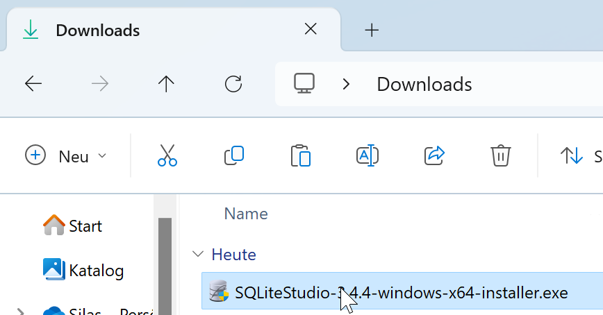
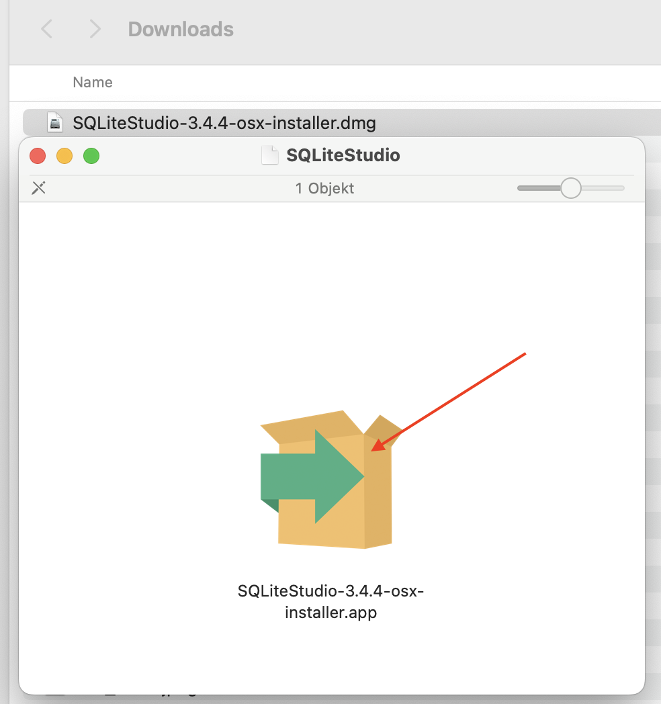

# SQLiteStudio Installieren
**SQLiteStudio** ist ein kostenloses Programm, mit welchem wir SQLite-Datenbanken verwalten können.

Wählen Sie Ihr Betriebssystem (Windows oder macOS) aus und befolgen Sie die Installationsanleitung.

::::Tabs{groupId="os"}
:::Tab[Windows]{value="win"}
1. Öffnen Sie die Download-Webseite: [https://github.com/pawelsalawa/sqlitestudio/releases](https://github.com/pawelsalawa/sqlitestudio/releases).
2. In der obersten Tabelle auf der Seite suchen Sie in der Spalte __Platform__ nach `Windows x64` und in der Spalte __Package type__ nach `Installer`.
3. Sobald Sie die korrekte Zeile gefunden haben, klicken Sie in der Spalte __File name__ auf den blauen Link, um die Installationsdatei herunterzuladen
4. Führen Sie die heruntergeladene Datei aus, indem Sie sie im __Downloads__-Ordner suchen und darauf **doppel**klicken:
   
5. Klicken Sie bei der folgenden Sicherheitswarnung auf __Ja__:
   
6. Folgen Sie dem Installationsprogramm, indem Sie jeweils auf __Next__ klicken. Akzeptieren Sie die Lizenz und belassen Sie alle anderen Einstellungen unverändert.
   
7. Wenn Sie SQLiteStudio zum ersten Mal öffnen, wählen Sie die Sprache _Deutsch_ aus:
   
:::

:::Tab[macOS]{value="macos"}
1. Öffnen Sie die Download-Webseite: [https://github.com/pawelsalawa/sqlitestudio/releases](https://github.com/pawelsalawa/sqlitestudio/releases).
2. In der obersten Tabelle auf der Seite suchen Sie in der Spalte __Platform__ nach `MacOS X x64` und in der Spalte __Package type__ nach `Installer`.
3. Sobald Sie die korrekte Zeile gefunden haben, klicken Sie in der Spalte __File name__ auf den blauen Link, um die Installationsdatei herunterzuladen
4. Führen Sie die heruntergeladene Datei aus, indem Sie sie im Downloads-Ordner suchen und darauf **doppel**klicken. Es öffnet sich folgendes Fenster, in welchem Sie das Box-Symbol ebenfalls nochmal **doppel**klicken müssen:

5. Sie erhalten dabei vermutlich eine Fehlermeldung, weil das Programm nicht von einem verifizierten Entwickler stammt. Öffnen Sie in dem Fall Ihre **Systemeinstellungen**, gehen Sie zu **Datenschutz & Sicherheit**, suchen Sie den Eintrag wie im Bild gezeigt, und klicken Sie dort auf __Dennoch öffnen__:

6. Klicken Sie bei diesem Dialog dann nochmal auf __Öffnen__.

7. Folgen Sie dem Installationsprogramm, indem Sie jeweils auf "Next" klicken. Akzeptieren Sie die Lizenz und belassen Sie alle anderen Einstellungen unverändert.

8. Wenn Sie SQLiteStudio zum ersten Mal öffnen, wählen Sie die Sprache _Deutsch_ aus:

:::
::::

---
