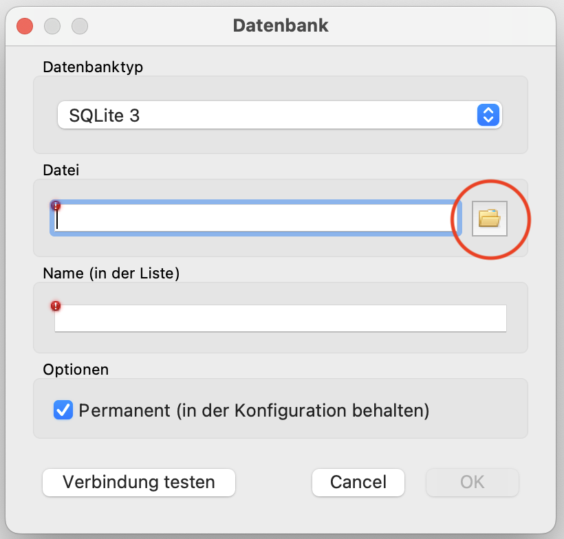

import ProgressState from '@tdev-components/documents/ProgressState';

# Erste Schritte mit SQLiteStudio
## Datenbank herunterladen
In SQLite wird die gesamte Datenbank in einer einzigen Datei gespeichert. Für diese Übung verwenden wir die Beispiel-Datenbank **Legomania**. Diese Datenbank-Datei müssen Sie sich nun also zuerst herunterladen, damit sie anschliessend auf Ihrem Computer verfügbar ist.

:::aufgabe[Legomania-Datenbank herunterladen]
<TaskState id="c4d5aea0-69b0-4208-8642-c65342de5b22" />
Laden Sie die Legomania-Datenbank über [diesen Link](https://erzbe-my.sharepoint.com/:u:/g/personal/silas_berger_gbsl_ch/IQBDK1b5M8nUQKk9-nFaHaZ6Aac0LnZObXzL5bhD5acgbMc?e=c8ZQrT) herunter und speichern Sie die Datei an einem Ort, an dem Sie sie später wiederfinden (z.B. unter `Dokumente` oder in Ihrem Informatik-Ordner):
:::

## Datenbank hinzufügen
In SQLite ist eine Datenbank ganz einfach eine Datei mit der Dateiendung `.sqlite`.

Um in SQLiteStudio eine bestehende Datenbank hinzuzufügen (also, sich mit der Datenbank zu _verbinden_), klicken Sie zuerst auf folgenden Button:


Anschliessend müssen Sie die entsprechende `.sqlite`-Datenbank-Datei auswählen. Dazu klicken Sie auf folgenden Button:



Nun suchen Sie die `.sqlite`-Datenbank-Datei, mit der Sie sich verbinden wollen. In diesem Beispiel wählen wir die Datei `legomania.sqlite` im Ordner `Downloads` aus. Den Namen müssen Sie nicht anpassen. Klicken Sie am Schluss auf __OK__ um sich mit der Datenbank-Datei zu verbinden.


:::aufgabe[Datenbank verbinden]
<TaskState id="cded3ebc-d0ec-47a3-b3c9-f9e1c030ac71" />
Verbinden Sie sich mit der heruntergeladenen Legomania-Datenbank-Datei.
:::

## SQL Editor und Überblick
Wenn Sie mit einer Datenbank verbunden sind, können Sie den _SQL-Editor_ öffnen, um mit der Datenbank zu interagieren. Was genau SQL ist, das lernen Sie später.

Stellen Sie zuerst sicher, dass die korrekte Datenbank ausgewählt ist. Hier haben wir die Datenbank `legomania` ausgewählt. Klicken Sie dann auf folgenden Button:


Es öffnet sich nun der sogenannte (vorerst noch leere) _SQL-Editor_:


Klicken Sie links neben dem Namen der Datenbank (hier `legomania`) auf den kleinen Dropdown-Pfeil, um eine Liste aller _Tabellen_ in dieser Datenbank zu sehen.

Rechts im _SQL-Editor_ sehen Sie zuoberst den Abfrage-Editor, in dem Sie ihre Abfragen formulieren können. In der Resultat-Ansicht erscheint später das Resultat der Abfrage.

In der Status-Ansicht erhalten Sie nützliche Informationen zum Status der Abfrage — sie ist besonders dann nützlich, wenn Fehler auftreten.

## Eine erste Abfrage (_«Query»_)
Mithilfe einer Sprache namens SQL (_**S**tructured **Q**uery **L**angauge_) können wir auf einer SQLite-Datenbank beliebige Abfragen (sogenannte _Queries_ formulieren). Um Ihre erste _Query_ zu tätigen, geben Sie im SQLite-Editor folgenden Text ein:

```sql
SELECT * FROM legodudes;
```

Drücken Sie danach auf den «Play-Button» um die Abfrage auszuführen.


Je nach Datenbank könnte das Resultat ungefähr so aussehen:


Speichern Sie die Abfrage nun per Klick auf das Speichersymbol auf Ihrem Computer, an einem Ort, wo Sie die Datei später wieder finden. In diesem Beispiel speichern wir die Abfrage als `select all legodudes.sql`:


:::warning[Was wird gespeichert?]
Es wird hierbei nur der «Text» im Abfrage-Editor gespeichert — nicht etwa das Resultat, oder die ganze Datenbank!
:::

:::aufgabe[Erste Abfrage ausführen und speichern]
<ProgressState id="960b7eb0-80b3-4ac6-9e96-3a32aed6f9ef" confirm>
1. Erstellen Sie in Ihrem Informatik-Ordner (OneDrive) einen neuen Ordner namens `Datenbanken`.
2. Erstellen Sie darin einen neuen Unterordner namens `Legomania-Abfragen`. In diesem Ordner können Sie zukünftig alle Ihre SQL-Abfragen zur Legomania-Datenbank speichern, damit Sie sie später als Referenz haben, um für die Probe zu lernen.
3. Führen Sie die oben beschriebene Abfrage (`SELECT * FROM legodudes;`) im SQL-Editor aus und speichern Sie die Abfrage im Ordner `Legomania-Abfragen` unter dem Namen `select all legodudes.sql`.
4. Öffnen Sie den Ordner `Legomania-Abfragen` in Ihrem Dateiexplorer und überprüfen Sie:
    - …ob der Ordner `Legomania-Abfragen` wirklich in Ihrem **Informatik**-Ordner auf **OneDrive** liegt.
    - …ob die Datei `select all legodudes.sql` dort gespeichert wurde.
</ProgressState>
:::

---
