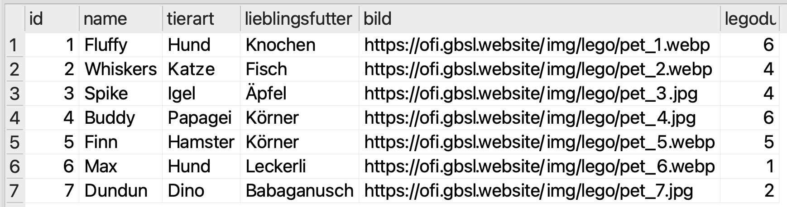
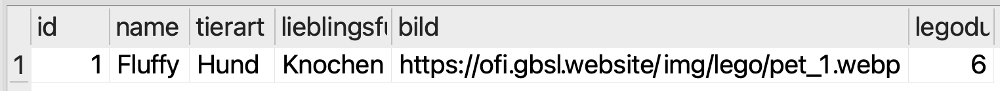
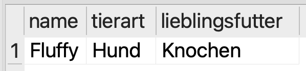
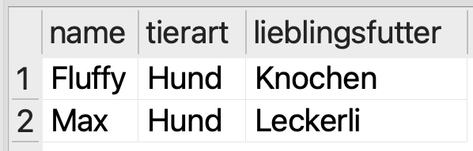
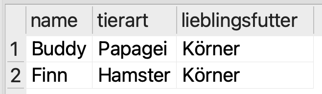
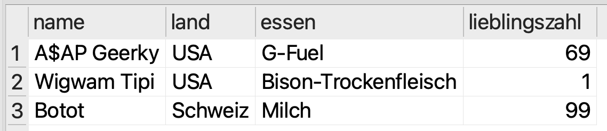

# Daten abfragen
:::aufgabe[Anweisungen]
<TaskState id="e5c33009-8883-4767-adfd-4a83d4696aee" />
Lesen Sie die folgenden Arbeitsanweisungen sorgfältig durch. Markieren Sie diese Aufgabe anschliessend als erledigt.

Gehen Sie für jede der untenstehenden Aufgaben wie folgt vor:
1. Öffnen Sie in SQLiteStudio einen neuen **SQL-Editor** (über das Symbol mit dem Blatt und dem Plus-Zeichen), so dass Sie ein leeres Textfeld für SQL-Abfragen vor sich haben.
2. Erstellen Sie dort anschliessend eine passende SQL-Abfrage (`SELECT ...`), welche das beschriebene Ergebnis erzeugt.
3. Sobald die Abfrage korrekt ist, **speichern** Sie sie als `SELECT Abfrage [Nummer].sql` (also z.B. `SELECT Abfrage 1.sql`, dann `SELECT Abfrage 2.sql`, und so weiter) auf Ihrer OneDrive (z.B. in einem Ordner __Informatik__ → __Data Management__ → __SQL-Abfragen__), damit Sie sie später wieder finden.
:::

:::aufgabe[1. Alle Haustiere]
<TaskState id="937e727b-b634-4805-9e2a-745854ed2a94" />
Schreiben Sie eine SQL-Abfrage, welche **alle Spalten aller Haustiere** (Tabelle `haustiere`) anzeigt.



<Solution id="8688b3ff-aea8-4ab9-ab62-a94c765aedef">
```sql
SELECT * FROM haustiere;
```
</Solution>
:::

:::aufgabe[2. Fluffy]
<TaskState id="f9205303-3abd-4e41-8a76-c6631ead34b8" />
Schreiben Sie eine SQL-Abfrage, welche **alle Spalten** des Haustiers mit dem Namen _Fluffy_ anzeigt.



<Solution id="dd901636-4ca8-421c-a95f-f07c2cdd6388">
```sql
SELECT * FROM haustiere WHERE name = 'Fluffy';
```
</Solution>
:::

:::aufgabe[3. Fluffy besser kennenlernen]
<TaskState id="dd9feebe-0d55-438c-a4b3-2340f7004601" />
Schreiben Sie eine SQL-Abfrage, welche die Spalten `name`, `tierart` und `lieblingsfutter` des Haustiers mit dem Namen _Fluffy_ anzeigt.



<Solution id="168543bc-caf0-4ee9-8ede-929c3d682769">
```sql
SELECT name, tierart, lieblingsfutter FROM haustiere WHERE name = 'Fluffy';
```
</Solution>
:::

:::aufgabe[4. Alle Hunde]
<TaskState id="927080cc-c9fc-4539-93ce-93d3ff938eb1" />
Schreiben Sie eine SQL-Abfrage, welche die Spalten `name`, `tierart` und `lieblingsfutter` aller Haustiere der Tierart _Hund_ anzeigt.



<Solution id="933a9a45-3395-4fc9-ae74-4f7646c657a4">
```sql
SELECT name, tierart, lieblingsfutter FROM haustiere WHERE tierart = 'Hund';
```
</Solution>
:::

:::aufgabe[5. Chörnlipicker]
<TaskState id="9c19faa2-ba2f-4d1b-8782-0cb958eede63" />
Erstellen Sie eine SQL-Abfrage, welche die Spalten `name`, `tierart` und `lieblingsfutter` aller Haustiere anzeigt, deren Lieblingsfutter _Körner_ ist.



<Solution id="a46d1d4e-faec-4118-9b99-a706d1220502">
```sql
SELECT name, tierart, lieblingsfutter FROM haustiere WHERE lieblingsfutter = 'Körner';
```
</Solution>
:::

::::aufgabe[6. Keine Leckerli]
<TaskState id="3a012aa3-01b0-4e64-84fa-c66916acd6c0" />
Erstellen Sie eine SQL-Abfrage, welche die Spalten `name`, `tierart` und `lieblingsfutter` **aller Haustiere** anzeigt, deren Lieblingsfutter **nicht** _Leckerli_ sind.

:::tip[Negation in SQL]
Mit `=` vergleichen wir in SQL auf Gleichheit. Um auf Ungleichheit zu vergleichen, verwenden wir `!=`.
:::


<Solution id="f2355ff1-ee3a-44e2-859b-7f18abaff44d">
```sql
SELECT name, tierart, lieblingsfutter FROM haustiere WHERE lieblingsfutter != 'Leckerli';
```
</Solution>
::::

::::aufgabe[7. Hund oder Körner]
<TaskState id="3023d469-42b5-4727-93d4-d888801fd8cf" />
Erstellen Sie eine SQL-Abfrage, welche die Spalten `name`, `tierart` und `lieblingsfutter` aller Haustiere anzeigt, die entweder ein Hund sind **oder** Körner als Lieblingsfutter haben.

:::tip[ODER-Bedingung in SQL]
Analog zu `AND` gibt es in SQL auch das Schlüsselwort `OR`.
:::


<Solution id="0fa77472-43c3-4341-adb0-7e397dd6bd2e">
```sql
SELECT name, tierart, lieblingsfutter FROM haustiere WHERE tierart = 'Hund' OR lieblingsfutter = 'Körner';
```
</Solution>
::::

:::aufgabe[8. Ganz bestimmte Legodudes]
<TaskState id="6aeb3209-3715-4569-955f-a04c7bdce739" />
Erstellen Sie eine SQL-Abfrage, welche die Spalten `name`, `land`, `essen` und `lieblingszahl` aller **Legodudes** angibt, welche **beide** dieser Bedingungen erfüllen:
1. Ihre Lieblingszahl beträgt **höchstens** 99.
2. Es sind entweder Amerikaner **oder** sie haben Milch als Lieblingsessen.



<Solution id="50e22135-ddbc-44d4-be6a-bbce95ee0b14">
```sql
SELECT name, land, essen, lieblingszahl FROM legodudes WHERE lieblingszahl <= 99 AND (land = 'USA' OR essen = 'Milch');
```
</Solution>
:::

:::aufgabe[9. Düräzeuä]
<TaskState id="b0015f86-7788-4086-9919-12d98d281cbe" />
Kopieren Sie Ihre SQL-Abfrage aus der vorheringen Aufgabe in einen neuen Editor und passen Sie sie so an, dass nur noch die **Anzahl der Ergebnisse** angezeigt wird.

Das erwartete Ergebnis ist __3__.

<Solution id="e3215e24-2aba-4f32-82de-d059965f48ac">
```sql
SELECT COUNT(*) FROM legodudes WHERE lieblingszahl <= 99 AND (land = 'USA' OR essen = 'Milch');
```
</Solution>
:::


---
