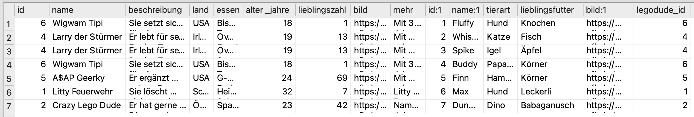
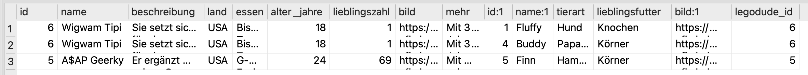
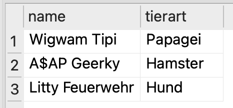
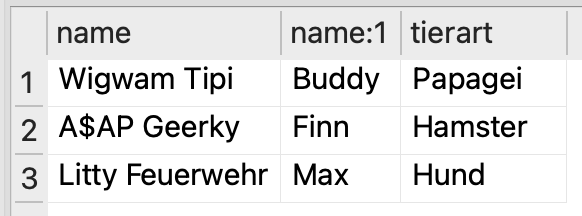
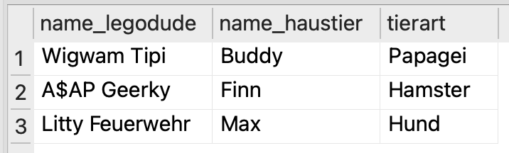

# Tabellen kombinieren
Die meisten Datenbanken bestehen aus mehreren Tabellen, die miteinander in Beziehung stehen. Um Informationen aus mehreren Tabellen zu kombinieren, verwenden wir den **JOIN**-Befehl.

Verwenden wir wieder die drei Tabellen aus dem vorherigen Kapitel:

:::cards{flexBasis="300px"}
__personen__
| id | name | alter | talent |
|----|------|-------|--------|
| 1 | Alice | 30 | singen |
| 2 | Bob | 25 | tanzen |
| 3 | Charlie | 30 | malen |
| 4 | Diana | 28 | singen |
| 5 | Bob | 25 | kegeln |
| 6 | Bob | 25 | kegeln |
::br
__einschreibungen__
| person_id | kurs_id | einschreibungsdatum |
|-----------|---------|---------------------|
| 2 | 1 | 2024-08-15 |
| 4 | 2 | 2024-09-20 |
| 5 | 1 | 2024-08-20 |
| 5 | 3 | 2024-08-21 |
::br
__kurse__
| id | name | datum | preis |
|----|------|-------|-------|
| 1 | Python Programmieren | 2024-09-01 | 199 |
| 2 | Datenbanken Grundlagen | 2024-10-15 | 249 |
| 3 | Webentwicklung mit HTML & CSS | 2024-11-20 | 179 |
:::

Um beispielsweise herauszufinden, ob sich für einen bestimmten Kurs überhaupt Teilnehmer eingeschrieben haben, können wir die Tabellen `einschreibungen` und `kurse` miteinander verbinden. Dabei verwenden wir die Spalte `kurs_id` aus der Tabelle `einschreibungen` und die Spalte `id` aus der Tabelle `kurse`, da diese beiden Spalten jeweils denselben Kurs identifizieren:

```sql
SELECT * FROM einschreibungen JOIN kurse ON einschreibungen.kurs_id = kurse.id;
```

Als Ergebnis erhalten wir folgende Tabelle:
| person_id | kurs_id | einschreibungsdatum | id | name | datum | preis |
|-----------|---------|---------------------|----|------|-------|-------|
| 2 | 1 | 2024-08-15 | 1 | Python Programmieren | 2024-09-01 | 199 |
| 4 | 2 | 2024-09-20 | 2 | Datenbanken Grundlagen | 2024-10-15 | 249 |
| 5 | 1 | 2024-08-20 | 1 | Python Programmieren | 2024-09-01 | 199 |
| 5 | 3 | 2024-08-21 | 3 | Webentwicklung mit HTML & CSS | 2024-11-20 | 179 |


Wir sehen, dass sich für alle drei Kurse Teilnehmer eingeschrieben haben. Der Kurs «Python Programmieren» taucht sogar zweimal auf, da sich zwei verschiedene Personen dafür angemeldet haben.

:::aufgabe[Arbeitsanweisungen]
<TaskState id="2a31bbe1-09c0-4530-a7e7-7398e0fbb0d6" />
Gehen Sie bei den Aufgaben in diesem Abschnitt wieder genau gleich vor, wie bei allen bisherigen SQL-Aufgaben: Öffnen Sie pro Aufgabe einen neuen SQL-Editor-Tab und speichern Sie die Abfrage anschliessend im Ihrem OneDrive-Ordner.

Verwenden Sie bei der Benennung das Namensschema `JOIN Abfrage [Nummer].sql`.

Markieren Sie diese Aufgabe als erledigt, wenn Sie die Anweisungen gelesen und verstanden haben.
:::

:::aufgabe[1. Alle Legodudes mit ihren Haustieren]
<TaskState id="4f59a39a-f8fd-40b5-ad84-dbb788a58cf9" />
Erstellen Sie eine SLQ-Abfrage, welche alle Legodudes zusammen mit ihren Haustieren anzeigt.



<Solution id="60af890f-4b05-4299-af6e-3f3b1fc245fd">
```sql
SELECT * FROM legodudes JOIN haustiere ON legodudes.id = haustiere.legodude_id;
```
</Solution>
:::

:::aufgabe[2. Alle US-Legodudes mit ihren Haustieren]
<TaskState id="9b71d9c6-d3d3-48d8-b2bb-7d73373fb85e" />
Erstellen Sie eine SLQ-Abfrage, welche alle Legodudes **aus den USA** zusammen mit ihren Haustieren anzeigt.



<Solution id="c31606f9-02fd-4670-9cbb-ca63a04c17a3">
```sql
SELECT * FROM legodudes JOIN haustiere ON legodudes.id = haustiere.legodude_id WHERE land = 'USA';
```
</Solution>
:::

:::aufgabe[3. Spezifische Kombinationen]
<TaskState id="3b2625ac-c7bf-4e90-a67d-29a09674949f" />
Erstellen Sie eine SLQ-Abfrage, welche alle Legodudes zusammen mit ihren Haustieren anzeigt, wenn Sie:
- **entweder** aus Schweden stammen
- **oder** aus den USA stammen **und** ihr Haustier als Lieblingsfutter «Körner» hat.


<Solution id="23dfbcd9-f990-4899-b4e5-81156ef3f38a">
```sql
SELECT * FROM legodudes JOIN haustiere ON legodudes.id = haustiere.legodude_id WHERE land = 'Schweden' OR land = 'USA' AND lieblingsfutter = 'Körner';
```
</Solution>
:::


## Projektionen
Oft sind die Tabellen, die wir miteinander verbinden, sehr gross und enthalten viele Spalten. Um die Ausgabe übersichtlicher zu gestalten, können wir mit **Projektionen** nur diejenigen Spalten auswählen, die wir wirklich benötigen. Das Prinzip kennen Sie auch bereits: Statt `SELECT *` schreiben wir einfach `SELECT spalte1, spalte2, ...`. Das ist eine _Projektion_.

:::aufgabe[4. Projektion]
<TaskState id="da73d83e-ee15-4de4-9e68-005288a3636e" />
Kopieren Sie Ihre SQL-Abfrage aus der letzten Aufgabe in einen neuen Editor-Tab und passen Sie diese so an, dass nur noch der Name des Legodudes und die Tierart des Haustiers angezeigt werden:



<Solution id="34696b62-d1dc-4bad-91bc-9c54056367f7">
```sql
SELECT name, tierart FROM legodudes JOIN haustiere ON legodudes.id = haustiere.legodude_id WHERE land = 'Schweden' OR land = 'USA' AND lieblingsfutter = 'Körner';
```
</Solution>
:::

:::aufgabe[5. Duplizierte Spaltennamen]
<TaskState id="3c8fb85d-64a9-4156-8f76-7008f970b7df" />
Kopieren Sie Ihre SQL-Abfrage aus der letzten Aufgabe in einen neuen Editor-Tab und passen Sie diese so an, dass nun zudem auch noch der **Name des Haustiers** angezeigt wird.

**Achtung:** Das ist nicht ganz so einfach, wie es auf den ersten Blick scheint! Es haben nämlich sowohl die Tabelle `legodudes` als auch die Tabelle `haustiere` eine Spalte namens `name`. Wenn wir also einfach `SELECT name, tierart, name` schreiben, weiss die Datenbank nicht, welchen der beiden `name`-Spalten wir meinen.

Um das zu lösen, müssen wir den **Tabellennamen** vor den Spaltennamen schreiben, um die Spalte eindeutig zu identifizieren. Beispielsweise schreiben wir `legodudes.name`, wenn wir die `name`-Spalte aus der Tabelle `legodudes` meinen.



<Solution id="be2a9073-65b6-48a0-b2df-637bee76d73f">
```sql
SELECT legodudes.name, haustiere.name, tierart FROM legodudes JOIN haustiere ON legodudes.id = haustiere.legodude_id WHERE land = 'Schweden' OR land = 'USA' AND lieblingsfutter = 'Körner';
```
</Solution>
:::

:::aufgabe[6. Spalten umbenennen]
<TaskState id="fcd8b48d-9de1-4b16-85a9-136ae52c0826" />
Die Abfrage funktioniert jetzt zwar, doch ist das Ergebnis noch nicht so schön: Wir haben eine Spalte `name` und eine Spalte `name:1`, was nicht sehr aussagekräftig ist.

Kopieren Sie Ihre SQL-Abfrage aus der letzten Aufgabe in einen neuen Editor-Tab und passen Sie diese so an, dass Sie im Ergebnis eine Spalte `name_legodude` und `name_haustier` erhalten.

Dazu brauchen Sie ein sogenanntes **Alias**. Ein Alias ist ein alternativer Name, den wir einer Spalte geben können. Dazu verwenden wir das Schlüsselwort `AS` (dt.: _als_).

Das Schema zur Verwendung eines Alias ist:

```sql
SELECT tabelle.spalte AS alias
```

wobei Sie `tabelle` und `spalte` durch die entsprechenden Tabellennamen und Spaltennamen ersetzen und für `alias` einen aussagekräftigen Namen wählen. Die zu verwendenden Alias-Namen sind in dieser Aufgabe bereits vorgegeben ist (`name_legodude`, resp. `name_haustier`).



<Solution id="b5535fbd-445e-4e01-b379-f60e1fc48f67">
```sql
SELECT legodudes.name AS name_legodude, haustiere.name AS name_haustier, tierart FROM legodudes JOIN haustiere ON legodudes.id = haustiere.legodude_id WHERE land = 'Schweden' OR land = 'USA' AND lieblingsfutter = 'Körner';
```
</Solution>
:::


---