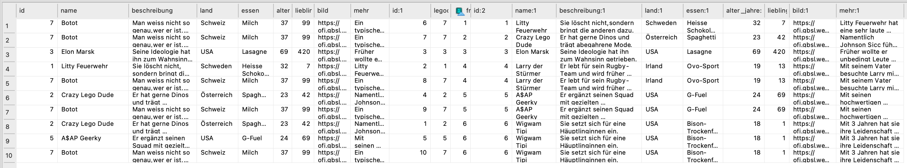
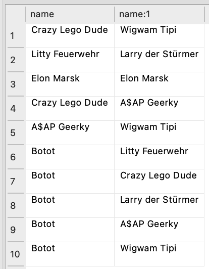
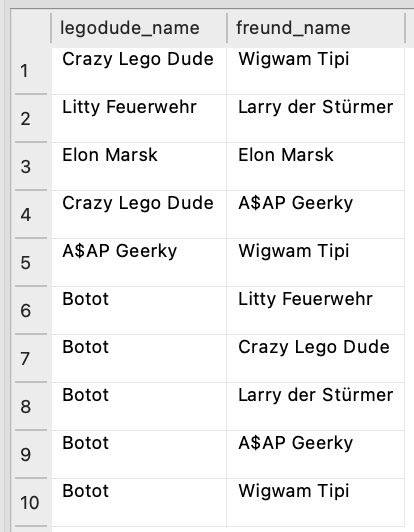
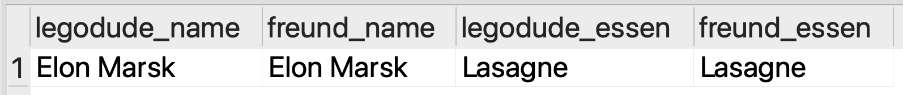
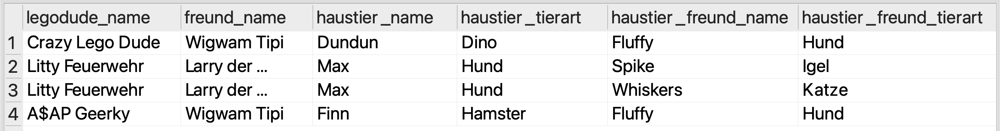

# JOIN-Tabellen
Wie im letzten Abschnitt erwähnt, stellen uns `n:m`-Beziehungen bei der Planung unserer Datenbank vor ein Problem. Die Herausforderung ist, dass ein _Datenfeld_ (quasi eine «Datenbank-Zelle») grundsätzlich immer nur einen einzigen Wert enthalten kann – also nicht etwa eine Liste von Werten. Wir können somit zum Beispiel in der Tabelle `personen` nicht einfach eine Spalte `kurs_ids` mit einer Liste von Kurs-IDs anlegen, für die sich die Person eingeschrieben hat. Genauso wenig könnten wir in der Tabelle `kurse` eine Spalte `teilnehmer_ids` mit einer Liste von Personen-IDs anlegen, die sich für den Kurs eingeschrieben haben.

:::cards{flexBasis="300px"}
__personen__
| id | name | alter | talent |
|----|------|-------|--------|
| 1 | Alice | 30 | singen |
| 2 | Bob | 25 | tanzen |
| 3 | Charlie | 30 | malen |
| 4 | Diana | 28 | singen |
| 5 | Bob | 25 | kegeln |
| 6 | Bob | 25 | kegeln |
::br
__einschreibungen__
| person_id | kurs_id | einschreibungsdatum |
|-----------|---------|---------------------|
| 2 | 1 | 2024-08-15 |
| 4 | 2 | 2024-09-20 |
| 5 | 1 | 2024-08-20 |
| 5 | 3 | 2024-08-21 |
::br
__kurse__
| id | name | datum | preis |
|----|------|-------|-------|
| 1 | Python Programmieren | 2024-09-01 | 199 |
| 2 | Datenbanken Grundlagen | 2024-10-15 | 249 |
| 3 | Webentwicklung mit HTML & CSS | 2024-11-20 | 179 |
:::

Als Lösung für dieses Problem verwenden wir sogenannte **JOIN-Tabellen** (auch **Verknüpfungstabellen** genannt). Die Tabelle `einschreibungen` in unserem Beispiel ist eine solche JOIN-Tabelle. Darin können wir für jede Kombination aus Person und Kurs eine eigene Zeile anlegen. So können wir beliebig viele Personen mit beliebig vielen Kursen verknüpfen, ohne dass wir Datenfelder mit Listen von Werten anlegen müssen.

Wenn wir nun aber wissen wollen, welche Kurse eine bestimmte Person belegt hat, müssen wir die Tabelle `personen` mit der Tabelle `einschreibungen` verbinden, um die Kurs-IDs zu erhalten. Anschliessend müssen wir diese Kurs-IDs wiederum mit der Tabelle `kurse` verbinden, um die Kurs-Namen zu erhalten. Es braucht also nicht nur einen, sondern **zwei JOINs**. Das sieht wie folgt aus:

```sql showLineNumbers
SELECT personen.name, kurse.name FROM personen
JOIN einschreibungen ON personen.id = einschreibungen.person_id
JOIN kurse ON einschreibungen.kurs_id = kurse.id;
```

Auf Zeile `2` verbinden wir die Tabellen `personen` und `einschreibungen`, indem wir die Spalte `personen.id` mit der Spalte `einschreibungen.person_id` vergleichen. Auf Zeile `3` verbinden wir anschliessend die Tabellen `einschreibungen` und `kurse`, indem wir die Spalte `einschreibungen.kurs_id` mit der Spalte `kurse.id` vergleichen. Da wir in diesem Beispiel auf Zeile `1` nur die Spalten `personen.name` und `kurse.name` ausgewählt haben (wobei das `*` natürlich ebenfalls erlaubt wäre), erhalten wir als Ergebnis folgende Tabelle:

| name | name |
|------|------|
| Bob | Python Programmieren |
| Diana | Datenbanken Grundlagen |
| Bob | Python Programmieren |
| Bob | Webentwicklung mit HTML & CSS |

Etwas unschön ist hier, dass wir in der Ergebnis-Tabelle zweimal die Spalte `name` haben, was zu Verwirrung führen kann. Um das zu vermeiden, können wir den Spalten in der Ergebnis-Tabelle sogenannte **Aliase** geben. Das machen wir mit dem Schlüsselwort `AS`, gefolgt vom gewünschten Alias-Namen. Dazu müssen wir lediglich die Zeile `1` anpassen und erhalten folgenden verbesserten Befehl:

```sql showLineNumbers
SELECT personen.name AS person_name, kurse.name AS kurs_name
FROM personen
JOIN einschreibungen ON personen.id = einschreibungen.person_id
JOIN kurse ON einschreibungen.kurs_id = kurse.id;
```

Als Ergebnis erhalten wir nun folgende Tabelle:

| person_name | kurs_name |
|-------------|-----------|
| Bob | Python Programmieren |
| Diana | Datenbanken Grundlagen |
| Bob | Python Programmieren |
| Bob | Webentwicklung mit HTML & CSS |

Aliase können nicht nur für Spalten, sondern auch für Tabellen verwendet werden. Das ist vor allem dann praktisch, wenn wir dieselbe Tabelle mehrmals in einer Abfrage verwenden müssen (z.B. bei Freundschaftsbeziehungen zwischen Legodudes, wie Sie im nächsten Abschnitt sehen werden). Tabellen-Aliase funktionieren genau gleich wie Spalten-Aliase. Die obige Abfrage könnten wir also auch wie folgt schreiben:

```sql showLineNumbers
SELECT p.name AS person_name, k.name AS kurs_name
FROM personen AS p
JOIN einschreibungen AS es ON p.id = es.person_id
JOIN kurse AS k ON es.kurs_id = k.id;
```

Mit `personen AS p`, `einschreibungen AS es` und `kurse AS k` haben wir die Tabellen `personen` zu `p`, `einschreibungen` zu `es` und `kurse` zu `k` «umbenannt». Das ändert nichts an der Datenbank selbst, aber wir können diese Aliase nun in der gesamten Abfrage verwenden, um auf die entsprechenden Tabellen zu verweisen. Bei langen Tabellennamen können wir so die Lesbarkeit der Abfrage verbessern und bei einigen Abfragen 

## Übungen
In der Legomania-Datenbank haben wir ebenfalls eine `n:m`-Beziehung, nämlich die Freundschaften zwischen den verschiedenen Legodudes. Ein Legodude kann mehrere Freunde haben, und ein Legodude kann auch der Freund von mehreren Legodudes sein. Um diese Beziehungen abzubilden, gibt es die Tabelle `legodudes_freunde`, welche als JOIN-Tabelle dient.

:::aufgabe[1. Freundestabelle verstehen]
<TaskState id="84f60cdd-9a08-4ea3-9e8c-50eb63710291" />
1. Schreiben Sie zuerst mal eine Abfrage, mit der Sie alle Zeilen der Tabelle `legodudes_freunde` erhalten. Dazu brauchen Sie noch keinen JOIN. Es geht nur mal darum, sich einen Überblick über die Tabelle zu verschaffen.
2. Wie interpretieren Sie diese Tabelle?

Halten Sie Ihre **Abfrage** und Ihre **Interpretation** hier fest.

<QuillV2 id="07ac9aa3-3567-4654-b2cf-ddd4bfc5d5cf" />

<Solution id="43708dab-c436-4a52-b2cc-434445b63179">
```sql
SELECT * FROM legodudes_freunde;
```
  
Die Tabelle gibt an, welcher Legodude mit welchem anderen Legodude befreundet ist. Jeder Legodude hat eine `id` (sie können auch nochmal `SELECT * FROM legodudes` ausführen, um sich davon zu überzeugen). Jede Zeile in der Tabelle `legodudes_freunde` stellt eine Freundschaftsbeziehung dar: der Legodude mit der ID in der Spalte `legodude_id` ist befreundet mit dem Legodude mit der ID in der Spalte `freund_id`.
</Solution>
:::

::::aufgabe[2. Alle Legodudes mit ihren Freunden]
<TaskState id="3d69eb85-1783-4b28-bd59-ec2a30712ee3" />
Erstellen Sie eine SQL Abfrage, mit der Sie alle Legodudes zusammen mit Ihren Freunden erhalten. Im Ergebnis dürfen alle Spalten aus der Tabelle `legodudes` sowohl für den Legodude als auch für seinen Freund angezeigt werden (`SELECT * …`).



:::tip[Tabellen-Alias verwenden]
In dieser Abfrage werden Sie zweimal die Tabelle `legodudes` verwenden müssen. Damit das funktioniert, müssen Sie ihr bei jeder Verwendung einen anderen Alias geben. Beispielsweise könnten Sie die erste Verwendung der Tabelle `legodudes` mit dem Alias `ld1` (`…legodudes AS ld1…`) und die zweite Verwendung mit dem Alias `ld2` versehen.
:::

Kopieren Sie Ihre fertige Abfrage hier rein:
<QuillV2 id="62db1562-5087-47ab-8f6a-03f7abea4453" />

<Solution id="3f01cebb-0857-4fb9-a4f9-9d5d123a164e">
```sql
SELECT * 
FROM legodudes AS ld1
JOIN legodudes_freunde ON ld1.id = legodudes_freunde.legodude_id
JOIN legodudes AS ld2 ON legodudes_freunde.freund_id = ld2.id;
```
</Solution>
::::

:::aufgabe[3. Spalten auswählen]
<TaskState id="528a7596-0f9a-48f8-ac44-7986af180715" />
Kopieren Sie Ihre SQL-Abfrage aus der letzten Aufgabe in einen neuen Editor-Tab und passen Sie diese so an, dass nur noch der Name des Legodudes und der Name seines Freundes angezeigt werden.



Kopieren Sie Ihre fertige Abfrage hier rein:
<QuillV2 id="7dbf087b-72c8-4117-a8b0-30ef1322e378" />

<Solution id="2ff5431f-756e-4a15-8a1f-2d4719c3c468">
```sql
SELECT ld1.name, ld2.name
FROM legodudes AS ld1
JOIN legodudes_freunde ON ld1.id = legodudes_freunde.legodude_id
JOIN legodudes AS ld2 ON legodudes_freunde.freund_id = ld2.id;
```
</Solution>
:::

:::aufgabe[4. Spalten umbenennen]
<TaskState id="6c61e2d6-519b-4f01-9520-482e3bd79309" />
Kopieren Sie Ihre SQL-Abfrage aus der letzten Aufgabe in einen neuen Editor-Tab und passen Sie diese so an, dass die Spalten im Ergebnis `legodude_name` und `freund_name` heissen.



Kopieren Sie Ihre fertige Abfrage hier rein:
<QuillV2 id="a7c29f6d-71a3-4c3f-bed6-b572b37e9335" />

<Solution id="9672fd6a-c8a0-43fb-a6d6-2b3ac539c93c">
```sql
SELECT ld1.name AS legodude_name, ld2.name AS freund_name
FROM legodudes AS ld1
JOIN legodudes_freunde ON ld1.id = legodudes_freunde.legodude_id
JOIN legodudes AS ld2 ON legodudes_freunde.freund_id = ld2.id;
```
</Solution>
:::

:::aufgabe[5. Gleich und gleich gesellt sich gern]
<TaskState id="46832f61-d9ef-42c7-b642-84c32511d5a8" />
Erstellen Sie wieder eine SQL Abfrage, mit der Sie alle Legodudes zusammen mit Ihren Freunden erhalten. Diesmal sollen im Ergebnis die beiden Namen (`legodude_name` und `freund_name`) und die beiden Lieblingsessen (`legodude_essen` und `freund_essen`) angezeigt werden. Zudem soll das Ergebnis nur diejenigen Freundespaare enthalten, die **dasselbe Lieblingsessen** haben.



Kopieren Sie Ihre fertige Abfrage hier rein:
<QuillV2 id="1d73b1fe-f66d-4a78-8854-1b7e12911e2b" />

<Solution id="cfa35e0c-e909-462c-8d3d-dbb2b9bdf0eb">
```sql
SELECT ld1.name AS legodude_name, ld2.name AS freund_name, ld1.essen AS legodude_essen, ld2.essen AS freund_essen
FROM legodudes AS ld1
JOIN legodudes_freunde ON ld1.id = legodudes_freunde.legodude_id
JOIN legodudes AS ld2 ON legodudes_freunde.freund_id = ld2.id
WHERE ld1.essen = ld2.essen;
```
</Solution>
:::

::::aufgabe[🏆 6. Hundebesitzer:innen]
<TaskState id="2f4bf94c-a8a8-4240-b410-041a79f9ef80" />

Hundebesitzer:innen gehen oft nicht nur zusammen mit ihren vierbeinigen, sondern auch mit ihren zweibeinigen Freund:innen spazieren. Erstellen Sie eine SQL Abfrage, mit der Sie alle Legodudes zusammen mit ihren Freund:innen und deren jeweiligen Haustieren erhalten. Im Ergebnis sollen folgende Spalten angezeigt werden:
- `legodude_name`: Name des Legodudes
- `freund_name`: Name der Freund:in
- `haustier_name`: Name des Haustiers des Legodudes
- `haustier_tierart`: Tierart des Haustiers des Legodudes
- `haustier_freund_name`: Name des Haustiers der Freund:in
- `haustier_freund_tierart`: Tierart des Haustiers der Freund:in

Zudem sollen im Ergebnis nur Einträge vorkommen, bei denen **mindestens eines der beiden Haustiere ein Hund** ist.



Halten Sie Ihre fertige Abfrage hier fest:
<QuillV2 id="7daf2342-5880-40fc-b77a-c3ab7802f086" />

<Solution id="114caa15-a257-4172-94cd-58687053bfe4">
```sql
SELECT ld1.name AS legodude_name, ld2.name AS freund_name, ht1.name AS haustier_name, ht1.tierart AS haustier_tierart, ht2.name AS haustier_freund_name, ht2.tierart AS haustier_freund_tierart
FROM legodudes AS ld1
JOIN legodudes_freunde ON ld1.id = legodudes_freunde.legodude_id
JOIN legodudes AS ld2 ON legodudes_freunde.freund_id = ld2.id
JOIN haustiere AS ht1 ON ld1.id = ht1.legodude_id
JOIN haustiere AS ht2 ON ld2.id = ht2.legodude_id;
```
</Solution>
::::

---