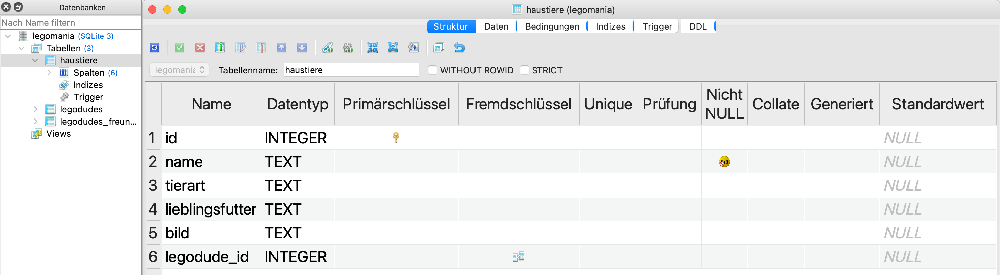
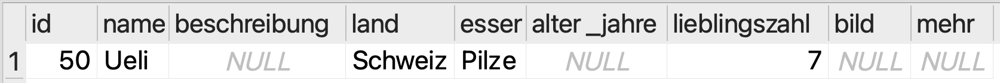
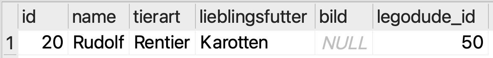
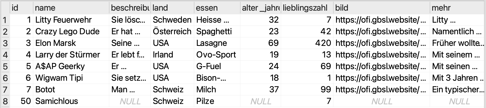
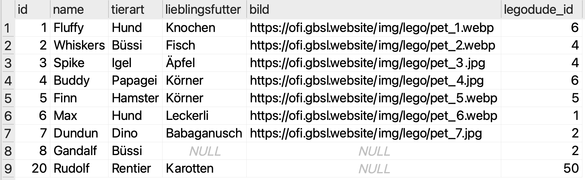
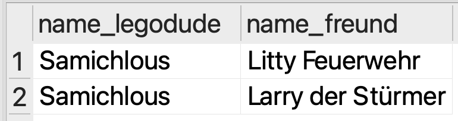
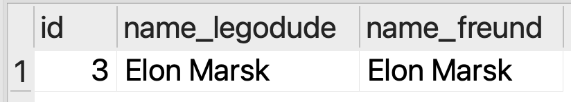

# CRUD
Das Akronym **CRUD** steht für die vier grundlegenden Operationen, die auf Daten in einer Datenbank angewendet werden können:

C 
: **Create** (Erstellen)
: Erstellen von neuen Datensätzen
: Befehl: `INSERT INTO`
R 
: **Read** (Lesen)
: Lesen von bestehenden Datensätzen
: Befehl: `SELECT`
U
: **Update** (Aktualisieren)
: Aktualisieren von bestehenden Datensätzen
: Befehl: `UPDATE`
D
: **Delete** (Löschen)
: Löschen von bestehenden Datensätzen
: Befehl: `DELETE`

Dabei gehen wir davon aus, dass die Datenbank und die entsprechenden Tabellen **bereits existieren**.

## Create: Daten erstellen
Um Daten in die Datenbank einzufügen, verwenden wir den `INSERT INTO`-Befehl. Wir verwenden dabei folgendes Schema:

```sql
INSERT INTO tabellenname (spalte1, spalte2, ...) VALUES (wert1, wert2, ...);
```

Der befehl beginnt also immer mit `INSERT INTO`, gefolgt vom Namen der Tabelle, in die wir Daten einfügen möchten. Danach folgt in Klammern eine Liste der Spalten, in die wir Werte einfügen möchten, getrennt durch Kommas. Wir müssen nämlich nicht immer in allen Spalten einen Wert angeben. Es gibt aber einige Regeln zu beachten:

- Es kann Spalten geben, die **nicht-null** sind. Das bedeutet, dass wir für diese Spalten immer einen Wert angeben müssen.
- Es kann Spalten mit einem **Standardwert** geben. Wenn wir für diese Spalten keinen Wert angeben, wird automatisch der Standardwert verwendet.
- Es kann Spalten geben, deren Wert **automatisch generiert** wird (oft z.B. eine ID-Spalte). Für diese Spalten dürfen wir keinen Wert angeben.

Um für eine bestehende Tabelle herauszufinden, welche Spalten es gibt und welche Regeln für diese Spalten gelten, können wir uns die **Tabellenstruktur** anzeigen lassen. In SQLiteStudio geht das, indem wir in der linken Seitenleiste die entsprechende Tabelle auswählen und dann oben auf den Reiter **Struktur** klicken.



Hier sehen wir die Struktur der `haustiere`-Tabelle. Da sehen wir unter anderem, dass die Spalte `id` als _Primärschlüssel_ definiert ist. Wie Sie wissen, darf der Wert für den Primärschlüssel **niemals leer** sein. Weiter zeigt die Übersicht, dass die Spalte `name` ebenfalls als `Nicht NULL` markiert ist. Standardwerte gibt es in dieser Tabelle keine, und es ist auch keine Spalte als `Generiert` markiert. Das heisst, bei dieser Tabelle gelten folgende Regeln:

- Für die Spalten `id` und `name` müssen wir immer einen Wert angeben.
- Für alle anderen Spalten dürfen wir einen Wert angeben, müssen es aber nicht. Wenn wir keinen Wert angeben, wird der Wert in dieser Spalte leer bleiben.
- Die Spalte `legodude_id` ist als **Fremdschlüssel** markiert. Das bedeutet, dass die Werte in dieser Spalte mit den Primärschlüssel-Werten in einer anderen Tabelle (in diesem Fall `legodudes.id`) übereinstimmen müssen, sofern wir einen Wert angeben.

Sobald wir angegeben haben, in welche Spalten wir Werte einfügen wollen, folgt das Schlüsselwort `VALUES`, gefolgt von einer Liste der Werte, die wir einfügen möchten. Diese Liste steht wiederum in Klammern und die einzelnen Werte sind durch Kommas getrennt.

Ein Beispiel: Wir möchten in der `haustiere`-Tabelle eine `Katze` namens `Gollum` einfügen. Gollums Lieblingsfutter kennen wir nicht und ein Bild haben wir ebenfalls keins, also lassen wir diese Angaben weg. Gollum gehört zum Legodude mit der ID `2`. Eine ID für die neue Katze müssen wir auch noch festlegen: Wir wählen einfach die nächste noch nicht verwendete Zahl, also die `8` (da die IDs `1` bis `7` in dieser Tabelle bereits vergeben sind), wobei grundsätzlich jede noch nicht verwendete Zahl erlaubt wäre. Unsere SQL-Abfrage sieht dann so aus:

```sql
INSERT INTO haustiere (id, name, tierart, legodude_id) VALUES (8, 'Gollum', 'Katze', 2);
```

Wir können nun prüfen, ob das Einfügen geklappt hat, indem wir eine `SELECT`-Abfrage ausführen:

```sql
SELECT * FROM haustiere WHERE id = 8;
```

:::warning[Nicht mehrfach einfügen!]
Führen Sie die `INSERT INTO`-Abfrage nur **einmal** aus! Wenn Sie die Abfrage mehrfach ausführen, erhalten Sie eine Fehlermeldung, da Sie versuchen, einen Datensatz mit einer bereits vergebenen ID einzufügen (Primärschlüssel-Werte müssen immer eindeutig sein). Wenn Sie die ID ändern, können Sie die Abfrage zwar mehrfach ausführen, aber das würde zu mehreren ähnlichen Einträgen in der Tabelle führen, was in der Regel nicht gewünscht ist.
:::

## Read: Daten lesen
Das Lesen von bestehenden Datensätzen beherrschen Sie bereits bestens: Den `SELECT`-Befehl haben Sie schon ausgiebig geübt. Diese Operation werden wir hier deshalb nicht weiter vertiefen.

## Update: Daten ändern
Sie wissen nun, wie Sie Daten in eine Tabelle einfügen können. Was aber, wenn Sie einen bestehenden Datensatz ändern möchten? Dazu verwenden wir den `UPDATE`-Befehl. Das Schema dafür ist folgendes:

```sql
UPDATE tabellenname SET spalte1 = wert1, spalte2 = wert2, ... WHERE bedingung;
```

Der Befehl beginnt mit `UPDATE`, gefolgt vom Namen der Tabelle, in der wir Daten ändern möchten. Danach folgt das Schlüsselwort `SET`, gefolgt von einer Liste der Spalten, die wir ändern möchten, zusammen mit den neuen Werten. Jede Spalte und ihr neuer Wert sind durch ein Gleichheitszeichen (`=`) verbunden, und die einzelnen Spalten-Wert-Paare sind durch Kommas getrennt. Diese Anpassung (also alles, was Sie im `SET`-Teil angeben) wird auf **alle** Datensätze angewendet, die der im `WHERE`-Teil angegebenen Bedingung entsprechen.

:::danger[Vorsicht beim Update!]
Wenn Sie den `WHERE`-Teil weglassen, werden **alle** Datensätze in der Tabelle aktualisiert! Und selbst wenn Sie einen `WHERE`-Teil angeben, kann es passieren, dass **mehrere** Datensätze die Bedingung erfüllen und somit ebenfalls alle aktualisiert werden.

Seien Sie also vorsichtig und stellen Sie sicher, dass Ihre Bedingung korrekt ist, um nur die gewünschten Datensätze zu ändern. In aller Regel möchten Sie nämlich nur einen einzigen Datensatz ändern. Im `WHERE`-Teil filtert man deshalb meistens nach dem Primärschlüssel (also z.B. `WHERE id = 3`), um sicherzustellen, dass nur der gewünschte Datensatz geändert wird.
:::

Wenn wir also beispielsweise den Namen des Haustiers mit der ID `8` (also Gollum, die vorhin neu eingefügte Katze) in `Gandalf` ändern möchten, schreiben wir folgende SQL-Abfrage:

```sql
UPDATE haustiere SET name = 'Gandalf' WHERE id = 8;
```

## Delete: Daten löschen
Nun fehlt nur noch der letzte Abschnitt im Lebenszyklus eines Datenbank-Eintrags: Das Löschen von Daten. Dazu verwenden wir den `DELETE`-Befehl. Das Schema dafür ist folgendes:

```sql
DELETE FROM tabellenname WHERE bedingung;
```

Der Befehl beginnt mit `DELETE FROM`, gefolgt vom Namen der Tabelle, aus der wir Daten löschen möchten. Danach folgt der `WHERE`-Teil, in dem wir angeben, welche Datensätze gelöscht werden sollen. Nur die Datensätze, die der angegebenen Bedingung entsprechen, werden gelöscht.

:::danger[Vorsicht beim Löschen!]
Genau wie beim `UPDATE`-Befehl gilt auch hier: Wenn Sie den `WHERE`-Teil weglassen, können im schlimmsten Fall **alle** Datensätze in der Tabelle gelöscht werden! Und wenn Sie einen `WHERE`-Teil angeben, kann es passieren, dass **mehrere** Datensätze die Bedingung erfüllen und somit ebenfalls alle gelöscht werden.

Auch beim Löschen haben wir es in der Regel nur auf einen einzigen Datensatz pro Abfrage abgesehen. Deshalb filtert man im `WHERE`-Teil meistens nach dem Primärschlüssel (also z.B. `WHERE id = 3`), um sicherzustellen, dass nur der gewünschte Datensatz gelöscht wird.
:::

Wenn wir also beispielsweise das Haustier mit der ID `8` (also Gandalf, den vorhin als «Gollum» eingefügten und anschliessend umbenannten Kater) löschen möchten, schreiben wir folgende SQL-Abfrage:

```sql
DELETE FROM haustiere WHERE id = 8;
```

## Übungen
Für die nachfolgenden Übungen müssen Sie Ihre Editor-Tabs nicht mehr unbedingt speichern (Sie wissen nun, wie das geht…). Wichtig ist lediglich, dass Sie Ihre Lösung jeweils hier in Classrooms einfügen.

:::aufgabe[Ein neuer Legodude zieht ein]
<TaskState id="b985cf04-a463-438a-aaa8-d4592acc9fb1" />
Ein neuer Legodude ist nach Lego City gezogen. Er heisst Ueli und kommt aus der Schweiz. Am liebsten isst er Pilze und seine Lieblingszahl ist 7.

Nehmen Sie Ueli in die Datenbank auf und vergeben Sie Ihm die ID `50`. Suchen Sie anschliessend mit einer `SELECT`-Abfrage nach Ueli, um zu überprüfen, ob das Einfügen geklappt hat. Diese Abfrage können Sie gleich im selben Editor-Tab durchführen – Sie müssen lediglich sicherstellen, dass beide Abfragen jeweils mit einem Semikolon (`;`) abgeschlossen sind. Zum Ausführen des `SELECT`-Befels markieren Sie diesen einfach und klicken Sie auf den **Play-Button** (▶️) oben rechts im Editor-Fenster.



Fügen Sie zum Schluss den gesamten SQL-Code (Einfüngen und `SELECT`) hier ein:

<QuillV2 id="ef3173bf-10a4-4e2b-b391-ffa20f44e98d" />

<Solution id="1425ee6d-fcd6-44b1-987b-90a121f14402">
```sql
INSERT INTO legodudes (id, name, land, essen, lieblingszahl) VALUES (50, 'Ueli', 'Schweiz', 'Pilze', 7)
```
</Solution>
:::

:::aufgabe[Ein Tier kommt in die Stadt]
<TaskState id="bade4c65-df9d-4a39-be46-bd5ac8781e17" />
Einmal, in einer kalten Winternacht, sehen die Legodudes, wie ein leuchtend roter Schimmer durch die Strassen von Lego City zieht. Am nächsten Tag erfahren sie, dass das Rentier Rudolf in der Stadt Urlaub macht und die nächsten Wochen als Uelis Haustier verbringen wird. Nehmen Sie Rudolf mit der ID `20` in die Datenbank auf. Er isst am liebsten Karotten.

Führen Sie anschliessend eine `SELECT`-Abfrage durch, um zu überprüfen, ob das Einfügen geklappt hat. Das können Sie ebenfalls wieder im selben Editor-Tab machen.



Fügen Sie zum Schluss den gesamten SQL-Code (Einfügen und `SELECT`) hier ein:

<QuillV2 id="f9ab36c9-9457-4f76-b569-ee95584f4066" />

<Solution id="b3ef7d37-af71-4156-a26e-4a668878789a">
```sql
INSERT INTO haustiere (id, name, tierart, lieblingsfutter, legodude_id) VALUES (20, 'Rudolf', 'Rentier', 'Karotten', 50);
```
</Solution>
:::

:::aufgabe[Mögliche Fehlerquellen]
<TaskState id="93adcfb1-2c91-48a8-94c9-10cc94b7627d" />

Gehen Sie zurück zum Editor-Tab, in dem Sie Rudolf in die Datenbank eingefügt haben. Passen Sie die Abfrage nun wie folgt an:
- Vergeben Sie Rudolf die ID `21` (weil `20` ja nun bereits belegt ist).
- Weisen Sie Rudolf dem Legodude mit der ID `999` als Haustier zu (statt Ueli mit der ID `50`).

Führen Sie die Abfrage anschliessend aus. Was passiert? Wieso tritt dieser Fehler auf? Schreiben Sie Ihre Antwort hier hin:

<QuillV2 id="d8f1816a-1829-4338-a0e7-70764d42b579" />

<Solution id="9e97da4a-b8c3-4439-8413-5df0adc8d663">
Sie erhalten eine Fehlermeldung mit dem Text `FOREIGN KEY constraint failed`. Wie Sie bereits wissen, ist die Spalte `legodude_id` in der Tabelle `haustiere` als Fremdschlüssel definiert. Das bedeutet, dass jeder Wert in dieser Spalte mit einem bestehenden Primärschlüssel-Wert in der Tabelle `legodudes` übereinstimmen muss. Nun gibt es aber keinen Legodude mit der ID `999` in der Tabelle `legodudes`.

Deshalb tritt dieser Fehler auf. Würde SQLite uns erlauben, diesen Eintrag so zu erstellen, dann hätten wir ein Haustier, das einem Legodude gehört, der gar nicht existiert. Die Datenbank wäre in dem Moment **inkonsistent**, was wir unbedingt vermeiden wollen.
</Solution>
:::

:::aufgabe[Ueli erhält einen Spitznamen]
<TaskState id="3b540357-b148-4aab-b3c2-e9374dc3aa0b" />
Nachdem sich rumgesprochen hat, dass Ueli neuerdings ein recht berühmtes Rentier als Haustier hat, nennen ihn alle liebevoll «Samichlous». Der bärtige Berner Legodude fühlt sich mit seinem neuen Spitznamen gänzlich wohl und möchte, dass dieser auch in der Datenbank vermerkt wird.

Passen Sie den Datenbank-Eintrag für Ueli entsprechend an. Führen Sie anschliessend eine `SELECT`-Abfrage durch, um zu überprüfen, ob die Änderung geklappt hat. Machen Sie danach auch eine Abfrage, die Ihnen **alle** Legodudes anzeigt, um sicherzustellen, dass Sie nicht versehentlich die gesamte Stadt umbenannt haben. Beide `SELECT`-Abfragen können Sie wieder im selben Editor-Tab durchführen.



Fügen Sie zum Schluss den gesamten SQL-Code hier ein:

<QuillV2 id="7a751017-bb00-47c3-b32c-b62205e23184" />

<Solution id="acab542d-bfe1-4b0f-96e4-fb4133becbfc">
```sql
UPDATE legodudes SET name = 'Samichlous' WHERE id = 50;
```
</Solution>
:::

::::aufgabe[Mä cha dr Chatz o Büssi sägä…]
<TaskState id="8beba0bc-ee2a-49ab-b3dc-2b5e83a6f018" />
:::warning[Genügend Katzen?]
Bevor Sie mit dieser Aufgabe beginnen, sollten Sie noch sicherstellen, dass Sie mindestens zwei Katzen in der `haustiere`-Tabelle haben. Weiter oben haben wir ja bereits eine Katze namens Gollum (später in Gandalf umbenannt) eingefügt. Falls Sie diesen Befehl da nicht ausgeführt haben, holen Sie das jetzt am besten noch nach.
:::

Die Bewohner von Lego City haben Ueli den «Samichlous» bereits fest in ihr Herz geschlossen. Als kleine Aufmerksamkeit möchten Sie zu Ehren seines berndeutschen Dialekts die Katzen der Stadt neu als «Büssi» bezeichnen. Schreiben Sie also eine SQL-Abfrage, die **alle Katzen** in der `haustiere`-Tabelle so ändert, dass deren Tierart von `Katze` zu `Büssi` angepasst wird. Prüfen Sie anschliessend mit einer `SELECT`-Abfrage, ob die Änderung geklappt hat.

:::warning[Alle Katzen gleichzeitig ändern!]
Sie haben gelernt, dass wir normalerweise nur einen Datensatz pro Abfrage ändern wollen. In diesem Fall macht es aber mehr Sinn, **alle** Katzen in einem einzigen Schritt zu ändern. Sonst hätten wir (mindestens zeitweise) eine Mischung aus Katzen und Büssi in der Datenbank, obwohl es sich bei beiden um dieselbe Tierart handelt.

Schreiben Sie Ihre Abfrage deshalb so, dass sie **alle** Katzen auf einmal ändert.
:::



Fügen Sie zum Schluss den gesamten SQL-Code hier ein:

<QuillV2 id="78258c8e-95c0-45cc-877a-d229766a9553" />

<Solution id="d47fb9e6-ba8c-4ce1-b448-b43fb41c7287">
```sql
UPDATE haustiere SET tierart = 'Büssi' WHERE tierart = 'Katze';
```
</Solution>
::::

::::aufgabe[Neue Freunde]
<TaskState id="e96b913f-1796-407a-8375-a82356978ad4" />
Ueli der «Samichlous» hat in Lego City bereits viele neue Menschen kennengelernt und sich mit zwei davon angefreundet: Mit Litty Feuerwehr kann er sich herrlich darüber amüsieren, dass ihre Herkunftsländer immer verwechselt werden und mit Larry teilt er die Leidenschaft für Ovo-Sport (Larrys Lieblingsessen).

Erfassen Sie diese beiden neuen Freundschaftsbeziehungen (Ueli und Litty, sowie Ueli und Larry) in der Datenbank. Als ID für die jewelige Freundschaftsbeziehung wählen Sie jeweils die nächste verfügbare Zahl (also z.B. `7`, falls die IDs `1` bis `6` bereits vergeben sind).

:::warning[Freundschaft beruht auf Gegenseitigkeit]
In der Datenbank sind Freundschaftsbeziehungen gegenseitig: Wenn A mit B befreundet ist, dann ist B auch mit A befreundet. Es ist also egal, ob Sie Ueli jeweils als den «Legodude» oder als den «Freund» in der Freundschaftsbeziehung erfassen. 
:::

Führen Sie anschliessend eine `SELECT`-Abfrage durch, die alle Freunde von Ueli anzeigt, um zu überprüfen, ob das Einfügen geklappt hat. Es reicht, wenn im Ergebnis lediglich die Namen angezeigt werden. **Hinweis:** Für diese Abfrage brauchen Sie wieder mehrere `JOIN`s, sowie Tabelle- und Spalten-Aliase, wie Sie das bereits geübt haben.



Fügen Sie zum Schluss den gesamten SQL-Code hier ein:

<QuillV2 id="fad08029-f62b-412b-93fa-4ed000e720e6" />

<Solution id="6c298138-580d-41e7-845b-d902c986dfd3">
```sql
INSERT INTO legodudes_freunde (id, legodude_id, freund_id) VALUES (11, 50, 1);
INSERT INTO legodudes_freunde (id, legodude_id, freund_id) VALUES (12, 50, 4);

--- Abfrage der Freunde von Ueli:
SELECT ld1.name AS name_legodude, ld2.name AS name_freund
FROM legodudes AS ld1 
JOIN legodudes_freunde ON ld1.id = legodudes_freunde.legodude_id
JOIN legodudes AS ld2 ON legodudes_freunde.freund_id = ld2.id
WHERE legodudes_freunde.legodude_id = 50 OR legodudes_freunde.freund_id = 50;
```
</Solution>
::::

::::aufgabe[Neue Feinde]
<TaskState id="070e286f-9357-4136-922a-ae50542636ee" />
Elon Marsk hat sich mit sich selbst verkracht. 

**Bevor Sie etwas löschen**, führen Sie anschliessend eine `SELECT`-Abfrage durch, die alle Freunde von Elon anzeigt (Sie können dazu Ihre Abfrage aus der vorherigen Aufgabe kopieren und anpassen). Wichtig ist, dass Sie diesmal auch die ID der Freundschaftsbeziehung ausgeben lassen, denn die brauchen Sie anschliessend fürs Löschen. Es sollte genau ein Eintrag angezeigt werden:



**Löschen** Sie nun diese Freundschaftsbeziehung aus der Datenbank. Führen Sie die `SELECT`-Abfrage danach erneut durch, um zu überprüfen, ob das Löschen geklappt hat. Das Ergebnis sollte nun leer sein.

Fügen Sie zum Schluss den gesamten SQL-Code hier ein:

<QuillV2 id="86f74c27-7948-4480-9e84-919638f04ce4" />

<Solution id="d57582ba-3c6a-4727-bbd9-ed50191fea3b">
```sql
DELETE FROM legodudes_freunde WHERE id = 3;
```
</Solution>
::::

::::aufgabe[Alles hat ein Ende]
<TaskState id="133b87ee-8165-4c3e-b515-a619ddf3227a" />
So gut es ihm in Lego City auch gefallen hat, Rudolf das Rentier muss nun leider wieder zurück zum Nordpol fliegen, um dort die Weihnachtsvorbereitungen zu treffen.

Löschen Sie Rudolf aus der Datenbank. Führen Sie anschliessend eine `SELECT`-Abfrage durch, um zu überprüfen, ob das Löschen geklappt hat. Rudolf sollte nicht mehr als Haustier auftauchen.

Fügen Sie zum Schluss den gesamten SQL-Code hier ein:

<QuillV2 id="23c3d930-6b0b-4ea9-b6f0-e1d8859479bf" />

<Solution id="5203ecc9-5753-4dc2-9864-dded503b13a0">
```sql
DELETE FROM haustiere WHERE id = 20;
```
</Solution>
::::

::::aufgabe[Umzug]
<TaskState id="f601084b-c10f-440a-bf11-807fa87ed2c0" />
A\$AP Geerky hat sich entschieden, Lego City zu verlassen, um seine musikalische Karriere in L.A. voranzutreiben.

Versuchen Sie nun zuerst, A\$AP Geerky aus der Datenbank zu löschen. Was passiert? Wieso tritt dieser Fehler auf? Schreiben Sie Ihre Antwort hier hin:

<QuillV2 id="3913a2dc-7909-4e19-a748-386433894750" />

Sobald Sie Ihre Theorie erfasst haben, klappen Sie den zweiten Teil der Aufgabe auf:

<details>
<summary>Teil 2</summary>
<div>
Wir erhalten eine Fehlermeldung `FOREIGN KEY constraint failed`. A\$AP kann nicht gelöscht werden, weil bei einem Haustier (Finn) in der `haustiere`-Tabelle der Fremdschlüssel `legodude_id` auf A\$APs ID zeigt. Würden wir A\$AP löschen, dann wäre Finns Eintrag in der `haustiere`-Tabelle inkonsistent, weil er auf einen Legodude zeigt, der nicht (mehr) existiert.

Leider kann er seinen geliebten Hamster Finn nicht mitnehmen. Die Leute von Lego City haben sich deshalb bereit erklärt, sich als ganze Stadt gemeinsam um Finn zu kömmern. Finn soll also keinen spezifischen Besitzer mehr haben.

Passen Sie den Eintrag für Finn also so an, dass er keinen Besitzer mehr hat (der Wert für «kein Wert» ist `NULL`). Löschen Sie anschliessend A\$AP Geerky aus der Datenbank. Führen Sie zum Schluss eine `SELECT`-Abfrage durch, um zu überprüfen, dass A\$AP nicht mehr als Legodude angezeigt wird.
</div>
</details>

Fügen Sie zum Schluss den gesamten SQL-Code hier ein:

<QuillV2 id="8108d995-b6b4-4ddb-8fc9-6893984e469d" />

<Solution id="290ca66a-5d4d-4e86-a21d-3f6745a56198">
```sql
UPDATE haustiere SET legodude_id = NULL WHERE id = 5;
DELETE FROM legodudes WHERE id = 5;
```
</Solution>
::::

---
