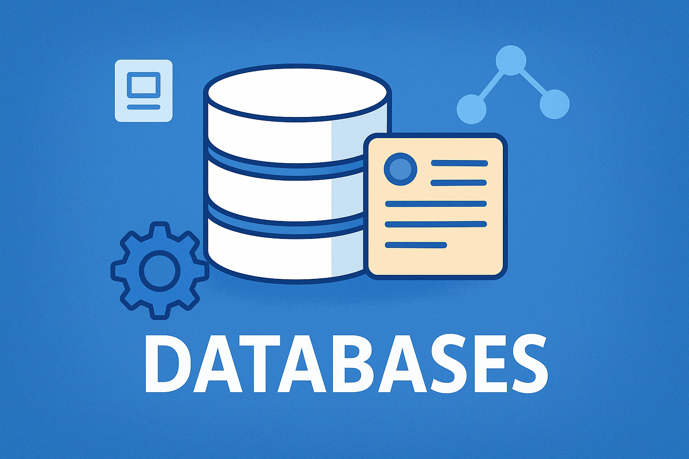

# Datenbanken
Datenbanken sind spezialisierte Programme zur Speicherung und Verwaltung von Daten. Sie ermöglichen es uns, grosse Mengen an Daten effizient zu speichern, abzurufen und zu manipulieren.

---
